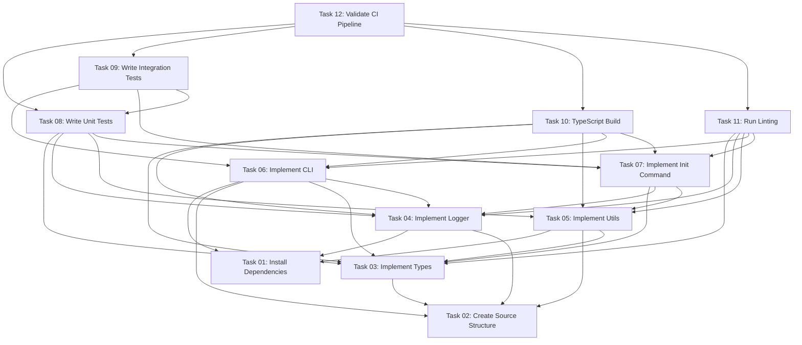

# Plan: AI Task Manager Init Command Implementation

## Executive Summary

This plan outlines the implementation of the `init` command for the AI Task Manager CLI tool using TypeScript. The implementation will follow the clean, simple architectural patterns from the cursor-bank project, focusing solely on the initialization functionality with the required `--assistants` flag support. The project will include tests for the implemented functionality and ensure the existing CI/CD pipeline works correctly.

## Context

The AI Task Manager CLI tool needs its core `init` command implemented to initialize workspaces with AI assistant support. The source code has been deleted, requiring implementation from scratch.

### Current State
- Complete package configuration exists (package.json, tsconfig.json)
- Template files exist in `/workspace/templates/` directory
- GitHub Actions workflows exist for PR validation and releases
- Source code directory (src/) has been deleted entirely

### Requirements
- Implement the `init` command with required `--assistants` flag
- Support values: 'claude', 'gemini', or 'claude,gemini'
- Create appropriate directory structures based on assistant selection
- Copy template files to correct locations
- Use TypeScript with simple, clean architecture inspired by cursor-bank
- Add tests for the implemented functionality
- Ensure existing CI/CD pipeline passes

## Technical Architecture

### Core Design Principles
1. **Simplicity First**: Follow cursor-bank's minimalist approach with clear, single-purpose functions
2. **TypeScript Native**: Leverage TypeScript's type system for safety and documentation
3. **Modular Structure**: Separate concerns into distinct modules (CLI, filesystem, templates, UI)
4. **Error Resilience**: Graceful error handling with informative messages
5. **Test-Driven**: Comprehensive unit and integration test coverage

### Technology Stack
- **Language**: TypeScript (ES2020 target)
- **CLI Framework**: Commander.js
- **Testing**: Jest with TypeScript support
- **CI/CD**: GitHub Actions
- **Package Manager**: NPM
- **Node Version**: >= 18.0.0

### Module Architecture
```
src/
├── cli.ts                    # Entry point with Commander setup
├── index.ts                  # Main init command implementation
├── logger.ts                 # Simple logging utility
├── types.ts                  # TypeScript type definitions
└── utils.ts                  # Helper functions for file operations
```

## Implementation Features

### CLI Command Structure

**init command**: The single command to implement
- Accepts `--assistants` flag (required) with values: 'claude', 'gemini', or 'claude,gemini'
- Creates `.ai/task-manager/` directory structure with plans folder
- Creates `.claude/commands/tasks/` when Claude is selected
- Creates `.gemini/commands/tasks/` when Gemini is selected
- Copies template files from `/workspace/templates/` to appropriate locations:
  - TASK_MANAGER.md to `.ai/task-manager/`
  - POST_PHASE.md to `.ai/task-manager/`
  - Command templates to assistant-specific directories
- If directories exist, merges structure and overwrites files (as per README)
- Shows success message with created directories

### Directory Structure Created

Based on assistant selection, creates:
```
project-root/
├── .ai/
│   └── task-manager/
│       ├── plans/                    # Empty directory for future plans
│       ├── TASK_MANAGER.md      # Copied from templates
│       └── POST_PHASE.md       # Copied from templates
├── .claude/                          # Only if claude selected
│   └── commands/
│       └── tasks/
│           ├── create-plan.md        # Copied from templates
│           ├── execute-blueprint.md  # Copied from templates
│           └── generate-tasks.md     # Copied from templates
└── .gemini/                          # Only if gemini selected
    └── commands/
        └── tasks/
            ├── create-plan.md        # Copied from templates
            ├── execute-blueprint.md  # Copied from templates
            └── generate-tasks.md     # Copied from templates
```

### File Operations

**Template Copying**:
- Read files from `/workspace/templates/ai-task-manager/`
- Read command files from `/workspace/templates/commands/tasks/`
- Create directories recursively if they don't exist
- Copy files with proper error handling
- Use fs-extra for robust file operations

**Error Handling**:
- Check if `--assistants` flag is provided, show error if missing
- Validate assistant values (must be 'claude', 'gemini', or both)
- Handle file system errors gracefully
- Show clear error messages for permission issues
- Exit with appropriate error codes

## Risk Considerations

### Technical Risks
1. **Dependency Compatibility**: Ensure all npm packages work together smoothly
   - Mitigation: Use proven, stable versions with explicit version locking

2. **Cross-Platform Support**: File path handling across Windows/Mac/Linux
   - Mitigation: Use Node.js path module consistently, test on multiple platforms

3. **TypeScript Configuration**: Strict mode may surface complex type issues
   - Mitigation: Gradual type refinement, use utility types where appropriate

### Implementation Risks
1. **Missing Context**: Deleted source may have contained undocumented features
   - Mitigation: Strictly follow README.md specifications, avoid assumptions

2. **Template Integration**: Existing templates must work with new code
   - Mitigation: Validate template structure early, maintain backward compatibility

## Success Metrics

### Functional Criteria
- [ ] `init` command works with required `--assistants` flag
- [ ] Supports 'claude', 'gemini', and 'claude,gemini' values
- [ ] Creates correct directory structures based on selection
- [ ] Copies all template files to correct locations
- [ ] Handles existing directories by merging and overwriting files

### Quality Criteria
- [ ] TypeScript compilation with zero errors
- [ ] Tests pass for init command functionality
- [ ] ESLint passes with no violations
- [ ] GitHub Actions PR validation workflow passes
- [ ] Package builds successfully with npm run build

## Resource Requirements

### Development Tools
- Node.js 18+ environment
- TypeScript 5.x compiler
- Jest testing framework
- ESLint and Prettier for code quality
- GitHub repository with Actions enabled

### External Dependencies
Essential NPM packages required:
- commander: CLI framework for parsing commands and flags
- fs-extra: Enhanced file operations for copying templates
- chalk: Terminal output coloring (optional, for better UX)

## Quality Assurance Requirements

### Code Quality Standards
1. TypeScript compilation with zero errors in strict mode
2. All unit tests passing with >80% coverage
3. Integration tests for all CLI commands
4. ESLint with no violations (using project .eslintrc.js)
5. Prettier formatting applied to all files

### Testing Requirements
1. Jest test suites for each module
2. Mock filesystem operations to avoid side effects
3. Test error conditions and edge cases
4. CLI command integration tests
5. Cross-platform compatibility tests

### CI/CD Pipeline Validation
1. GitHub Actions PR validation workflow passes
2. Semantic versioning correctly applied
3. NPM package builds successfully
4. Security audit shows no critical vulnerabilities
5. Commit messages follow conventional commits format

## Notes and Constraints

### Scope Boundaries
- Implement ONLY the `init` command with `--assistants` flag
- No other commands (verify, repair, list, etc.)
- No interactive prompts or template selection
- Just the basic initialization as documented in README.md

### Code Standards
- Follow existing project conventions (ESLint, Prettier configs)
- Keep implementation simple and focused
- Use async/await for file operations
- Clear error messages for missing or invalid flags

### Testing Requirements
- Unit tests for init command
- Test assistant flag validation
- Test directory creation
- Test template file copying
- Mock filesystem operations to avoid side effects

## Conclusion

This plan provides a focused approach to implementing the `init` command for the AI Task Manager CLI tool. By keeping the scope limited to just the initialization functionality with assistant selection, the implementation will be clean, testable, and maintainable. The plan avoids scope creep by implementing only what is explicitly required: creating the appropriate directory structures and copying template files based on the `--assistants` flag value.

## Task Dependency Visualization



## Execution Blueprint

**Validation Gates:**
- Reference: `.ai/task-manager/config/hooks/POST_PHASE.md`

### Phase 1: Project Foundation
**Parallel Tasks:**
- Task 01: Install NPM Dependencies
- Task 02: Create Source Directory Structure

**Validation:** Dependencies installed, directory structure created

### Phase 2: Core Implementation
**Parallel Tasks:**
- Task 03: Implement TypeScript Type Definitions (depends on: 02)
- Task 04: Implement Logger Utility (depends on: 01, 02)

**Validation:** Core utilities compile without errors

### Phase 3: Business Logic Implementation
**Parallel Tasks:**
- Task 05: Implement File Operation Utilities (depends on: 01, 02, 03)
- Task 06: Implement CLI Entry Point (depends on: 01, 02, 03, 04)
- Task 07: Implement Init Command Logic (depends on: 03, 04, 05)

**Validation:** All implementation files complete, TypeScript compiles

### Phase 4: Quality Assurance
**Parallel Tasks:**
- Task 08: Write Unit Tests (depends on: 03, 04, 05, 07)
- Task 10: TypeScript Build (depends on: 03, 04, 05, 06, 07)
- Task 11: Run Linting (depends on: 03, 04, 05, 06, 07)

**Validation:** Tests written, build succeeds, linting passes

### Phase 5: Integration and Validation
**Parallel Tasks:**
- Task 09: Write Integration Tests (depends on: 06, 07, 08)

**Validation:** Integration tests pass

### Phase 6: CI/CD Verification
**Parallel Tasks:**
- Task 12: Validate CI/CD Pipeline (depends on: 08, 09, 10, 11)

**Validation:** All CI/CD checks pass, package ready for publication

### Post-phase Actions
- Run `npm test` to verify all tests pass
- Run `npm run build` to create distribution
- Run `npm run lint` to ensure code quality
- Verify GitHub Actions workflows are ready

### Execution Summary
- Total Phases: 6
- Total Tasks: 12
- Maximum Parallelism: 3 tasks (in Phase 3 and Phase 4)
- Critical Path Length: 6 phases
- Estimated Completion: All tasks can be completed in sequence with proper validation at each phase