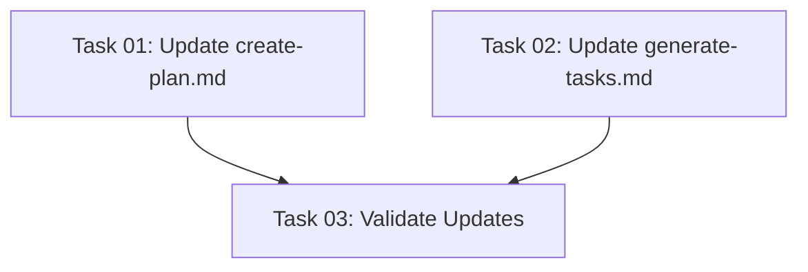

# Plan: Task Generation Prompt Optimization

## Executive Summary

This plan addresses the observed scope creep in AI-generated plans and tasks by updating the prompt templates used for plan creation and task generation. The updates will add explicit language to prevent unsolicited features, reduce unnecessary complexity, and ensure meaningful test coverage without redundancy. The goal is to improve maintainability and focus on delivering exactly what was requested without additional overhead.

## Context

### Current Problem
The existing prompts in `create-plan.md` and `generate-tasks.md` are producing plans with:
- Features not requested by users (scope creep)
- Unnecessary complexity that harms maintainability
- Excessive or redundant test cases
- Tests that verify upstream functionality rather than the actual implementation

### Desired Outcome
Updated prompts that guide AI assistants to:
- Strictly adhere to user requirements without adding unrequested features
- Prioritize simplicity and maintainability
- Generate only meaningful, non-redundant tests
- Focus on testing the actual implementation, not dependencies

## Technical Architecture

### Files to Modify
1. `/workspace/templates/commands/tasks/create-plan.md` - Plan creation prompt
2. `/workspace/templates/commands/tasks/generate-tasks.md` - Task generation prompt

### Key Principles to Embed
1. **Minimal Viable Implementation**: Do exactly what's asked, nothing more
2. **YAGNI (You Aren't Gonna Need It)**: Don't add features "just in case"
3. **DRY Testing**: Each test case should have a unique purpose
4. **Test the Code, Not the Framework**: Focus on custom logic, not library behavior

## Implementation Requirements

### Prompt Updates for create-plan.md

**Scope Control Section**:
- Add explicit warnings against feature creep
- Include language about "implementing ONLY what is explicitly requested"
- Add reminder to question any additions not directly mentioned by the user
- Include examples of common scope creep patterns to avoid

**Simplicity Guidelines**:
- Add section on preferring simple solutions over complex ones
- Include principle of "least surprise" in implementation
- Emphasize maintainability over cleverness

### Prompt Updates for generate-tasks.md

**Task Minimization**:
- Add constraint to create the minimum number of tasks needed
- Include warning against "nice to have" features
- Add explicit instruction to validate each task against original requirements

**Test Strategy Section**:
- Define what constitutes a "meaningful test"
- Add examples of redundant tests to avoid
- Include guidelines for test coverage without over-testing
- Specify when NOT to write tests (e.g., for third-party library features)

### Language Additions

**Anti-Patterns to Document**:
1. Adding extra commands or features "for completeness"
2. Creating comprehensive test suites for simple functions
3. Testing library functionality that's already tested upstream
4. Creating infrastructure for future features that weren't requested
5. Adding "helpful" abstractions that increase complexity

**Positive Patterns to Encourage**:
1. Direct implementation of stated requirements
2. Testing critical paths and edge cases only
3. Focusing on business logic, not boilerplate
4. Keeping implementations as simple as possible
5. Questioning the necessity of each component

## Risk Considerations

### Potential Challenges
1. **Under-specification**: Risk of being too restrictive and missing necessary components
   - Mitigation: Include clarification prompts for genuinely ambiguous requirements

2. **Test Coverage**: Risk of insufficient testing
   - Mitigation: Define clear criteria for "meaningful" tests with examples

3. **Backward Compatibility**: Existing users may expect current behavior
   - Mitigation: Clear documentation of changes and rationale

## Success Metrics

### Measurable Outcomes
- Reduction in number of tasks generated per plan (target: 20-30% reduction)
- Decrease in test redundancy (no duplicate test scenarios)
- Improved alignment between requirements and implementation
- Faster task execution due to reduced scope

### Quality Indicators
- Plans contain only explicitly requested features
- Each test has a clear, unique purpose
- No tests for third-party library functionality
- Simpler, more maintainable code structure

## Resource Requirements

### Development Resources
- Text editor access to modify template files
- Understanding of prompt engineering best practices
- Knowledge of common software development anti-patterns

### Testing Requirements
- Validation of updated prompts with sample use cases
- Comparison of outputs before and after changes
- Review of generated plans for scope creep indicators

## Quality Assurance

### Validation Criteria
1. Updated prompts explicitly mention scope creep prevention
2. Clear examples of what to avoid are included
3. Test generation guidelines are specific and actionable
4. Language is clear and unambiguous

### Review Process
1. Review current prompts for areas needing updates
2. Draft new language additions
3. Test with sample scenarios
4. Refine based on output quality
5. Document changes for users

## Notes and Constraints

### Scope Boundaries
- Only modify the two specified template files
- Maintain existing prompt structure and flow
- Preserve all current functionality while adding constraints
- Keep additions concise to avoid making prompts too lengthy

### Implementation Guidelines
- Use clear, imperative language in prompt updates
- Provide concrete examples where possible
- Balance between being restrictive and allowing necessary flexibility
- Ensure changes don't break existing workflows

## Conclusion

This plan provides a focused approach to improving the quality of AI-generated plans and tasks by updating the prompt templates. By adding explicit constraints against scope creep and redundant testing, the system will produce more maintainable, focused implementations that better align with user requirements. The updates will help ensure that generated plans do exactly what's needed—no more, no less.

## Task Dependency Visualization

## Execution Blueprint

**Validation Gates:**
- Reference: `.ai/task-manager/config/hooks/POST_PHASE.md`

### ✅ Phase 1: Prompt Updates
**Parallel Tasks:**
- ✔️ Task 01: Update create-plan.md Prompt (status: completed)
- ✔️ Task 02: Update generate-tasks.md Prompt (status: completed)

**Validation:** Both template files updated with new sections

### ✅ Phase 2: Validation
**Parallel Tasks:**
- ✔️ Task 03: Validate Prompt Updates (depends on: 01, 02) (status: completed)

**Validation:** Prompts contain scope control language and function correctly

### Post-phase Actions
- Review updated prompts for clarity
- Confirm anti-patterns are documented
- Verify no existing functionality broken

### Execution Summary
- Total Phases: 2
- Total Tasks: 3
- Maximum Parallelism: 2 tasks (in Phase 1)
- Critical Path Length: 2 phases
- Estimated Completion: Minimal effort required, focused on text updates only
