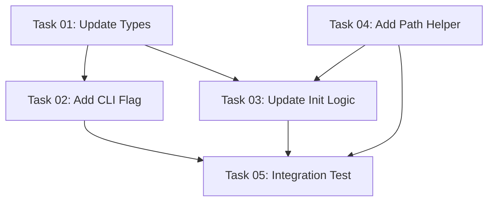

# Plan: Add --destination-directory Flag to Init Command

## Executive Summary

This plan implements a `--destination-directory` flag for the AI Task Manager init command, allowing users to specify where the project structure and template files should be created. This enhancement maintains backward compatibility (defaulting to current directory) while enabling e2e testing in isolated locations.

## Current State Analysis

The current init command:
- Creates directory structures starting with `.ai/task-manager/` in the current working directory
- Uses relative paths throughout the implementation (e.g., `.ai/task-manager/plans`, `.claude/commands/tasks`)
- Has comprehensive integration tests that already use temporary directories
- Supports multiple assistants (claude, gemini) with their own directory structures

## Technical Approach

The implementation will modify the path resolution logic throughout the init command to support a configurable base directory while maintaining all existing functionality and path relationships.

### Key Implementation Areas

1. **CLI Interface Enhancement** (`src/cli.ts`)
   - Add optional `--destination-directory` flag to init command
   - Update InitOptions interface to include the new flag
   - Preserve backward compatibility by making flag optional

2. **Core Logic Modification** (`src/index.ts`)
   - Update path resolution to use destination directory as base
   - Maintain relative path relationships between created directories
   - Update logging to reflect actual destination paths

3. **Utility Functions Enhancement** (`src/utils.ts`)
   - Create path resolution helper function
   - Update existing functions to work with configurable base paths
   - Ensure proper path joining across different operating systems

4. **Type System Updates** (`src/types.ts`)
   - Extend InitOptions interface with destinationDirectory property
   - Update related type definitions as needed

5. **Test Coverage Expansion**
   - Add integration tests for the new flag functionality
   - Test both default behavior (current directory) and custom destination
   - Verify directory structures are created correctly in custom locations
   - Test path resolution edge cases (absolute vs relative paths)

## Success Criteria

### Functional Requirements
- ✓ `--destination-directory` flag accepts both absolute and relative paths
- ✓ When flag omitted, behavior remains identical to current implementation
- ✓ When flag provided, all structures created relative to specified directory
- ✓ All template files copied to correct locations within destination
- ✓ Assistant-specific directories created in proper hierarchy
- ✓ Logging messages reflect actual destination paths

### Quality Requirements
- ✓ All existing tests continue to pass
- ✓ New comprehensive test coverage for flag functionality
- ✓ Type safety maintained throughout implementation
- ✓ Error handling for invalid destination paths
- ✓ Cross-platform path compatibility (Windows/Unix)

### Integration Requirements
- ✓ E2E tests can use flag to test in isolated directories
- ✓ No breaking changes to existing API or behavior
- ✓ Compatible with existing assistant configurations
- ✓ Proper validation and error messages for edge cases

## Risk Considerations

### Path Resolution Complexity
- **Risk**: Different path handling between operating systems
- **Mitigation**: Use Node.js path module and test on multiple platforms
- **Testing**: Include tests for both relative and absolute paths

### Backward Compatibility
- **Risk**: Unintended changes to default behavior
- **Mitigation**: Extensive testing of existing functionality with flag omitted
- **Testing**: Regression test suite focusing on default behavior

### Template Path Resolution
- **Risk**: Template files not found when destination directory changes
- **Mitigation**: Template paths remain absolute, only destination changes
- **Testing**: Verify template copying works from various working directories

### Directory Creation Edge Cases
- **Risk**: Permission issues or invalid paths in destination directory
- **Mitigation**: Proper error handling and validation before directory creation
- **Testing**: Test with read-only destinations and invalid paths

## Implementation Dependencies

### Internal Dependencies
- No new external dependencies required
- Leverages existing fs-extra and path modules
- Uses established error handling patterns

### Testing Dependencies
- Builds on existing Jest integration test framework
- Uses current temporary directory testing patterns
- Compatible with existing test utilities

### Build and Development Dependencies
- No additional build steps required
- Compatible with existing TypeScript compilation
- Uses established linting and formatting rules

## Validation Gates

### Pre-Implementation Validation
- Verify understanding of current path resolution logic
- Confirm template structure and copy mechanisms
- Review existing test patterns for consistency

### Implementation Validation
- Unit tests pass for modified utilities
- Integration tests verify flag functionality
- Backward compatibility tests confirm no regressions

### Post-Implementation Validation
- E2E test demonstrates intended use case
- Documentation reflects new flag usage
- Performance impact assessment (should be minimal)

## Resource Requirements

### Development Skills
- TypeScript/Node.js development
- CLI development with Commander.js
- File system operations and path manipulation
- Jest testing framework

### Time Estimation
- Implementation: 4-6 hours
- Testing: 3-4 hours
- Documentation and refinement: 1-2 hours
- Total: 8-12 hours

### Tools and Environment
- Existing development environment sufficient
- No additional tools or setup required
- Compatible with current build and test processes

## Task Dependency Visualization

## Execution Blueprint

**Validation Gates:**
- Reference: `.ai/task-manager/config/hooks/POST_PHASE.md`

### ✅ Phase 1: Foundation
**Parallel Tasks:**
- ✔️ Task 01: Update TypeScript Types for Destination Directory
- ✔️ Task 04: Add Path Resolution Helper to Utils

**Validation:** Types compile, utility function works correctly

### ✅ Phase 2: Implementation
**Parallel Tasks:**
- ✔️ Task 02: Add --destination-directory Flag to CLI (depends on: 01)
- ✔️ Task 03: Update Init Command Path Resolution (depends on: 01, 04)

**Validation:** CLI accepts flag, paths resolve correctly

### ✅ Phase 3: Testing
**Parallel Tasks:**
- ✔️ Task 05: Add Integration Test for Destination Directory Flag (depends on: 02, 03, 04)

**Validation:** Test passes, backward compatibility maintained

### Post-phase Actions
- Run npm run build to compile TypeScript
- Run npm test to verify all tests pass
- Test manually with different destination paths

### Execution Summary
- Total Phases: 3
- Total Tasks: 5
- Maximum Parallelism: 2 tasks (in Phases 1 and 2)
- Critical Path Length: 3 phases
- Estimated Completion: Focused implementation with minimal scope