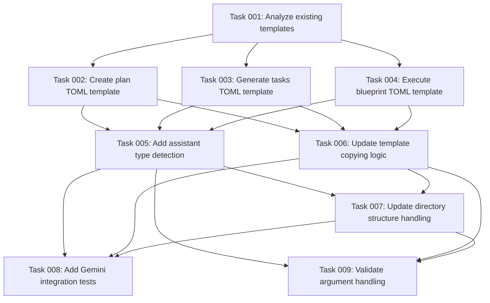

# Gemini Command Adaptation Plan

## Executive Summary

This plan outlines the adaptation of existing AI task management command templates from Claude's markdown format (`.md` with `$ARGUMENTS`/`$1`) to Gemini's TOML format (`.toml` with `{{args}}` or default argument handling). The primary focus is updating the `init` command to generate appropriate Gemini-compatible command files in `.gemini/commands/tasks/` directories.

## Context Analysis

**Objective**: Transform the current Claude-specific command template system to support Gemini CLI's custom slash command format, ensuring compatibility with both assistants.

**Current State**:
- Templates in `templates/commands/tasks/` use `.md` format
- Argument injection uses `$ARGUMENTS` and `$1` placeholders
- Init command copies templates directly to `.{assistant}/commands/tasks/`
- Three template files: `create-plan.md`, `generate-tasks.md`, `execute-blueprint.md`

**Target State**:
- Gemini commands use `.toml` format with `description` and `prompt` fields
- Arguments use `{{args}}` for shorthand injection or default behavior
- Init command generates appropriate format based on assistant type
- Maintain backward compatibility with existing Claude templates

**Scope**: Limited to command template adaptation and init command modifications. Does not include changes to core task management logic or CLI functionality.

**Success Criteria**:
- Gemini users can initialize projects with properly formatted `.toml` command files
- Command files work correctly with Gemini CLI's slash command system
- Argument handling functions properly in Gemini environment
- Claude compatibility remains unaffected
- Init command handles both assistant types appropriately

## Technical Requirements

**File Format Conversion**:
- Convert from markdown frontmatter + content to TOML format
- Map existing argument hints to Gemini's `description` field
- Transform command content to `prompt` field

**Argument Handling Migration**:
- Replace `$ARGUMENTS` with `{{args}}` for simple argument injection
- Use default argument handling for complex prompts
- Maintain semantic equivalence of argument processing

**Init Command Updates**:
- Detect assistant type during initialization
- Apply appropriate template format based on assistant
- Generate `.toml` files for Gemini, preserve `.md` files for Claude
- Update file extension and content structure conditionally

## Implementation Approach

**Phase-Based Development**:
1. **Analysis & Template Creation**: Examine current templates and create Gemini equivalents
2. **Core Logic Updates**: Modify init command to handle format selection
3. **Integration & Testing**: Ensure both assistant types work properly
4. **Validation**: Verify generated commands function correctly

**Risk Mitigation**:
- Maintain separate template handling for each assistant type
- Test both Claude and Gemini initialization paths
- Validate argument handling in actual Gemini environment
- Ensure no breaking changes to existing Claude installations

**Quality Assurance**:
- Manual testing of init command with both assistants
- Verification of generated command files in Gemini CLI
- Confirmation of argument processing functionality
- Cross-platform compatibility testing

## Dependencies

**Internal**: Access to existing template files, init command implementation, and utility functions
**External**: Understanding of Gemini CLI's TOML format requirements and argument handling mechanisms
**Technical**: Node.js file system operations, template processing capabilities

## Resource Requirements

**Development**: TypeScript/JavaScript expertise for init command modifications
**Testing**: Access to both Claude and Gemini CLI environments
**Validation**: Ability to test generated commands in actual assistant environments

## Expected Outcomes

**Deliverables**:
- Updated init command supporting both Claude and Gemini formats
- Gemini-compatible TOML template generation logic
- Proper argument handling for Gemini slash commands
- Maintained Claude compatibility without regression

**Quality Metrics**:
- All three task commands (`create-plan`, `generate-tasks`, `execute-blueprint`) work in Gemini
- Argument injection functions correctly in both assistants
- Init command successfully creates appropriate directory structures
- No breaking changes to existing Claude installations

## Task Dependencies

## Execution Blueprint

**Validation Gates:**
- Reference: `/config/hooks/POST_PHASE.md`

✅ ### Phase 1: Foundation Analysis
**Parallel Tasks:**
- ✔️ Task 001: Analyze existing templates (template-analysis) (status: completed)

✅ ### Phase 2: Template Creation
**Parallel Tasks:**
- ✔️ Task 002: Create plan TOML template (depends on: 001) (status: completed)
- ✔️ Task 003: Generate tasks TOML template (depends on: 001) (status: completed)
- ✔️ Task 004: Execute blueprint TOML template (depends on: 001) (status: completed)

✅ ### Phase 3: Init Command Integration
**Parallel Tasks:**
- ✔️ Task 005: Add assistant type detection (depends on: 002, 003, 004) (status: completed)
- ✔️ Task 006: Update template copying logic (depends on: 002, 003, 004) (status: completed)

✅ ### Phase 4: Directory Structure Updates
**Parallel Tasks:**
- ✔️ Task 007: Update directory structure handling (depends on: 005, 006) (status: completed)

✅ ### Phase 5: Testing and Validation
**Parallel Tasks:**
- ✔️ Task 008: Add Gemini integration tests (depends on: 005, 006, 007) (status: completed)
- ✔️ Task 009: Validate argument handling (depends on: 005, 006, 007) (status: completed)

### Post-phase Actions
After each phase completion, validate that template generation and init command functionality work correctly for both Claude and Gemini assistants.

### Execution Summary
- Total Phases: 5
- Total Tasks: 9
- Maximum Parallelism: 3 tasks (in Phase 2)
- Critical Path Length: 5 phases
- Critical Path: Tasks 001 → 002/003/004 → 005/006 → 007 → 008/009