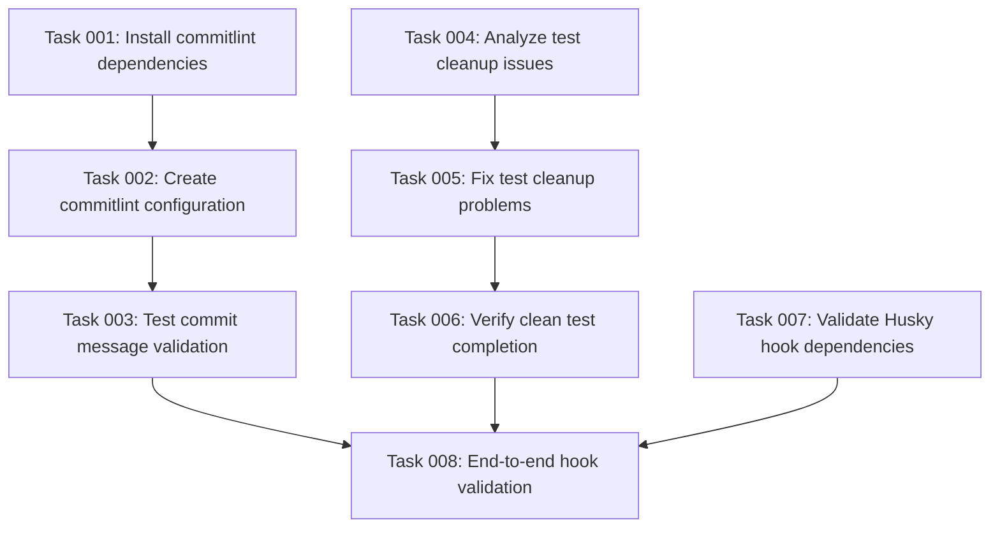

# Plan: Fix Commit Hook Errors

## Executive Summary
Resolve commit failures by installing missing commitlint dependency and addressing test cleanup warnings. The pre-commit hook tests are passing but the commit-msg validation is failing due to missing packages.

## Context Analysis

**Objective**: Fix commit errors by resolving pre-commit hook failures
**Current Issues Identified**:
1. commitlint@19.8.1 is not installed but required by commit-msg hook
2. Tests pass but have cleanup warnings about worker processes not exiting gracefully
3. Husky hooks are configured but missing required dependencies

**Technical Setup**:
- Using Husky for git hooks
- Pre-commit hook runs `npm test` (currently passing)
- Commit-msg hook runs `npx commitlint --edit ${1}` (failing due to missing package)
- Jest test runner with 133 passing tests

## Detailed Steps

### 1. **Install Missing commitlint Dependencies**
- Install commitlint CLI and configuration packages
- Add appropriate commitlint configuration for the project
- Ensure commit message validation works properly

### 2. **Address Test Cleanup Issues**
- Run tests with `--detectOpenHandles` to identify async operations
- Fix any test cleanup issues that prevent proper process termination
- Verify tests complete cleanly without force exit warnings

### 3. **Validate Hook Configuration**
- Verify all Husky hooks have required dependencies
- Ensure hooks run successfully in CI/CD context

## Implementation Order
1. Install commitlint packages first (blocks commit process)
2. Configure commitlint rules
3. Address test cleanup issues (quality improvement)

## Risk Considerations
- **commitlint configuration**: Need to choose appropriate ruleset without being too restrictive
- **Test cleanup**: May require identifying specific tests with async leaks
- **Breaking changes**: Installing new linting rules might require commit message format changes

## Success Metrics
- Commit completes successfully without errors
- All pre-commit hooks pass
- Tests run cleanly without force exit warnings

## Resource Requirements
- Package installation: commitlint CLI and config packages
- Configuration: commitlint.config.js or similar
- Testing: Jest with --detectOpenHandles flag
- Git: Working knowledge of hooks and commit process

## Task Dependency Visualization

## Execution Blueprint

**Validation Gates:**
- Reference: `/config/hooks/POST_PHASE.md`

### ✅ Phase 1: Foundation Setup
**Parallel Tasks:**
- ✔️ Task 001: Install commitlint dependencies
- ✔️ Task 004: Analyze test cleanup issues
- ✔️ Task 007: Validate Husky hook dependencies

### ✅ Phase 2: Configuration & Issue Resolution
**Parallel Tasks:**
- ✔️ Task 002: Create commitlint configuration (depends on: 001)
- ✔️ Task 005: Fix test cleanup problems (depends on: 004)

### ✅ Phase 3: Component Validation
**Parallel Tasks:**
- ✔️ Task 003: Test commit message validation (depends on: 002)
- ✔️ Task 006: Verify clean test completion (depends on: 005)

### ✅ Phase 4: Integration Testing
**Parallel Tasks:**
- ✔️ Task 008: End-to-end hook validation (depends on: 003, 006, 007)

### Post-phase Actions

### Execution Summary
- Total Phases: 4
- Total Tasks: 8
- Maximum Parallelism: 3 tasks (in Phase 1)
- Critical Path Length: 4 phases
