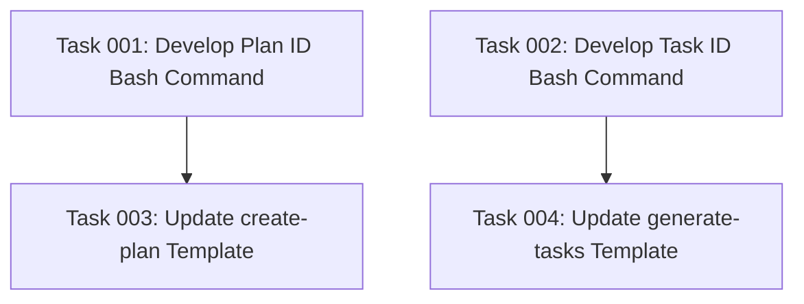

# Fix ID Generation System for Plans and Tasks

## Executive Summary

The current task manager system has inconsistent ID generation where:
1. Plan IDs sometimes revert to `01` instead of auto-incrementing
2. Front-matter uses zero-padded strings (like `"01"`) instead of numeric values (like `1`)
3. ID generation relies on LLM accuracy rather than automated bash commands

This plan implements reliable bash-based auto-increment ID generation for both plans and tasks, with proper numeric formatting in front-matter while maintaining zero-padded file/folder naming conventions.

## Problem Analysis

### Current Issues
- **Non-deterministic ID generation**: LLMs sometimes generate duplicate or non-sequential IDs
- **Inconsistent data types**: Front-matter should use numeric IDs but currently uses zero-padded strings
- **Manual process vulnerability**: Relying on AI to calculate next ID introduces human/AI error
- **Lack of automation**: No documented bash commands for reliable ID generation

### Impact
- Duplicate plan IDs cause confusion and organizational issues
- Inconsistent data types break schema validation and downstream processing
- Manual ID management doesn't scale and introduces errors

## Technical Requirements

### ID Generation Logic
- **Plan IDs**: Auto-increment based on highest existing plan ID in `.ai/task-manager/plans/`
- **Task IDs**: Auto-increment based on highest existing task ID within specific plan's `tasks/` folder
- **Front-matter format**: Numeric values (e.g., `id: 6`)
- **File/folder naming**: Zero-padded strings (e.g., `06--plan-name`)

### Bash Command Requirements
- Single-line commands that can be copy-pasted
- Handle edge cases (no existing plans/tasks, non-sequential IDs)
- Work reliably across different shell environments
- Return only the numeric ID value

## Implementation Approach

### Phase 1: Plan ID Generation
- Analyze current plan directory structure
- Develop bash command to find highest plan ID
- Document command in `templates/commands/tasks/create-plan.md`
- Update template documentation with usage instructions

### Phase 2: Task ID Generation
- Analyze task directory structure within plans
- Develop bash command to find highest task ID within a specific plan
- Document command in `templates/commands/tasks/generate-tasks.md`
- Update template documentation with usage instructions

### Phase 3: Template Integration
- Add bash command documentation sections to both template files
- Include examples of proper front-matter formatting
- Add notes about numeric vs. zero-padded string distinctions
- Provide usage guidelines for implementers

## Success Metrics

### Functional Requirements
- Bash commands reliably generate correct next ID
- Front-matter uses numeric IDs (schema compliant)
- File/folder names maintain zero-padding convention
- Commands work for edge cases (empty directories, gaps in sequence)

### Documentation Requirements
- Clear instructions in both template files
- Copy-pasteable bash commands
- Examples showing proper usage
- Explanation of numeric vs. string formatting

## Risk Considerations

### Technical Risks
- **Command compatibility**: Bash commands might behave differently across systems
- **Edge case handling**: Empty directories or non-sequential existing IDs
- **File system race conditions**: Multiple concurrent plan/task creation

### Mitigation Strategies
- Test commands on common shell environments (bash, zsh)
- Handle edge cases explicitly in command logic
- Document assumptions and prerequisites
- Provide fallback instructions for manual ID generation

## Resource Requirements

### Skills Needed
- Bash scripting and file system operations
- Understanding of task manager directory structure
- Markdown documentation
- Schema validation knowledge

### Tools Required
- Command line access for testing bash commands
- Text editor for template modification
- File system access to existing plans/tasks for testing

## Dependencies

### Prerequisites
- Access to existing `.ai/task-manager/` directory structure
- Understanding of current plan/task ID patterns
- Knowledge of front-matter schema requirements

### External Dependencies
- Standard Unix utilities (`find`, `ls`, `sort`, `tail`, `basename`)
- Shell environment with bash command support

## Task Dependencies

## Execution Blueprint

**Validation Gates:**
- Reference: `/config/hooks/POST_PHASE.md`

### ✅ Phase 1: Bash Command Development
**Parallel Tasks:**
- ✔️ Task 001: Develop and test plan ID generation bash command
- ✔️ Task 002: Develop and test task ID generation bash command

### ✅ Phase 2: Template Documentation
**Parallel Tasks:**
- ✔️ Task 003: Update create-plan.md template with ID generation documentation (depends on: 001)
- ✔️ Task 004: Update generate-tasks.md template with ID generation documentation (depends on: 002)

### Post-phase Actions
After completion, validate that both template files contain working bash commands and proper documentation for numeric vs zero-padded ID formatting.

### Execution Summary
- Total Phases: 2
- Total Tasks: 4
- Maximum Parallelism: 2 tasks (in both phases)
- Critical Path Length: 2 phases