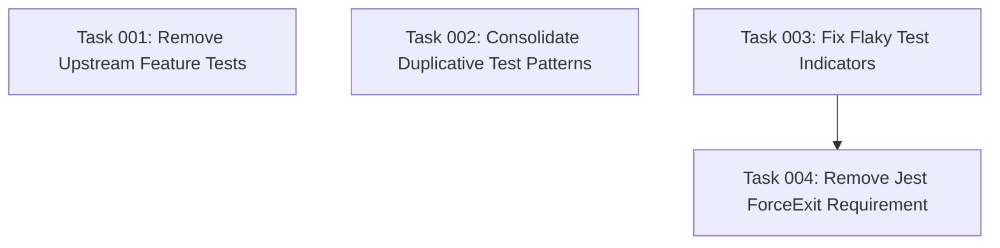

# Test Cleanup & Quality Improvement Plan

## Executive Summary

The project has a well-structured Jest-based test suite with 4 test files covering CLI, core functionality, logging, and utilities. While the tests are generally well-organized, there are opportunities for cleanup, consolidation, and improvement to eliminate redundancy and potential flaky behavior.

## Current Test Analysis

**Testing Infrastructure:**
- Framework: Jest with TypeScript (ts-jest)
- Test files: 4 files, 144 tests total
- Coverage: Well-configured with thresholds at 70%
- Organization: Clean separation between unit and integration tests

**Issues Identified:**

### 1. Superfluous & Duplicative Tests
- **Path testing redundancy**: `utils.test.ts` has extensive path helper tests that mostly test Node.js built-in functionality
- **Template validation duplication**: Multiple tests verify template file existence and content structure
- **Assistant validation repetition**: Similar validation logic tested across multiple files
- **Error handling patterns**: Repeated error handling test patterns across files

### 2. Flaky Test Indicators Found
- **Process management issues**: Complex process tracking in integration tests with potential race conditions
- **File system timing dependencies**: Tests creating/removing directories without proper cleanup ordering
- **Timer management**: Manual timer tracking suggests potential timing issues
- **Jest exit forcing**: The `forceExit: true` flag indicates hanging async operations

### 3. Testing Upstream Features
- **Node.js path module**: Extensive testing of `path.resolve`, `path.join`, etc.
- **fs-extra functionality**: Testing library methods rather than business logic
- **OS operations**: Testing `os.homedir()` functionality

## Risk Considerations

- **Breaking changes**: Some test removal may reduce coverage temporarily
- **Integration complexity**: CLI integration tests require careful handling
- **Timing sensitivity**: File system operations need proper synchronization

## Success Metrics

- Reduce total test count by ~25% while maintaining coverage
- Eliminate Jest force exit requirement
- Improve test execution time by removing unnecessary operations
- Achieve consistent test runs without flaky failures

## Resource Requirements

- **Tools**: Existing Jest setup sufficient
- **Skills**: TypeScript, Jest, async/await patterns
- **Timeline**: 2-3 hours for complete implementation

## Task Dependency Visualization

## Execution Blueprint

**Validation Gates:**
- Reference: `.ai/task-manager/config/hooks/POST_PHASE.md`

### ✅ Phase 1: Test Cleanup and Stabilization
**Parallel Tasks:**
- ✔️ Task 001: Remove Upstream Feature Tests (utils.test.ts cleanup)
- ✔️ Task 002: Consolidate Duplicative Test Patterns (merge similar tests across files)
- ✔️ Task 003: Fix Flaky Test Indicators (stabilize integration tests)

### ✅ Phase 2: Final Validation
**Parallel Tasks:**
- ✔️ Task 004: Remove Jest ForceExit Requirement (depends on: 003)

### Post-phase Actions
- Run full test suite to verify stability
- Check coverage metrics remain above 70%
- Validate CI pipeline passes without issues

### Execution Summary
- Total Phases: 2
- Total Tasks: 4
- Maximum Parallelism: 3 tasks (in Phase 1)
- Critical Path Length: 2 phases