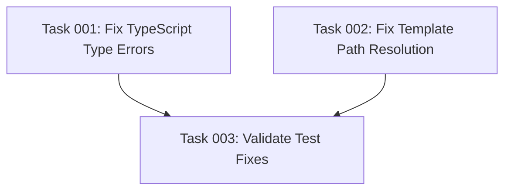

# Fix Failing Tests Plan

## Executive Summary

The pre-commit hooks are failing due to test failures in two main areas: TypeScript type errors in the TOML integration tests and template file path resolution issues in the CLI integration tests. This plan addresses both issues through proper type fixing and correct path handling, ensuring all tests pass without introducing hacky workarounds or masking underlying bugs.

## Problem Analysis

### Issue 1: TypeScript Type Errors in toml-integration.test.ts
- `jest.spyOn(fs, 'readFile')` is expecting a parameter of type 'never' instead of string
- This occurs at lines 55, 143, and 211 in the test file
- The issue stems from incorrect typing of the fs module's readFile method mock

### Issue 2: Template Path Resolution Failures
- Multiple tests fail with "Template file not found: /templates/ai-task-manager/TASK_MANAGER.md"
- The path `/templates/` is absolute but should be relative to the workspace
- Affects both cli.integration.test.ts and index.test.ts

## Detailed Implementation Approach

### Phase 1: Fix TypeScript Type Errors
The `fs.readFile` mock type mismatch needs to be resolved by properly typing the mock or using the correct fs-extra method signature. The issue likely stems from fs-extra's readFile returning a Buffer by default, not a string.

### Phase 2: Fix Template Path Resolution
The template paths need to be resolved relative to the workspace root, not as absolute paths. The issue is in how the getTemplatePath utility function constructs paths - it's creating absolute paths when it should create workspace-relative paths.

### Phase 3: Test Validation
After fixing both issues, run the complete test suite iteratively to ensure:
- No TypeScript compilation errors
- All template files are found correctly
- All tests pass without conditional workarounds
- No error suppression or masking

## Success Criteria

1. All tests pass successfully: `npm test` exits with code 0
2. No TypeScript compilation errors in any test file
3. Template files are correctly resolved in all test scenarios
4. Pre-commit hooks execute successfully
5. No hacky conditionals or error suppression added
6. Code remains simple and maintainable

## Risk Considerations

- **Mock Type Compatibility**: Ensure fs-extra mock types match the actual usage in the codebase
- **Path Resolution Consistency**: Verify path resolution works across different operating systems
- **Test Environment State**: Ensure test setup/teardown properly manages file system state
- **Dependency Versions**: Check that jest and fs-extra versions are compatible

## Resource Requirements

- Access to the codebase and test files
- Ability to run npm test iteratively
- Understanding of Jest mocking patterns
- Knowledge of TypeScript type system
- Understanding of Node.js path resolution

## Implementation Order

1. Fix TypeScript type errors first (they prevent compilation)
2. Fix template path resolution issues
3. Run tests iteratively after each fix
4. Validate all tests pass cleanly
5. Verify pre-commit hooks work

## Quality Assurance

- Each fix should be tested immediately
- No shortcuts or error suppression
- Maintain test readability and simplicity
- Ensure fixes work in CI/CD environment
- Document any non-obvious changes

## Task Dependencies

## Execution Blueprint

**Validation Gates:**
- Reference: `/config/hooks/POST_PHASE.md`

### ✅ Phase 1: Core Fixes
**Parallel Tasks:**
- ✔️ Task 001: Fix TypeScript Type Errors (type-fixes group) - COMPLETED
- ✔️ Task 002: Fix Template Path Resolution (path-fixes group) - COMPLETED

### ✅ Phase 2: Validation
**Parallel Tasks:**
- ✔️ Task 003: Validate Test Fixes (depends on: 001, 002) - COMPLETED

### Post-phase Actions
After each phase completion, ensure validation gates pass:
- Code base passes linting requirements
- All tests run locally and are passing
- Descriptive commit created using conventional commits

### Execution Summary
- Total Phases: 2
- Total Tasks: 3
- Maximum Parallelism: 2 tasks (in Phase 1)
- Critical Path Length: 2 phases