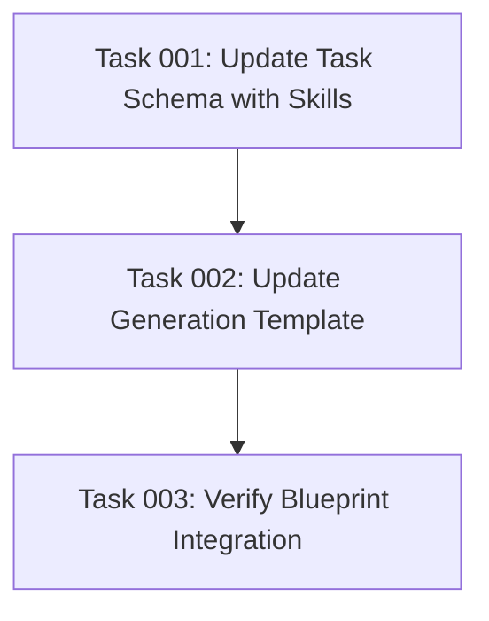

# Skills Property Enhancement Plan

## Executive Summary

This plan implements a new "skills" frontmatter property in the task generation system to enable more precise subagent selection during blueprint execution. The property will be an array of strings containing 1-2 technical skills required for each task, facilitating automated matching of tasks to appropriate specialized agents.

## Project Context

The current task management system generates tasks with frontmatter containing basic metadata (id, group, dependencies, status, created). However, the execute-blueprint.md process lacks sufficient information to automatically select the most appropriate Claude Code sub-agent for each task. Adding a "skills" property will bridge this gap by providing explicit technical skill requirements.

## Objectives

### Primary Goals
1. **Schema Enhancement**: Add "skills" property to task frontmatter schema as an array of strings
2. **Generation Logic Update**: Modify task generation templates to automatically populate skills based on task requirements
3. **Blueprint Integration**: Enable execute-blueprint.md to leverage skills data for optimal subagent selection
4. **Documentation Update**: Update schemas, examples, and documentation to reflect the new property

### Success Criteria
- All task generation templates include skills property in schema and examples
- Generated tasks automatically include relevant technical skills (1-2 per task)
- Skills don't necessarily align with available subagent capabilities, since we don't know which subagents will be available in the projects where the templates are copied into
- Blueprint execution can successfully match tasks to appropriate agents based on skills

## Technical Requirements

### Skills Property Specifications
- **Type**: Array of strings
- **Cardinality**: Typically 1-2 skills per task (can be more if necessary)
- **Format**: Lowercase strings matching common technical domains
- **Required**: Yes (cannot be empty array)

### Skill Categories and Examples
- **Frontend**: "js", "css", "react-hooks", "vue-components", "html", "sass"
- **Backend**: "api-endpoints", "database", "server-config", "authentication"
- **Framework-Specific**: "drupal-backend", "drupal-config", "wordpress-plugins"
- **Testing**: "jest", "unit-testing", "e2e-testing", "playwright"
- **DevOps**: "github-actions", "ci-cd", "docker", "deployment"
- **Languages**: "typescript", "python", "php", "bash"

### Schema Integration Points
1. **Templates**: `/templates/commands/tasks/generate-tasks.md`
2. **Blueprint Execution**: `/templates/commands/tasks/execute-blueprint.md` (consumer)

## Implementation Approach

### Phase 1: Schema Definition
- Update JSON schema to include skills property as required array of strings
- Update frontmatter examples across all templates

### Phase 2: Template Updates
- Modify all task generation templates to include skills property
- Add guidance for skill selection based on task technical requirements
- Update task body structure documentation

### Phase 3: Generation Logic Enhancement
- Add logic to automatically infer skills from task objectives and technical requirements
- Ensure consistent skill naming conventions

### Phase 4: Blueprint Integration
- Verify execute-blueprint.md can consume skills property
- Validate subagent matching logic works with new skills data

## Risk Considerations

### Technical Risks
- **Over/Under-specification**: Tasks may have too many or too few skills assigned
  - *Mitigation*: Establish clear guidelines and validation rules

## Success Metrics

### Functional Metrics
- ✅ All task generation templates include skills property with correct schema
- ✅ Generated tasks consistently have 1-2 relevant technical skills
- ✅ Skills vocabulary aligns with common technical domains and subagent capabilities
- ✅ Blueprint execution successfully uses skills for subagent selection

### Quality Metrics
- ✅ Generated skills are contextually appropriate for task objectives
- ✅ Documentation accurately reflects new property usage

## Resource Requirements

### Technical Assets
- Task generation template files (3 files)
- JSON schema definitions
- Documentation and examples
- Blueprint execution template

### Validation Requirements
- Task generation testing with various plan types

## Scope Constraints

### In Scope
- Adding skills property to task frontmatter schema
- Updating task generation template
- Providing clear skill selection guidance
- Ensuring blueprint integration readiness
- Updating examples and documentation

### Out of Scope
- Modifying existing generated tasks (retroactive updates)
- Creating new subagent types or capabilities
- Changing core blueprint execution logic beyond skills consumption
- Complex skill inference algorithms or AI-based skill detection
- Skills-based task prioritization or scheduling

## Dependencies

### Internal Dependencies
- Access to all task generation template files

## Quality Assurance

### Validation Gates
1. **Generation Testing**: New tasks generated with proper skills arrays
2. **Documentation Review**: All examples and schemas are consistent and accurate

### Testing Strategy
- Integration testing with sample plans

## Task Dependencies

## Execution Blueprint

**Validation Gates:**
- Reference: `/config/hooks/POST_PHASE.md`

### ✅ Phase 1: Schema Foundation
**Parallel Tasks:**
- ✔️ Task 001: Update Task Schema with Skills (skills: json-schema)

### ✅ Phase 2: Template Enhancement
**Parallel Tasks:**
- ✔️ Task 002: Update Generation Template (depends on: 001, skills: markdown, documentation)

### ✅ Phase 3: Integration Validation
**Parallel Tasks:**
- ✔️ Task 003: Verify Blueprint Integration (depends on: 002, skills: integration-testing)

### Execution Summary
- Total Phases: 3
- Total Tasks: 3
- Maximum Parallelism: 1 task per phase
- Critical Path Length: 3 phases