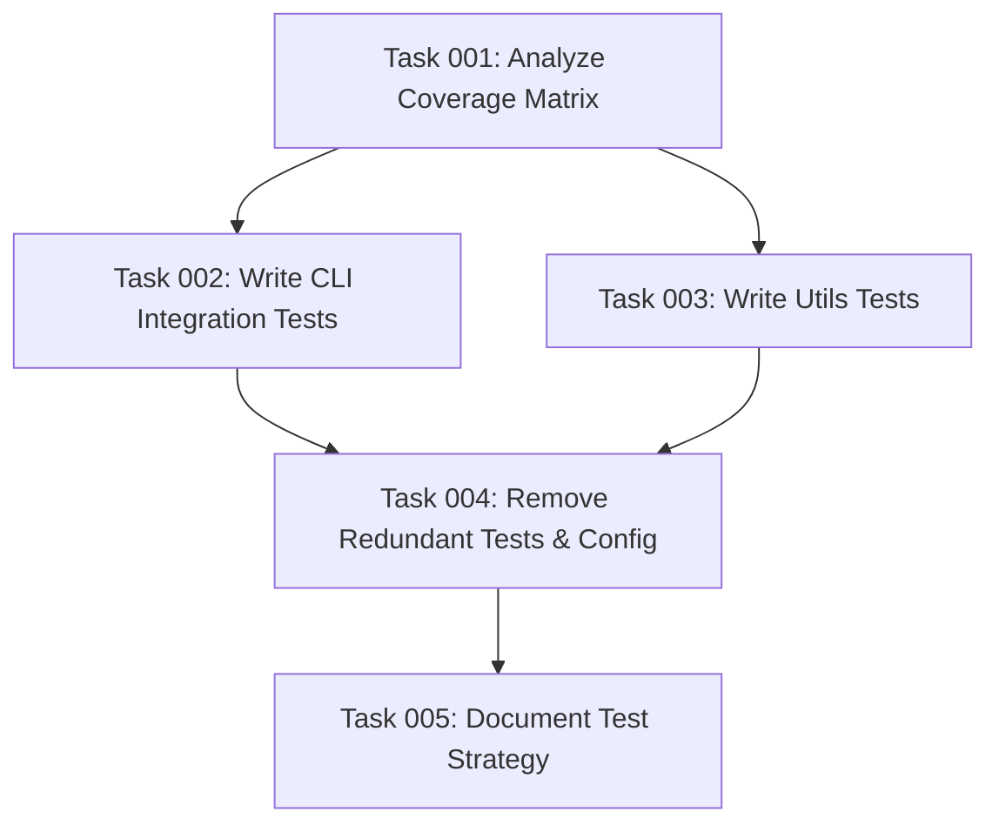

# Plan 10: Reduce Overtesting in AI Task Manager

## Executive Summary

The current test suite contains 3,185 lines of test code for only 1,305 lines of production code (2.4x ratio) with 184 test cases. This plan will consolidate the test suite to approximately 500-700 lines of focused integration tests that cover the critical paths: file copying, conflict handling, and path resolution. We'll follow the principle "write a few tests, mostly integration" to achieve an efficient 1:2 production-to-test code ratio.

## Problem Statement

- **Current State**:
  - 184 test cases across 6 test files
  - 3,185 lines of test code
  - Excessive unit testing of trivial functions
  - Redundant test coverage with multiple tests verifying the same behavior
  - Heavy mocking that adds complexity without significant value

- **Target State**:
  - ~15-20 focused integration test cases
  - ~500-700 lines of test code
  - Primarily integration tests that verify real behavior
  - Minimal mocking (only for external dependencies like file system errors)
  - Clear, maintainable test suite that runs quickly

## Implementation Strategy

### Phase 1: Analyze and Document Current Coverage
Identify which tests are actually valuable and which are redundant. Document the critical user paths that must be tested.

### Phase 2: Design New Test Structure
Create a new, simplified test structure focusing on:
1. **One main integration test file** (`cli.integration.test.ts`) - ~400 lines
2. **One utilities test file** (`utils.test.ts`) - ~200 lines for critical path functions
3. **Remove** logger, toml-validation, toml-integration, and most of index.test.ts

### Phase 3: Implement Core Integration Tests
Write comprehensive integration tests that cover:
- **Happy Path**: Initialize with different assistant combinations
- **Conflict Resolution**: Handling existing files and directories
- **Path Resolution**: Various path inputs (relative, absolute, special characters)
- **Error Scenarios**: Invalid inputs, permission issues, missing templates

### Phase 4: Prune Redundant Tests
Remove:
- Unit tests for trivial functions (e.g., path joining, string formatting)
- Duplicate test scenarios
- Tests that mock everything and test nothing real
- Logger tests (logging is not critical functionality)
- TOML conversion tests (keep one integration test if critical)

## Success Criteria

1. **Test Coverage Metrics**:
   - Maintain 70%+ code coverage for critical paths
   - Reduce test code to ~500-700 lines
   - Reduce test execution time by 50%+

2. **Quality Metrics**:
   - All critical user workflows are tested
   - Tests are readable and maintainable
   - No flaky tests
   - Clear test failure messages

## Risk Mitigation

1. **Risk**: Breaking existing functionality
   - **Mitigation**: Run full test suite before and after changes
   - **Mitigation**: Keep old tests in a backup branch temporarily

2. **Risk**: Future regressions
   - **Mitigation**: Document what each integration test covers
   - **Mitigation**: Add comments explaining why certain areas don't need tests

## Technical Requirements

- Jest test framework (existing)
- Node.js file system operations
- Temporary directories for test isolation
- No additional testing libraries needed

## Core Testing Principles

Following the "write a few tests, mostly integration" mantra:

1. **Test Behavior, Not Implementation**: Focus on what users experience, not how code works internally
2. **Avoid Over-Mocking**: Use real file system operations where possible
3. **One Assertion Per Test**: Keep tests focused and clear
4. **Fast Feedback**: Tests should run in under 5 seconds total
5. **Clear Naming**: Test names should describe the scenario and expected outcome

## What NOT to Test

- Getters/setters
- Simple utility functions that wrap standard library functions
- Console output formatting
- Configuration loading (unless it affects behavior)
- Third-party library functionality

## What MUST be Tested

1. **File Operations**:
   - Copying templates to correct locations
   - Creating directory structures
   - Handling existing files (merge/overwrite behavior)

2. **Path Resolution**:
   - Relative paths
   - Absolute paths
   - Default directory behavior
   - Cross-platform compatibility

3. **Assistant Configuration**:
   - Single assistant setup
   - Multiple assistant setup
   - Invalid assistant names

4. **Error Handling**:
   - Missing required parameters
   - File system permission errors
   - Template not found errors

## Implementation Order

1. Create test coverage matrix from existing tests
2. Write new consolidated integration tests
3. Verify new tests cover all critical paths
4. Remove redundant test files
5. Update jest configuration for faster execution
6. Document test strategy in CLAUDE.md

## Deliverables

1. Reduced test suite with ~15-20 focused tests
2. Updated jest.config.js optimized for speed
3. Test strategy documentation
4. Coverage report showing maintained coverage of critical paths

## Task Dependencies

## Execution Blueprint

**Validation Gates:**
- Reference: `/config/hooks/POST_PHASE.md`

### ✅ Phase 1: Analysis
**Parallel Tasks:**
- ✔️ Task 001: Analyze Existing Tests and Create Coverage Matrix

### ✅ Phase 2: Implementation
**Parallel Tasks:**
- ✔️ Task 002: Write Consolidated CLI Integration Tests (depends on: 001)
- ✔️ Task 003: Write Minimal Utils Tests for Critical Functions (depends on: 001)

### ✅ Phase 3: Cleanup
**Parallel Tasks:**
- ✔️ Task 004: Remove Redundant Test Files and Update Configuration (depends on: 002, 003)

### ✅ Phase 4: Documentation
**Parallel Tasks:**
- ✔️ Task 005: Document Test Strategy (depends on: 004)

### Execution Summary
- Total Phases: 4
- Total Tasks: 5
- Maximum Parallelism: 2 tasks (in Phase 2)
- Critical Path Length: 4 phases