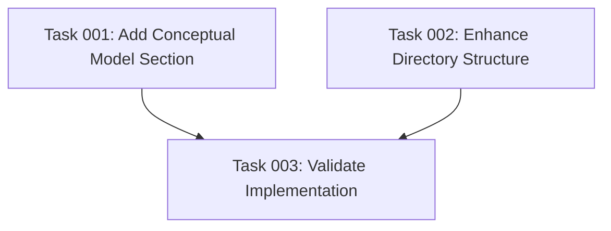

# Plan: Enhance CLAUDE.md with Task Manager Context

## Executive Summary

This plan enhances the CLAUDE.md file by adding essential context about the task management system that the CLI tool creates, without significantly increasing the file length. The improvement will help future developers understand not just how the CLI works, but what it creates and why.

## Current Gap Analysis

The existing CLAUDE.md excellently covers the technical implementation but lacks:
- **Conceptual Model**: What are work orders, plans, and tasks?
- **User Workflow**: How do users interact with the generated system?
- **Purpose Context**: Why does this task management approach exist?
- **File Relationships**: How do plans and tasks connect?

## Problem Statement

Future Claude Code instances working in this repository need to understand both:
1. How the CLI tool is implemented (currently well documented)
2. What the task management system does conceptually (currently missing)

Without this context, developers may modify the CLI without understanding the intended user workflow or the relationships between work orders, plans, and tasks.

## Solution Overview

Add a concise "Task Manager Conceptual Model" section to CLAUDE.md that explains:
- The work order → plan → tasks hierarchy
- How users interact with the generated slash commands
- The purpose behind the specific directory structure
- The relationship between files in the `.ai/task-manager/` directory

## Key Requirements

### Content Requirements
- Add 150-200 words maximum of new content
- Explain the conceptual model without duplicating TASK_MANAGER.md
- Reference key files (TASK_MANAGER.md, POST_PHASE.md) rather than duplicate content
- Maintain the same technical, developer-focused tone

### Structure Requirements
- Insert new section before "Code Architecture"
- Enhance existing "Directory Structure Created" section with usage context
- Use bullet points and structured formatting for readability
- Keep total file length under 200 lines

### Scope Limitations
- Focus on developer context, not end-user documentation
- Avoid duplicating information from template files
- Don't explain detailed user workflows (that's in other docs)
- Reference but don't reproduce the find command syntax

## Success Criteria

1. **Completeness**: Developers can understand what the CLI creates, not just how it works
2. **Conciseness**: Total CLAUDE.md remains under 200 lines
3. **No Duplication**: New content references rather than repeats existing docs
4. **Developer Focus**: Content helps with code maintenance, not end-user guidance
5. **Tone Consistency**: Maintains the same technical, concise writing style

## Risk Mitigation

- **Context Bloat Risk**: Strict 150-200 word limit for new content
- **Duplication Risk**: Reference existing files rather than reproduce their content
- **Wrong Audience Risk**: Focus on implementation context, not user documentation

## Implementation Notes

The enhancement should help future developers understand that this isn't just a file generation tool - it creates a structured approach to AI-assisted development with specific concepts (work orders, plans, tasks) and workflows (slash commands) that have interdependencies and require careful handling during modifications.

## Task Dependency Visualization

## Execution Blueprint

**Validation Gates:**
- Reference: `/config/hooks/POST_PHASE.md`

### ✅ Phase 1: Content Creation
**Parallel Tasks:**
- ✔️ Task 001: Add conceptual model section to CLAUDE.md
- ✔️ Task 002: Enhance directory structure section with usage context

### ✅ Phase 2: Quality Assurance
**Parallel Tasks:**
- ✔️ Task 003: Validate implementation requirements (depends on: 001, 002)

### Post-phase Actions
Review and finalize the enhanced CLAUDE.md ensuring all requirements are met.

### Execution Summary
- Total Phases: 2
- Total Tasks: 3
- Maximum Parallelism: 2 tasks (in Phase 1)
- Critical Path Length: 2 phases