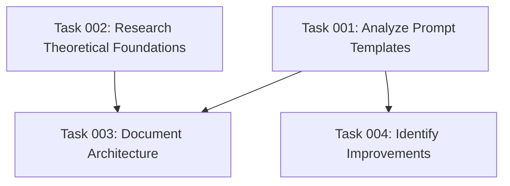

# Plan 12: AI Task Management System Documentation and Analysis

## Executive Summary

This plan addresses the comprehensive documentation and analysis of the AI task management system's architecture, particularly focusing on how its prompt engineering strategies, hierarchical task decomposition, and specialized agent orchestration work together to improve AI agent accuracy when implementing complex features. The documentation will be added to CLAUDE.md, explaining the theoretical foundations, practical implementation strategies, and identified areas for improvement.

## Objectives

1. **Analyze the prompt architecture** - Document how the three-command workflow (create-plan, generate-tasks, execute-blueprint) creates a structured approach to complex feature implementation
2. **Document key design patterns** - Explain the system's emphasis on scope control, avoiding over-testing, simplicity principles, and atomic task decomposition
3. **Research and validate theoretical foundations** - Provide academic support for the specialized agent approach and atomic task decomposition strategy
4. **Identify improvement opportunities** - Analyze current limitations and suggest enhancements to the system

## Background and Context

The AI task management system implements a sophisticated prompt engineering framework that addresses common challenges in AI-assisted development:

- **Context fragmentation**: Large, complex tasks overwhelm AI agents with too much simultaneous context
- **Scope creep**: AI tends to add unnecessary features beyond what was requested
- **Over-engineering**: Complex solutions when simple ones would suffice
- **Test bloat**: Creating excessive tests that don't add meaningful value
- **Dependency confusion**: Poor tracking of task interdependencies

The system solves these through a three-phase workflow that progressively refines and decomposes work, combined with specialized agent matching for atomic tasks.

## Implementation Strategy

### Phase 1: Analysis and Research
- Deep analysis of the prompt templates and their interaction patterns
- Research supporting literature on specialized agents and task decomposition
- Examination of the scope control and simplicity enforcement mechanisms

### Phase 2: Documentation Structure
- Create comprehensive documentation sections explaining:
  - The three-command workflow architecture
  - Prompt engineering patterns and their rationale
  - The theoretical basis for specialized agents
  - Key design decisions (scope control, test minimization, etc.)

This documentation should not be too extensive, as to not overwhelm the context window when injecting CLAUDE.md into tasks in this project.

### Phase 3: Improvement Identification
- Analyze current system limitations
- Identify specific enhancement opportunities
- Document these in a clearly labeled section

## Success Criteria

1. **Comprehensive coverage**: All key architectural decisions and patterns are documented
2. **Academic validation**: Theoretical foundations are supported with research citations
3. **Practical clarity**: Documentation explains both the "what" and "why" of design choices
4. **Actionable improvements**: Specific, implementable enhancement suggestions are provided
5. **Integration**: Documentation seamlessly integrates into existing CLAUDE.md structure

## Risk Considerations

1. **Over-documentation**: Risk of creating verbose documentation that obscures key insights
   - **Mitigation**: Focus on essential patterns and decisions, use clear structure
2. **Missing context**: Some design decisions may not be apparent from templates alone
   - **Mitigation**: Infer from patterns and validate against best practices
3. **Scope expansion**: Temptation to redesign rather than document
   - **Mitigation**: Strictly separate analysis from improvement suggestions

## Resource Requirements

- Access to all template files in `templates/commands/tasks/`
- Access to `templates/ai-task-manager/` configuration files
- Research access for academic validation
- Current CLAUDE.md for integration
- Understanding of the existing codebase architecture

## Detailed Implementation Approach

### Analysis Framework

The documentation will analyze the system through multiple lenses:

1. **Architectural Pattern Analysis**
   - How the three-command pattern creates progressive refinement
   - The role of YAML frontmatter in maintaining structure
   - Directory organization as context management

2. **Prompt Engineering Techniques**
   - Context window optimization through task atomization
   - Skill-based agent matching for improved accuracy
   - Validation gates as quality control mechanisms

3. **Cognitive Load Management**
   - Breaking complex problems into manageable chunks
   - Parallel vs. sequential execution decisions
   - Dependency management through visual representations

4. **Quality Control Mechanisms**
   - Scope creep prevention strategies
   - Test minimization philosophy
   - Simplicity enforcement patterns

### Documentation Integration

The analysis will be integrated into CLAUDE.md with clear sections:
- A new major section explaining the AI task management philosophy
- Subsections covering each architectural component
- Cross-references to existing documentation
- A dedicated "Areas for Improvement" section

### Research Validation

Academic support will be drawn from:
- Multi-agent system literature (2024-2025)
- Mixture of Agents (MoA) architecture research
- Task decomposition and cognitive load studies
- Prompt engineering best practices

## Deliverables

1. **Comprehensive CLAUDE.md update** with:
   - AI Task Management System Architecture section
   - Theoretical foundations with citations
   - Practical implementation guidelines
   - Areas for improvement section

2. **Analysis artifacts**:
   - Detailed examination of prompt interactions
   - Identification of key design patterns
   - Validation of architectural decisions

3. **Improvement roadmap**:
   - Prioritized list of enhancement opportunities
   - Specific implementation suggestions
   - Compatibility considerations

## Implementation Notes

- Focus on explaining the "why" behind design decisions, not just the "what"
- Use concrete examples from the templates to illustrate concepts
- Maintain consistency with existing CLAUDE.md style and structure
- Ensure all claims are supported by evidence from templates or research
- Keep improvement suggestions practical and implementable

## Task Dependency Visualization

## Execution Blueprint

**Validation Gates:**
- Reference: `/config/hooks/POST_PHASE.md`

### ✅ Phase 1: Analysis and Research
**Parallel Tasks:**
- ✔️ Task 001: Analyze prompt templates and patterns
- ✔️ Task 002: Research theoretical foundations

### ✅ Phase 2: Documentation and Improvement
**Parallel Tasks:**
- ✔️ Task 003: Document AI task management architecture (depends on: 001, 002)
- ✔️ Task 004: Identify improvement opportunities (depends on: 001)

### Post-phase Actions
- Review documentation for clarity and completeness
- Ensure all sections integrate seamlessly with existing CLAUDE.md
- Verify citations and references are properly formatted

### Execution Summary
- Total Phases: 2
- Total Tasks: 4
- Maximum Parallelism: 2 tasks (in both phases)
- Critical Path Length: 2 phases