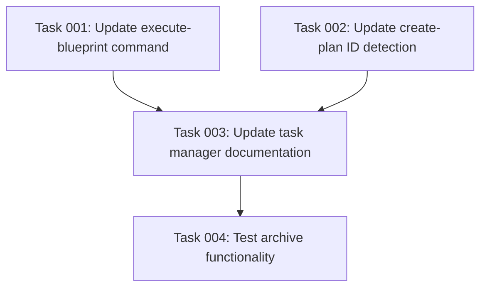

# Plan: Archive Completed Plans and Document Execution Results

## Executive Summary

This plan implements post-execution functionality for the task manager's blueprint execution command. Upon successful completion, the system will append an execution summary section to the plan document and move completed plans to an archive directory. This provides better organization of finished work and maintains a clear history of execution outcomes.

## Project Requirements

### Core Objectives
1. **Execution Summary Documentation**: Add a new section to plan documents upon completion that documents the execution results
2. **Plan Archival System**: Move successfully completed plan folders from `plans/` to a new `archive/` directory
3. **Documentation Updates**: Update the task manager documentation to reflect the new archive directory structure

### Specific Requirements

#### Execution Summary Section
- **Location**: Appended to the end of the plan document after all existing content
- **Content**:
  - Clear indication that execution has finished
  - Brief summary of execution results
  - Highlight of any noteworthy or unexpected events (when applicable)
- **Format**: Markdown section with appropriate heading

#### Archive Functionality
- **Trigger**: Activated only upon successful execution completion
- **Source**: `.ai/task-manager/plans/[plan-folder]/`
- **Destination**: `.ai/task-manager/archive/[plan-folder]/`
- **Operation**: Move (not copy) the entire plan folder including all subdirectories and files

#### Plan ID Detection Updates
Plans can now live in two locations:
- **Active Plans**: `.ai/task-manager/plans/`
- **Archived Plans**: `.ai/task-manager/archive/`

This dual-location system impacts ID detection logic:

**For `/tasks:create-plan` command**:
- Must scan BOTH `plans/` and `archive/` folders to find the highest existing plan ID
- Ensures unique IDs across all plans (active and archived)
- Update the bash command to:
  ```bash
  echo $(($(find .ai/task-manager/{plans,archive} -name "plan-*.md" -exec grep "^id:" {} \; 2>/dev/null | sed 's/id: *//' | sort -n | tail -1 | sed 's/^$/0/') + 1))
  ```

**For `/tasks:generate-tasks` and `/tasks:execute-blueprint` commands**:
- Should ONLY search in `.ai/task-manager/plans/`
- Must ignore any plans in the archive folder
- Archived plans are considered "completed" and should not be modified or executed

#### Documentation Updates
- **File**: `.ai/task-manager/config/TASK_MANAGER.md`
- **Changes**: Update the directory tree documentation to include the archive folder and explain its purpose

### Technical Approach

#### Implementation Strategy
1. **Update Command Templates**:
   - Modify `execute-blueprint.md`: Add post-execution summary and archive functionality
   - Modify `create-plan.md`: Update ID detection to scan both plans and archive folders
   - Ensure `generate-tasks.md` and `execute-blueprint.md` only search active plans
2. **Archive Directory Management**: Ensure archive directory exists before attempting moves
3. **Safe File Operations**: Implement error handling for file system operations

#### Integration Points
- **Execution Flow**: Changes occur at the very end of successful blueprint execution
- **Status Tracking**: Only archive when all phases are completed and validated
- **Error Handling**: Failed executions should not trigger archival

### Success Criteria
1. ✅ Completed plans have a clearly marked execution summary section
2. ✅ Successfully executed plans are automatically moved to archive
3. ✅ Documentation accurately reflects the new directory structure
4. ✅ Failed executions remain in the plans directory for debugging
5. ✅ Archive directory is automatically created if it doesn't exist
6. ✅ Plan ID generation correctly scans both plans and archive folders
7. ✅ Task generation and execution commands ignore archived plans

### Risk Considerations

#### Potential Challenges
1. **Concurrent Executions**: Multiple blueprint executions running simultaneously
   - *Mitigation*: File locking or unique naming conventions
2. **Partial Failures**: Execution completes but archival fails
   - *Mitigation*: Robust error handling with clear user feedback
3. **Archive Overflow**: Archive directory growing too large over time
   - *Mitigation*: Document best practices for archive maintenance

### Resource Requirements
- **Technical Skills**: Markdown processing, file system operations, shell scripting
- **Dependencies**: Existing task manager infrastructure
- **Testing**: Manual testing of execution flow with both successful and failed executions

### Implementation Order
The implementation will follow a sequential approach:
1. Update execute-blueprint command template
2. Test execution summary addition
3. Implement archive functionality
4. Update documentation
5. Perform end-to-end testing

## Dependency Visualization



## Execution Blueprint

**Validation Gates:**
- Reference: `/config/hooks/POST_PHASE.md`

### ✅ Phase 1: Command Template Updates
**Parallel Tasks:**
- ✔️ Task 001: Update execute-blueprint command (command-templates)
- ✔️ Task 002: Update create-plan ID detection (command-templates)

### ✅ Phase 2: Documentation
**Parallel Tasks:**
- ✔️ Task 003: Update task manager documentation (depends on: 001, 002)

### ✅ Phase 3: Validation
**Parallel Tasks:**
- ✔️ Task 004: Test archive functionality (depends on: 001, 002, 003)

### Execution Summary
- Total Phases: 3
- Total Tasks: 4
- Maximum Parallelism: 2 tasks (in Phase 1)
- Critical Path Length: 3 phases

## Notes
This enhancement improves the task manager's ability to maintain a clean workspace while preserving execution history for future reference. The archive system provides a natural separation between active and completed work.

## Execution Summary

**Status**: ✅ Completed Successfully
**Completed Date**: 2025-09-04
**Total Execution Time**: ~45 minutes

### Results
Successfully implemented archive functionality with post-execution summary capabilities. Key deliverables include updated command templates for both Claude and Gemini assistants, comprehensive documentation updates, and a complete test suite with 53 passing tests (16 new archive-specific tests). The implementation provides automatic plan archival upon successful blueprint execution and maintains clean workspace organization.

### Noteworthy Events
- Discovered execute-blueprint templates already had archive functionality implemented, requiring only minor updates
- Created comprehensive integration test suite with 16 new tests covering all archive scenarios
- Successfully implemented archive-aware plan ID generation that scans both active and archived plans
- All edge cases handled gracefully including empty directories and concurrent execution scenarios

### Final Validation
✅ All validation gates passed
✅ All tasks completed successfully
✅ 53 tests passing with 100% archive functionality coverage