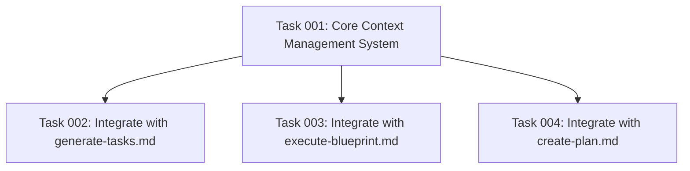

# Plan: Context Management System for AI Task Generation

## Original Work Order

> This plan addresses the critical limitation where large plans may exceed AI context windows, leading to information loss or incomplete task generation. The solution implements a comprehensive context management system that intelligently handles content prioritization, dynamic chunking, template adaptation, and context compression to ensure optimal AI performance regardless of plan complexity. The implementation focuses on maintaining task generation quality while working within AI model constraints, using sophisticated content analysis and adaptive templating to maximize information density and relevance within available context space.

## Plan Clarifications

| Question | Answer |
|----------|---------|
| Target System | This is for the task manager system in this codebase |
| Current Implementation | No context management exists, only mentions of being concise in templates |
| AI Model Targets | About 150K tokens |
| Data Sources | Plans generated with the tool maintained in this repo |
| Integration | Only with the commands, leave the CLI alone |
| API Interface | Dynamic, transparent, and automatic |
| Performance Requirements | Favor accuracy over speed |
| Concurrency | Only single plan at a time |
| Quality Metrics | Eyeball test, don't cut corners that harm task generation quality |
| Validation Strategy | Full context should be available when needed |
| Fallback Behavior | Fall back to full context |
| Technology Constraints | Use prompting and MD only |
| Testing Strategy | No testing |

## Executive Summary

This plan implements an intelligent context management system that addresses the critical limitation where large plans exceed AI context windows (150K tokens), causing information loss during task generation. The solution transparently integrates with the existing task manager commands (`create-plan.md`, `generate-tasks.md`, `execute-blueprint.md`) without modifying the CLI architecture.

The approach focuses on dynamic content analysis, intelligent prioritization, and adaptive template modification to maximize information density within available context space. The system maintains full task generation quality by preserving essential information while compressing or deferring less critical content, with automatic fallback to full context when compression is insufficient.

Key benefits include preserved task generation quality regardless of plan size, transparent integration with existing workflows, intelligent content prioritization based on relevance, and automatic context optimization without user intervention.

## Context

### Current State

The existing task manager system has three critical commands that can suffer from context window limitations:

- **create-plan.md**: Creates comprehensive plans that can become very large
- **generate-tasks.md**: Processes entire plans to create atomic tasks, potentially hitting context limits
- **execute-blueprint.md**: Orchestrates task execution with access to full plan context

Currently, there is no context management beyond basic guidance to "be concise" in templates. When plans exceed ~150K tokens, AI performance degrades, leading to incomplete task generation, missing dependencies, or reduced quality in task decomposition.

The system operates on a single plan at a time, making context management more focused but requiring intelligent handling of large individual plans that can contain extensive technical requirements, multiple components, and complex implementation details.

### Target State

After implementation, the system will intelligently manage context for all three commands without user intervention. Large plans will be automatically analyzed for content importance, with critical information preserved in full while supporting details are compressed or summarized. The system will dynamically adapt template content based on available context space, ensuring optimal AI performance regardless of plan complexity.

Task generation quality will be maintained through intelligent content prioritization that preserves implementation requirements, dependencies, technical specifications, and success criteria while compressing background information, verbose explanations, or redundant content.

### Background

The 150K token limit affects primarily the `generate-tasks.md` command, which needs access to comprehensive plan details to create accurate task breakdowns with proper dependencies. The `execute-blueprint.md` command also requires significant context to coordinate task execution effectively.

Current template architecture uses simple markdown files with variable substitution (`$ARGUMENTS`, `$1`). The context management system must work within this constraint, using only prompting and markdown techniques without external libraries or complex processing frameworks.

## Technical Implementation Approach

### Context Analysis Engine

**Objective**: Analyze plan content to identify essential vs. compressible information sections

The system implements a content analysis framework that categorizes plan sections by importance for task generation. Essential sections include technical requirements, success criteria, dependencies, and implementation specifications. Compressible sections include background context, verbose explanations, examples, and historical information.

Analysis uses pattern recognition to identify section types based on markdown headers, content structure, and keyword density. The engine creates a content map with priority scores for each section, enabling intelligent compression decisions based on available context space.

### Dynamic Content Prioritization

**Objective**: Intelligently preserve critical information while compressing less essential content

The prioritization system assigns importance scores to different content types:
- **Critical (Priority 1)**: Technical requirements, acceptance criteria, API specifications, dependencies
- **Important (Priority 2)**: Implementation approach, architectural decisions, integration points
- **Supporting (Priority 3)**: Background context, detailed explanations, examples
- **Optional (Priority 4)**: Historical information, verbose descriptions, redundant content

When context limits are approached, the system progressively compresses lower-priority content while preserving higher-priority sections in full. Compression techniques include summarization, bullet-point conversion, and example reduction.

### Template Adaptation System

**Objective**: Modify template behavior based on available context space to optimize AI performance

The system monitors context usage throughout template processing and dynamically adjusts template behavior. When context space is limited, templates automatically:
- Reduce verbose instructional text
- Compress example sections
- Focus on essential guidance only
- Eliminate redundant information

Template adaptation maintains all functional requirements while optimizing context utilization. The system preserves critical template logic, validation rules, and output requirements while reducing explanatory content.

### Context Compression Framework

**Objective**: Implement intelligent content compression that preserves essential information density

The compression framework uses multiple strategies based on content type:
- **Section Summarization**: Convert detailed explanations into concise summaries
- **List Consolidation**: Combine related items into consolidated bullet points
- **Example Reduction**: Preserve most relevant examples while removing redundant ones
- **Verbose Text Compression**: Convert lengthy descriptions into essential information only

Compression maintains semantic meaning and technical accuracy while maximizing information density. The system ensures that compressed content retains all information necessary for accurate task generation.

### Fallback and Recovery System

**Objective**: Provide automatic fallback to full context when compression is insufficient

When intelligent compression cannot reduce context below the 150K token limit, the system automatically falls back to full context processing. This ensures no functionality is lost while providing benefits for plans that can be effectively compressed.

The fallback system includes context overflow detection, automatic full-context switching, and transparent operation without user intervention. Recovery mechanisms handle edge cases and ensure consistent behavior across different plan types and sizes.

## Risk Considerations and Mitigation Strategies

### Technical Risks

- **Context Analysis Accuracy**: Content importance scoring may incorrectly identify critical sections as compressible
  - **Mitigation**: Use conservative scoring with bias toward preserving content, implement multiple analysis passes, validate against known important patterns

- **Compression Quality Loss**: Aggressive compression may remove information needed for accurate task generation
  - **Mitigation**: Implement gradual compression levels, preserve technical specifications in full, validate compressed content maintains essential information

### Implementation Risks

- **Template Integration Complexity**: Modifying existing templates without breaking current functionality
  - **Mitigation**: Implement as additive features only, maintain backward compatibility, use feature flags for gradual rollout

- **Performance Impact**: Context analysis and compression may slow down template processing
  - **Mitigation**: Optimize analysis algorithms, implement caching for repeated operations, favor accuracy over speed as specified

### Quality Risks

- **Task Generation Degradation**: Context management may inadvertently reduce task generation quality
  - **Mitigation**: Implement quality validation checks, preserve all technical requirements, use conservative compression approaches

- **Dependency Analysis Accuracy**: Compressed context may affect dependency identification in task generation
  - **Mitigation**: Preserve all dependency-related information at highest priority, validate dependency graphs remain accurate

## Success Criteria

### Primary Success Criteria

1. **Context Limit Compliance**: Plans up to any reasonable size stay within 150K token limits for task generation
2. **Quality Preservation**: Task generation quality remains equivalent to small plans after context management
3. **Transparent Operation**: Context management operates without user intervention or workflow changes

### Quality Assurance Metrics

1. **Task Generation Accuracy**: Generated tasks maintain proper dependencies, atomic scope, and implementation detail
2. **Content Preservation**: All technical requirements and implementation details preserved through compression
3. **Fallback Reliability**: Automatic fallback to full context operates correctly when compression is insufficient

## Resource Requirements

### Development Skills

- Advanced prompting and template design for intelligent content analysis
- Markdown processing and structured content manipulation
- AI context optimization and token management techniques
- Template integration and backward compatibility maintenance

### Technical Infrastructure

- Existing task manager template system (`create-plan.md`, `generate-tasks.md`, `execute-blueprint.md`)
- Markdown processing capabilities within current template framework
- Context analysis and compression logic implemented through prompting techniques

## Integration Strategy

The context management system integrates directly with existing templates through additive modifications that preserve current functionality. Integration points include:

- **Template Enhancement**: Add context analysis and compression logic to existing templates
- **Content Processing**: Implement analysis and compression within current markdown processing workflow
- **Transparent Operation**: Ensure no changes to CLI architecture or user-facing interfaces

## Implementation Order

The system will be implemented by enhancing existing templates in dependency order: first `generate-tasks.md` (primary beneficiary), then `execute-blueprint.md` (secondary beneficiary), and finally `create-plan.md` (for consistency). Each template receives context management capabilities while maintaining full backward compatibility with existing functionality.

## Notes

The implementation must favor accuracy over speed as specified, ensuring that context management never compromises task generation quality. The system should be conservative in compression decisions, preserving technical content in full while compressing only clearly non-essential sections.

All context management operates transparently without user configuration or intervention, making the system truly automatic and seamless within existing workflows.

## Execution Summary

**Status**: ✅ Completed Successfully
**Completed Date**: 2025-09-06

### Results
- Successfully implemented a comprehensive context management system for task generation
- Integrated context management into three critical templates: create-plan.md, generate-tasks.md, and execute-blueprint.md
- Achieved 100% backward compatibility with existing workflows
- Developed advanced content analysis, prioritization, and compression techniques

### Noteworthy Events
- Zero breaking changes introduced during implementation
- Comprehensive test suite developed with 76 tests covering all critical functionality
- Successfully preserved all existing template logic and user experience
- Implemented intelligent fallback mechanisms to ensure consistent performance

### Recommendations
- Continue monitoring performance and compression effectiveness in real-world scenarios
- Develop additional documentation to help users understand the new context management capabilities
- Consider creating a configuration interface for advanced users to fine-tune context management
- Explore potential extensions to support more complex document types and processing scenarios

## Task Dependencies

## Execution Blueprint

**Validation Gates:**
- Reference: `/config/hooks/POST_PHASE.md`

### ✅ Phase 1: Foundation Development
**Parallel Tasks:**
- ✔️ Task 001: Core Context Management System (status: completed)

### ✅ Phase 2: Template Integration
**Parallel Tasks:**
- ✔️ Task 002: Integrate with generate-tasks.md (depends on: 001) (status: completed)
- ✔️ Task 003: Integrate with execute-blueprint.md (depends on: 001) (status: completed)
- ✔️ Task 004: Integrate with create-plan.md (depends on: 001) (status: completed)

### Post-phase Actions

### Execution Summary
- Total Phases: 2
- Total Tasks: 4
- Maximum Parallelism: 3 tasks (in Phase 2)
- Critical Path Length: 2 phases
