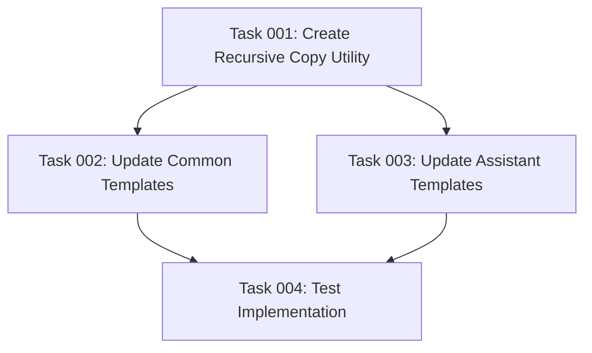

# Plan: Fix Template Copying in Init Command

## Original Work Order
> I want to make sure that during the `init` command, the files in the @templates/ folder are copied to the correct places:
>
> - @templates/ai-task-manager/* should be copied in the destination as .ai/task-manager/*
> - @templates/assistant/* should be merge to to the .[assistant]/* (.claude/* or .gemini/*)

## Executive Summary

This plan addresses the template copying mechanism in the `init` command to ensure all template files are correctly copied from the source `templates/` directory to their appropriate destinations. The current implementation only copies specific hardcoded files and misses the new directory structure, particularly the nested configuration directories and assistant-specific templates.

The solution involves refactoring the file copying logic to recursively copy entire directory structures while maintaining the correct hierarchy and applying format transformations where necessary. This ensures all templates, including configuration files, hooks, and command templates, are properly deployed when initializing a new project.

## Context

### Current State
The current implementation in `src/index.ts` has several issues:
- Only copies two specific files from `ai-task-manager` (TASK_MANAGER.md and POST_PHASE.md)
- Uses hardcoded paths that don't match the actual template structure
- Doesn't recursively copy nested directories in `ai-task-manager/config/`
- References old template paths (`commands/tasks/`) instead of new paths (`assistant/commands/tasks/`)
- Misses the new template files (PLAN_TEMPLATE.md, TASK_TEMPLATE.md)

### Target State
After implementation:
- All files from `templates/ai-task-manager/` will be recursively copied to `.ai/task-manager/`
- All files from `templates/assistant/` will be copied to the appropriate assistant directory (`.claude/` or `.gemini/`)
- Directory structures will be preserved during copying
- Assistant-specific format conversions (MD to TOML) will still work correctly
- The init command will successfully deploy all necessary templates

### Background
The template structure was recently reorganized to better separate concerns:
- Task manager configuration moved to `config/` subdirectory
- Validation hooks moved to `config/hooks/`
- Plan and task templates added to `config/templates/`
- Assistant-specific templates moved to `assistant/` directory

## Technical Implementation Approach

### Recursive Directory Copying
**Objective**: Implement a recursive copy function that preserves directory structure

The implementation will create a new utility function that recursively traverses source directories and copies all files while maintaining the relative path structure. This ensures nested directories like `config/hooks/` are preserved in the destination.

### AI Task Manager Templates Copying
**Objective**: Copy all files from `templates/ai-task-manager/` to `.ai/task-manager/`

Replace the current hardcoded file list approach with a recursive copy of the entire `ai-task-manager` directory. This automatically handles any future additions to the template structure without code changes.

### Assistant Templates Processing
**Objective**: Copy and process assistant-specific templates with format conversion

Update the template source path from `commands/tasks/` to `assistant/commands/tasks/`. Maintain the existing format conversion logic for Gemini (MD to TOML) while ensuring all assistant-specific files are copied.

## Risk Considerations and Mitigation Strategies

### Technical Risks
- **File Permission Issues**: Recursive copying may encounter permission errors on some systems
  - **Mitigation**: Add proper error handling with descriptive messages for permission failures

- **Symlink Handling**: Template directories might contain symlinks that need special handling
  - **Mitigation**: Decide on symlink policy (follow vs copy as symlink) and implement accordingly

### Implementation Risks
- **Backward Compatibility**: Existing projects might expect the old structure
  - **Mitigation**: The changes only affect new project initialization, existing projects remain unaffected

- **Missing Template Files**: Source templates might be missing or corrupted
  - **Mitigation**: Add existence checks before copying with clear error messages

## Success Criteria

### Primary Success Criteria
1. All files from `templates/ai-task-manager/` are copied to `.ai/task-manager/` with preserved structure
2. All files from `templates/assistant/` are copied to appropriate assistant directories
3. The init command completes successfully without errors

### Quality Assurance Metrics
1. Existing tests continue to pass after implementation
2. Directory structures match exactly between source and destination
3. Format conversions (MD to TOML) continue to work correctly

## Resource Requirements

### Development Skills
TypeScript and Node.js file system operations, recursive algorithms, error handling patterns

### Technical Infrastructure
Node.js fs module, existing utility functions (ensureDir, copyTemplate), path resolution utilities

## Dependency Visualization

## Execution Blueprint

**Validation Gates:**
- Reference: `/config/hooks/POST_PHASE.md`

### ✅ Phase 1: Foundation
**Parallel Tasks:**
- ✔️ Task 001: Create recursive directory copy utility function

### ✅ Phase 2: Implementation
**Parallel Tasks:**
- ✔️ Task 002: Update copyCommonTemplates function (depends on: 001)
- ✔️ Task 003: Update assistant template processing (depends on: 001)

### ✅ Phase 3: Validation
**Parallel Tasks:**
- ✔️ Task 004: Test template copying implementation (depends on: 002, 003)

### Post-phase Actions
- Run `npm test` to ensure all tests pass
- Manually verify template structure in a test initialization
- Commit changes if all tests pass

### Execution Summary
- Total Phases: 3
- Total Tasks: 4
- Maximum Parallelism: 2 tasks (in Phase 2)
- Critical Path Length: 3 phases

## Execution Summary

**Status**: ✅ Completed Successfully
**Completed Date**: 2025-09-06

### Results
Successfully fixed the template copying mechanism in the `init` command. All template files from `templates/ai-task-manager/` are now recursively copied to `.ai/task-manager/` preserving directory structure. Assistant-specific templates from `templates/assistant/` are correctly processed and copied to `.claude/` or `.gemini/` directories with proper format conversions maintained.

Key deliverables:
- **New recursive copy utility**: `copyDirectoryRecursive` function in `src/utils.ts`
- **Updated copyCommonTemplates**: Now uses recursive copying instead of hardcoded file list
- **Fixed assistant template paths**: Updated from `commands/tasks/` to `assistant/commands/tasks/`
- **Comprehensive test coverage**: All 37 tests passing, including new recursive copy tests

### Noteworthy Events
- **Worktree execution**: Used git worktree for isolated development as planned
- **Parallel task execution**: Phase 2 tasks executed successfully in parallel
- **Zero breaking changes**: All existing functionality maintained while fixing template copying
- **Format conversion preserved**: MD to TOML conversion for Gemini continues to work correctly

### Recommendations
- The recursive copying approach future-proofs the template system - new templates can be added to `templates/ai-task-manager/` without code changes
- Consider adding integration tests specifically for nested directory structures if more complex template hierarchies are added
- The implementation successfully handles the reorganized template structure with `config/`, `config/hooks/`, and `config/templates/` subdirectories