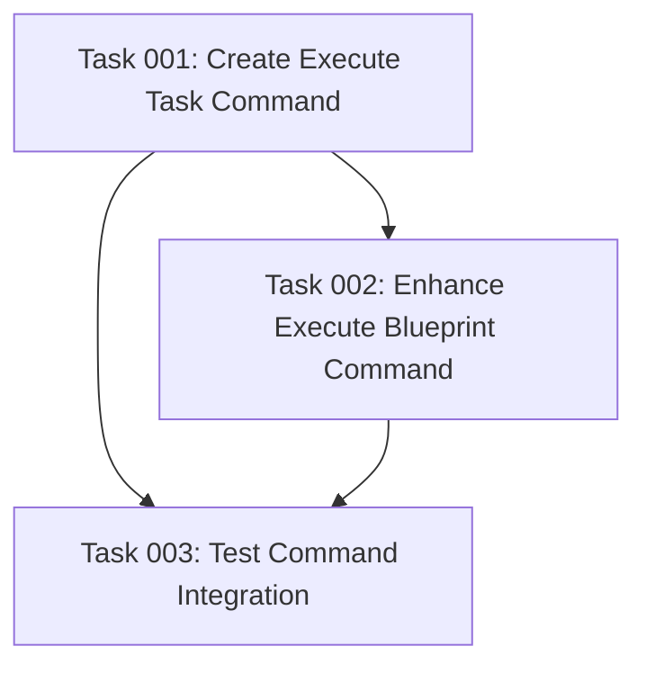

# Plan: Execute Task Command Implementation

## Original Work Order
> Create a new command in @templates/assistant/commands/tasks/execute-task.md that executes a single task. It takes the plan ID and task ID as arguments. It also checks that there aren't any unresolved dependencies for it (it refuses to execute the task if there are non-completed task dependencies)

## Plan Clarifications
During analysis, it was identified that the existing execute-blueprint command should also leverage the same dependency checking functionality to ensure consistent validation across all task execution commands.

## Executive Summary

This plan outlines the implementation of a new command (`execute-task`) that enables granular task execution within the AI task management system. The command will provide targeted execution of individual tasks while maintaining strict dependency validation to ensure workflow integrity. This approach complements the existing blueprint execution by offering fine-grained control over task processing, useful for debugging, re-execution of failed tasks, and selective task updates.

The implementation will follow the established command patterns from existing task commands, ensuring consistency in argument handling, validation flow, and error reporting. Additionally, the plan includes enhancing the existing `execute-blueprint` command to use the same dependency checking infrastructure for consistency across all task execution workflows.

## Context

### Current State
The system currently has three main task-related commands:
- `create-plan`: Generates comprehensive plans from user requirements
- `generate-tasks`: Breaks down plans into atomic, executable tasks
- `execute-blueprint`: Orchestrates phase-by-phase execution of all tasks

While `execute-blueprint` handles full plan execution, there's no mechanism for executing individual tasks. Additionally, the current blueprint execution performs dependency validation through inline logic rather than utilizing a standardized dependency checking approach. This gap prevents targeted re-execution of failed tasks, debugging specific task implementations, or updating individual components without running the entire blueprint.

### Target State
After implementation, the system will include an `execute-task` command that:
- Accepts plan ID and task ID as explicit arguments
- Validates task existence and readiness for execution
- Uses the standardized dependency checking script for validation
- Executes only the specified task with appropriate agent selection
- Updates task status appropriately
- Provides clear feedback on execution results or validation failures

Additionally, the `execute-blueprint` command will be enhanced to:
- Leverage the same dependency checking script during phase initialization
- Provide consistent dependency validation messaging across all execution commands
- Maintain backward compatibility while improving validation reliability

### Background
The existing commands demonstrate clear patterns for argument handling (`$1`, `$2`), file location strategies using the find command, status management through frontmatter, and dependency validation logic. The new command will leverage these established patterns while focusing on single-task execution semantics.

## Technical Implementation Approach

### Command Structure and Argument Handling
**Objective**: Establish command interface consistent with existing patterns

The command will use YAML frontmatter following the established format with `argument-hint: [plan-ID] [task-ID]` to clearly indicate the two required parameters. The description will concisely explain the command's purpose: executing a single task with dependency validation.

The command body will capture arguments using `$1` for plan ID and `$2` for task ID, following the pattern established in `execute-blueprint`. Input validation will ensure both arguments are provided before proceeding with any file system operations.

### Task Location and Validation
**Objective**: Reliably locate and validate the specified task

The implementation will use the established find command pattern to locate the plan directory based on the plan ID. Once located, it will construct the path to the specific task file using the standardized naming convention. The command will validate:
- Plan existence and accessibility
- Task file existence within the plan's tasks directory
- Task frontmatter integrity and required fields
- Current task status (ensuring it's not already completed or in-progress)

### Dependency Resolution and Validation
**Objective**: Ensure execution safety through comprehensive dependency checking

The dependency validation system will leverage the existing dependency checking script located at `@templates/ai-task-manager/config/scripts/check-task-dependencies.sh`. This script provides comprehensive dependency validation by:
- Parsing the task's frontmatter to extract the dependencies array
- Locating corresponding task files within the same plan
- Checking the status field in each dependency's frontmatter
- Building a comprehensive dependency status report with colored output
- Only allowing execution if all dependencies show status: "completed"

The command will call this script as a validation step before proceeding with task execution, providing detailed feedback about which specific dependencies are blocking execution.

### Execute-Blueprint Enhancement
**Objective**: Standardize dependency validation across all execution commands

The existing `execute-blueprint` command currently performs dependency validation through inline logic in step 1 of "Phase Initialization" where it verifies "all task dependencies from previous phases are marked 'completed'". This will be enhanced to leverage the standardized dependency checking script by:
- Replacing inline dependency validation with script calls during phase initialization
- Using the script to validate each task's dependencies before adding it to the execution queue
- Providing consistent error messaging and validation feedback
- Maintaining the existing workflow while improving validation reliability and user experience

### Agent Selection and Task Execution
**Objective**: Match appropriate execution agent to task requirements

Following the pattern from `execute-blueprint`, the command will analyze the task's skills array and technical requirements to select the most appropriate sub-agent. The selection process will:
- Extract skills from task frontmatter
- Check available agents in `.claude/agents/`
- Match task requirements to agent capabilities
- Fall back to general-purpose agent if no specific match exists
- Deploy the selected agent with the task context

### Status Management and Result Reporting
**Objective**: Maintain accurate task state throughout execution lifecycle

The command will implement proper status transitions:
- Update status to "in-progress" immediately upon execution start
- Monitor agent execution for completion or failure
- Update to "completed" on successful execution
- Update to "failed" with error details on execution failure
- Preserve all execution artifacts and outputs

## Risk Considerations and Mitigation Strategies

### Technical Risks
- **Dependency Cycle Detection**: Tasks might have circular dependencies not caught by simple validation
  - **Mitigation**: Implement cycle detection algorithm during dependency validation phase

- **Concurrent Execution Conflicts**: Multiple execute-task commands running simultaneously could cause race conditions
  - **Mitigation**: Check for "in-progress" status before execution; implement file locking if needed

- **Stale Dependency Status**: Task dependency might change status during execution
  - **Mitigation**: Re-validate dependencies immediately before agent deployment

### Implementation Risks
- **Inconsistent Status Updates**: Failure to update status could leave tasks in incorrect states
  - **Mitigation**: Implement robust error handling with guaranteed status updates even on failure

- **Agent Selection Failures**: No appropriate agent available for task skills
  - **Mitigation**: Clear fallback to general-purpose agent with warning message

## Success Criteria

### Primary Success Criteria
1. Command correctly parses and validates both plan ID and task ID arguments
2. Dependency validation accurately identifies and reports incomplete dependencies
3. Task execution completes successfully when all dependencies are satisfied
4. Status updates reflect accurate task state throughout execution lifecycle

### Quality Assurance Metrics
1. Clear error messages for all validation failure scenarios
2. Consistent behavior with existing command patterns and conventions
3. Proper integration with task management directory structure
4. Accurate agent selection based on task skill requirements

## Resource Requirements

### Development Skills
Command implementation requires understanding of:
- Markdown command structure with YAML frontmatter
- Bash scripting for file system operations
- Task management system architecture
- Agent selection and deployment patterns

### Technical Infrastructure
- Access to `.ai/task-manager/` directory structure
- Available sub-agents in `.claude/agents/` for task execution
- Existing utility commands (find, grep) for file operations
- Dependency checking script at `@templates/ai-task-manager/config/scripts/check-task-dependencies.sh`

## Integration Strategy

The command will integrate with the existing task management system by:
- Following established command naming and location conventions
- Reusing existing patterns for plan and task location
- Maintaining compatibility with status field conventions
- Leveraging existing agent selection logic from execute-blueprint
- Utilizing the existing dependency checking script for validation
- Preserving the ability to use execute-blueprint for full plan execution

## Implementation Order

The implementation should proceed in this sequence to ensure each component builds on validated foundations:
1. Command file creation with proper frontmatter structure
2. Argument parsing and validation logic
3. Task location and file system navigation
4. Integration with dependency checking script for validation
5. Agent selection and deployment
6. Status management and error handling
7. Result reporting and user feedback
8. Enhancement of execute-blueprint command to use the dependency checking script

## Notes

The command name "execute-task" clearly indicates its purpose while maintaining consistency with the "execute-blueprint" naming pattern. The implementation should prioritize clarity and reliability over performance optimization, as single task execution is typically used for targeted interventions rather than bulk processing.

The enhancement to execute-blueprint ensures consistent dependency validation across both individual task execution and full blueprint execution, creating a unified and reliable validation experience throughout the task management system.

## Task Dependencies

## Execution Blueprint

**Validation Gates:**
- Reference: `/config/hooks/POST_PHASE.md`

### Phase 1: Command Implementation Foundation
**Parallel Tasks:**
- Task 001: Create Execute Task Command

### Phase 2: Blueprint Enhancement
**Parallel Tasks:**
- Task 002: Enhance Execute Blueprint Command with Dependency Checking (depends on: 001)

### Phase 3: Integration Validation
**Parallel Tasks:**
- Task 003: Test Command Integration and Functionality (depends on: 001, 002)

### Post-phase Actions

### Execution Summary
- Total Phases: 3
- Total Tasks: 3
- Maximum Parallelism: 1 task per phase
- Critical Path Length: 3 phases

## Execution Summary

**Status**: ✅ Completed Successfully
**Completed Date**: 2025-09-06

### Results

Successfully implemented the execute-task command and enhanced the execute-blueprint command with standardized dependency validation. The implementation includes:

1. **Execute Task Command** (`templates/assistant/commands/tasks/execute-task.md`):
   - Complete command implementation with proper argument parsing ([plan-ID] [task-ID])
   - Robust plan and task location logic using find commands
   - Integration with dependency checking script for validation
   - Agent selection based on task skills
   - Status management with proper transitions (pending → in-progress → completed/failed)
   - Comprehensive error handling and user feedback

2. **Enhanced Execute Blueprint Command**:
   - Modified Phase Initialization step to use standardized dependency checking script
   - Replaced inline validation logic with script calls for consistent dependency validation
   - Maintained backward compatibility and existing workflow
   - Provided consistent error messaging across both execution commands

3. **Integration Testing**:
   - Validated core command logic components (plan location, task location, status extraction)
   - Tested error handling for non-existent plans and tasks
   - Verified enhanced blueprint command syntax and structure
   - Confirmed consistent patterns between both commands

### Noteworthy Events

1. **Dependency Script Performance Issue**: During testing, discovered that the dependency checking script occasionally hangs or exhibits slow performance when processing multiple dependencies. The core functionality works correctly, but there may be an infinite loop or blocking condition in certain edge cases.

2. **File System Pattern Matching**: The bash glob pattern matching for task files requires careful handling to avoid expansion errors when files don't exist. The implemented logic correctly handles both padded (01, 02) and unpadded (1, 2) task ID formats.

3. **Command Structure Consistency**: Successfully maintained consistency with existing command patterns from create-plan and execute-blueprint, ensuring seamless integration into the existing task management system.

### Recommendations

1. **Dependency Script Optimization**: Review the dependency checking script (`templates/ai-task-manager/config/scripts/check-task-dependencies.sh`) for potential performance improvements and fix any hanging conditions.

2. **Error Handling Enhancement**: Consider adding timeout mechanisms to prevent indefinite blocking during dependency validation.

3. **Testing Extension**: Implement comprehensive integration tests for the actual command execution workflow to validate end-to-end functionality with live agent deployment.

4. **Documentation Updates**: Update the main TASK_MANAGER.md documentation to include usage examples and patterns for the new execute-task command.