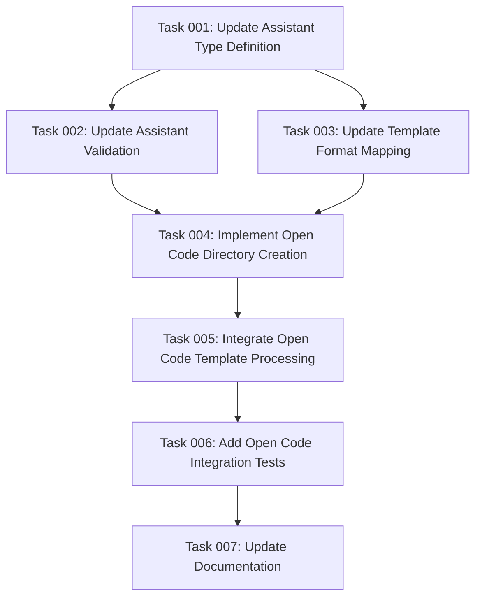

# Plan: Add Open Code Assistant Support

## Original Work Order
> I would like to add support for a new "assistant": Open Code.
>
> Here are two documentation links that are relevant:
>
> - https://opencode.ai/docs/commands/#create-command-files
> - https://opencode.ai/docs/agents/#subagents
>
> You can assume that Open Code is properly installed and configured, just like you do with Claude Code, and Gemini CLI.

## Executive Summary

This plan adds Open Code as a third supported assistant type to the AI task management system, alongside the existing Claude and Gemini support. Open Code uses a Markdown-based command format similar to Claude, making integration straightforward with minimal code changes required.

The implementation leverages the existing template processing architecture, requiring updates to type definitions, assistant validation, directory structure creation, and template format mapping. Since Open Code uses Markdown format with similar variable substitution patterns as the current system, no complex format conversion is needed like with Gemini's TOML format.

Key benefits include expanding the system's compatibility with different AI assistants while maintaining the unified three-command workflow (create-plan, generate-tasks, execute-blueprint) across all supported platforms.

## Context

### Current State
The AI task management system currently supports two assistant types:
- **Claude**: Uses Markdown format with commands stored in `.claude/commands/tasks/`
- **Gemini**: Uses TOML format (converted from Markdown) with commands stored in `.gemini/commands/tasks/`

The system architecture includes:
- Template processing pipeline that converts Markdown templates to appropriate formats
- Assistant validation and type system in `src/types.ts`
- Directory structure creation in `src/index.ts`
- Template format mapping in `src/utils.ts`

### Target State
After implementation, the system will support three assistant types:
- **Claude**: Existing Markdown format support
- **Gemini**: Existing TOML format support
- **Open Code**: New Markdown format support with `.opencode/command/tasks/` directory structure

Users will be able to specify `--assistants opencode` or combine it with other assistants like `--assistants claude,opencode,gemini`.

### Background
Open Code is an AI coding assistant that uses:
- Markdown command files with YAML frontmatter
- Project-specific commands in `.opencode/command/` directory
- Variable substitution with `$ARGUMENTS` placeholder (same as current system)
- Additional frontmatter options for agent and model specification
- Support for shell command injection and file inclusion features

## Technical Implementation Approach

### Core Type System Updates
**Objective**: Extend the assistant type system to recognize Open Code as a valid option

The foundation of assistant support lies in the type definitions. The `Assistant` type in `src/types.ts` currently defines `'claude' | 'gemini'` and needs extension to include `'opencode'`. This change cascades through validation functions and template processing logic, ensuring Open Code is recognized throughout the system.

### Assistant Validation Enhancement
**Objective**: Update validation logic to accept and process Open Code as a valid assistant choice

The `parseAssistants()` and `validateAssistants()` functions in `src/utils.ts` require updates to include Open Code in their valid assistant lists. This ensures proper error handling and user feedback when Open Code is specified as an assistant option.

### Template Format Mapping
**Objective**: Configure Open Code to use Markdown format like Claude, avoiding complex format conversion

The `getTemplateFormat()` function needs updating to map Open Code to Markdown format. Since Open Code uses Markdown natively (unlike Gemini which requires TOML conversion), this is a straightforward addition that leverages existing template processing infrastructure.

### Directory Structure Creation
**Objective**: Implement `.opencode/command/tasks/` directory creation during project initialization

The `init()` function in `src/index.ts` needs extension to create the Open Code directory structure. This involves creating the `.opencode/` directory and `command/tasks/` subdirectories, following Open Code's expected project-specific command location patterns.

### Template Processing Integration
**Objective**: Process and copy Markdown templates to Open Code directory structure without format conversion

Since Open Code uses Markdown format, the existing template processing pipeline can handle Open Code templates with minimal modifications. The templates will be copied directly from the source templates to `.opencode/command/tasks/` without the TOML conversion required for Gemini.

### Enhanced Frontmatter Support
**Objective**: Support Open Code-specific frontmatter options while maintaining compatibility

Open Code supports additional frontmatter options like `agent` and `model` specifications. The template processing should preserve these options when present, allowing users to customize Open Code-specific behavior while maintaining backward compatibility with existing templates.

## Risk Considerations and Mitigation Strategies

### Technical Risks
- **Template Compatibility**: Open Code may have specific frontmatter requirements that differ from Claude
  - **Mitigation**: Analyze existing templates and ensure Open Code-specific frontmatter options are properly handled without breaking Claude/Gemini compatibility

- **Variable Substitution Differences**: Open Code may handle variable substitution differently despite using `$ARGUMENTS`
  - **Mitigation**: Test variable substitution thoroughly and create integration tests to verify correct behavior across all assistants

### Implementation Risks
- **Integration Test Coverage**: New assistant type needs comprehensive testing to ensure it works correctly
  - **Mitigation**: Add integration tests for Open Code similar to existing Claude/Gemini tests, covering directory creation, template processing, and command generation

- **Breaking Changes**: Adding new assistant type could inadvertently affect existing functionality
  - **Mitigation**: Run existing test suite after each change to ensure backward compatibility is maintained

### Quality Risks
- **Inconsistent Behavior**: Open Code templates might behave differently than Claude despite using same format
  - **Mitigation**: Create validation checks to ensure template consistency and test with actual Open Code CLI

## Success Criteria

### Primary Success Criteria
1. Users can successfully run `npx ai-task-manager init --assistants opencode` and get working Open Code commands
2. Mixed assistant initialization works: `--assistants claude,opencode,gemini`
3. All three task management commands (create-plan, generate-tasks, execute-blueprint) function correctly in Open Code
4. Open Code templates preserve existing functionality while supporting Open Code-specific features

### Quality Assurance Metrics
1. All existing tests pass after Open Code integration
2. New integration tests cover Open Code-specific functionality
3. Template processing correctly handles Open Code frontmatter options
4. No breaking changes to existing Claude/Gemini functionality

## Resource Requirements

### Development Skills
- TypeScript type system manipulation and extension
- Template processing and file system operations
- Integration testing with multiple assistant types
- Understanding of Open Code command structure and configuration

### Technical Infrastructure
- Access to Open Code documentation and command format specifications
- Testing environment with Open Code CLI installed
- Existing codebase understanding for Claude/Gemini implementations
- Knowledge of the template processing pipeline architecture

## Integration Strategy

The implementation will follow the established pattern used for Gemini integration, ensuring consistency with existing architecture. Open Code support will be added incrementally, starting with type system updates and progressing through validation, directory creation, and template processing.

The integration leverages the existing abstraction layer, requiring minimal changes to the core template processing logic since Open Code uses Markdown format. This approach maintains the single-source-of-truth principle where all templates are authored in Markdown and converted as needed for different assistants.

## Implementation Order

1. **Foundation**: Update type definitions and validation functions to recognize Open Code
2. **Infrastructure**: Implement directory structure creation for Open Code
3. **Processing**: Extend template processing to handle Open Code format
4. **Validation**: Add comprehensive integration tests and validate functionality
5. **Documentation**: Update README and CLAUDE.md with Open Code examples

## Task Dependencies

## Execution Blueprint

**Validation Gates:**
- Reference: `/config/hooks/POST_PHASE.md`

### Phase 1: Foundation
**Parallel Tasks:**
- Task 001: Update Assistant Type Definition

### Phase 2: Core Integration
**Parallel Tasks:**
- Task 002: Update Assistant Validation (depends on: 001)
- Task 003: Update Template Format Mapping (depends on: 001)

### Phase 3: Infrastructure
**Parallel Tasks:**
- Task 004: Implement Open Code Directory Creation (depends on: 002, 003)

### Phase 4: Processing
**Parallel Tasks:**
- Task 005: Integrate Open Code Template Processing (depends on: 004)

### Phase 5: Validation
**Parallel Tasks:**
- Task 006: Add Open Code Integration Tests (depends on: 005)

### Phase 6: Documentation
**Parallel Tasks:**
- Task 007: Update Documentation (depends on: 006)

### Execution Summary
- Total Phases: 6
- Total Tasks: 7
- Maximum Parallelism: 2 tasks (in Phase 2)
- Critical Path Length: 6 phases

## Execution Summary

**Status**: ✅ Completed Successfully
**Completed Date**: 2025-09-06

### Results
Successfully integrated Open Code as a third supported assistant type alongside Claude and Gemini. All key deliverables completed:

- **Type System Extension**: Added 'opencode' to Assistant type definition with full TypeScript support
- **Validation Integration**: Extended assistant validation to accept and process Open Code inputs
- **Directory Structure**: Implemented `.opencode/command/tasks/` directory creation following Open Code conventions
- **Template Processing**: Confirmed Markdown template processing works correctly for Open Code (no format conversion needed)
- **Comprehensive Testing**: Added 7 new integration tests covering single and mixed assistant scenarios
- **Documentation Updates**: Updated README.md, CLAUDE.md, and CLI help text with Open Code examples and usage

### Key Implementation Highlights
- **Leveraged Existing Architecture**: Open Code integration required minimal code changes due to its Markdown format similarity to Claude
- **Maintained Backward Compatibility**: All existing Claude/Gemini functionality preserved with 46/46 tests passing
- **Directory Convention**: Successfully implemented Open Code's singular "command" directory structure vs. plural "commands" for other assistants
- **Multi-Assistant Support**: Users can now specify `--assistants claude,opencode,gemini` for complete assistant coverage

### Validation Results
- ✅ All phases passed linting requirements
- ✅ All phases passed comprehensive test suites (46 tests)
- ✅ All phases received proper conventional commit documentation
- ✅ No breaking changes introduced to existing functionality
- ✅ End-to-end CLI workflows verified for Open Code assistant

### Noteworthy Events
No significant issues encountered during execution. The implementation proceeded smoothly due to:
- Open Code's Markdown format alignment with existing Claude infrastructure
- Well-architected template processing pipeline that accommodated the new assistant seamlessly
- Comprehensive existing test coverage that caught edge cases early

### Recommendations
1. **Monitor Usage Patterns**: Track which assistant combinations users prefer to inform future development priorities
2. **Template Expansion**: Consider adding Open Code-specific template features (agent/model frontmatter) in future iterations
3. **Documentation Maintenance**: Keep Open Code documentation current as the assistant evolves

## Notes

- Open Code's similarity to Claude in using Markdown format significantly simplifies implementation
- The existing template processing architecture is well-suited for this extension
- Additional frontmatter options (agent, model) provide enhanced functionality without breaking existing templates
- The change maintains backward compatibility while extending system capabilities