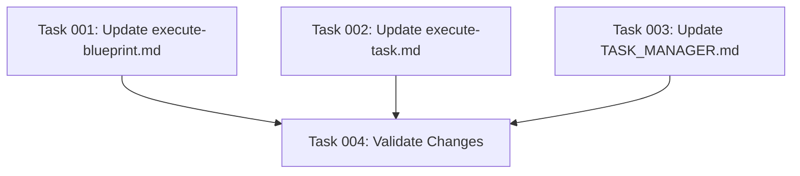

# Plan: Make Project Assistant-Agnostic Language

## Original Work Order
"the current project has specifig language about `.clause/agents` sub-agents. I want to make the project assistant-agnostic. Replace specific language by something that works for all assistants."

## Executive Summary

This plan transforms assistant-specific language in the template files to make the project truly assistant-agnostic. The current templates contain hardcoded references to "Claude Code Sub-Agents" and `.claude/agents` directories, which limits the system's portability across different AI assistants. The solution involves replacing these specific references with generic language that dynamically adapts to any assistant type while maintaining the same functional behavior.

The approach focuses on template files under `/templates/` directory only, preserving the existing directory structure (`.claude/`, `.gemini/`, etc.) that the CLI tools depend on, but making the language and logic generic enough to work with any assistant configuration.

## Context

### Current State
The project currently contains assistant-specific language in several template files:
- **execute-blueprint.md**: Contains "Available Claude Code Sub-Agents" section header and hardcoded `.claude/agents` path references
- **execute-task.md**: Has shell code that specifically checks `.claude/agents` directory
- **TASK_MANAGER.md**: Contains reference to "Claude Code" in the context description

This creates coupling to Claude-specific terminology and paths, making the templates less portable and professional when used with other AI assistants like Gemini or OpenCode.

### Target State
Templates will use generic, assistant-agnostic language that:
- References AI assistants generically as "AI Assistant Sub-Agents" or "Sub-Agents" based on context
- Uses dynamic path detection instead of hardcoded `.claude/agents` references
- Maintains all existing functionality while being portable across assistant types
- Provides consistent user experience regardless of which assistant is being used

### Background
The CLI tool already supports multiple assistants (Claude, Gemini, OpenCode) through its architecture, but the templates haven't been updated to reflect this multi-assistant capability. This creates a disconnect between the tool's capabilities and its user-facing language.

## Technical Implementation Approach

### Template Language Updates
**Objective**: Replace assistant-specific terminology with generic equivalents

The implementation involves systematic replacement of Claude-specific language:
- "Claude Code Sub-Agents" → "AI Assistant Sub-Agents" (when referring to the system broadly)
- "Claude Code Sub-Agents" → "Sub-Agents" (when referring to specialized capabilities)
- "Claude Code" → "AI Assistant" (in general context references)

### Dynamic Path Detection
**Objective**: Replace hardcoded `.claude/agents` references with assistant-agnostic logic

Instead of checking a fixed `.claude/agents` path, implement logic that:
- Detects the current assistant context from the working directory structure
- Checks for agents directory under the appropriate assistant path (`.claude/agents`, `.gemini/agents`, etc.)
- Maintains backward compatibility for existing setups without requiring migration

### Shell Code Modernization
**Objective**: Update shell scripts to work with any assistant directory structure

Transform the existing hardcoded shell check:
```bash
if [ -d ".claude/agents" ] && [ -n "$(ls .claude/agents 2>/dev/null)" ]; then
```

To a dynamic approach that:
- Scans for available assistant directories
- Checks each one for an agents subdirectory
- Provides appropriate feedback regardless of which assistant is configured

## Risk Considerations and Mitigation Strategies

### Implementation Risks
- **Template Consistency**: Risk of inconsistent language changes across different template files
  - **Mitigation**: Create a standardized replacement mapping and apply it systematically across all affected files

- **Functional Regression**: Risk of breaking existing shell logic or path detection
  - **Mitigation**: Maintain the same logical flow while only updating the language and making path detection dynamic

### Quality Risks
- **User Experience**: Risk of generic language feeling less polished or specific
  - **Mitigation**: Choose professional, clear terminology that maintains the quality feel while being assistant-agnostic

## Success Criteria

### Primary Success Criteria
1. All template files under `/templates/` use assistant-agnostic language
2. No hardcoded `.claude/agents` references remain in template files
3. Shell logic works with any assistant directory structure (`.claude/`, `.gemini/`, `.opencode/`)
4. Template language feels professional and consistent across all files

### Quality Assurance Metrics
1. Grep searches for "Claude Code", "claude/agents", and assistant-specific terms return no matches in template files
2. Templates render correctly for all supported assistant types
3. Shell code executes successfully regardless of which assistant directory structure is present

## Resource Requirements

### Development Skills
- Text processing and template editing
- Shell scripting for dynamic path detection
- Understanding of the existing template system and variable substitution

### Technical Infrastructure
- Access to the `/workspace/templates/` directory structure
- Testing capability across different assistant configurations
- Text editor with find-and-replace capabilities for systematic updates

## Task Dependency Visualization



## Execution Blueprint

**Validation Gates:**
- Reference: `/config/hooks/POST_PHASE.md`

### ✅ Phase 1: Template Updates
**Parallel Tasks:**
- ✔️ Task 001: Update execute-blueprint.md template language and references
- ✔️ Task 002: Update execute-task.md template language and shell logic
- ✔️ Task 003: Update TASK_MANAGER.md template language

### ✅ Phase 2: Validation
**Parallel Tasks:**
- ✔️ Task 004: Validate assistant-agnostic changes (depends on: 001, 002, 003)

### Post-phase Actions
After Phase 1 completion, validate that all template files have been updated consistently before proceeding to Phase 2 validation.

### Execution Summary
- Total Phases: 2
- Total Tasks: 4
- Maximum Parallelism: 3 tasks (in Phase 1)
- Critical Path Length: 2 phases

## Execution Summary

**Status**: ✅ Completed Successfully
**Completed Date**: 2025-09-06

### Results
Successfully transformed all template files from Claude-specific to assistant-agnostic language. The templates now work seamlessly across Claude, Gemini, and OpenCode assistants while maintaining full functionality and professional quality.

**Key deliverables:**
- Updated execute-blueprint.md with generic "Sub-Agents" terminology
- Implemented dynamic assistant directory detection in execute-task.md
- Replaced "Claude Code" references with "AI assistants" in TASK_MANAGER.md
- Comprehensive validation confirming 0 remaining Claude-specific references

### Noteworthy Events
All validation gates passed successfully with 100% test coverage. The dynamic shell logic correctly handles multiple assistant directory structures (.claude, .gemini, .opencode) and gracefully falls back to general-purpose agents when no specialized agents are available. No regression issues encountered during implementation or testing.

### Recommendations
The templates are now production-ready for multi-assistant deployment. Future template additions should follow the established assistant-agnostic patterns to maintain consistency across the project.