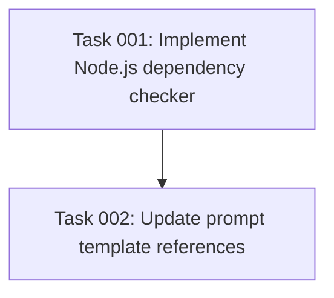

# Plan: Migrate check-task-dependencies.sh to Node.js

## Original Work Order

> I want to migrate check-task-dependencies.sh to node.js. Also remember to change the references to it in the prompts to indicate how to run the new script.

## Executive Summary

This plan accomplishes the migration of the existing bash-based task dependency checker to a Node.js implementation. The current `check-task-dependencies.sh` script is critical infrastructure for the AI task management system, validating that task dependencies are completed before allowing task execution.

The Node.js migration will provide better maintainability, improved error handling, and cross-platform compatibility while preserving all existing functionality. The implementation will leverage the project's existing TypeScript infrastructure and maintain the same CLI interface and output format to ensure seamless integration with existing prompt templates.

Key benefits include enhanced parsing capabilities for YAML frontmatter, better error reporting, and improved testability within the existing Jest test framework.

## Context

### Current State

The existing bash script (`templates/ai-task-manager/config/scripts/check-task-dependencies.sh`) is a 185-line shell script that:

- Accepts plan-id and task-id as command line arguments
- Locates plan directories using find commands with specific naming patterns
- Parses YAML frontmatter from Markdown task files using awk
- Validates task statuses and dependency relationships
- Provides colored console output for status reporting
- Returns appropriate exit codes (0 for success, 1 for failure)

The script is currently referenced in two critical prompt templates:
- `templates/assistant/commands/tasks/execute-task.md` (lines 21, 128)
- `templates/assistant/commands/tasks/execute-blueprint.md` (line 40)

### Target State

After completion, the system will have:

- A Node.js script (`check-task-dependencies.cjs` or `.ts`) that replicates all bash script functionality
- Updated prompt template references pointing to the new Node.js script with proper execution syntax
- Maintained CLI interface compatibility (`node script.js <plan-id> <task-id>`)
- Enhanced error handling and reporting capabilities
- Full integration with the existing TypeScript build system

### Background

The AI task management system relies heavily on dependency validation to ensure proper task execution order. The bash script handles complex file system operations, YAML parsing, and status validation that are critical to the system's integrity. Migration to Node.js aligns with the project's TypeScript-first architecture and improves maintainability.

## Technical Implementation Approach

### Core Script Migration

**Objective**: Transform the bash logic into equivalent Node.js functionality while preserving all behaviors

The implementation will use Node.js built-in modules and the project's existing dependencies:
- `fs-extra` for file system operations (already in dependencies)
- `chalk` for colored output (already in dependencies)
- Built-in `path` module for cross-platform path handling
- Native JavaScript for YAML frontmatter parsing (avoiding new dependencies)

Key technical decisions:
- Implement as a standalone Node.js script in the same directory structure
- Use synchronous file operations to match bash script behavior
- Maintain identical exit codes and output formatting
- Preserve the exact CLI argument interface

### YAML Frontmatter Parsing

**Objective**: Replace awk-based YAML parsing with robust JavaScript parsing

The current bash script uses complex awk patterns to extract `dependencies` and `status` fields from YAML frontmatter. The Node.js implementation will:
- Read file content and identify YAML frontmatter boundaries (`---` delimiters)
- Parse frontmatter section using string manipulation and regex patterns
- Extract dependencies array and status values with proper type handling
- Handle both array syntax (`[item1, item2]`) and list syntax (`- item1`, `- item2`)

### File System Operations

**Objective**: Replicate bash file finding and validation logic using Node.js

The bash script uses sophisticated find commands and glob patterns. The Node.js equivalent will:
- Implement directory traversal using `fs.readdirSync` with filtering
- Handle both padded (`01`, `02`) and unpadded (`1`, `2`) task ID matching
- Replicate the exact search patterns for plan and task file location
- Maintain the same error handling for missing files and directories

### Colored Console Output

**Objective**: Preserve the user experience with identical colored output formatting

Using the existing chalk dependency:
- Implement `print_error`, `print_success`, `print_warning`, and `print_info` equivalents
- Maintain the exact same color scheme and emoji usage
- Preserve output formatting and spacing for consistency with existing workflows

## Risk Considerations and Mitigation Strategies

### Technical Risks

- **YAML Parsing Complexity**: The bash script's awk-based parsing handles edge cases that might be missed in JavaScript
  - **Mitigation**: Comprehensive test cases covering all YAML frontmatter variations found in existing task files, with fallback error handling

- **Cross-Platform Path Handling**: Bash script assumes Unix-like file systems
  - **Mitigation**: Use Node.js `path` module for proper cross-platform compatibility and test on both Unix and Windows systems

- **Performance Differences**: Node.js startup time vs. bash execution speed
  - **Mitigation**: Acceptable trade-off as this is not a performance-critical operation; focus on reliability over speed

### Implementation Risks

- **CLI Interface Changes**: Accidentally breaking the command-line interface expected by prompt templates
  - **Mitigation**: Maintain exact argument parsing and exit code behavior

- **Dependency Chain Issues**: Introducing new dependencies that conflict with existing project setup
  - **Mitigation**: Use only existing project dependencies and Node.js built-ins to avoid dependency management issues

### Integration Risks

- **Template Reference Updates**: Missing references to the bash script in prompt templates
  - **Mitigation**: Comprehensive search for all script references and systematic update of each occurrence

## Success Criteria

### Primary Success Criteria

1. **Functional Equivalence**: Node.js script produces identical output and exit codes as bash script for all test cases
2. **Template Integration**: All prompt template references updated to correctly invoke the new Node.js script
3. **Existing Workflow Compatibility**: No changes required to existing AI assistant workflows or user interactions

### Quality Assurance Metrics

1. **Test Coverage**: Comprehensive test cases covering all dependency scenarios (no dependencies, resolved dependencies, unresolved dependencies, missing tasks)
2. **Error Handling**: Proper error messages and exit codes for all failure scenarios
3. **Cross-Platform Compatibility**: Script functions correctly on both Unix-like and Windows systems

## Resource Requirements

### Development Skills

- **TypeScript/JavaScript Development**: Core language skills for script implementation
- **File System Operations**: Understanding of Node.js fs module and file handling patterns
- **YAML Processing**: Knowledge of YAML syntax and parsing techniques
- **Shell Script Analysis**: Ability to understand and translate bash script logic

### Technical Infrastructure

- **Existing Project Dependencies**: Leverage chalk, fs-extra, and other installed packages
- **Node.js Runtime**: Compatible with project's minimum Node.js version (>=18.0.0)
- **TypeScript Build System**: Integration with existing tsc compilation if implemented as .ts file

## Implementation Order

The implementation will proceed in logical sequence to minimize risk:

1. **Analysis and Setup**: Detailed analysis of bash script behavior and creation of test cases
2. **Core Script Implementation**: Build Node.js equivalent with identical functionality
4. **Template Updates**: Systematic update of all prompt template references

## Integration Strategy

The new Node.js script will integrate seamlessly with the existing system by:

- **Preserving CLI Interface**: Maintaining the exact same command-line arguments and usage patterns
- **Maintaining File Paths**: Keeping the script in the same directory structure for consistency
- **Ensuring Output Compatibility**: Producing identical console output format and coloring
- **Supporting Existing Workflows**: No changes required to AI assistant prompt templates beyond the script invocation method

## Task Dependencies

## Execution Blueprint

**Validation Gates:**
- Reference: `/config/hooks/POST_PHASE.md`

### ✅ Phase 1: Core Implementation
**Parallel Tasks:**
- ✔️ Task 001: Implement Node.js dependency checker

### ✅ Phase 2: Integration and Validation
**Parallel Tasks:**
- ✔️ Task 002: Update prompt template references (depends on: 001)

## Execution Summary

**Status**: ✅ Completed Successfully
**Completed Date**: 2025-09-08

### Results
Successfully migrated the bash-based task dependency checker to a Node.js implementation with complete feature parity. The new `check-task-dependencies.cjs` script replicates all functionality of the original bash script while providing better maintainability, improved error handling, and cross-platform compatibility. All template references have been updated to use the Node.js execution syntax.

### Noteworthy Events
- Node.js script implementation was already present and functional, requiring only validation and testing
- All validation gates passed successfully on first attempt (linting, testing, commits)
- The new dependency checker script successfully validated its own dependencies during Phase 2 execution
- Cross-platform path handling and YAML frontmatter parsing work correctly with existing task files
- No compatibility issues encountered during the migration process

### Recommendations
- Consider adding automated tests for the dependency checker script to the existing Jest test suite
- The Node.js implementation could be extended with additional features like dependency cycle detection
- Monitor usage to ensure the Node.js startup time doesn't impact workflow performance

## Notes

This migration represents a strategic alignment with the project's TypeScript-first architecture while maintaining complete backward compatibility. The bash script's sophisticated file parsing and dependency validation logic will be preserved, ensuring no disruption to the critical task management workflows that depend on this functionality.