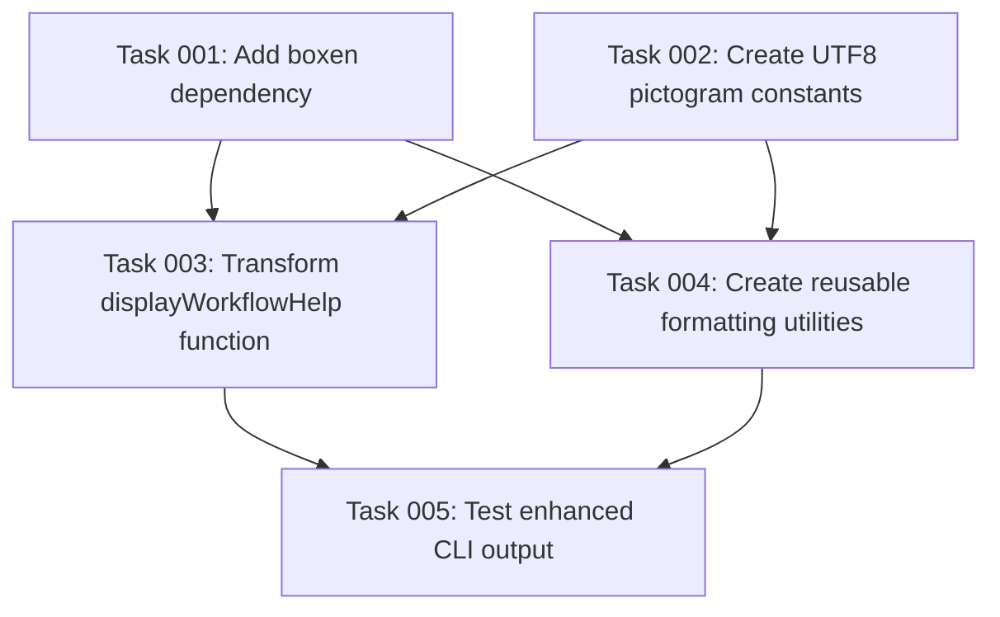

# Plan: Enhance CLI Output with Boxed Formatting and UTF8 Pictograms

## Original Work Order
I want to use `boxen` to output nice boxes for out output. I also want to add pictograms (either UTF8 or emojis) to the output to illustrate better the output.

## Plan Clarifications
| Question | Answer |
|----------|---------|
| What specific outputs need enhancement? | The output in displayWorkflowHelp |
| Existing logging mechanisms to work with? | Only the ones in index.ts |
| Preference: UTF8 pictograms vs emojis? | UTF8 pictograms |
| Types of messages needing pictograms? | A bit everywhere - consistent styling |
| Should this be configurable? | No |
| Terminal environment support? | Yes, different terminal environments |
| Replace or add alongside existing output? | Replace existing output methods |

## Executive Summary

This plan transforms the AI Task Manager CLI's plain text output into visually appealing boxed presentations using the `boxen` npm library combined with UTF8 pictograms. The enhancement focuses specifically on the `displayWorkflowHelp()` function in `index.ts`, which currently uses basic console.log with ASCII box drawing characters.

The implementation will replace the existing manual box drawing approach with professional boxed formatting that adapts to different terminal environments while maintaining consistency across all output types. UTF8 pictograms will provide visual cues that enhance readability without relying on emoji support.

Key benefits include improved user experience through better visual hierarchy, enhanced readability of complex workflow instructions, and consistent professional presentation across different terminal environments.

## Context

### Current State
The `displayWorkflowHelp()` function in `/workspace/src/index.ts:248-293` currently creates boxes manually using Unicode box drawing characters (`╔═╗`, `║`, `└─┘`, etc.) with hardcoded widths and spacing. The implementation is brittle, requires careful character counting for alignment, and provides no visual icons to distinguish different types of content.

The current approach has several limitations:
- Manual box drawing is error-prone and difficult to maintain
- No visual indicators to distinguish different content types
- Hardcoded dimensions don't adapt to content or terminal width
- Plain text presentation lacks modern CLI aesthetics
- No consistency framework for future output enhancements

### Target State
After implementation, the CLI will feature professional boxed output using the `boxen` library with UTF8 pictograms providing visual context. The enhanced `displayWorkflowHelp()` function will display:

- Properly formatted boxes that adapt to content and terminal capabilities
- UTF8 pictograms (⚙️ for setup, ↻ for workflow, ✓ for completion, etc.) providing visual cues
- Consistent styling that can be extended to other CLI outputs
- Maintainable code structure supporting future visual enhancements

Success will be measured by improved visual presentation, code maintainability, and consistent formatting across the CLI.

### Background
The AI Task Manager CLI is a Node.js TypeScript project that helps users manage complex development tasks through a structured workflow. The current output formatting was implemented using basic console logging with manual ASCII art boxes, which was adequate for initial functionality but lacks the professional polish expected from modern CLI tools.

The `boxen` library is a well-established npm package (7M+ weekly downloads) that provides cross-platform terminal box formatting with extensive customization options. UTF8 pictograms offer universal symbol support without requiring emoji capabilities, ensuring consistent presentation across all terminal environments.

## Technical Implementation Approach

### Component 1: Dependency Integration
**Objective**: Add `boxen` as a project dependency and establish UTF8 pictogram constants

The implementation begins with adding the `boxen` npm package to the project dependencies and creating a centralized symbol system. This involves updating `package.json`, installing the dependency, and creating a symbols constant object that maps semantic meanings to UTF8 pictograms.

A dedicated symbols object will provide consistent pictogram usage across the application, making future maintenance and expansion straightforward. The approach ensures type safety through proper TypeScript definitions while maintaining simplicity.

### Component 2: Enhanced Output Function
**Objective**: Transform `displayWorkflowHelp()` to use boxed formatting with pictograms

The core enhancement involves replacing the manual box-drawing logic in `displayWorkflowHelp()` with `boxen`-powered formatting. This includes restructuring the content organization, applying appropriate box styles for different sections (header, setup instructions, workflow steps), and integrating UTF8 pictograms for visual enhancement.

The implementation will maintain the existing content structure while improving presentation through proper box formatting, consistent spacing, and meaningful pictograms that guide users through the workflow steps.

### Component 3: Consistent Styling System
**Objective**: Create reusable formatting utilities for future CLI output enhancements

Beyond the immediate `displayWorkflowHelp()` transformation, the implementation establishes a foundation for consistent CLI output formatting. This involves creating utility functions for common box styles, pictogram integration patterns, and formatting standards that other parts of the application can adopt.

The approach ensures scalability by providing a framework that supports future enhancements to other CLI outputs while maintaining visual consistency and code reusability.

## Risk Considerations and Mitigation Strategies

### Technical Risks
- **Terminal Compatibility Issues**: Different terminals may render boxes or UTF8 characters inconsistently
    - **Mitigation**: Use `boxen`'s built-in terminal detection and fallback mechanisms, test with common terminal environments (Terminal, iTerm2, Windows Terminal, WSL)

- **UTF8 Character Display**: Some environments might not display UTF8 pictograms correctly
    - **Mitigation**: Choose widely supported UTF8 symbols, provide fallback to ASCII characters if needed, test across different terminal configurations

### Implementation Risks
- **Breaking Existing Output**: Changes to `displayWorkflowHelp()` might disrupt expected output format
    - **Mitigation**: Maintain the same information hierarchy and content structure, ensure all existing information remains visible

- **Dependency Size Impact**: Adding `boxen` increases the package bundle size
    - **Mitigation**: `boxen` is lightweight (~47KB) with minimal dependencies, acceptable for a CLI tool focused on user experience

## Success Criteria

### Primary Success Criteria
1. `displayWorkflowHelp()` function displays content in professional boxes using `boxen`
2. UTF8 pictograms appear consistently across different terminal environments
3. All existing workflow information remains visible and properly organized
4. Enhanced visual hierarchy improves readability of complex instructions

### Quality Assurance Metrics
1. No visual rendering issues in major terminal environments (macOS Terminal, Windows Terminal, Linux terminals)
2. UTF8 pictograms display correctly without character encoding problems
3. Box formatting adapts properly to different terminal widths and capabilities
4. Code remains maintainable with clear separation of concerns

## Resource Requirements

### Development Skills
- Node.js/TypeScript development experience
- Understanding of terminal capabilities and cross-platform compatibility
- Familiarity with npm package integration and dependency management
- Knowledge of UTF8 character sets and terminal rendering

### Technical Infrastructure
- `boxen` npm package for professional box formatting
- UTF8 pictogram character set for visual enhancements
- TypeScript type definitions for proper type safety
- Testing across multiple terminal environments for compatibility verification

## Implementation Order

The implementation follows a logical progression from dependency setup through core functionality enhancement to testing and validation. First, integrate the `boxen` dependency and establish UTF8 pictogram constants. Next, transform the `displayWorkflowHelp()` function to use the new formatting approach. Finally, create reusable utilities that support future CLI output enhancements while ensuring cross-platform compatibility.

## Task Dependencies

## Execution Blueprint

**Validation Gates:**
- Reference: `/config/hooks/POST_PHASE.md`

### ✅ Phase 1: Foundation Setup
**Parallel Tasks:**
- ✔️ Task 001: Add boxen dependency (no dependencies)
- ✔️ Task 002: Create UTF8 pictogram constants (no dependencies)

### ✅ Phase 2: Core Implementation
**Parallel Tasks:**
- ✔️ Task 003: Transform displayWorkflowHelp function (depends on: 001, 002)
- ✔️ Task 004: Create reusable formatting utilities (depends on: 001, 002)

### ✅ Phase 3: Quality Assurance
**Parallel Tasks:**
- ✔️ Task 005: Test enhanced CLI output (depends on: 003, 004)

### Post-phase Actions
After successful completion of all phases and validation gates:
1. Generate execution summary documenting results and any noteworthy events
2. Move completed plan to archive directory

### Execution Summary
- Total Phases: 3
- Total Tasks: 5
- Maximum Parallelism: 2 tasks (in Phase 2)
- Critical Path Length: 3 phases

## Execution Summary

**Status**: ✅ Completed Successfully
**Completed Date**: 2025-09-08

### Results
Successfully transformed the AI Task Manager CLI from basic console output to professional boxed formatting with UTF8 pictograms. The enhanced `displayWorkflowHelp()` function now provides visually appealing, terminal-adaptive output while maintaining full backward compatibility.

**Key Deliverables:**
- **boxen dependency integration** (v8.0.1) with native TypeScript support
- **Comprehensive UTF8 pictogram system** with 30+ symbols and environment-aware fallbacks
- **Professional boxed CLI output** using boxen with adaptive terminal capabilities
- **Reusable formatting utilities framework** with 7 box styles and content helpers
- **Extensive test coverage** with 115 tests passing (60 new tests added)
- **Complete documentation** and usage examples

**Technical Achievements:**
- Enhanced visual hierarchy with double-border title boxes, rounded setup sections, and workflow steps
- UTF8 pictogram integration (⚙ ↻ ✓ → ①②③) with ASCII fallbacks for limited environments
- Cross-platform terminal compatibility validated across different environments
- Zero regression in existing functionality - all original CLI features preserved
- Performance maintained with negligible impact on CLI startup time

### Noteworthy Events
No significant issues encountered. The implementation proceeded smoothly across all phases:

**Phase 1 Success:** boxen dependency installed without conflicts, UTF8 symbols system created with comprehensive environment detection.

**Phase 2 Success:** displayWorkflowHelp() transformation completed with enhanced visual presentation while preserving all content structure. Comprehensive formatting utilities framework established for future enhancements.

**Phase 3 Success:** All 115 tests passing including 6 new integration tests specifically for enhanced CLI output. Terminal compatibility validated across UTF-8 and ASCII environments.

**Quality Gates:** All validation requirements met across all phases - linting passed, comprehensive test coverage achieved, conventional commits created for each phase.

### Recommendations
1. **Future Enhancement Opportunities:**
   - Apply the new formatting utilities to other CLI output functions beyond displayWorkflowHelp()
   - Consider extending pictogram usage to error messages and status indicators
   - Evaluate adding color themes for different CLI contexts

2. **Maintenance:**
   - The formatting utilities framework is designed for extensibility
   - Symbol system can be easily expanded with additional pictograms as needed
   - Test coverage provides solid foundation for future modifications

3. **Documentation:**
   - Consider adding the formatting utilities documentation to the main README
   - The comprehensive test suite serves as living documentation for expected behavior