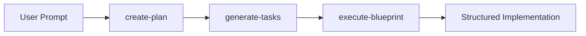
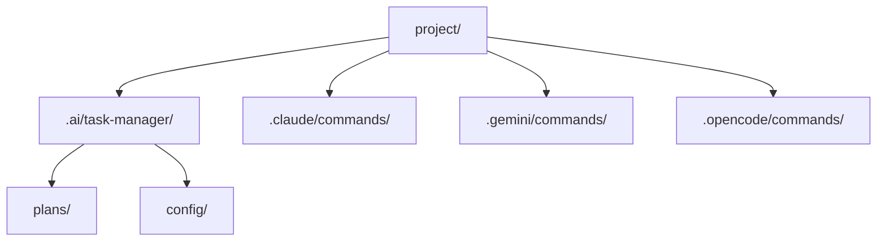
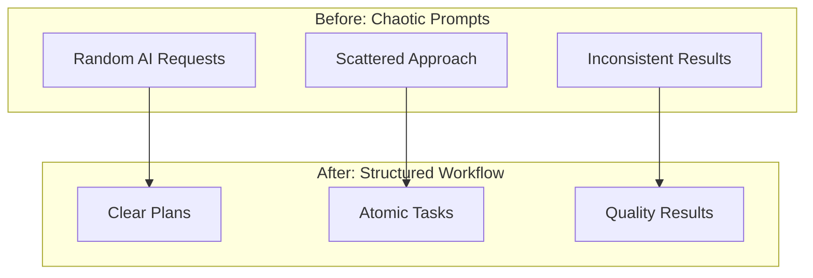
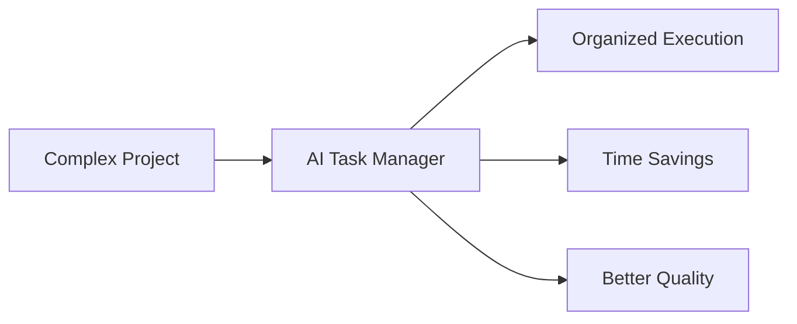

# Create Documentation Content and Strategic Diagrams

## Objective
Create minimal, visually engaging documentation content (under 1000 words) with 4-5 strategic Mermaid diagrams that clearly illustrate the AI Task Manager's 3-step workflow approach and value proposition.

## Skills Required
- **markdown**: Creating well-structured Markdown content with proper formatting
- **technical-writing**: Writing clear, concise explanations for technical concepts

## Acceptance Criteria
- [ ] `/docs` folder created with main documentation file
- [ ] Total content under 1000 words (excluding diagram code)
- [ ] 4-5 Mermaid diagrams illustrating key concepts
- [ ] Content covers: what it is, installation, usage, supported assistants
- [ ] Mobile-friendly layout with responsive design considerations
- [ ] Content focuses on 3-step workflow value proposition

## Technical Requirements
- Use Markdown format for maximum compatibility
- Include Mermaid diagrams (supported by GitHub Pages/Jekyll)
- Structure content for single-page or minimal multi-page layout
- Ensure diagrams use simple, clean design (2-3 colors max)
- Include basic meta tags for SEO

## Input Dependencies
- Current README.md content for reference
- Existing CLAUDE.md for architectural context
- Plan 23 specifications for content requirements

## Output Artifacts
- `/docs/index.md` (main documentation file)
- Embedded Mermaid diagrams within documentation
- Basic CSS styling (if needed for responsive design)

## Implementation Notes

<details>
<summary>Detailed Implementation Instructions</summary>

### Content Structure (400-500 words total)

**Homepage/Main Documentation (docs/index.md):**

1. **Header Section**:
   - Project title and 2-sentence description
   - Workflow overview diagram (Mermaid)

2. **The Problem & Solution**:
   - Brief explanation of chaotic AI prompts vs structured approach
   - 3-step process diagram: create-plan → generate-tasks → execute-blueprint

3. **Quick Start**:
   - Single npm install command
   - 3 basic usage examples with before/after visual

4. **What It Creates**:
   - Directory structure diagram showing generated files
   - Supported assistants table with brief descriptions

5. **FAQ**:
   - 5 most common questions with 1-2 sentence answers

### Required Mermaid Diagrams

**Diagram 1: Workflow Overview**


**Diagram 2: Directory Structure**


**Diagram 3: Before/After Comparison**


**Diagram 4: Value Proposition**


### Content Guidelines

1. **Tone**: Direct, practical, no marketing fluff
2. **Focus**: Emphasize the 3-step workflow benefit
3. **Length**: Each section under 100 words
4. **Style**: Use bullet points over paragraphs
5. **Examples**: Include actual CLI commands
6. **Visual Priority**: Let diagrams tell the story

### File Structure
```
docs/
├── index.md           # Main documentation
└── _config.yml        # Jekyll config (if needed)
```

### Responsive Design Notes
- Use standard Markdown tables (responsive by default)
- Ensure Mermaid diagrams scale on mobile
- Include viewport meta tag
- Use relative units for any custom CSS

### SEO Basics
```html
<meta name="description" content="AI Task Manager - Transform chaotic AI prompts into structured, manageable workflows">
<meta name="keywords" content="AI, task management, CLI, automation, workflow">
```

### Writing Style
- **Scannable**: Use headers, bullets, short paragraphs
- **Action-oriented**: Start with verbs ("Install", "Run", "Create")
- **Benefit-focused**: Always explain "why" not just "what"
- **Example-driven**: Show actual commands and outputs

</details>