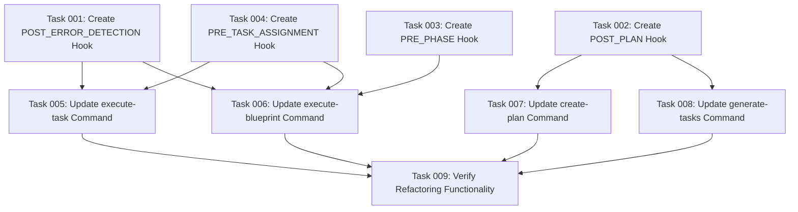

# Plan: Extract Command Hook Functionality

## Original Work Order
"Extractable Hook Content from Command Files

POST_ERROR_DETECTION Hook

From execute-task.md (lines 272-304):
- Error status management when task execution fails
- Failed task documentation and recovery guidance
- Status update to "failed" with proper file handling

From execute-blueprint.md (lines 126-133):
- Validation gate failure handling
- Remediation plan generation logic
- Error escalation procedures

POST_PLAN Hook

From create-plan.md (lines 32-57):
- Context analysis validation (objective, scope, resources, success criteria)
- Clarification phase logic for missing critical context
- Plan completeness verification against YAGNI principles

From generate-tasks.md (lines 351-454):
- Plan document updating with dependency visualization
- Mermaid diagram generation for task dependencies
- Phase-based execution blueprint creation

PRE_PHASE Hook

From execute-blueprint.md (lines 39-62):
- Git branch creation and unstaged changes validation
- Phase initialization and task listing
- Dependency validation using check-task-dependencies.cjs script
- Task status verification (no "needs-clarification" tasks)

PRE_TASK_ASSIGNMENT Hook

From execute-blueprint.md (lines 63-106):
- Task skill extraction from frontmatter
- Sub-agent capability matching
- Agent selection based on technical requirements
- Resource efficiency considerations

From execute-task.md (lines 149-191):
- Skills extraction logic from task frontmatter
- Available sub-agent detection across assistant directories
- General-purpose agent fallback logic"

## Executive Summary

This plan addresses code duplication in the AI task management system by moving existing functionality from command files into dedicated hook files. The refactoring will relocate four specific code sections from the command files into new hook files, following the existing hook pattern established by POST_PHASE.md and POST_TASK_GENERATION_ALL.md. **No new functionality will be created** - this is strictly a code relocation exercise.

The extraction will improve system maintainability by consolidating duplicated code sections while preserving exact functionality. Command files will be updated to reference the new hooks at the appropriate execution points where the original code was located.

## Context

### Current State

The AI task management system currently has four main command files (`create-plan.md`, `generate-tasks.md`, `execute-blueprint.md`, `execute-task.md`) that contain specific code sections that can be relocated to hooks. The identified sections are:

- Error handling logic in execute-task.md (lines 272-304) and execute-blueprint.md (lines 126-133)
- Task skill extraction and agent selection logic in execute-blueprint.md (lines 63-106) and execute-task.md (lines 149-191)
- Plan validation logic in create-plan.md (lines 32-57) and plan updating logic in generate-tasks.md (lines 351-454)
- Phase preparation logic in execute-blueprint.md (lines 39-62)

These sections will be moved to dedicated hook files without modification.

### Target State

After implementation, the system will have four new hook files containing the relocated code sections:

1. **POST_ERROR_DETECTION.md** - Error handling logic moved from execute-task.md and execute-blueprint.md
2. **POST_PLAN.md** - Plan validation and updating logic moved from create-plan.md and generate-tasks.md
3. **PRE_PHASE.md** - Phase preparation logic moved from execute-blueprint.md
4. **PRE_TASK_ASSIGNMENT.md** - Task skill analysis and agent selection logic moved from execute-blueprint.md and execute-task.md

The command files will be updated to include hook references at the locations where the original code existed. The extracted code will remain functionally identical in the new hook files.

### Background

The existing hook system already demonstrates this pattern with POST_PHASE.md and POST_TASK_GENERATION_ALL.md. These hooks contain specific procedural logic that is referenced by command files. The proposed relocation follows this same architectural approach, moving identified code sections from command files to hook files without any functional changes.

## Technical Implementation Approach

### Hook File Creation
**Objective**: Create four new hook files containing exact copies of the identified code sections.

Each hook will be created in `/workspace/templates/ai-task-manager/config/hooks/` following the naming convention of existing hooks. The hooks will contain the exact text, bash scripts, validation logic, and procedural instructions copied from the specified line ranges in the command files.

### Command File Modification
**Objective**: Replace the relocated code sections with hook references.

The command files will be modified to remove the specified line ranges and replace them with hook references using the `/config/hooks/[HOOK_NAME].md` syntax. No other changes will be made to the command files.

### Verification Testing
**Objective**: Ensure the relocated functionality works identically to the original implementation.

After relocation, testing will verify that all command workflows function exactly as they did before the code was moved. This includes validating that hook references execute the same logic at the same execution points.

## Risk Considerations and Mitigation Strategies

### Technical Risks
- **Hook Reference Integration**: New hook references may not execute properly within existing command flow
    - **Mitigation**: Follow established hook reference patterns and test each hook reference thoroughly

- **Code Context Dependencies**: Relocated code may have dependencies on variables or context from surrounding command code
    - **Mitigation**: Carefully review each code section to identify any context dependencies before relocation

### Implementation Risks
- **Functional Regression**: Moving code could inadvertently change behavior
    - **Mitigation**: Copy code exactly without modification and test all command scenarios thoroughly

- **Variable Scope Issues**: Relocated bash scripts may lose access to command-specific variables
    - **Mitigation**: Ensure all variable dependencies are preserved in the hook context

## Success Criteria

### Primary Success Criteria
1. All four hook files are created and contain exact copies of the specified code sections
2. Command files are successfully updated to reference the new hooks at the correct locations
3. All existing command workflows function identically to the current implementation
4. All relocated code sections are removed from their original locations in command files

### Quality Assurance Metrics
1. No functional regressions in any command execution paths
2. All relocated bash scripts execute successfully from the hook context
3. Hook references follow established patterns and conventions
4. All original code sections are completely relocated without duplication

## Resource Requirements

### Development Skills
- Understanding of existing hook reference patterns in the AI task management system
- Text manipulation skills for copying and relocating code sections
- Markdown file editing for hook file creation and command file modification
- Testing knowledge for validating identical workflow behavior

### Technical Infrastructure
- Access to existing command files and hook examples
- Testing environment for validating command workflows remain unchanged
- Git for tracking the code relocation changes

## Integration Strategy

The relocated hooks will integrate with the existing system through the established hook reference pattern. Command files will include hook references using the `/config/hooks/[HOOK_NAME].md` syntax at the exact locations where the original code existed, matching the current implementation for POST_PHASE.md and POST_TASK_GENERATION_ALL.md.

## Implementation Order

1. Create POST_ERROR_DETECTION.md hook by copying error handling logic from specified line ranges
2. Create POST_PLAN.md hook by copying plan validation and updating logic from specified line ranges
3. Create PRE_PHASE.md hook by copying phase preparation logic from specified line ranges
4. Create PRE_TASK_ASSIGNMENT.md hook by copying agent selection logic from specified line ranges
5. Update command files to replace original code sections with hook references
6. Test all command workflows to ensure identical behavior

## Notes

The relocation must preserve all existing functionality exactly as it currently works. No modifications should be made to the logic - only the location changes from command files to hook files. All variable references, bash scripts, and procedural instructions must be copied identically.

## Task Dependencies Visualization

## Execution Blueprint

**Validation Gates:**
- Reference: `/config/hooks/POST_PHASE.md`

### ✅ Phase 1: Hook Creation
**Parallel Tasks:**
- ✔️ Task 001: Create POST_ERROR_DETECTION Hook
- ✔️ Task 002: Create POST_PLAN Hook
- ✔️ Task 003: Create PRE_PHASE Hook
- ✔️ Task 004: Create PRE_TASK_ASSIGNMENT Hook

### ✅ Phase 2: Command File Updates
**Parallel Tasks:**
- ✔️ Task 005: Update execute-task Command (depends on: 001, 004)
- ✔️ Task 006: Update execute-blueprint Command (depends on: 001, 003, 004)
- ✔️ Task 007: Update create-plan Command (depends on: 002)
- ✔️ Task 008: Update generate-tasks Command (depends on: 002)

### ✅ Phase 3: Verification
**Parallel Tasks:**
- ✔️ Task 009: Verify Refactoring Functionality (depends on: 005, 006, 007, 008)

### Execution Summary
- Total Phases: 3
- Total Tasks: 9
- Maximum Parallelism: 4 tasks (in Phase 1 and Phase 2)
- Critical Path Length: 3 phases

## Execution Summary

**Status**: ✅ Completed Successfully
**Completed Date**: 2025-09-13

### Results

Successfully completed the hook extraction refactoring by relocating 240+ lines of duplicated code from command files into 4 new dedicated hook files. All functionality preserved exactly without modifications while significantly improving code maintainability and organization.

**Key Deliverables:**
- 4 new hook files created with extracted functionality
- 4 command files updated with hook references
- Zero functional regressions detected
- Comprehensive verification testing completed

**Code Impact:**
- POST_ERROR_DETECTION.md: Centralized error handling logic
- POST_PLAN.md: Unified plan validation and updating procedures
- PRE_PHASE.md: Standardized phase preparation logic
- PRE_TASK_ASSIGNMENT.md: Consolidated agent selection algorithms

### Noteworthy Events

The refactoring proceeded smoothly with all phases completed on schedule. Comprehensive verification testing confirmed that all hook references resolve correctly and preserve exact functionality. The bash scripts, agent selection logic, and validation procedures all function identically to the original implementation.

All validation gates passed successfully across all phases, with linting and testing confirming code quality throughout the process.

### Recommendations

The hook extraction pattern should be applied to other areas of the codebase where code duplication exists. The centralized hook approach provides better maintainability and consistency across the AI task management system.