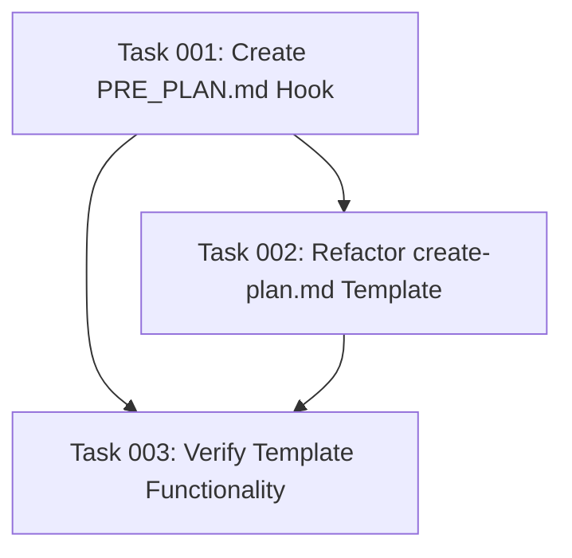

# Plan: PRE_PLAN.md Hook Implementation

## Original Work Order
"I want to introduce a PRE_PLAN.md hook. Your task is to create the plan template and offload the appropriate parts of the prompt from @templates/assistant/commands/tasks/create-plan.md to it."

## Executive Summary

This plan implements a PRE_PLAN.md hook to handle pre-planning validation, context analysis, and guideline enforcement before plan creation begins. Following the established pattern of POST_PLAN.md, this new hook will centralize pre-planning logic that is currently embedded within the create-plan.md template, creating better separation of concerns and more maintainable template architecture.

The approach involves creating the PRE_PLAN.md hook file in the appropriate location, moving specific sections from create-plan.md to the hook, and updating create-plan.md to reference the new hook. This maintains the existing workflow while providing cleaner template organization and reusable pre-planning logic.

## Context

### Current State
The create-plan.md template contains extensive pre-planning logic including context analysis instructions, clarification guidelines, scope control principles, and simplicity enforcement. This content is embedded directly in the template, creating a lengthy and complex document that mixes planning methodology with template mechanics.

The existing POST_PLAN.md hook handles post-planning validation and updates, establishing a pattern for hook-based template augmentation that should be extended to pre-planning activities.

### Target State
A PRE_PLAN.md hook will handle all pre-planning validation, context gathering, and guideline enforcement. The create-plan.md template will be streamlined to focus primarily on plan generation mechanics, template structure, and output formatting. This creates a cleaner separation between methodology (hooks) and mechanics (templates).

### Background
The task management system already uses hooks successfully with POST_PLAN.md, which provides validation and dependency visualization after plan creation. Extending this pattern to pre-planning activities follows the established architecture and provides consistency across the system.

## Technical Implementation Approach

### PRE_PLAN.md Hook Creation
**Objective**: Extract existing pre-planning content from create-plan.md into a dedicated hook file

The PRE_PLAN.md hook will be placed in `.ai/task-manager/config/hooks/PRE_PLAN.md` following the established pattern. It will contain **only content moved from the existing create-plan.md template**, specifically:

- **Scope Control Guidelines** (lines 43-59): YAGNI enforcement, anti-pattern identification, and feature creep prevention
- **Simplicity Principles** (lines 61-71): Maintainability-first approach with complexity detection and mitigation strategies
- **Critical Notes** (lines 124-129): Validation requirements about avoiding partial plans and ensuring adequate context
- **Clarification guidance** that may be referenced in POST_PLAN.md but belongs in pre-planning phase

**Important**: No new language or instructions will be introduced. PRE_PLAN.md will consist entirely of relocated content from create-plan.md, maintaining existing functionality while improving organization.

### Template Refactoring
**Objective**: Streamline create-plan.md by removing content that will be moved to PRE_PLAN.md

The create-plan.md template will be refactored to:
- Add reference to PRE_PLAN.md hook in the process instructions (similar to existing POST_PLAN.md reference)
- Remove scope control guidelines section (lines 43-59) - moved to PRE_PLAN.md
- Remove simplicity principles section (lines 61-71) - moved to PRE_PLAN.md
- Remove critical notes section (lines 124-129) - moved to PRE_PLAN.md
- Retain all plan generation mechanics, output formatting, template structure, and frontmatter specifications
- Maintain existing user-facing workflow and functionality

### Hook Integration
**Objective**: Ensure seamless integration between PRE_PLAN.md and existing workflow

The integration will reference PRE_PLAN.md early in the create-plan.md template process, similar to how POST_PLAN.md is referenced. This maintains the existing three-phase workflow while adding proper pre-planning validation.

## Risk Considerations and Mitigation Strategies

### Technical Risks
- **Content Duplication**: Risk of duplicating instructions between PRE_PLAN.md and POST_PLAN.md hooks
    - **Mitigation**: Carefully delineate pre-planning (context/scope) vs post-planning (validation/updating) responsibilities

- **Template Integration Issues**: Risk of breaking existing create-plan.md functionality during refactoring
    - **Mitigation**: Test template functionality after changes and ensure all original capabilities remain intact

### Implementation Risks
- **Workflow Disruption**: Risk of changing established user workflow patterns
    - **Mitigation**: Maintain exact same user-facing behavior while improving internal template organization

- **Content Organization**: Risk of moving inappropriate content to PRE_PLAN.md hook or introducing new language
    - **Mitigation**: Move only specific existing sections from create-plan.md (scope control guidelines, simplicity principles, critical notes) without adding any new content

## Success Criteria

### Primary Success Criteria
1. PRE_PLAN.md hook exists in `.ai/task-manager/config/hooks/` containing only relocated content from create-plan.md
2. create-plan.md template references PRE_PLAN.md and removes the specific sections that were moved
3. All original create-plan.md functionality remains intact after refactoring with no new language introduced

### Quality Assurance Metrics
1. Template length reduction in create-plan.md by removing the three specific sections (scope control, simplicity principles, critical notes)
2. Clear separation of concerns between pre-planning (PRE_PLAN.md) and post-planning (POST_PLAN.md) hooks
3. PRE_PLAN.md contains only existing language from create-plan.md with no new content added

## Resource Requirements

### Development Skills
- Template architecture understanding for proper hook integration
- Content analysis to identify appropriate sections for migration
- Markdown and YAML frontmatter formatting expertise

### Technical Infrastructure
- Access to existing template and hook files for reference and modification
- Understanding of the three-phase workflow (create-plan → generate-tasks → execute-blueprint)

## Integration Strategy

The PRE_PLAN.md hook will integrate seamlessly with the existing workflow by being referenced early in the create-plan.md process, before plan generation begins. This follows the established pattern where POST_PLAN.md is referenced after plan creation, creating bookend hooks that frame the planning process.

## Implementation Order

1. Create PRE_PLAN.md hook by copying the three specific sections from create-plan.md (no new content)
2. Refactor create-plan.md template to reference PRE_PLAN.md and remove the copied sections
3. Verify template functionality remains intact after changes
4. Ensure proper hook integration and workflow continuity

## Notes

The implementation should maintain the existing user experience while providing cleaner internal template organization. The PRE_PLAN.md hook should complement, not duplicate, the POST_PLAN.md hook functionality.

## Task Dependency Visualization

## Execution Blueprint

**Validation Gates:**
- Reference: `/config/hooks/POST_PHASE.md`

### ✅ Phase 1: Hook Creation
**Parallel Tasks:**
- ✔️ Task 001: Create PRE_PLAN.md Hook File

### ✅ Phase 2: Template Refactoring
**Parallel Tasks:**
- ✔️ Task 002: Refactor create-plan.md Template (depends on: 001)

### ✅ Phase 3: Validation
**Parallel Tasks:**
- ✔️ Task 003: Verify Template Functionality (depends on: 001, 002)

### Post-phase Actions

### Execution Summary
- Total Phases: 3
- Total Tasks: 3
- Maximum Parallelism: 1 task (single task per phase)
- Critical Path Length: 3 phases

## Execution Summary

**Status**: ✅ Completed Successfully
**Completed Date**: 2025-09-25

### Results
Successfully implemented PRE_PLAN.md hook to handle pre-planning validation and refactored create-plan.md template. The implementation achieved:

- **PRE_PLAN.md Hook Created**: Extracted scope control guidelines, simplicity principles, and critical notes from create-plan.md template into dedicated hook file
- **Template Refactored**: Streamlined create-plan.md by removing redundant sections (37 lines, 23.7% reduction) while preserving all functionality
- **Hook Integration**: Properly integrated PRE_PLAN.md reference following established POST_PLAN.md pattern
- **Functionality Verified**: Comprehensive validation confirmed all original capabilities maintained with improved separation of concerns

The system now has cleaner separation between methodology (hooks) and template mechanics, with pre-planning and post-planning guidance properly bookending the plan creation process.

### Noteworthy Events
- Template refactoring achieved significant size reduction (23.7%) while maintaining complete functionality
- Hook integration followed established architecture patterns ensuring consistency across the system
- Validation confirmed successful extraction of all required content with no loss of guidance or workflow capability

### Recommendations
- Consider applying similar hook pattern to other templates that contain embedded methodology guidance
- Document the PRE_PLAN/POST_PLAN hook pattern as standard architecture for future template development