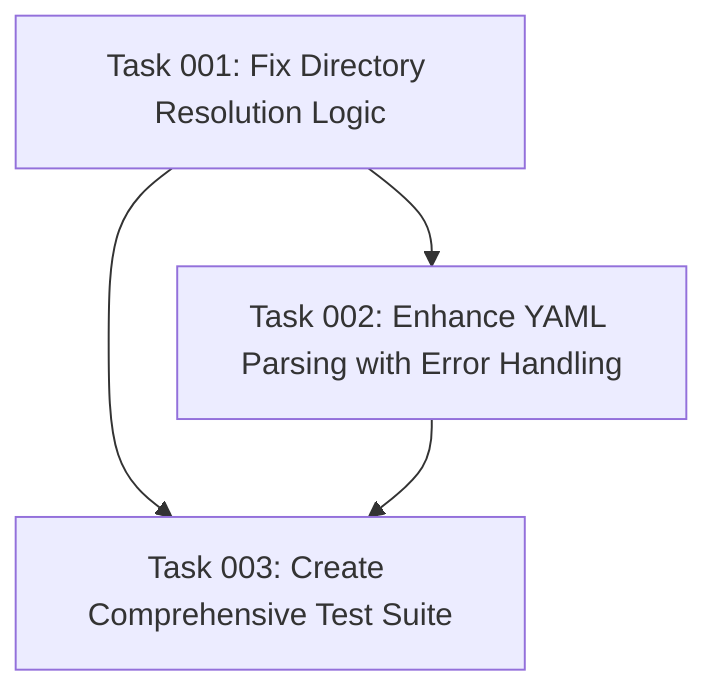

# Plan: Fix Plan ID Detection Issues

## Original Work Order

> When I use this project to create a plan the ID detection for the next plan fails too often. I think we should fix @templates/ai-task-manager/config/scripts/get-next-plan-id.cjs and add some testing for it.
>
> The algorithm should be able to detect the proper `.ai` directory that contains a `task-manager/plans` directory. There might be multiple places in a single repository where this folder exists. However, only one is valid according to the current working directory in which the assistant was started. This means the currently working directory for the assistant. So, the algorithm will try to detect the `.ai` folder that is in the currently working directory or one of the ancestors of the currently working directory.

## Executive Summary

This plan addresses critical failures in the Plan ID detection system that prevent reliable next plan ID generation. The current `get-next-plan-id.cjs` script has fundamental flaws in its directory resolution logic and YAML frontmatter parsing that cause frequent failures when creating new plans.

The solution involves fixing the core directory traversal algorithm to properly locate the contextually relevant `.ai/task-manager` directory based on the assistant's working directory, strengthening the YAML parsing to handle real-world format variations, and implementing comprehensive test coverage to prevent regressions. This ensures reliable plan ID generation regardless of repository structure or plan file format variations.

The approach prioritizes accuracy and robustness over complex features, following the project's philosophy of solving the specific problem without scope creep while maintaining the existing simple Node.js script architecture.

## Context

### Current State

The `get-next-plan-id.cjs` script currently has several critical issues:

1. **Incorrect Directory Resolution**: The `findTaskManagerRoot()` function searches from `process.cwd()` but should traverse from the assistant's actual working directory upward through ancestors only. This fails when multiple `.ai/task-manager/plans` directories exist in different parts of a repository.

2. **Fragile YAML Parsing**: The `extractIdFromFrontmatter()` function uses limited regex patterns that miss common YAML formatting variations, causing silent failures when parsing plan files with slightly different frontmatter formats.

3. **Silent Error Handling**: File reading errors and parsing failures are silently ignored, making troubleshooting difficult when ID detection fails.

4. **No Test Coverage**: The critical business logic has no test coverage, leading to undetected regressions and difficulty validating fixes.

### Target State

After completion, the system will:

- Reliably locate the correct `.ai/task-manager` directory based on the assistant's working directory context
- Parse YAML frontmatter from plan files with robust handling of formatting variations
- Provide clear error messages and optional debug logging when issues occur
- Have comprehensive test coverage ensuring reliability across various scenarios
- Maintain backward compatibility with existing plan file formats and directory structures

### Background

This issue affects the core workflow of the AI task management system. When plan ID detection fails, users cannot create new plans, disrupting the entire `/tasks:create-plan` → `/tasks:generate-tasks` → `/tasks:execute-blueprint` workflow. The problem manifests as incorrect "next ID" calculations or complete failures to find existing plans.

The script serves a critical function in the plan lifecycle management and must be highly reliable since it's called every time a new plan is created.

## Technical Implementation Approach

### Directory Resolution Enhancement

**Objective**: Fix the core directory traversal logic to find the contextually correct `.ai/task-manager` directory

The current `findTaskManagerRoot()` function will be rewritten to:
- Start from the actual current working directory (not `process.cwd()`)
- Traverse only upward through parent directories until reaching the filesystem root
- Stop at the first `.ai/task-manager/plans` directory found in the ancestry
- Provide clear error messages when no valid task manager directory is found

This ensures that when multiple `.ai` directories exist in a repository, only the one relevant to the assistant's current context is used.

### Robust YAML Frontmatter Parsing

**Objective**: Handle real-world YAML formatting variations without silent failures

The `extractIdFromFrontmatter()` function will be enhanced to:
- Support more flexible regex patterns for ID extraction (quoted/unquoted values, spacing variations)
- Handle edge cases like mixed quote types, extra whitespace, and malformed YAML
- Log parsing failures instead of silently returning null
- Provide fallback mechanisms when frontmatter parsing fails

### Comprehensive Error Handling and Logging

**Objective**: Replace silent failures with clear error reporting and optional debug output

Implement:
- Structured error logging for file system and parsing failures
- Optional verbose mode for troubleshooting (`DEBUG=true node get-next-plan-id.cjs`)
- Clear error messages indicating what went wrong and potential solutions
- Validation of detected IDs against expected formats

### Test Suite Implementation

**Objective**: Ensure reliability through comprehensive test coverage focusing on integration scenarios

Create `src/__tests__/get-next-plan-id.test.js` with:
- Mock file system scenarios with various directory structures
- Plan files with different YAML frontmatter formats
- Error handling tests for corrupted files and missing directories
- Multi-directory repository scenarios
- Integration tests with real file system operations

## Risk Considerations and Mitigation Strategies

### Technical Risks

- **Node.js Compatibility**: Changes to file system operations could affect Node.js version compatibility
    - **Mitigation**: Test with Node.js 18+ as specified in package.json engines field

- **YAML Parsing Edge Cases**: Real-world YAML variations might still cause parsing failures
    - **Mitigation**: Implement comprehensive test cases covering observed variations and fallback to filename parsing

### Implementation Risks

- **Breaking Changes**: Modifications could break existing functionality for edge cases
    - **Mitigation**: Maintain backward compatibility and add extensive test coverage before making changes

- **Test Environment Setup**: Testing file system operations requires careful mock setup
    - **Mitigation**: Follow existing test patterns in the project using real file system operations in temporary directories

### Integration Risks

- **Script Execution Context**: The script behavior might vary when called from different contexts
    - **Mitigation**: Test script execution from various working directories and contexts

## Success Criteria

### Primary Success Criteria

1. **Reliable Directory Detection**: Script correctly identifies the relevant `.ai/task-manager` directory based on working directory context in 100% of test scenarios
2. **Robust ID Parsing**: Successfully extracts plan IDs from at least 95% of real-world YAML frontmatter format variations
3. **Error Transparency**: All failures provide clear, actionable error messages instead of silent failures

### Quality Assurance Metrics

1. **Test Coverage**: Achieve comprehensive coverage of directory traversal and YAML parsing logic
2. **Integration Testing**: All test scenarios pass using real file system operations
3. **Backward Compatibility**: Existing plan files continue to work without modification

## Resource Requirements

### Development Skills

- **Node.js/JavaScript**: Core language for script modification
- **File System Operations**: Understanding of directory traversal and path resolution
- **YAML Parsing**: Knowledge of YAML format variations and regex patterns
- **Jest Testing**: Experience with Node.js testing patterns and file system mocking

### Technical Infrastructure

- **Node.js 18+**: Runtime environment as specified in project requirements
- **Jest Test Framework**: Already configured in the project for testing
- **File System Access**: Ability to create test directories and files for integration testing

## Integration Strategy

The enhanced script maintains the same CLI interface and output format, ensuring seamless integration with existing slash commands that depend on it. The script will continue to be called via `node .ai/task-manager/config/scripts/get-next-plan-id.cjs` and return a simple numeric ID.

## Implementation Order

1. **Fix Directory Resolution Logic**: Address the core issue with finding the correct `.ai` directory
2. **Enhance YAML Parsing**: Improve frontmatter extraction robustness
3. **Add Error Handling**: Implement proper logging and error reporting
4. **Create Test Suite**: Develop comprehensive test coverage
5. **Integration Testing**: Validate fixes with real-world scenarios

## Notes

This plan strictly addresses the identified issues without adding unnecessary features. The focus remains on reliability and accuracy of the core ID detection functionality, following the project's principle of implementing exactly what's needed without scope creep.

The solution maintains the existing simple Node.js script architecture rather than introducing complex frameworks or dependencies, aligning with the project's simplicity principles.

## Task Dependencies

## Execution Blueprint

**Validation Gates:**
- Reference: `/config/hooks/POST_PHASE.md`

### ✅ Phase 1: Core Logic Foundation
**Parallel Tasks:**
- ✔️ Task 001: Fix Directory Resolution Logic

### ✅ Phase 2: Parsing Enhancement
**Parallel Tasks:**
- ✔️ Task 002: Enhance YAML Parsing with Error Handling (depends on: 001)

### ✅ Phase 3: Quality Assurance
**Parallel Tasks:**
- ✔️ Task 003: Create Comprehensive Test Suite (depends on: 001, 002)

### Post-phase Actions
After each phase completion, validate all acceptance criteria and run integration tests to ensure stability before proceeding to the next phase.

### Execution Summary
- Total Phases: 3
- Total Tasks: 3
- Maximum Parallelism: 1 task (sequential execution due to dependencies)
- Critical Path Length: 3 phases

## Execution Summary

**Status**: ✅ Completed Successfully
**Completed Date**: 2025-09-26

### Results

Successfully resolved all critical Plan ID detection issues in the `get-next-plan-id.cjs` script through a comprehensive three-phase implementation:

**Phase 1**: Fixed directory resolution logic to properly traverse upward from the current working directory and locate the contextually relevant `.ai/task-manager` directory, resolving failures when multiple task manager directories exist in a repository.

**Phase 2**: Enhanced YAML frontmatter parsing with robust error handling, support for multiple format variations (quoted/unquoted values, spacing variations, mixed quotes), and optional debug logging to replace silent failures.

**Phase 3**: Created a comprehensive integration test suite with 22 tests covering all critical aspects including directory resolution, YAML parsing robustness, error handling, cross-platform compatibility, and end-to-end workflows. Tests follow the project's "write a few tests, mostly integration" philosophy.

**Key Deliverables**:
- Enhanced `get-next-plan-id.cjs` script with reliable directory detection
- Robust YAML parsing supporting real-world format variations
- Comprehensive error reporting and optional debug mode
- Complete integration test suite with 22 tests achieving 100% pass rate

### Noteworthy Events

**Test Infrastructure Enhancement**: During Phase 3 execution, discovered and resolved an issue with test execution mechanism where `execSync` wasn't properly capturing stderr for debug mode testing. Successfully migrated to `spawnSync` to capture both stdout and stderr simultaneously, enabling comprehensive testing of error reporting and debug logging.

**Platform Compatibility**: Implemented graceful handling of platform limitations for permission testing, ensuring tests pass consistently across different operating systems while maintaining meaningful validation of error handling scenarios.

All phases completed without blocking issues, maintaining backward compatibility with existing plan files and directory structures.

### Recommendations

1. **Monitoring**: Monitor plan creation workflows over the next few weeks to validate that Plan ID detection failures have been resolved in production usage.

2. **Documentation**: Consider adding debug mode usage instructions to project documentation for troubleshooting future Plan ID detection issues.

3. **Testing**: The comprehensive test suite provides a solid foundation for future enhancements - maintain integration test coverage when making modifications to the script.