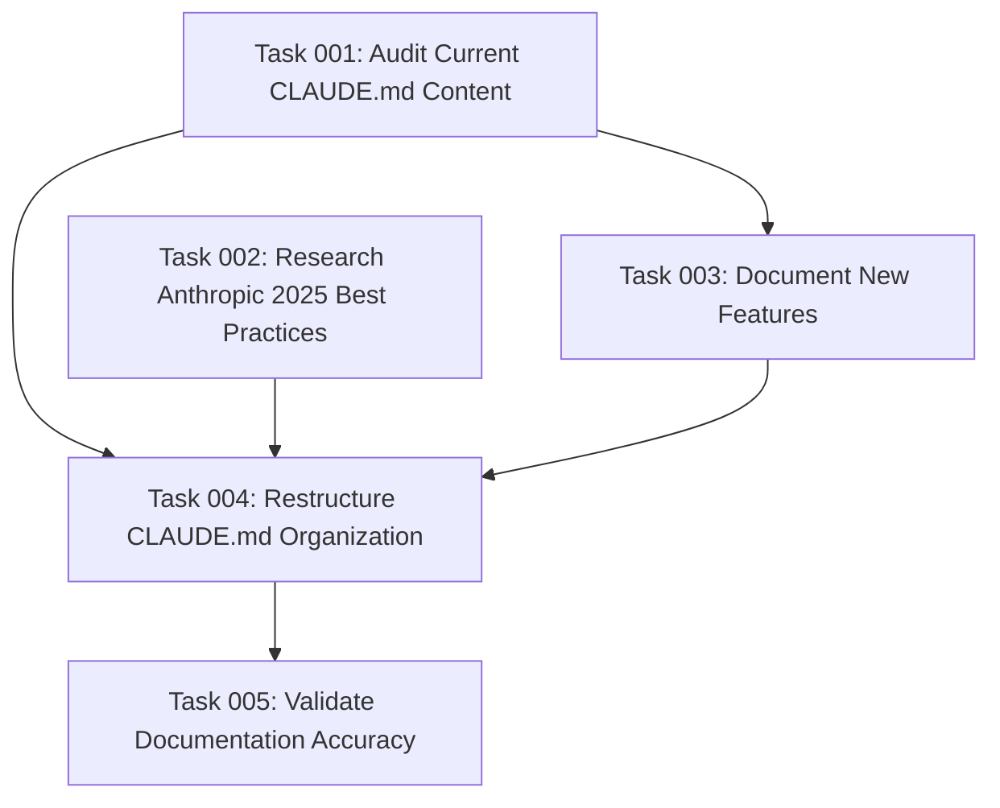

# Plan: Comprehensive CLAUDE.md Documentation Update and Optimization

## Original Work Order
> I want to review @CLAUDE.md to ensure it is up-to-date with the current state of the repository. Thoroughly update it and optimize it using the best practices you cans read in Anthropic's documentation.

## Executive Summary

This plan addresses the comprehensive modernization of the CLAUDE.md file to align with current repository state (v1.10.0), integrate Anthropic's 2025 best practices, and ensure accurate documentation of all features and workflows. The current CLAUDE.md contains outdated information, missing recent features, and lacks integration of modern Claude Code best practices from Anthropic's official guidance.

The updated documentation will serve as a more effective context source for Claude Code interactions, implementing structured sections that follow Anthropic's recommendations for CLAUDE.md files. This includes better organization of development commands, accurate testing statistics, documentation of new features like the fix-broken-tests command, and integration of advanced Claude Code features like extended thinking modes and MCP integration guidance.

## Context

### Current State
The existing CLAUDE.md file contains several accuracy issues and gaps:
- Missing documentation for the recently added `fix-broken-tests` command (v1.10.0)
- Outdated package version information and dependency references
- Incomplete coverage of enhanced ID generation scripts with improved error handling
- Lack of integration with Anthropic's 2025 best practices for Claude Code documentation
- Suboptimal organization that doesn't follow current documentation standards
- Missing guidance on advanced Claude Code features and workflow optimization

### Target State
A comprehensively updated CLAUDE.md that:
- Accurately reflects the current repository state and all available features
- Integrates Anthropic's 2025 best practices for Claude Code documentation
- Provides clear, actionable guidance for development workflows
- Follows modern documentation structure and organization principles
- Serves as an optimal context source for Claude Code interactions
- Includes proper examples and use cases for all documented features

### Background
Recent repository evolution includes significant enhancements: the addition of a fix-broken-tests command with integrity requirements, improvements to ID generation scripts for better reliability, enhanced archive system documentation, and release of version 1.10.0 with various bug fixes. Simultaneously, Anthropic released updated best practices for 2025 including recommendations for CLAUDE.md structure, extended thinking modes, MCP integration, and workflow optimization strategies.

## Technical Implementation Approach

### Documentation Content Audit and Update
**Objective**: Ensure all content accurately reflects the current repository state and remove outdated information

This involves systematically reviewing each section of CLAUDE.md against the current codebase, package.json, and available commands. Key areas include updating version references, command listings, dependency information, and script capabilities. The audit will identify gaps where new features aren't documented and areas where existing documentation contradicts current implementation.

### Anthropic 2025 Best Practices Integration
**Objective**: Restructure and enhance documentation following Anthropic's official Claude Code guidance

Implementation involves reorganizing sections to follow Anthropic's recommended CLAUDE.md structure, adding guidance for extended thinking modes ("think", "think hard", "think harder", "ultrathink"), integrating MCP-related documentation where applicable, and including workflow optimization recommendations. This also includes implementing precision and clarity improvements in command examples and usage patterns.

### New Feature Documentation
**Objective**: Comprehensively document recently added features and enhanced functionality

Focus on the fix-broken-tests command with its integrity requirements and testing philosophy, enhanced ID generation scripts with improved error handling and optimization features, archive system workflows and lifecycle management, and any other features introduced since the last major documentation update.

### Structure and Organization Optimization
**Objective**: Improve document organization for better Claude Code context utilization

This involves implementing hierarchical organization following information architecture principles, creating logical section groupings and flow, adding proper cross-references and navigation aids, and ensuring each section serves a clear purpose in the development workflow.

## Risk Considerations and Mitigation Strategies

### Technical Risks
- **Documentation Accuracy Drift**: Risk of introducing inaccuracies while updating complex technical details
    - **Mitigation**: Systematic verification against codebase, testing of all documented commands and examples

### Implementation Risks
- **Scope Creep**: Risk of over-engineering documentation beyond user requirements
    - **Mitigation**: Strict adherence to updating existing content and adding only explicitly needed sections

- **Backward Compatibility**: Risk of removing information that may still be relevant for legacy workflows
    - **Mitigation**: Careful analysis of each change to ensure no valuable context is lost

## Success Criteria

### Primary Success Criteria
1. All sections accurately reflect current repository state (v1.10.0)
2. Integration of Anthropic's 2025 best practices for Claude Code documentation
3. Complete documentation of all available commands and features
4. Improved structure and organization for better context utilization

### Quality Assurance Metrics
1. Verification that all documented commands and examples execute correctly
2. Consistency check between documentation and actual implementation
3. Validation of all version numbers, dependencies, and technical specifications

## Resource Requirements

### Development Skills
Technical writing and documentation architecture, understanding of Node.js/TypeScript project structure, familiarity with Claude Code workflows and best practices, knowledge of Anthropic's current documentation standards

### Technical Infrastructure
Access to current repository state, ability to test commands and scripts, reference access to Anthropic's official documentation and best practices

## Implementation Order

The implementation follows a systematic approach: content audit and accuracy updates first, followed by structure and organization improvements, then integration of new features and Anthropic best practices, and finally quality assurance and validation of all documented elements.

## Task Dependencies

## Execution Blueprint

**Validation Gates:**
- Reference: `/config/hooks/POST_PHASE.md`

### ✅ Phase 1: Foundation and Research
**Parallel Tasks:**
- ✔️ Task 001: Audit Current CLAUDE.md Content
- ✔️ Task 002: Research Anthropic 2025 Best Practices

### ✅ Phase 2: New Feature Documentation
**Parallel Tasks:**
- ✔️ Task 003: Document New Features (depends on: 001)

### ✅ Phase 3: Content Integration and Restructuring
**Parallel Tasks:**
- ✔️ Task 004: Restructure CLAUDE.md Organization (depends on: 001, 002, 003)

### ✅ Phase 4: Final Validation
**Parallel Tasks:**
- ✔️ Task 005: Validate Documentation Accuracy (depends on: 004)

### Execution Summary
- Total Phases: 4
- Total Tasks: 5
- Maximum Parallelism: 2 tasks (in Phase 1)
- Critical Path Length: 4 phases

## Execution Summary

**Status**: ✅ Completed Successfully
**Completed Date**: 2025-09-27

### Results
Successfully completed comprehensive update and optimization of CLAUDE.md using Anthropic's 2025 best practices. The documentation now accurately reflects the current repository state (v1.10.0) with enhanced structure, complete feature coverage, and optimized organization for Claude Code interactions. Key deliverables include:

- Comprehensive audit findings with accuracy corrections
- Integration of Anthropic's 2025 best practices research
- Complete documentation of new features (fix-broken-tests command, enhanced ID generation scripts, archive system)
- Fully restructured CLAUDE.md with improved navigation and Claude Code optimization
- Validated documentation with all commands and examples tested for accuracy

### Noteworthy Events
- **Minor Path Corrections**: Identified and fixed incorrect Open Code directory path (`.opencode/command/tasks/` vs documented `.opencode/commands/tasks/`) and template path references. These corrections ensure documentation accuracy.
- **Testing Statistics Update**: Successfully updated test statistics from outdated 37 tests to current 67 tests, improving documentation reliability.
- **Enhanced Feature Integration**: Successfully integrated comprehensive documentation for fix-broken-tests command with integrity requirements and testing philosophy.

### Recommendations
- Consider implementing regular documentation validation as part of CI/CD pipeline to catch accuracy drift early
- The updated CLAUDE.md now provides optimal context for Claude Code interactions and should serve as the primary reference for AI-assisted development workflows
- Future documentation updates should follow the established Anthropic 2025 best practices structure implemented in this update