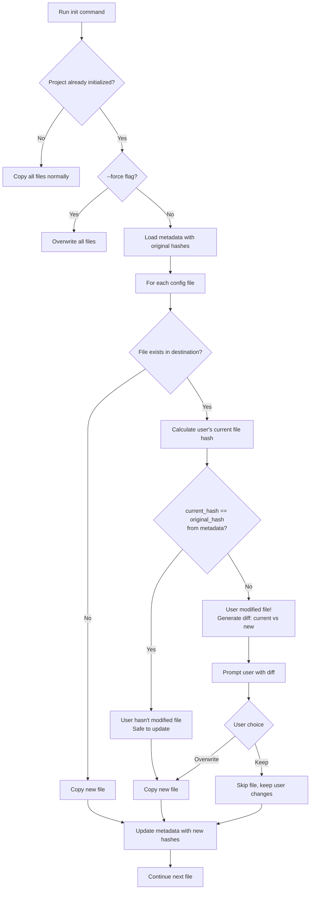
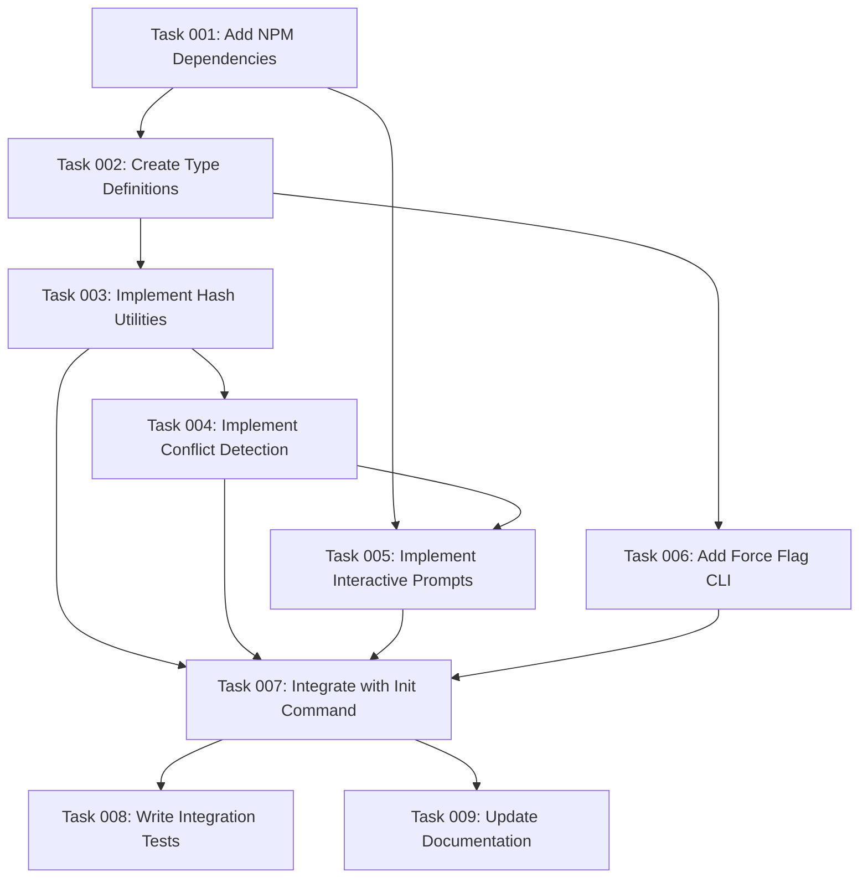

# Plan: File Conflict Detection for Init Command

## Original Work Order

> This project will copy some files from our repository to the project destination. These files can be overwritten by the user, in particular the files inside of the config folder, including the hooks, are meant for the user to override. When we use the init command, we override the files in the user's destination with our latest changes from this repository. This is problematic because the user may have meaningful changes that they may want to keep. Your task is to research online a way to detect these changes, maybe by hashing the state of the files that we last copied, along with the version of it, and doing some comparison with the new version, etc. But the point is that I want you to find a solid solution to this problem that I'm sure already exists online. As you know, this project already leverages the presence of node, but it doesn't require installation. Then we're using NBX for that. You can explore the possibility of using NPM packages for this CLI operation. This operation will happen only during installation time, during the init command, and it will detect possible user changes to avoid overwriting. When it detects an override, the init command should not override the file, but instead it should ask the user if they want to override it. The message should say something along the lines that there are changes in that particular file that would be lost. And then present a user with a div of their file versus the file that was originally downloaded, and that is about to be overwritten.

## Plan Clarifications

| Question | Answer |
|----------|--------|
| Which files need conflict detection? | All files in `.ai/task-manager/config/` directory |
| Default behavior when conflicts detected? | Prompt the user, unless `--force` flag is used |
| Diff presentation format? | Unified diff format (like git diff) |
| Version tracking granularity? | At the package level (all files from version X.Y.Z) |
| Automatic three-way merging? | No, just detect conflicts and let users decide |

## Executive Summary

This plan implements a hash-based file conflict detection system for the `init` command to prevent unintentional overwrites of user-modified configuration files. When users run the init command on an already-initialized project, the system will detect if config files in `.ai/task-manager/config/` have been modified since the last installation. If conflicts are detected, users will be prompted with a unified diff view showing their changes versus the new version, allowing them to choose whether to keep their modifications or accept the updates.

The solution leverages industry-standard approaches used by tools like Yeoman and npm packages, implementing hash-based change detection with a lightweight metadata file that tracks the package version and file hashes from the last init. This approach requires minimal dependencies and integrates seamlessly with the existing npx-based workflow.



## Context

### Current State

The init command currently overwrites all template files in the destination directory without checking for user modifications. Specifically:

- Files in `.ai/task-manager/config/` (including `TASK_MANAGER.md`, hooks, and templates) are meant for user customization
- Each `init` execution blindly copies files from the package's `templates/` directory using `fs.copy()`
- Users lose their customizations when re-running init (e.g., after upgrading the package version)
- There's no mechanism to detect or preserve user changes
- The current implementation in `src/index.ts:copyCommonTemplates()` uses direct file copying without any conflict resolution

### Target State

After implementation, the init command will:

- Detect when config files have been modified by users since the last init
- Store metadata about the package version and original file hashes from each init
- Compare current file hashes against the stored baseline to identify modifications
- Present users with a unified diff view (like `git diff`) showing their changes versus new version
- Allow users to make informed decisions about keeping or overwriting each modified file
- Support a `--force` flag to bypass prompts and overwrite all files
- Maintain full backward compatibility with first-time initialization

### Background

Research into established tools and npm packages revealed several proven approaches:

**Yeoman's Conflicter System**: Yeoman generators use a dedicated Conflicter module that detects file conflicts and prompts users, which has been battle-tested across thousands of generators. However, it's tightly coupled to Yeoman's ecosystem.

**Hash-based Detection**: The `file-changed` npm package demonstrates effective hash-based change detection using MD5/SHA algorithms. This approach is lightweight and doesn't require git integration.

**Three-way Merge Options**: Packages like `node-diff3` and `three-way-merge` support sophisticated merging, but the user explicitly requested just detection (not automatic merging).

**Interactive CLI Libraries**: `inquirer` is the industry standard for interactive prompts, while `diff` package provides unified diff generation similar to git.

The chosen approach balances simplicity with effectiveness, avoiding over-engineering while providing a robust solution.

## Technical Implementation Approach

### Hash-based Metadata Tracking

**Objective**: Store package version and file hashes to establish a baseline for detecting changes

A metadata file `.ai/task-manager/.init-metadata.json` will be created/updated during each init operation:

```json
{
  "version": "1.12.0",
  "timestamp": "2025-10-09T10:30:00.000Z",
  "files": {
    "config/TASK_MANAGER.md": "a3b2c1d4e5f6...",
    "config/hooks/POST_PHASE.md": "f6e5d4c3b2a1...",
    "config/templates/PLAN_TEMPLATE.md": "1a2b3c4d5e6f..."
  }
}
```

**Implementation details**:
- Use Node.js built-in `crypto` module for SHA-256 hashing (no external dependencies)
- Store relative paths from `.ai/task-manager/` as keys
- Track package version from `package.json` to enable version-specific conflict handling
- Metadata file is created after successful file copying, representing the "known good state"

### Conflict Detection Logic

**Objective**: Identify which config files have been modified by users since last init

**Three-way comparison entities**:
1. **Original file hash** (stored in `.init-metadata.json`) - The file as it was when we last copied it from the package
2. **User's current file** (calculated on-the-fly) - The file in its current state in their project
3. **New incoming file** (from package templates) - The file from the new/current package version

**Critical distinction**: The conflict detection compares `user's current file hash` against `original file hash` (from metadata). The new incoming file is NOT used for hash comparison - it's only used later for displaying the diff.

The detection flow:

1. Check if `.init-metadata.json` exists (indicates previous initialization)
2. If exists, load the stored hashes and version
3. For each file in `.ai/task-manager/config/`:
   - Calculate hash of user's current file in destination directory
   - Compare `current_file_hash` with `stored_original_hash` from metadata
   - If `current_file_hash != stored_original_hash` → **User has modified the file**
   - If file doesn't exist in metadata → new file in this version (safe to copy)

4. For files where user has modifications:
   - Generate diff between user's current file and new incoming file
   - Show diff to user and prompt for decision

**Key implementation notes**:
- Only files in `config/` directory are checked (as per clarification)
- Files in `config/scripts/` should be excluded (not user-editable)
- Handle edge cases: missing files, corrupted metadata, version mismatches
- The stored hash represents the baseline; current hash detects user changes; new file provides the update target

### Interactive Prompt with Unified Diff

**Objective**: Present users with clear conflict information and resolution options

When conflicts are detected:

**Dependencies to add**:
- `inquirer` (v9.x) - Interactive CLI prompts with TypeScript support
- `diff` (v5.x) - Generate unified diff output

**Prompt flow**:
```typescript
// For each conflicting file:
1. Generate unified diff between user's version and new version
2. Display diff with syntax highlighting (using chalk, already a dependency)
3. Show prompt:
   "The file 'config/TASK_MANAGER.md' has been modified.
    Your changes will be lost if you overwrite it.

    [Unified diff output here]

    ? What would you like to do? (Use arrow keys)
      > Keep my changes (skip update)
        Overwrite with new version
        Keep for all remaining conflicts
        Overwrite all remaining conflicts"
```

**Force flag behavior**:
- Add `--force` option to init command in `src/cli.ts`
- When `--force` is present, skip all prompts and overwrite files
- Update metadata as if normal overwrite occurred

### Integration with Existing Code

**Objective**: Modify the init command workflow to incorporate conflict detection

Changes required in `src/index.ts`:

1. **Before copying files**:
   - Check for existing `.init-metadata.json`
   - If exists and not `--force`, enter conflict detection mode

2. **During file copy**:
   - Replace `fs.copy()` with selective copying logic
   - For each config file, run conflict detection
   - Prompt user if conflicts found
   - Copy based on user decision

3. **After copying files**:
   - Generate new hashes for all copied files
   - Write updated `.init-metadata.json`

4. **Type definitions** (`src/types.ts`):
   - Add `InitMetadata` interface
   - Add `FileConflict` interface
   - Extend `InitOptions` with `force?: boolean`

**Backward compatibility**:
- First-time init (no metadata) works exactly as before
- Metadata file is ignored by git (add to `.gitignore` recommendation)
- If metadata is corrupted/invalid, treat as first-time init with warning

## Risk Considerations and Mitigation Strategies

### Technical Risks

- **Hash collision or corruption**: Extremely unlikely with SHA-256, but corrupted metadata could cause false positives
  - **Mitigation**: Validate metadata JSON schema on load; if invalid, treat as first-time init with user warning

- **Large files causing performance issues**: Config files are typically small, but hash calculation could slow down with many files
  - **Mitigation**: Stream-based hashing for files >1MB; parallel processing for multiple files

- **Diff generation errors**: Binary files or very large files might cause diff library issues
  - **Mitigation**: Detect binary files and skip diff display (just show "binary file changed"); graceful error handling with fallback to simple "changed/not changed" message

### Implementation Risks

- **Breaking existing workflows**: Users might have automation scripts that expect non-interactive init
  - **Mitigation**: Always allow `--force` flag for non-interactive mode; document this in migration guide

- **User confusion with diff format**: Not all users are familiar with unified diff format
  - **Mitigation**: Add helpful labels to diff output ("- Your version", "+ New version"); consider adding `--diff-format` option for future enhancement

- **Metadata file conflicts**: Multiple users on same project might have different metadata files
  - **Mitigation**: Document that metadata is local (not committed to git); each user has their own baseline

### Integration Risks

- **Dependency bloat**: Adding `inquirer` and `diff` packages increases bundle size
  - **Mitigation**: Both are small, well-maintained packages; `inquirer` v9 has minimal dependencies; total addition ~500KB

- **Version compatibility**: Package version updates might invalidate old metadata format
  - **Mitigation**: Include metadata format version in JSON; support migration/regeneration logic for future changes

## Success Criteria

### Primary Success Criteria

1. **Conflict Detection Accuracy**: System correctly identifies 100% of user-modified files by comparing hash differences
2. **User Choice Preservation**: When user chooses "keep my changes", their file remains unchanged and is excluded from updates
3. **Force Flag Behavior**: Using `--force` flag bypasses all prompts and overwrites all files as if first-time init
4. **Unified Diff Display**: Conflicts show accurate unified diff format matching git diff output standards

### Quality Assurance Metrics

1. **Test Coverage**: Integration tests covering all scenarios:
   - First-time init (no metadata)
   - Re-init with no user changes (hashes match)
   - Re-init with user changes (hashes differ)
   - Force flag behavior
   - Corrupted/missing metadata handling

2. **User Experience**: Diff output is readable and prompts are clear with no ambiguous choices

3. **Performance**: Hash calculation and diff generation complete in <2 seconds even for 50+ config files

## Resource Requirements

### Development Skills

- **TypeScript/Node.js**: Modify existing CLI code, add new modules
- **Cryptography basics**: Understanding hash algorithms and collision probability
- **CLI UX design**: Creating clear, intuitive prompts and diff presentations
- **Testing**: Integration tests for various conflict scenarios

### Technical Infrastructure

**New NPM dependencies**:
- `inquirer` (^9.2.0) - Interactive CLI prompts
- `diff` (^5.1.0) - Unified diff generation
- `@types/inquirer` (^9.0.0) - TypeScript definitions (devDependency)
- `@types/diff` (^5.0.0) - TypeScript definitions (devDependency)

**Node.js built-ins** (no installation needed):
- `crypto` - SHA-256 hash generation
- `fs/promises` - Async file operations

### External Dependencies

**Testing requirements**:
- Jest test cases for hash calculation
- Integration tests with mock file systems
- Test fixtures with sample config files at various versions

## Implementation Order

1. **Metadata infrastructure**: Create types and functions for reading/writing `.init-metadata.json`
2. **Hash calculation**: Implement file hashing utility using Node crypto module
3. **Conflict detection**: Build comparison logic between stored and current hashes
4. **Diff generation**: Integrate diff package to generate unified diff output
5. **Interactive prompts**: Implement inquirer-based user prompts with diff display
6. **Init command integration**: Modify existing init flow to incorporate conflict detection
7. **Force flag support**: Add `--force` CLI option and bypass logic
8. **Testing**: Comprehensive integration and unit tests
9. **Documentation**: Update README with conflict resolution behavior

## Notes

**Excluded from scope** (as per user requirements):
- Automatic three-way merging (user explicitly requested detection only)
- Assistant-specific template files (`.claude/`, `.gemini/`, `.opencode/`) - only `config/` directory
- Interactive merge resolution beyond keep/overwrite choice

**Future enhancements** (not in this plan):
- Support for custom merge strategies
- Backup file creation (`.bak` files)
- Conflict resolution history/logging
- Alternative diff formats (side-by-side, word-diff)

## Task Dependency Visualization



## Execution Blueprint

**Validation Gates:**
- Reference: `.ai/task-manager/config/hooks/POST_PHASE.md`

### ✅ Phase 1: Foundation
**Parallel Tasks:**
- ✔️ Task 001: Add NPM Dependencies (status: completed)

**Description**: Install required npm packages (inquirer, diff) and their TypeScript type definitions.

### ✅ Phase 2: Type System
**Parallel Tasks:**
- ✔️ Task 002: Create Type Definitions (depends on: 001) (status: completed)

**Description**: Define TypeScript interfaces for metadata, conflicts, and options.

### ✅ Phase 3: Core Infrastructure
**Parallel Tasks:**
- ✔️ Task 003: Implement Hash Utilities (depends on: 002) (status: completed)
- ✔️ Task 006: Add Force Flag CLI (depends on: 002) (status: completed)

**Description**: Build hash calculation and metadata management functions; add CLI flag support.

### ✅ Phase 4: Detection & UI
**Parallel Tasks:**
- ✔️ Task 004: Implement Conflict Detection (depends on: 003) (status: completed)
- ✔️ Task 005: Implement Interactive Prompts (depends on: 001, 004) (status: completed)

**Description**: Create conflict detection logic and user-facing interactive prompts with diff display.

### ✅ Phase 5: Integration
**Parallel Tasks:**
- ✔️ Task 007: Integrate with Init Command (depends on: 003, 004, 005, 006) (status: completed)

**Description**: Wire all components into the existing init command workflow.

### ✅ Phase 6: Quality Assurance
**Parallel Tasks:**
- ✔️ Task 008: Write Integration Tests (depends on: 007) (status: completed)
- ✔️ Task 009: Update Documentation (depends on: 007) (status: completed)

**Description**: Comprehensive testing and documentation updates.

### Post-phase Actions

After Phase 6 completion:
1. Run full test suite: `npm test`
2. Verify all tests pass (including new integration tests)
3. Build and test CLI manually:
   ```bash
   npm run build
   node dist/cli.js init --assistants claude --destination-directory /tmp/test
   ```
4. Test conflict detection workflow:
   - Run init twice with file modifications between runs
   - Verify diff display and prompt functionality
5. Test force flag: `--force` should bypass prompts
6. Review documentation for accuracy and completeness

### Execution Summary
- Total Phases: 6
- Total Tasks: 9
- Maximum Parallelism: 2 tasks (in Phase 3, Phase 4, Phase 6)
- Critical Path Length: 6 phases
- Critical Path: 001 → 002 → 003 → 004 → 007 → 008/009
