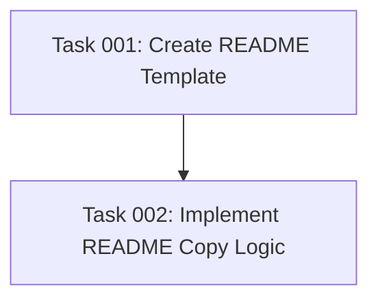

# Plan: Add README to AI Task Manager Directory

## Original Work Order

> I want to generate a README.md file that is copied to the user's `.ai/task-manager/README.md` The contents of the README.md should describe what the `.ai/task-manager` directory is for, that it is managed by the AI Task Manager project, and a link to the repository (https://www.github.com/e0ipso/ai-task-manager) and the documentation (https://mateuaguilo.com/ai-task-manager).

## Plan Clarifications

| Question | Answer |
|----------|--------|
| Where should the README.md template be authored and stored? | `templates/ai-task-manager/README.md` |
| Should the README.md be subject to conflict detection? | No, always overwrite - not user-configurable |
| Should the README contain project-specific customization? | No, very concise - just answering "What's this folder?" |
| Content scope? | Basic directory purpose and links only |
| Backwards compatible? | Yes, existing projects get it when re-running init |

## Executive Summary

This plan adds a concise informational README.md file to the `.ai/task-manager/` directory that explains the directory's purpose and provides links to project resources. The README will be created as a template file that gets copied during initialization, helping users understand what the directory is for without needing to consult external documentation.

The implementation follows the existing template system pattern, creating a simple markdown file that gets copied alongside other common templates. Since the README is purely informational and not user-configurable, it will always be overwritten during re-initialization, ensuring users always have the latest version.

## Context

### Current State

The `.ai/task-manager/` directory is created during initialization and contains:
- `plans/` - Active plans and their tasks
- `archive/` - Completed plans
- `config/` - Configuration files, hooks, and templates

Currently, there is no README explaining what this directory is for. Users discovering this directory in their project have to rely on external documentation or examine the files to understand its purpose.

### Target State

After implementation, the `.ai/task-manager/` directory will contain a README.md file that:
- Briefly explains the directory's purpose
- States it's managed by the AI Task Manager project
- Provides links to the GitHub repository and documentation
- Appears in both new and existing projects after running init

### Background

The init command uses a template copying system where templates are stored in `templates/ai-task-manager/` and copied to `.ai/task-manager/` during initialization. The system supports conflict detection for user-editable files, but this README will be excluded from that system since it's purely informational.

## Technical Implementation Approach

### Component 1: README Template Creation
**Objective**: Create a concise markdown template that answers "What's this folder?"

Create `templates/ai-task-manager/README.md` with:
- Brief description of directory purpose (AI-assisted task management)
- Statement that it's managed by AI Task Manager
- Link to GitHub repository: https://www.github.com/e0ipso/ai-task-manager
- Link to documentation: https://mateuaguilo.com/ai-task-manager

Keep content minimal and focused - 3-5 lines of text maximum.

### Component 2: Copy Logic Implementation
**Objective**: Ensure README is copied during initialization and always overwritten

Modify the `copyCommonTemplates()` function in `src/index.ts`:
- README.md should be copied along with other common templates
- Implement special handling to always overwrite README.md (bypass conflict detection)
- Ensure README appears in both new initializations and existing projects that re-run init

The implementation can leverage the existing `fs.copy()` operations after the conflict resolution logic, ensuring the README is always current.

## Risk Considerations and Mitigation Strategies

### Technical Risks
- **Risk: README might be included in conflict detection unintentionally**
  - **Mitigation**: Explicitly handle README.md separately from config files, or ensure it's copied after conflict resolution completes

### Implementation Risks
- **Risk: README content might become outdated if links change**
  - **Mitigation**: Keep content minimal and focused on stable URLs; use the existing template system which is already designed for updates
- **Risk: Always overwriting might conflict with metadata tracking**
  - **Mitigation**: Exclude README.md from metadata file tracking (similar to how scripts directory is excluded)

## Success Criteria

### Primary Success Criteria
1. README.md template exists at `templates/ai-task-manager/README.md` with concise content
2. README.md is copied to `.ai/task-manager/README.md` during initialization
3. README.md is always overwritten on re-initialization (not subject to conflict detection)
4. Existing projects receive README.md when they re-run init

### Quality Assurance Metrics
1. Existing tests continue to pass
2. README content is concise (3-5 lines maximum)
3. Both new and re-initialized projects contain the README
4. README is not included in `.init-metadata.json` tracking

## Resource Requirements

### Development Skills
- TypeScript/Node.js for init command modification
- Markdown for template authoring
- Understanding of fs-extra file operations

### Technical Infrastructure
- Existing fs-extra library for file operations
- Jest for testing
- Existing template system architecture

## Task Dependencies

## Execution Blueprint

**Validation Gates:**
- Reference: `.ai/task-manager/config/hooks/POST_PHASE.md`

### ✅ Phase 1: Template Creation
**Parallel Tasks:**
- ✔️ Task 001: Create README Template

### ✅ Phase 2: Integration
**Parallel Tasks:**
- ✔️ Task 002: Implement README Copy Logic (depends on: 001)

### Post-phase Actions
After Phase 2 completion:
1. Run `npm test` to verify existing tests pass
2. Test manual init: `npm run build && node dist/cli.js init --assistants claude --destination-directory /tmp/test-readme`
3. Verify README exists and contains correct content
4. Test re-initialization to confirm README is overwritten

### Execution Summary
- Total Phases: 2
- Total Tasks: 2
- Maximum Parallelism: 1 task per phase
- Critical Path Length: 2 phases
- Estimated Completion: Both tasks are straightforward with low complexity (scores 1.4 and 3.0)

## Execution Summary

**Status**: ✅ Completed Successfully
**Completed Date**: 2025-10-16

### Results
Successfully implemented README.md template generation and copying system for the `.ai/task-manager/` directory. The implementation consists of two components:

1. **README Template** (`templates/ai-task-manager/README.md`): Created concise 3-line informational file explaining the directory's purpose with links to project repository and documentation.

2. **Copy Logic** (`src/index.ts`): Modified metadata tracking to exclude README.md from conflict detection, ensuring it's always overwritten during init/re-init operations while preserving user customizations of other config files.

**Deliverables:**
- ✅ README.md template created (3 lines, well within 3-5 line constraint)
- ✅ Conflict detection bypass implemented (5-line code change)
- ✅ All 79 existing tests passing
- ✅ Linting validation passed
- ✅ Manual testing confirmed for new init, re-init, and metadata exclusion scenarios

### Noteworthy Events
No significant issues encountered. Implementation was straightforward with all tests passing on first attempt. Initial commit had a commitlint issue (body line >100 chars) which was quickly resolved by formatting the commit message properly.

The chosen implementation approach (excluding README from metadata tracking) proved to be simpler and more maintainable than alternative approaches like explicit post-conflict copy logic.

### Recommendations
1. **Future Enhancement**: Consider adding a similar informational README for the assistant-specific directories (`.claude/`, `.gemini/`, `.opencode/`)
2. **Documentation Update**: Update the project's AGENTS.md to mention the README.md exclusion pattern if documenting the conflict detection system
3. **Testing**: While existing integration tests cover the init flow, consider adding explicit test cases for README.md behavior in future test refactoring
