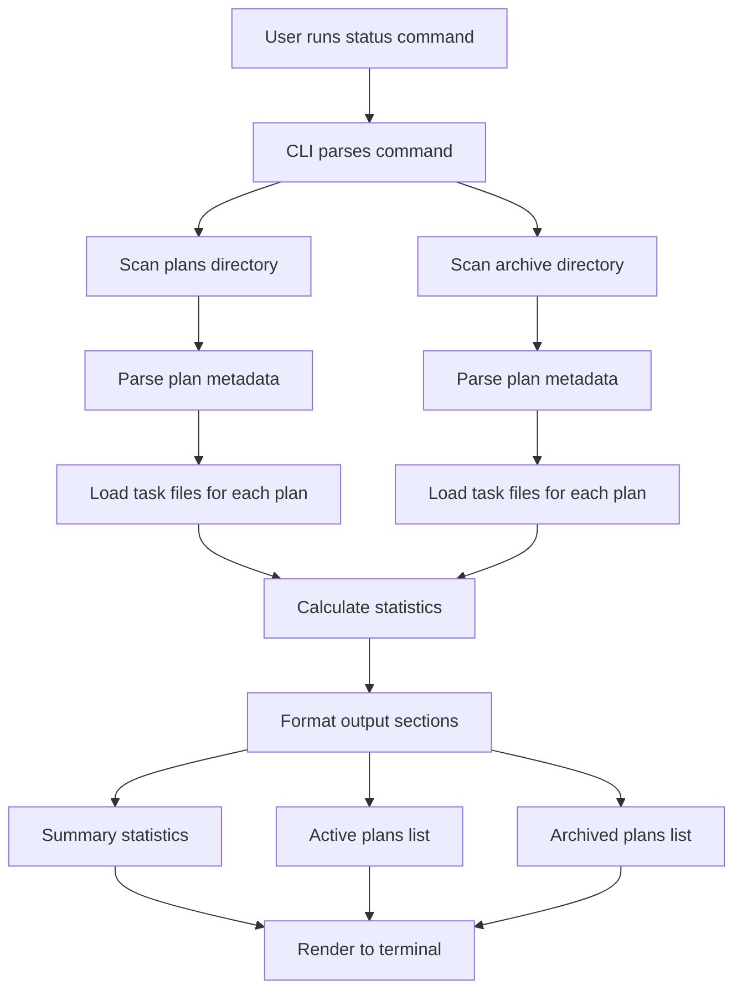
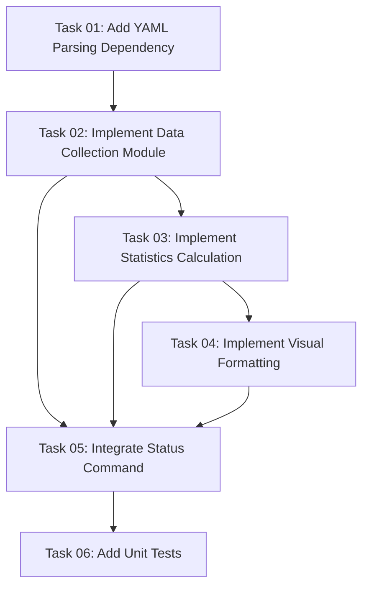

# Plan: Status Dashboard Command Implementation

## Original Work Order

> I want to create a CLI command to show a dashboard detailing the different implemented plans. This dashboard should be inspired in organization and visuals on https://github.com/Fission-AI/OpenSpec/blob/main/assets/openspec_dashboard.png?raw=true
>
> I want to list the archived plans, and the projected plans. For the projected plans: if they have the tasks already generated, if the tasks are partially implemented.
>
> Also include cool stats. Make it pretty.

## Plan Clarifications

| Question | Answer |
|----------|--------|
| Command structure and invocation | CLI command called `status` (not a slash command) |
| Output format | Terminal output with colors/formatting (not HTML) |
| Statistics to include | Total plans (active vs archived), task completion rate, plan status distribution, most recent plan, oldest plan |
| Plan status detection | Count tasks with `status: "completed"` vs total tasks |
| Visual style | Inspired by dashboard.png - sections with headers, dividers, colored bullets, progress bars |
| Interactivity | Static display (no interactive features) |

## Executive Summary

This plan implements a new `status` CLI command that provides a comprehensive dashboard view of the AI task management system's state. The dashboard displays statistics about active and archived plans, task completion progress, and implementation status in a visually appealing terminal format.

The implementation follows the visual style of the OpenSpec dashboard, using colored text, Unicode symbols, ASCII progress bars, and organized sections to present information clearly. This provides users with an at-a-glance view of their project's task management status without needing to manually inspect individual plan and task files.

The command integrates seamlessly with the existing CLI architecture, reading plan and task metadata from the filesystem and presenting aggregated statistics in a user-friendly format.

## Context

### Current State

The AI task manager CLI currently supports plan creation, task generation, and task execution through slash commands, but lacks a way to view overall project status. Users must manually navigate the `.ai/task-manager/plans/` and `.ai/task-manager/archive/` directories to understand:
- How many plans exist and their completion status
- Which plans have generated tasks
- Overall task completion progress
- Historical information about completed work

This lack of visibility makes it difficult to understand project status at a glance or track progress over time.

### Target State

After implementation, users will be able to run `npx @e0ipso/ai-task-manager status` to see:
- A formatted dashboard displaying summary statistics
- Lists of active plans with their completion status
- Lists of archived (completed) plans
- Visual progress indicators for partially completed plans
- Key metrics like total plans, task completion rates, and timeline information

The output will be visually appealing with colored text, progress bars, and organized sections, making it easy to quickly understand the project's task management state.

### Background

The existing codebase uses Commander.js for CLI argument parsing and has established patterns for:
- Reading YAML frontmatter from plan and task files
- Directory structure conventions (`.ai/task-manager/plans/`, `.ai/task-manager/archive/`)
- Colored logging using the chalk library
- File system operations using fs-extra

The dashboard design is inspired by the OpenSpec CLI dashboard, which demonstrates effective use of:
- Sectioned layouts with clear headers
- Colored bullets and symbols for visual organization
- ASCII progress bars for completion visualization
- Hierarchical information presentation

## Technical Implementation Approach

### CLI Command Integration

**Objective**: Add the `status` command to the existing Commander.js CLI structure

The implementation adds a new command handler in `src/cli.ts` following the existing pattern used by the `init` command. The command requires no arguments and reads from the standard `.ai/task-manager/` directory structure. Error handling follows established patterns with appropriate exit codes.

### Data Collection Module

**Objective**: Read and parse plan and task metadata from the filesystem

Create a new module `src/status.ts` that exports functions to:
- Scan `.ai/task-manager/plans/` and `.ai/task-manager/archive/` directories
- Parse YAML frontmatter from plan files to extract `id`, `summary`, and `created` fields
- Read task files within each plan's `tasks/` subdirectory
- Parse task frontmatter to extract `status` field
- Handle missing directories gracefully (e.g., no archive directory yet)
- Calculate derived statistics (completion percentage, status counts)

The module uses `fs-extra` for filesystem operations and existing utility functions where applicable. It returns structured data objects containing plan information and aggregated statistics.

### Statistics Calculation

**Objective**: Compute meaningful metrics from plan and task data

Implement calculation functions for:
- **Total Plans**: Count of active plans + archived plans
- **Active Plans**: Plans in `.ai/task-manager/plans/`
- **Archived Plans**: Plans in `.ai/task-manager/archive/`
- **Task Completion Rate**: Across all active plans, percentage of tasks with `status: "completed"`
- **Plan Status Distribution**: Categorize each plan as:
  - "No tasks generated" (no `tasks/` directory or empty)
  - "Not started" (all tasks have `status: "pending"`)
  - "In progress" (mixed statuses)
  - "Completed" (all tasks have `status: "completed"`)
- **Timeline Information**: Most recent and oldest plan based on `created` date from frontmatter

### Visual Formatting Module

**Objective**: Create visually appealing terminal output with colors and formatting

Develop formatting functions that use `chalk` to create:
- **Section Headers**: Cyan-colored bold text with horizontal dividers
- **Summary Bullets**: Colored dots (●) with statistics
  - Cyan for specifications/counts
  - Green for active items
  - Blue for completed items
  - Magenta for progress metrics
- **Progress Bars**: ASCII-based bars showing completion percentage
  - Format: `[████████░░░░░░░░░░] XX%`
  - Green for completed sections, gray for remaining
- **List Items**: Unicode checkmarks (✓) for completed items, dots (●) for active items
- **Dividers**: Horizontal lines to separate sections

The formatting module provides reusable functions that take data and return formatted strings ready for console output.

### Output Rendering

**Objective**: Assemble formatted sections into a cohesive dashboard display

The main `status()` function in `src/status.ts`:
1. Collects data using the data collection module
2. Calculates statistics
3. Formats each section using the formatting module:
   - **Dashboard Title**: "AI Task Manager Dashboard"
   - **Summary Section**: High-level statistics with colored bullets
   - **Active Plans Section**: Lists each active plan with progress bar
   - **Archived Plans Section**: Lists completed plans with checkmarks
4. Outputs the complete dashboard to the console
5. Returns success/failure status for CLI exit code handling

## Risk Considerations and Mitigation Strategies

### Technical Risks

- **Large Directory Structures**: Reading hundreds of plans/tasks could cause performance issues
  - **Mitigation**: Implement early returns and limit data parsing to necessary fields only. If needed, add pagination or filtering options in future iterations

- **YAML Parsing Failures**: Corrupted or malformed plan/task files could crash the command
  - **Mitigation**: Wrap parsing in try-catch blocks and skip files that fail to parse, logging warnings instead of crashing

- **Missing Directories**: Users who haven't created plans yet will have missing directories
  - **Mitigation**: Check for directory existence before reading and handle missing directories gracefully with appropriate messages

### Implementation Risks

- **Terminal Compatibility**: Unicode characters and colors may not render correctly on all terminals
  - **Mitigation**: Use widely-supported Unicode characters and rely on chalk's built-in terminal detection for color support

- **Output Width**: Long plan names or progress bars may wrap awkwardly on narrow terminals
  - **Mitigation**: Use string truncation for long names and design layouts that work with standard 80-character terminal widths

### Quality Risks

- **Inconsistent Formatting**: Manual string concatenation could lead to alignment issues
  - **Mitigation**: Create formatting utility functions with consistent spacing and alignment logic

- **Data Accuracy**: Incorrect statistics could mislead users about project status
  - **Mitigation**: Write unit tests for statistics calculation functions to ensure accuracy

## Success Criteria

### Primary Success Criteria

1. The `status` command executes successfully and displays a formatted dashboard
2. Dashboard shows accurate statistics for total plans (active and archived), task completion rates, and plan statuses
3. Visual formatting matches the style of the OpenSpec dashboard reference with colored sections, progress bars, and organized layout
4. Command handles edge cases gracefully (no plans, no archive, corrupted files)

### Quality Assurance Metrics

1. Statistics calculations are verified through unit tests
2. Command executes in under 2 seconds for typical project sizes (< 50 plans)
3. Output is readable on standard terminal widths (80+ characters)
4. Error handling prevents crashes and provides helpful messages

## Resource Requirements

### Development Skills

- TypeScript development
- Commander.js CLI framework
- Filesystem operations with Node.js
- YAML frontmatter parsing
- Terminal formatting with chalk
- Unit testing with Jest

### Technical Infrastructure

- Existing chalk dependency for colored output
- Existing fs-extra dependency for filesystem operations
- Existing YAML parsing capabilities (may need to add `js-yaml` library)
- Commander.js CLI framework (already in use)

### Additional Dependencies

May need to add:
- `js-yaml` or `gray-matter` library for reliable YAML frontmatter parsing (if not already included)

## Implementation Order

1. Create basic command structure in `src/cli.ts`
2. Implement data collection functions for reading plans and tasks
3. Implement statistics calculation functions
4. Develop visual formatting utilities
5. Integrate components into main `status()` function
6. Add error handling and edge case management
7. Write unit tests for statistics and formatting functions
8. Test command with various project states (empty, partial, full)

## Notes

- The command operates read-only on the filesystem and makes no modifications
- Future enhancements could include filtering options (e.g., `--active-only`, `--archived-only`) or different output formats
- Consider adding a `--json` flag in future iterations for machine-readable output
- The visual style should remain consistent with any existing CLI output patterns in the codebase

## Task Dependency Visualization

## Execution Blueprint

**Validation Gates:**
- Reference: `.ai/task-manager/config/hooks/POST_PHASE.md`

### Phase 1: Foundation Setup
**Parallel Tasks:**
- Task 01: Add YAML Parsing Dependency

### Phase 2: Core Data Infrastructure
**Parallel Tasks:**
- Task 02: Implement Data Collection Module (depends on: 01)

### Phase 3: Data Processing and Presentation
**Parallel Tasks:**
- Task 03: Implement Statistics Calculation (depends on: 02)
- Task 04: Implement Visual Formatting (depends on: 02)

### Phase 4: Integration
**Parallel Tasks:**
- Task 05: Integrate Status Command into CLI (depends on: 02, 03, 04)

### Phase 5: Quality Assurance
**Parallel Tasks:**
- Task 06: Add Unit Tests (depends on: 05)

### Post-phase Actions
After completing each phase, verify:
- All tasks in the phase have `status: "completed"`
- Code builds without errors (`npm run build`)
- Linting passes (`npm run lint`)
- Any implemented features function as expected

### Execution Summary
- Total Phases: 5
- Total Tasks: 6
- Maximum Parallelism: 2 tasks (in Phase 3)
- Critical Path Length: 5 phases
- Estimated Implementation Time: 1-2 days

**Implementation Strategy:**
- Phase 1-2: Sequential foundation (dependency + data collection)
- Phase 3: Parallel implementation of statistics and formatting (independent concerns)
- Phase 4: Integration of all components
- Phase 5: Testing and validation
