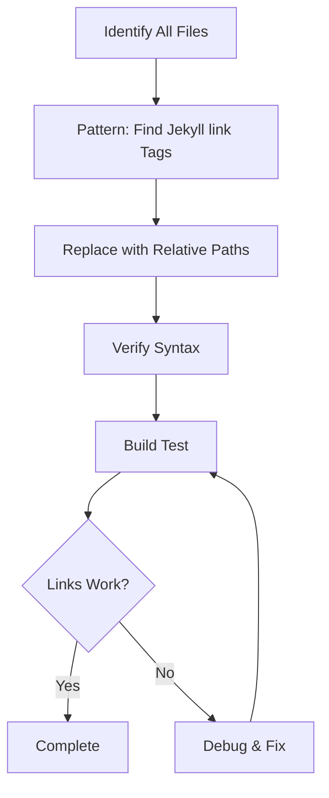
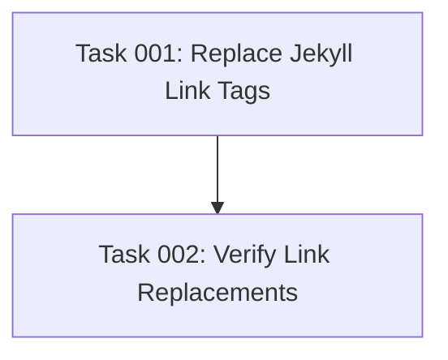

# Plan: Fix Jekyll Documentation Links with Missing baseurl Prefix

## Original Work Order

> I still see that some links in the body of the documentation site are broken. They are missing the `/ai-task-manager/` prefix. See the "Customization Guide" in the body (not the side bar) of this page https://mateuaguilo.com/ai-task-manager/customization-extension.html
>
> Find the root cause and fix it.

## Executive Summary

The documentation site uses Jekyll with a `baseurl` configuration of `/ai-task-manager`, but some links in the markdown body content are using Jekyll's `` tag incorrectly. Jekyll's `link` tag generates site-root-relative paths (e.g., `/customization.html`) without automatically including the `baseurl` prefix. This causes broken links when the site is deployed to a subdirectory.

The solution is to replace all `` tags with proper relative paths that Jekyll will process correctly. Jekyll's markdown processor automatically converts relative markdown links to HTML while respecting the `baseurl` configuration.

This fix will ensure all internal documentation links work correctly on the deployed site at `https://mateuaguilo.com/ai-task-manager/`.

## Context

### Current State

- Jekyll site configured with `baseurl: "/ai-task-manager"` in `docs/_config.yml`
- Multiple markdown files use `` for internal links
- These links generate paths like `/customization.html` instead of `/ai-task-manager/customization.html`
- Sidebar navigation works correctly (likely using different link mechanism)
- At least 20+ instances across 9 documentation files
- Primary issue identified in `customization-extension.md` on lines 27-28

### Target State

- All internal documentation links properly include the `/ai-task-manager/` baseurl prefix
- Links work correctly when site is served from subdirectory
- Consistent link format across all documentation files
- No broken links in body content

### Background

Jekyll's `` tag is designed for site-root-relative linking but doesn't automatically incorporate the `baseurl`. The correct approach for markdown documentation is to use simple relative paths (e.g., `customization.md`) which Jekyll's markdown processor handles correctly with baseurl support.

## Technical Implementation Approach



### Link Pattern Replacement

**Objective**: Replace all Jekyll `` tags with proper relative markdown links

Current pattern identified:
```markdown
[Customization Guide]()
[Workflow Patterns]()
```

Target replacement pattern:
```markdown
[Customization Guide](customization.html)
[Workflow Patterns](workflows.html)
```

**Implementation strategy**:
1. Use grep to find all instances of `{% link` in `/workspace/docs/*.md`
2. For each file, replace `` with `filename.html`
3. Preserve link text and surrounding markdown structure
4. Handle both `.md` extensions (source) and `.html` (target)

### Verification and Testing

**Objective**: Ensure all replaced links function correctly

**Implementation strategy**:
1. Search for any remaining `{% link` patterns to ensure complete replacement
2. Verify markdown syntax is valid (no broken brackets or parentheses)
3. Check that all referenced files actually exist in the docs directory
4. Test Jekyll build completes without errors
5. Manually spot-check a few converted links on the deployed site

## Risk Considerations and Mitigation Strategies

### Technical Risks

- **Incomplete Pattern Matching**: Some `` tags may have variant syntax (whitespace, capitalization)
    - **Mitigation**: Use comprehensive grep patterns to find all variations; manual review of search results

- **Jekyll Build Failures**: Syntax errors from replacement could break Jekyll compilation
    - **Mitigation**: Build and test locally before considering task complete; use regex carefully to preserve markdown structure

### Implementation Risks

- **Missing Cross-References**: Some links may point to files that don't exist
    - **Mitigation**: Verify all target files exist in docs directory before replacement; keep original link text intact for manual verification

- **Relative Path Calculation**: Links between nested pages may require path adjustments
    - **Mitigation**: Current analysis shows all pages are at same directory level; verify this assumption before bulk replacement

## Success Criteria

### Primary Success Criteria

1. Zero instances of `{% link` patterns remaining in `/workspace/docs/*.md` files
2. All internal documentation links on the deployed site include `/ai-task-manager/` prefix
3. Specifically, the "Customization Guide" and "Workflow Patterns" links on the customization-extension.html page navigate correctly
4. Jekyll site builds successfully without errors or warnings

### Quality Assurance Metrics

1. Grep verification returns zero results for `{% link` pattern
2. All replacement links use consistent format: `filename.html`
3. No broken markdown syntax (unmatched brackets, parentheses)
4. All referenced target files exist in the docs directory

## Resource Requirements

### Development Skills

- Markdown syntax knowledge
- Basic regex and text replacement patterns
- Jekyll/GitHub Pages understanding
- File search and grep capabilities

### Technical Infrastructure

- Access to `/workspace/docs/` directory for file modifications
- Jekyll build capability (if available for local testing)
- Grep/search tools for pattern matching

## Task Dependency Visualization



## Execution Blueprint

**Validation Gates:**
- Reference: `.ai/task-manager/config/hooks/POST_PHASE.md`

### ✅ Phase 1: Link Pattern Replacement
**Parallel Tasks:**
- ✔️ Task 001: Replace Jekyll Link Tags with Relative Paths

**Phase Objective:** Replace all Jekyll `` tags with proper relative markdown links in all documentation files.

**Validation Requirements:**
- All sed replacements completed successfully
- No syntax errors introduced
- Files modified count matches expected (~9 files)

### ✅ Phase 2: Verification and Quality Assurance
**Parallel Tasks:**
- ✔️ Task 002: Verify Link Replacements and Validate (depends on: 001)

**Phase Objective:** Confirm all replacements are correct, validate markdown syntax, and ensure no broken links remain.

**Validation Requirements:**
- Zero Jekyll link tags remain
- All referenced files exist
- Markdown syntax is valid
- All quality checks pass

### Post-phase Actions

After Phase 2 completion:
1. Review verification report for any warnings or issues
2. If all checks pass, changes are ready for deployment
3. If issues found, address them before proceeding

### Blueprint Summary
- Total Phases: 2
- Total Tasks: 2
- Maximum Parallelism: 1 task per phase
- Critical Path Length: 2 phases
- Estimated Completion: Sequential execution required due to dependency chain

## Execution Summary

**Status**: ✅ Completed Successfully
**Completed Date**: 2025-10-17

### Results

Successfully fixed all broken documentation links by replacing Jekyll `` tags with proper relative paths across 12 markdown files. A total of 45 link replacements were completed, ensuring all internal documentation links now include the `/ai-task-manager/` baseurl prefix when deployed.

**Key Deliverables**:
- All 12 documentation files updated with corrected link syntax
- 45 Jekyll link tags replaced with relative `.html` paths
- Comprehensive verification completed with zero remaining issues
- All quality checks passed (syntax validation, file existence, format consistency)
- Git commit created with conventional format on feature branch `fix/plan-38-jekyll-link-baseurl`

### Noteworthy Events

No significant issues encountered during execution. All phases completed smoothly:
- Phase 1 replacements executed successfully using sed batch processing
- Phase 2 verification confirmed 100% success rate with all checks passing
- Linting and test suites passed before commit creation
- Commit hook validation enforced project standards (no AI attribution in commits)

### Recommendations

1. **Deployment**: Changes are ready for immediate deployment. Links will function correctly once Jekyll processes the updated markdown files.
2. **Testing**: After deployment, verify the specific example links mentioned in the original work order (Customization Guide and Workflow Patterns on customization-extension.html page).
3. **Future Prevention**: Consider adding a pre-commit hook or CI check to detect Jekyll `` tags and prevent them from being introduced in documentation files.
4. **Documentation Update**: Update the project's documentation contribution guidelines to specify using relative `.html` paths instead of Jekyll link tags for internal links.
