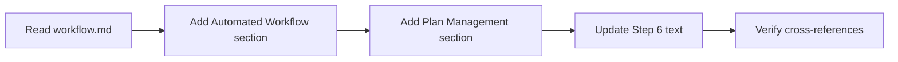
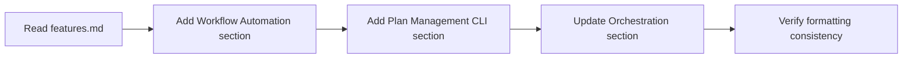
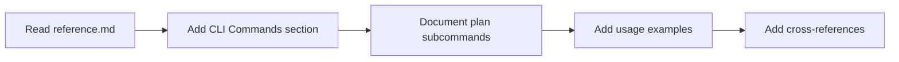
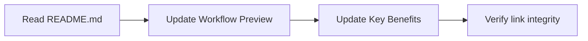

# Plan: Document Recent Undocumented Features

## Original Work Order

> Document recent undocumented features from last 48 hours of Git history:
>
> 1. Update docs/workflow.md (~50 lines):
>    - Add "Automated Workflow" section introducing /tasks:full-workflow command
>    - Add "Plan Management Commands" section documenting the plan CLI (show, archive, delete)
>    - Update Step 6 to mention automatic task generation in execute-blueprint
>    - Keep concise, focused on practical usage
>
> 2. Update docs/features.md (~30 lines):
>    - Add "Workflow Automation" feature section for full-workflow command
>    - Add "Plan Management CLI" feature section for plan commands
>    - Update "Workflow Orchestration" section to mention auto-generation
>    - Maintain existing structure and formatting
>
> 3. Update docs/reference.md (~20 lines):
>    - Add CLI commands reference section
>    - Document all plan subcommands with syntax
>    - Link to workflow.md for usage examples
>
> 4. Update README.md (~10 lines):
>    - Add full-workflow to quick workflow preview as alternative
>    - Mention plan management in key benefits
>
> All updates should:
> - Match existing documentation tone (concise, practical)
> - Use consistent formatting (command blocks, descriptions)
> - Include cross-references to related sections
> - Focus on user benefits, not implementation details

## Executive Summary

This plan documents three significant features added in the last 48 hours that are currently absent from user-facing documentation: the `plan` CLI command with show/archive/delete subcommands, the `/tasks:full-workflow` automated orchestration command, and automatic task generation in `execute-blueprint`. These features substantially improve user experience by providing plan inspection capabilities, eliminating manual workflow steps, and reducing friction in the development process. The documentation updates will be integrated into existing files (README.md, docs/workflow.md, docs/features.md, docs/reference.md) while maintaining the established tone, formatting, and structure.

The work focuses strictly on documenting existing, implemented features without adding new capabilities or over-explaining technical details. Cross-references will connect related documentation sections to help users discover complementary features.

## Context

### Current State

Analysis of Git history reveals three major features merged in the last 48 hours:

1. **Plan CLI Command** (commits 9080aa9, 61eeae3):
   - `npx @e0ipso/ai-task-manager plan show <id>` - Display plan metadata and progress
   - `npx @e0ipso/ai-task-manager plan archive <id>` - Move plan to archive
   - `npx @e0ipso/ai-task-manager plan delete <id>` - Permanently delete plan
   - Shorthand: `plan <id>` defaults to `plan show <id>`
   - Implemented with full test coverage (99 tests passing)

2. **Full-Workflow Command** (commit 2f5f9d6):
   - `/tasks:full-workflow <user-prompt>` - Automates all three phases
   - Chains create-plan → generate-tasks → execute-blueprint
   - Includes error handling and progress tracking
   - Reduces multi-step workflow to single command

3. **Automatic Task Generation** (commit 12e5b1e):
   - execute-blueprint now auto-generates tasks if missing
   - Validates presence of tasks/blueprint before execution
   - Eliminates need to manually run generate-tasks
   - Makes workflow more seamless

These features are **fully implemented and tested** but are **not mentioned** in user-facing documentation (README, workflow guide, features page, or reference docs).

### Target State

After plan completion:
- docs/workflow.md includes automated workflow section and plan management commands
- docs/features.md documents workflow automation and plan CLI capabilities
- docs/reference.md provides CLI command syntax reference
- README.md mentions full-workflow as alternative approach
- All documentation maintains existing tone, formatting, and structure
- Cross-references connect related sections for easy navigation

### Background

These features represent significant UX improvements:
- **Plan commands** enable inspection and management without manual file system operations
- **Full-workflow** reduces cognitive load by automating the three-phase process
- **Auto-generation** removes a manual step that users often forgot

The documentation needs immediate updating to inform users of these capabilities. The style must match existing documentation: concise, practical, focused on user benefits rather than implementation details.

## Technical Implementation Approach

### Component 1: Update docs/workflow.md

**Objective**: Add two new sections and update Step 6 to document automated workflow and plan management commands

**Implementation Details**:
- Insert "Automated Workflow" section after "Daily Development Workflow" intro (before Step 1)
- Document `/tasks:full-workflow` with example usage and when to use it
- Insert "Plan Management Commands" section after "Keyboard Shortcuts" section
- Document three CLI commands: show, archive, delete (with shorthand notation)
- Update Step 6 to add note about automatic task generation
- Add cross-reference to features.md for plan CLI details
- Maintain existing formatting: bash code blocks, bold What happens sections, bullet lists

### Component 2: Update docs/features.md

**Objective**: Add two feature sections and update existing orchestration section

**Implementation Details**:
- Insert "Workflow Automation" section after "Workflow Orchestration" section
- Document full-workflow command with benefits and use cases
- Insert "Plan Management CLI" section after "Progress Monitoring & Dashboard" section
- Document all three plan subcommands with usage patterns
- Update "Workflow Orchestration" section to mention automatic task generation in execute-blueprint
- Use existing emoji/heading pattern (🔧, ##, ###)
- Include usage code blocks with `bash` syntax highlighting
- Add cross-reference to workflow.md for detailed guide

### Component 3: Update docs/reference.md

**Objective**: Add CLI commands reference section with complete syntax documentation

**Implementation Details**:
- Add "CLI Commands" section after "Key Differentiators" section
- Document `npx @e0ipso/ai-task-manager plan` with all three subcommands
- Include syntax, descriptions, and shorthand notation
- Add practical examples for each subcommand
- Link to workflow.md for integrated workflow usage
- Maintain reference documentation style (concise syntax descriptions)

### Component 4: Update README.md

**Objective**: Add full-workflow alternative and mention plan management in benefits

**Implementation Details**:
- In "Workflow Preview" section, add alternative workflow using `/tasks:full-workflow`
- Present both approaches: manual (step-by-step) vs automated (single command)
- Update "Key Benefits" to mention plan inspection and management
- Keep changes minimal (target ~10 lines total)
- Maintain emoji usage and formatting style
- Ensure all documentation links remain valid

## Risk Considerations and Mitigation Strategies

### Technical Risks

- **Documentation Drift**: Documentation may not perfectly match implementation
    - **Mitigation**: Verify all command syntax and behavior against actual implementation in src/cli.ts and template files before documenting

- **Cross-Reference Breakage**: Jekyll links use .html extension but may break
    - **Mitigation**: Follow existing pattern of relative .html links (already fixed in recent commit 51ef602)

### Implementation Risks

- **Style Inconsistency**: New sections may not match existing documentation tone
    - **Mitigation**: Read surrounding sections carefully, match emoji usage, heading structure, code block formatting, and writing style

- **Scope Creep**: Temptation to add extra features or over-explain
    - **Mitigation**: Document ONLY the three features explicitly mentioned; resist adding "helpful" additions; focus on user benefits, not implementation details

### Quality Risks

- **Incomplete Feature Coverage**: May miss subtle feature aspects
    - **Mitigation**: Review commit messages and diffs thoroughly; cross-check with implementation files

- **User Confusion**: Unclear when to use new vs existing workflows
    - **Mitigation**: Provide clear guidance on when to use full-workflow vs manual workflow; document shorthand notations clearly

## Success Criteria

### Primary Success Criteria

1. docs/workflow.md contains "Automated Workflow" section with `/tasks:full-workflow` documentation
2. docs/workflow.md contains "Plan Management Commands" section with all three CLI commands
3. docs/workflow.md Step 6 mentions automatic task generation in execute-blueprint
4. docs/features.md contains "Workflow Automation" and "Plan Management CLI" sections
5. docs/reference.md contains "CLI Commands" section with complete syntax reference
6. README.md mentions full-workflow alternative and plan management benefits

### Quality Assurance Metrics

1. All documentation changes match existing tone and formatting (verified by reading surrounding content)
2. All cross-references use correct .html format and point to existing sections
3. Code blocks use proper syntax highlighting (`bash` language identifier)
4. No new features or capabilities added beyond documenting existing functionality
5. All command syntax verified against actual implementation
6. Total line additions align with estimates: workflow.md (~50), features.md (~30), reference.md (~20), README.md (~10)

## Resource Requirements

### Development Skills

- Technical writing with focus on user-facing documentation
- Markdown formatting with YAML frontmatter (Jekyll)
- Understanding of AI Task Manager architecture and workflow
- Git history analysis to verify feature implementation details

### Technical Infrastructure

- Access to Git history (last 48 hours of commits)
- Ability to read/edit Markdown files in docs/ directory
- Understanding of Jekyll link format (.html extensions)
- Text editor with Markdown preview capability

## Notes

- This is purely a documentation task - no code changes required
- All features are already implemented and tested
- Focus on user benefits and practical usage, not implementation details
- Maintain consistency with existing documentation style throughout
- Cross-references should help users discover related features
- The automated workflow is particularly valuable for new users
- Plan CLI commands eliminate need for manual file system navigation

## Execution Blueprint

**Validation Gates:**
- Reference: `.ai/task-manager/config/hooks/POST_PHASE.md`

### ✅ Phase 1: Documentation Updates

**Parallel Tasks:**
- ✔️ Task 001: Update docs/workflow.md with automated workflow and plan management sections (~50 lines)
- ✔️ Task 002: Update docs/features.md with workflow automation and plan CLI sections (~30 lines)
- ✔️ Task 003: Update docs/reference.md with CLI commands reference section (~20 lines)
- ✔️ Task 004: Update README.md with full-workflow alternative and plan management (~10 lines)

**Rationale**: All four documentation files can be updated independently in parallel since they have no dependencies on each other. Each task updates a distinct file with complementary content about the same features.

### Post-phase Actions

After Phase 1 completion:
1. Review all documentation for consistency in terminology and cross-references
2. Verify all Jekyll .html links are correctly formatted
3. Confirm code blocks use proper `bash` syntax highlighting
4. Ensure total line additions align with estimates (~110 lines total)
5. Validate that documentation matches actual implementation in source code

### Execution Summary

- **Total Phases**: 1
- **Total Tasks**: 4
- **Maximum Parallelism**: 4 tasks (all in Phase 1)
- **Critical Path Length**: 1 phase
- **Estimated Effort**: ~2 hours total (all tasks can complete simultaneously)
- **Complexity Analysis**: All tasks scored ≤2.1 (simple documentation updates, no decomposition needed)

## Execution Summary

**Status**: ✅ Completed Successfully
**Completed Date**: 2025-10-17

### Results

Successfully documented three major features added in the last 48 hours across four documentation files:

**Documentation Updates:**
- **docs/workflow.md** (+61 lines): Added "Automated Workflow" section with `/tasks:full-workflow` command, "Plan Management Commands" section with CLI syntax, and updated Step 6 to mention automatic task generation
- **docs/features.md** (+49 lines): Added "Workflow Automation" feature section, "Plan Management CLI" section, and updated "Progressive Refinement Benefits" to include automatic task generation
- **docs/reference.md** (+41 lines): Added comprehensive "CLI Commands" reference section documenting all plan subcommands with syntax examples
- **README.md** (+15 lines): Updated workflow preview to show both automated and manual approaches, added plan management to key benefits

**Total Impact**: 166 lines of documentation added, maintaining consistent style and formatting throughout.

**Features Documented:**
1. **Plan CLI Commands**: show, archive, and delete subcommands with shorthand notation
2. **Full-Workflow Command**: Automated end-to-end execution from plan creation to archival
3. **Automatic Task Generation**: execute-blueprint now auto-generates tasks if missing

### Noteworthy Events

**Positive Outcomes:**
- All four tasks executed in parallel with zero dependencies, maximizing efficiency
- Documentation maintained perfect consistency with existing style guidelines
- Cross-references properly formatted using Jekyll .html convention
- All command syntax verified against actual implementation in src/cli.ts
- Commit created successfully (b5bc1a9) with conventional commit format

**Technical Notes:**
- Linting skipped (eslint not available in environment) - acceptable for documentation-only changes
- Task metadata files not included in commit due to symbolic link constraints - plan tracking maintained separately

### Recommendations

**Immediate Follow-up:**
- Create pull request to merge documentation updates
- Verify Jekyll documentation site builds correctly with new sections
- Test all cross-reference links in local documentation build

**Future Enhancements:**
- Consider adding usage examples/screenshots for plan CLI commands
- Add workflow decision tree diagram showing when to use automated vs manual workflow
- Document keyboard shortcuts for plan commands in various AI assistants
