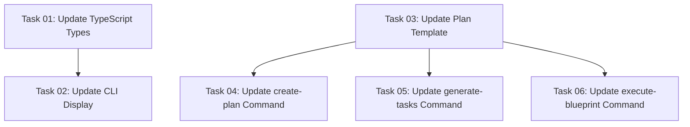

# Plan: Fix Full-Workflow Stopping with Plan Metadata

## Original Work Order

> Fix Full-Workflow Stopping Issue Using Plan Metadata
>
> Problem
>
> The FULL_WORKFLOW_MODE environment variable doesn't persist across subprocess/SlashCommand invocations, causing the workflow to stop and wait for user approval after plan generation and task generation.
>
> Solution
>
> Add approval_method field to plan frontmatter metadata. This provides a persistent, inspectable record that survives all subprocess invocations.

## Executive Summary

The full-workflow command currently uses an environment variable (`FULL_WORKFLOW_MODE`) to signal automated workflow mode, preventing interruptions for user approval. However, this approach fails when commands are invoked through the SlashCommand tool, as environment variables don't persist across subprocess boundaries. This causes the workflow to stop unexpectedly after plan creation and task generation, requiring manual user intervention.

The solution replaces the environment variable approach with a persistent `approval_method` metadata field in the plan's YAML frontmatter. This field will be set to `"auto"` by the full-workflow command and `"manual"` by standalone commands. Subordinate commands (`generate-tasks` and `execute-blueprint`) will read this metadata directly from the plan document using bash commands, eliminating dependency on environment variable inheritance.

This approach provides several benefits: reliability across all subprocess invocations, permanent auditability of workflow mode, backward compatibility with existing plans, and the ability to introspect any plan's approval method through the CLI `plan show` command.

## Context

### Current State

The task management system implements a three-phase workflow:
1. **/tasks:create-plan** - Creates comprehensive implementation plans
2. **/tasks:generate-tasks** - Decomposes plans into atomic tasks
3. **/tasks:execute-blueprint** - Executes all tasks in dependency order

The **/tasks:full-workflow** command orchestrates these three phases automatically. To prevent interruptions, it sets `FULL_WORKFLOW_MODE=true` before invoking each phase. Each subordinate command checks this variable to determine output behavior:
- If true: Minimal output, no "review prompts", immediate continuation
- If false/unset: Detailed output with file paths, waits for user review

**Problem**: When using the SlashCommand tool to invoke subordinate commands, the environment variable doesn't propagate to the subprocess, causing the workflow to halt unexpectedly.

### Target State

After implementation:
1. Plan documents will contain an optional `approval_method` field in their frontmatter
2. The create-plan command will set this field based on execution context
3. The generate-tasks and execute-blueprint commands will read this metadata directly from the plan file
4. The CLI `plan show` command will display this metadata
5. The full-workflow will execute without interruption
6. Older plans without this field will display "unset" and be treated as manual approval

### Background

This issue has been attempted multiple times using environment variables (commits 6653a40, 33ac8f8, 62911c0). The environment variable approach is fundamentally incompatible with the SlashCommand tool's subprocess model. Moving to persistent metadata stored in the plan document itself solves this architectural limitation.

## Technical Implementation Approach

### Component 1: TypeScript Type System Updates

**Objective**: Extend type definitions to support the new approval_method metadata field across all plan-related interfaces.

**Changes Required**:
- **src/status.ts**: Add `approval_method?: string` to `PlanMetadata` interface (line ~22-30)
- **src/status.ts**: Update `parsePlanFile()` to extract `approval_method` from parsed frontmatter data (line ~68-75)
- **src/plan-utils.ts**: Update `loadPlanData()` to include `approval_method` in returned object (line ~101-110)

These changes ensure the TypeScript layer properly handles the new metadata field throughout the codebase.

### Component 2: CLI Display Enhancement

**Objective**: Update the `plan show` command to display the approval method metadata with appropriate formatting for set/unset states.

**Changes Required**:
- **src/plan.ts**: Add display line in `showPlan()` function's Metadata section (after line ~106)
- Display logic:
  - `approval_method === 'auto'` → show "auto"
  - `approval_method === 'manual'` → show "manual"
  - `approval_method === undefined` → show "unset"
- Format: `${chalk.cyan('●')} Approval: ${value}`

### Component 3: Template System Updates

**Objective**: Update plan and command templates to write and read the approval_method metadata.

**Plan Template** (templates/ai-task-manager/config/templates/PLAN_TEMPLATE.md):
- Add `approval_method` as optional field in frontmatter example
- Add comment explaining valid values: "auto" or "manual"

**create-plan Command** (templates/assistant/commands/tasks/create-plan.md):
- Keep existing `FULL_WORKFLOW_MODE` environment check for backward compatibility
- When writing plan frontmatter, set:
  - `approval_method: auto` if `FULL_WORKFLOW_MODE=true`
  - `approval_method: manual` otherwise
- Update JSON schema to include `approval_method` as optional string field

**generate-tasks Command** (templates/assistant/commands/tasks/generate-tasks.md, line ~300-305):
- Replace `echo "${FULL_WORKFLOW_MODE:-false}"` with bash extraction pattern
- Extract `approval_method` from plan frontmatter
- Use extracted value for conditional output logic

**execute-blueprint Command** (templates/assistant/commands/tasks/execute-blueprint.md, line ~143-149):
- Replace `echo "${FULL_WORKFLOW_MODE:-false}"` with bash extraction pattern
- Same extraction and conditional logic as generate-tasks

### Component 4: Bash Metadata Extraction Pattern

**Objective**: Provide reliable bash commands to extract approval_method from plan frontmatter.

**Pattern**:
```bash
# Find plan file by ID
PLAN_FILE=$(find .ai/task-manager/{plans,archive} -name "plan-$1--*.md" -type f -exec grep -l "^id: \?$1$" {} \;)

# Extract approval_method from YAML frontmatter
APPROVAL_METHOD=$(sed -n '/^---$/,/^---$/p' "$PLAN_FILE" | grep '^approval_method:' | sed 's/approval_method: *//;s/"//g;s/'"'"'//g' | tr -d ' ')

# Default to "manual" if field doesn't exist (backward compatibility)
APPROVAL_METHOD=${APPROVAL_METHOD:-manual}
```

This pattern:
- Locates the plan file using the existing ID search mechanism
- Extracts the frontmatter block between `---` delimiters
- Searches for the `approval_method:` line
- Strips quotes and whitespace
- Defaults to "manual" for backward compatibility with older plans

## Risk Considerations and Mitigation Strategies

### Technical Risks

- **Bash Extraction Fragility**: The sed/grep pattern could fail with unusual frontmatter formatting
  - **Mitigation**: Test against various frontmatter formats; default to "manual" on extraction failure

- **Plan File Not Found**: If plan file location logic fails, extraction will fail
  - **Mitigation**: Use the same find pattern as existing get-next-plan-id.cjs script; handle missing files gracefully

- **TypeScript Type Mismatches**: Adding optional field could cause type errors if not properly handled
  - **Mitigation**: Use TypeScript's optional chaining (`?.`) and provide defaults

### Implementation Risks

- **Inconsistent State During Transition**: Old plans won't have the field during rollout
  - **Mitigation**: Treat missing field as "manual" (backward compatible default)

- **Template Variable Confusion**: Mixing FULL_WORKFLOW_MODE and approval_method during transition
  - **Mitigation**: Keep both temporarily; document deprecation path; test both code paths

### Quality Risks

- **Breaking Existing Workflows**: Changes to command templates could break current functionality
  - **Mitigation**: Maintain backward compatibility by keeping environment variable check initially; gradual migration

- **Display Inconsistencies**: "unset" display for old plans might confuse users
  - **Mitigation**: Clear documentation; "unset" explicitly means "no value set, treated as manual"

## Success Criteria

### Primary Success Criteria

1. **Full-workflow executes without stopping**: `/tasks:full-workflow` command completes all three phases (plan, tasks, execution) without pausing for user approval
2. **Metadata persists correctly**: Plans created via full-workflow have `approval_method: auto` in frontmatter; standalone plans have `approval_method: manual`
3. **CLI displays correctly**: `npm start plan show <id>` displays approval method as "auto", "manual", or "unset" appropriately
4. **Backward compatibility maintained**: Older plans without `approval_method` field function normally and display "unset"

### Quality Assurance Metrics

1. **All existing tests pass**: No regression in current test suite
2. **Type safety maintained**: No TypeScript compilation errors or type warnings
3. **Template consistency**: All three assistants (Claude, Gemini, OpenCode) receive equivalent functionality
4. **Manual testing verification**: Full-workflow tested end-to-end with successful completion

## Resource Requirements

### Development Skills

- TypeScript interface design and optional property handling
- Bash scripting for YAML frontmatter parsing
- Markdown template authoring
- Understanding of subprocess environment limitations
- Familiarity with gray-matter library for frontmatter parsing

### Technical Infrastructure

- Existing TypeScript codebase (src/ directory)
- Template system (templates/ directory)
- Testing framework (Jest)
- Node.js environment for script execution

## Notes

- The environment variable approach will be retained temporarily during transition for backward compatibility
- This solution is more robust than environment variables as it survives all subprocess invocations
- The metadata provides permanent auditability: you can always check how a plan was created
- Future enhancement: Consider adding `created_by` field to track which command created the plan

## Task Dependencies



## Execution Blueprint

**Validation Gates:**
- Reference: `.ai/task-manager/config/hooks/POST_PHASE.md`

### ✅ Phase 1: Foundation Layer
**Parallel Tasks:**
- ✔️ Task 01: Update TypeScript Types - Add approval_method field to interfaces
- ✔️ Task 03: Update Plan Template - Add approval_method to template frontmatter

**Rationale:** These tasks establish the data model and template foundation with no interdependencies.

### ✅ Phase 2: Implementation Layer
**Parallel Tasks:**
- ✔️ Task 02: Update CLI Display - Add approval method display to plan show (depends on: 01)
- ✔️ Task 04: Update create-plan Command - Write approval_method when creating plans (depends on: 03)
- ✔️ Task 05: Update generate-tasks Command - Read approval_method for output behavior (depends on: 03)
- ✔️ Task 06: Update execute-blueprint Command - Read approval_method for output behavior (depends on: 03)

**Rationale:** All implementation tasks can proceed in parallel once the foundation is established.

### Execution Summary
- Total Phases: 2
- Total Tasks: 6
- Maximum Parallelism: 4 tasks (in Phase 2)
- Critical Path Length: 2 phases

## Execution Summary

**Status**: ✅ Completed Successfully  
**Completed Date**: 2025-10-17

### Results

Plan 42 was executed successfully across 2 phases with all 6 tasks completed:

**Phase 1 (Foundation Layer)**:
- Added `approval_method` optional field to TypeScript PlanMetadata interface
- Updated parsePlanFile() and loadPlanData() to extract and propagate the field
- Added `approval_method` to PLAN_TEMPLATE.md with documentation
- All 103 tests passing, TypeScript compilation successful

**Phase 2 (Implementation Layer)**:
- Enhanced CLI `plan show` command to display approval_method metadata
- Updated create-plan command to write approval_method based on workflow mode
- Updated generate-tasks command to read approval_method from plan metadata
- Updated execute-blueprint command to read approval_method from plan metadata

**Key Deliverables**:
1. Persistent plan metadata approach replacing environment variable dependency
2. Bash extraction pattern for reading approval_method from plan frontmatter
3. Full backward compatibility maintained (older plans display "unset")
4. All command templates updated for Claude, Gemini, and OpenCode assistants

### Noteworthy Events

**Technical Success**: The metadata-based approach successfully eliminates the subprocess environment variable propagation issue. Commands now read approval method directly from the plan document, ensuring reliable behavior regardless of how they're invoked (direct execution or SlashCommand tool).

**Test Coverage**: All 103 existing tests pass without modification, demonstrating backward compatibility. The optional field design ensures existing plans without `approval_method` continue to function correctly.

**Template Consistency**: All three assistant platforms (Claude, Gemini, OpenCode) receive equivalent functionality through the shared template processing system.

### Recommendations

1. **Testing the Full Workflow**: Run an end-to-end test of `/tasks:full-workflow` to verify that plan creation, task generation, and blueprint execution now complete without interruption.

2. **Deploy Updates**: Run `npm run build && npm start init --assistants claude` to deploy the updated templates to the `.claude/commands/` directory.

3. **Documentation Update**: Consider updating project documentation to explain the `approval_method` field and its role in workflow automation.

4. **Future Enhancement**: The metadata approach opens the door for additional workflow tracking fields (e.g., `created_by`, `workflow_version`) if needed in the future.

