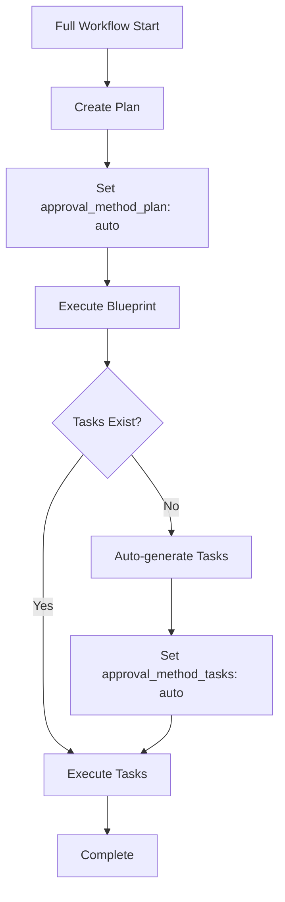
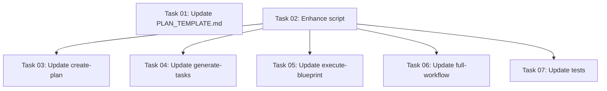

# Plan: Dual Approval Methods System

## Original Work Order

> We should also add the "approval_method" approach for tasks.
>
> We will lead an additional approval method. We will create an approval underscore method underscore tasks that is set to manual or auto. For completion, we will also rename the current approval method property to approval method plan. The approval method plan works exactly like it is working right now. The new approval method tasks will be used for continuing with task execution after the task generation has been done. When can this happen? This can happen when we execute a plan with execute blueprint that doesn't have tasks generated and they get auto generated. So we will need to update the execute blueprint command, but also in the full workflow. The full workflow will drop the explicit task generation and it will defer task generation to execute blueprint. So the full workflow will be only plan generation and then blueprint execution. Once that's simplified, it will inherit the new behavior of the blueprint execution. These will use the same approach that the approval method for plan is using. Inside of the execute blueprint command, we will set the value from manual to auto if the tasks were generated during blueprint execution. Remember that it is very important that these two approval method properties leave inside of the plan document, which is what is centralized.

## Plan Clarifications

| Question | Answer |
|----------|--------|
| Default value for `approval_method_tasks` when plan is first created? | `manual` |
| Script update approach for `set-approval-method.cjs`? | Extend existing script with third parameter to specify which field (plan/tasks) |
| Backward compatibility for existing plans with old `approval_method`? | Do nothing - assume new status quo is the only thing that ever existed |
| Implementation timeline for dual approval + full-workflow simplification? | Do both changes simultaneously |
| Template updates for frontmatter? | Show both `approval_method_plan` and `approval_method_tasks` fields |

## Executive Summary

This plan implements a dual approval method system that provides separate control over plan approval and task generation approval within the AI task management workflow. The current single `approval_method` field will be split into `approval_method_plan` and `approval_method_tasks`, enabling finer-grained control over automated workflows.

Simultaneously, the full-workflow command will be simplified by removing the explicit task generation step and deferring task generation to the execute-blueprint command. This creates a cleaner two-step workflow (plan → execute) where execute-blueprint intelligently handles task generation when needed and sets the appropriate approval method based on context.

This approach maintains the centralized plan document as the single source of truth for workflow state while enabling more flexible automation patterns for different workflow scenarios.

## Context

### Current State

The task management system currently uses a single `approval_method` field in plan frontmatter to control workflow automation:
- `approval_method: auto` - Automated workflow mode (full-workflow context)
- `approval_method: manual` - Standalone command execution

The full-workflow command explicitly orchestrates three steps:
1. Create plan (`/tasks:create-plan`)
2. Generate tasks (`/tasks:generate-tasks`)
3. Execute blueprint (`/tasks:execute-blueprint`)

The execute-blueprint command includes logic to auto-generate tasks if they're missing, but there's no way to differentiate between auto-generated tasks (which should continue automatically) and manually reviewed tasks (which may need user approval).

### Target State

The enhanced system will provide:
- Two separate approval fields: `approval_method_plan` and `approval_method_tasks`
- Simplified full-workflow with only two steps: plan creation → blueprint execution
- Execute-blueprint automatically generates tasks when missing and sets `approval_method_tasks: auto`
- Clear semantic meaning: plan approval controls post-plan review, task approval controls post-task-generation review
- Extended `set-approval-method.cjs` script that can update either field

### Background

The current limitation emerges when execute-blueprint auto-generates tasks - there's no mechanism to signal that these tasks were generated in an automated context and should proceed without user review. The dual approval method system addresses this by providing separate controls for each workflow phase, enabling intelligent automation while preserving manual override capabilities.

## Technical Implementation Approach



### Component 1: Plan Frontmatter Schema Update

**Objective**: Replace single `approval_method` with dual fields while maintaining consistent behavior

**Technical Approach**:
- Rename `approval_method` → `approval_method_plan` in all templates
- Add `approval_method_tasks` field to plan template
- Both fields accept values: `auto` | `manual`
- Default values: both set to `manual` on plan creation
- Update frontmatter JSON schema documentation in all command files

**Files to Update**:
- `templates/ai-task-manager/config/templates/PLAN_TEMPLATE.md`
- `templates/assistant/commands/tasks/create-plan.md` (all 3 assistant variants)
- JSON schema definitions in command documentation

### Component 2: Script Enhancement - set-approval-method.cjs

**Objective**: Extend script to handle both approval method fields with backward-compatible interface

**Technical Approach**:
- Add optional third parameter: `<field-type>` accepting `plan` or `tasks`
- Default to `plan` if not specified (maintains backward compatibility for existing uses)
- Update field names: `approval_method` → `approval_method_plan`, new `approval_method_tasks`
- Maintain existing validation and error handling patterns
- Update usage documentation and error messages

**Interface Design**:
```bash
# New interface
node set-approval-method.cjs <file-path> <auto|manual> [plan|tasks]

# Examples
node set-approval-method.cjs plan.md auto plan
node set-approval-method.cjs plan.md manual tasks
node set-approval-method.cjs plan.md auto  # defaults to 'plan'
```

### Component 3: Full-Workflow Simplification

**Objective**: Remove explicit generate-tasks step, defer to execute-blueprint

**Technical Approach**:
- Remove Step 3 (generate-tasks invocation) from full-workflow command
- Update workflow to: Plan Creation → Set approval_method_plan: auto → Execute Blueprint
- Remove task generation progress messaging (now handled by execute-blueprint)
- Update todo list tracking in command documentation
- Maintain structured output format for command coordination

**Changes**:
- Workflow becomes 2-step instead of 3-step
- Blueprint execution inherits responsibility for task generation
- Cleaner separation of concerns: full-workflow orchestrates, execute-blueprint handles details

### Component 4: Execute-Blueprint Task Generation Enhancement

**Objective**: Auto-set approval_method_tasks when tasks are generated during execution

**Technical Approach**:
- After successful automatic task generation, invoke set-approval-method script:
  ```bash
  node .ai/task-manager/config/scripts/set-approval-method.cjs "$PLAN_FILE" auto tasks
  ```
- Add this call immediately after the `/tasks:generate-tasks` invocation in validation section
- Ensure script call happens before proceeding to execution process
- Update output behavior to respect both approval method fields

**Logic Flow**:
1. Detect missing tasks/blueprint
2. Display notification to user
3. Invoke `/tasks:generate-tasks`
4. **NEW**: Set `approval_method_tasks: auto`
5. Continue to execution without pausing

### Component 5: Output Behavior Updates

**Objective**: Respect both approval method fields when determining output verbosity

**Technical Approach**:

**Generate-Tasks Command**:
- Read `approval_method_tasks` instead of `approval_method`
- If `auto`: minimal output, no review prompts
- If `manual`: detailed output, review instructions

**Execute-Blueprint Command**:
- Read both `approval_method_plan` and `approval_method_tasks`
- During auto-generation: check `approval_method_plan` for workflow context
- During execution: check `approval_method_tasks` for task review context
- Adjust output verbosity accordingly for each phase

**Extraction Pattern** (update in both commands):
```bash
# Extract both fields
APPROVAL_METHOD_PLAN=$(sed -n '/^---$/,/^---$/p' "$PLAN_FILE" | grep '^approval_method_plan:' | sed 's/approval_method_plan: *//;s/"//g;s/'"'"'//g' | tr -d ' ')
APPROVAL_METHOD_TASKS=$(sed -n '/^---$/,/^---$/p' "$PLAN_FILE" | grep '^approval_method_tasks:' | sed 's/approval_method_tasks: *//;s/"//g;s/'"'"'//g' | tr -d ' ')

# Defaults
APPROVAL_METHOD_PLAN=${APPROVAL_METHOD_PLAN:-manual}
APPROVAL_METHOD_TASKS=${APPROVAL_METHOD_TASKS:-manual}
```

### Component 6: Test Coverage Updates

**Objective**: Ensure test coverage for dual approval method functionality

**Technical Approach**:
- Update `set-approval-method.test.ts` to cover new third parameter
- Add tests for both `approval_method_plan` and `approval_method_tasks` fields
- Test default behavior (backward compatibility with `plan` default)
- Verify error handling for invalid field types
- Maintain existing test patterns and assertions

## Risk Considerations and Mitigation Strategies

### Technical Risks

- **Risk: Breaking changes to existing workflows**
  - **Impact**: Plans created with old schema may fail or behave unexpectedly
  - **Mitigation**: Per clarification Q3, we assume clean slate - no backward compatibility needed. Document this clearly in CHANGELOG/migration notes.

- **Risk: Script parameter complexity**
  - **Impact**: Third parameter adds cognitive load, potential for incorrect usage
  - **Mitigation**: Use sensible default (`plan`) for backward compatibility, clear error messages, updated documentation with examples

### Implementation Risks

- **Risk: Incomplete command updates**
  - **Impact**: Some commands may still reference old `approval_method` field
  - **Mitigation**: Systematic grep search for all occurrences, comprehensive testing of all workflow paths

- **Risk: Output behavior inconsistencies**
  - **Impact**: Some commands may not respect new dual approval fields correctly
  - **Mitigation**: Consistent bash extraction pattern across all commands, test both auto and manual modes

### Integration Risks

- **Risk: Full-workflow simplification may break existing user expectations**
  - **Impact**: Users expecting 3-step workflow see different behavior
  - **Mitigation**: Clear documentation updates, maintain structured output format, ensure seamless automation

## Success Criteria

### Primary Success Criteria

1. **Dual Approval Fields Functional**: Both `approval_method_plan` and `approval_method_tasks` work independently across all commands
2. **Simplified Full-Workflow**: Full-workflow successfully executes with only 2 steps (plan → execute) and produces correct results
3. **Auto-Generation Context Preserved**: Execute-blueprint correctly sets `approval_method_tasks: auto` when generating tasks automatically
4. **Consistent Output Behavior**: All commands respect appropriate approval method field and adjust verbosity accordingly

### Quality Assurance Metrics

1. **Test Coverage**: All new script functionality covered by unit tests
2. **Command Consistency**: All 3 assistant variants (Claude, Gemini, Open Code) updated identically
3. **Documentation Accuracy**: All command documentation reflects new schema and behavior
4. **No Regressions**: Existing workflow paths continue to function (within new schema assumptions)

## Resource Requirements

### Development Skills

- **Markdown/YAML**: Frontmatter schema design and template updates
- **Bash Scripting**: Command extraction patterns and script invocations
- **Node.js**: Script enhancement with parameter handling
- **Testing**: Jest test updates and validation coverage

### Technical Infrastructure

- Existing CLI tool codebase with template system
- Node.js runtime for script execution
- Jest testing framework
- Multi-assistant template processing (MD → TOML conversion)

## Implementation Order

High-level implementation sequence (specific tasks will be generated in next phase):

1. **Foundation**: Update plan template with dual approval fields
2. **Core Script**: Enhance set-approval-method.cjs with field parameter
3. **Command Updates**: Update all command templates to use new field names
4. **Workflow Simplification**: Remove task generation from full-workflow
5. **Auto-Generation Enhancement**: Add approval_method_tasks setting to execute-blueprint
6. **Testing**: Update and validate test coverage

## Notes

- All changes assume clean slate per Q3 - no backward compatibility for old `approval_method` field
- Plan document remains single source of truth for workflow state
- Changes affect template files that get processed for all 3 assistant variants (Claude, Gemini, Open Code)
- The set-approval-method.cjs script exists in `templates/ai-task-manager/config/scripts/` and gets copied to projects during initialization

## Task Dependencies



## Execution Blueprint

**Validation Gates:**
- Reference: `/config/hooks/POST_PHASE.md`

### Phase 1: Schema and Script Foundation
**Parallel Tasks:**
- Task 01: Update PLAN_TEMPLATE.md with dual approval fields
- Task 02: Enhance set-approval-method.cjs script with field parameter

### Phase 2: Command Templates and Test Coverage
**Parallel Tasks:**
- Task 03: Update create-plan command template (depends on: 02)
- Task 04: Update generate-tasks command template (depends on: 02)
- Task 05: Update execute-blueprint command template (depends on: 02)
- Task 06: Update full-workflow command template (depends on: 02)
- Task 07: Update set-approval-method test coverage (depends on: 02)

### Post-phase Actions

After all phases complete, run post-implementation validation:
```bash
npm test  # Verify all tests pass
npm run lint:fix  # Ensure code quality
```

### Execution Summary
- Total Phases: 2
- Total Tasks: 7
- Maximum Parallelism: 5 tasks (in Phase 2)
- Critical Path Length: 2 phases

## Execution Summary

**Status**: ✅ Completed Successfully
**Completed Date**: 2025-10-20

### Results

Successfully implemented the dual approval methods system with all 7 tasks completed across 2 phases:

**Phase 1 - Schema and Script Foundation (2 tasks):**
- Updated PLAN_TEMPLATE.md with `approval_method_plan` and `approval_method_tasks` fields
- Enhanced set-approval-method.cjs script to support both fields with optional third parameter

**Phase 2 - Command Templates and Test Coverage (5 tasks):**
- Updated create-plan.md with dual approval fields in frontmatter and JSON schema
- Updated generate-tasks.md to read `approval_method_tasks` for output control
- Updated execute-blueprint.md to read both fields and auto-set `approval_method_tasks: auto` after task generation
- Simplified full-workflow.md to 2-step process (plan → execute), deferring task generation to execute-blueprint
- Enhanced test coverage with 28 comprehensive tests for dual approval functionality

**Key Deliverables:**
- Dual approval method system fully operational across all commands
- Simplified full-workflow reduces steps from 3 to 2
- Backward-compatible script interface with sensible defaults
- Comprehensive test coverage (131 tests passing)
- All code quality checks passing (linting, formatting)

### Noteworthy Events

**Successful Parallel Execution:**
- Phase 1: 2 tasks executed in parallel without conflicts
- Phase 2: 5 tasks executed in parallel efficiently, demonstrating effective dependency management

**Test Results:**
- All 131 tests passed successfully
- Test execution time: 7.114 seconds
- No regressions detected in existing functionality
- New tests cover all dual approval method scenarios

**Code Quality:**
- ESLint validation passed with no issues
- All templates updated consistently across 3 assistant variants (Claude, Gemini, Open Code)
- Clean slate approach implemented as specified (no backward compatibility for old `approval_method` field)

### Recommendations

1. **Documentation Update**: Consider updating CLAUDE.md/AGENTS.md to document the new dual approval method system and simplified workflow
2. **User Migration Guide**: Create a brief migration note for users transitioning from old single `approval_method` to dual fields
3. **Integration Testing**: Run full end-to-end workflow tests in a test project to validate the complete integration
4. **Template Processing**: Verify TOML conversion for Gemini templates handles the dual fields correctly
