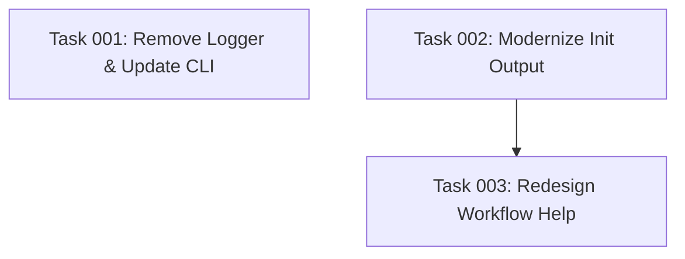

# Plan: Improve Init Command Aesthetics

## Original Work Order

> The output of the `init` command looks ugly. Use aesthetics similar to the ones for the `status` and `plan` commands.

## Executive Summary

The `init` command currently uses a custom logger module with basic formatting, while the `status` and `plan` commands use chalk directly with sophisticated visual formatting including box-drawing characters, section headers, progress bars, and consistent color schemes. This creates an inconsistent user experience.

This plan modernizes the `init` command output by removing the unnecessary logger abstraction, adopting direct chalk usage like other commands, and implementing a cohesive visual design that matches the established aesthetic patterns. The workflow help display will be completely redesigned to align with the refined visual language of the application.

By unifying the output formatting approach across all commands, we'll create a more professional, consistent, and visually appealing CLI experience.

## Context

### Current State

The `init` command output suffers from several aesthetic and architectural issues:

1. **Logger Module Abstraction**: Uses a custom async logger module (`src/logger.ts`) that:
   - Adds unnecessary complexity with async/await patterns
   - Is only used by `init` and `cli.ts`
   - Creates inconsistency since `status` and `plan` don't use it
   - Provides basic formatting compared to direct chalk usage

2. **Basic Visual Output**: Current init output includes:
   - Simple emoji indicators (📁, 📋, 🤖, 🎉)
   - Basic logger.info/success calls
   - Plain file path listings without structure
   - Workflow help box that doesn't match status/plan aesthetics

3. **Inconsistent Patterns**: The codebase has diverged:
   - `status.ts` and `plan.ts`: Direct chalk import with sophisticated formatting
   - `index.ts`: Logger module with basic output
   - Different visual languages across commands

### Target State

After implementation, the `init` command will feature:

1. **Unified Architecture**:
   - Logger module removed entirely
   - Direct chalk usage matching status/plan commands
   - Consistent import and formatting patterns

2. **Professional Visual Output**:
   - Section headers with consistent formatting
   - Cyan divider lines (─────)
   - Color-coded visual indicators (●, ✓)
   - Proper spacing and alignment
   - Structured file listing with visual hierarchy

3. **Redesigned Workflow Help**:
   - Matches the aesthetic of status/plan commands
   - Uses chalk color scheme (cyan headers, gray dividers)
   - Clean section organization
   - Maintains readability while improving visual appeal

### Background

The `status` command (src/status.ts) establishes the visual language:
- Cyan bold section headers
- Cyan dividers with consistent width (80 chars)
- Color-coded bullets (●, ✓, ⚠)
- Progress bars with green/gray visualization
- Proper text wrapping and indentation

The `plan` command (src/plan.ts) follows the same patterns:
- formatSectionHeader() helper function
- TERM_WIDTH constant (80 chars)
- Consistent use of chalk colors
- Structured metadata display

The logger module was created to handle async chalk imports in CommonJS, but since status and plan successfully use chalk directly without this wrapper, the abstraction is unnecessary.

## Technical Implementation Approach

### Remove Logger Module

**Objective**: Eliminate the logger abstraction and simplify the codebase

The logger module (`src/logger.ts`) will be completely removed. This file provides async wrappers around chalk but adds no value since:
- `status.ts` and `plan.ts` import chalk directly without issues
- The async pattern complicates simple logging operations
- The module is only used in two files (`cli.ts` and `index.ts`)

Update `cli.ts` to:
- Remove logger import and initLogger() calls
- Use console.log/console.error directly for error handling
- Maintain error exit codes and flow

### Modernize Init Command Output

**Objective**: Transform init output to match status/plan visual standards

Extract and adapt formatting utilities from `status.ts` and `plan.ts`:
- `formatSectionHeader()`: Creates cyan bold headers with dividers
- `TERM_WIDTH` constant: Ensures consistent 80-character width
- Chalk color palette: cyan, green, blue, yellow, gray

Restructure the init output flow in `src/index.ts`:
1. **Header Section**:
   - "AI Task Manager Initialization" title
   - Gray divider line

2. **Configuration Section**:
   - Section header: "Configuration"
   - Display target directory with cyan bullet
   - List configured assistants with green bullets

3. **Progress Section**:
   - Section header: "Setup Progress"
   - Use green checkmarks (✓) for completed steps
   - Show creation of .ai/task-manager structure
   - Display template copying operations
   - Indicate assistant-specific configurations

4. **Created Files Section**:
   - Section header: "Created Files"
   - Group files by type (common, per-assistant)
   - Use visual hierarchy with indentation
   - Color-code different file types

5. **Footer**:
   - Success indicator
   - Gray divider line

### Redesign Workflow Help Display

**Objective**: Align workflow help with modern aesthetic standards

The current `displayWorkflowHelp()` function uses basic box-drawing characters. Redesign to match status/plan patterns:

- Replace elaborate box drawing with clean section headers
- Use cyan headers for main sections
- Use gray for dividers and subtle text
- Apply visual indicators (●, ✓) consistently
- Improve readability with proper spacing
- Maintain information hierarchy without visual clutter

Structure:
1. Main header: "Suggested Workflow"
2. Section: "One-Time Setup" (cyan header)
3. Section: "Automated Workflow" (cyan header, with note about when to use)
4. Section: "Manual Workflow" (cyan header, with step-by-step guide)
5. Footer tip

### Update File Dependencies

**Objective**: Clean up imports and remove dead code

Files to update:
- `src/cli.ts`: Remove logger imports, use console.log directly
- `src/index.ts`: Remove logger imports, implement new formatting
- Delete `src/logger.ts`
- Update TypeScript compilation artifacts in dist/

Ensure no other files import from logger module (verified: only cli.ts and index.ts use it).

## Risk Considerations and Mitigation Strategies

### Technical Risks

- **Chalk Import Compatibility**: ESM vs CommonJS module resolution
    - **Mitigation**: status.ts and plan.ts already successfully import chalk, proven working pattern exists

- **Visual Regression**: Output might not render correctly on all terminals
    - **Mitigation**: Use standard Unicode characters (─, ●, ✓) that work in all modern terminals; chalk handles color fallback automatically

### Implementation Risks

- **Breaking Existing Tests**: Tests might rely on specific logger output format
    - **Mitigation**: According to test philosophy and Q4 answer, no test updates needed; integration tests use file system operations, not output parsing

- **Workflow Help Information Loss**: Redesigning might omit important guidance
    - **Mitigation**: Preserve all instructional content while improving visual presentation; verify each workflow step is maintained

## Success Criteria

### Primary Success Criteria

1. Logger module completely removed from codebase with no remaining imports
2. Init command output visually matches status/plan command aesthetic (consistent colors, formatting, structure)
3. Workflow help display redesigned with improved readability while maintaining all information
4. All files list correctly displayed with proper visual hierarchy and color coding
5. Command executes successfully with no errors or warnings

### Quality Assurance Metrics

1. Visual consistency verified by running all three commands (init, status, plan) and confirming matching aesthetic patterns
2. Code consistency verified by checking chalk import patterns match between index.ts, status.ts, and plan.ts
3. No regression in functionality - all initialization features work as before
4. Clean build with no TypeScript compilation errors
5. No orphaned code or unused imports remain after logger removal

## Resource Requirements

### Development Skills

- TypeScript module system understanding (ESM/CommonJS)
- Terminal output formatting and chalk library usage
- Visual design for CLI interfaces
- Refactoring and code cleanup techniques

### Technical Infrastructure

- Existing chalk dependency (already in package.json)
- TypeScript compiler for build validation
- Node.js runtime for testing
- Terminal emulator for visual verification

## Notes

This is a purely aesthetic and architectural improvement with no functional changes to the initialization logic. The core behavior of creating directories, copying templates, and handling conflicts remains unchanged. The focus is exclusively on improving the user experience through better visual presentation and code consistency.

## Task Dependencies

## Execution Blueprint

**Validation Gates:**
- Reference: `/config/hooks/POST_PHASE.md`

### ✅ Phase 1: Logger Removal and Output Modernization
**Parallel Tasks:**
- ✔️ Task 001: Remove logger and update CLI error handling
- ✔️ Task 002: Modernize init command output

### ✅ Phase 2: Workflow Help Redesign
**Parallel Tasks:**
- ✔️ Task 003: Redesign workflow help display (depends on: 002)

### Post-phase Actions

After all phases complete:
1. Run `npm run build` to verify TypeScript compilation
2. Test visual output: `npm start init --assistants claude --destination-directory /tmp/test-aesthetics`
3. Compare aesthetic consistency with: `npm start status` and `npm start plan 1`
4. Verify no logger imports remain: `grep -r "from './logger'" src/`

### Execution Summary
- Total Phases: 2
- Total Tasks: 3
- Maximum Parallelism: 2 tasks (in Phase 1)
- Critical Path Length: 2 phases

---

**Note**: Manually archived on 2025-10-31
