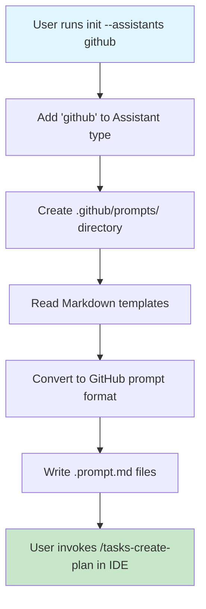

# Plan: GitHub Copilot Prompt Files Support

## Original Work Order
> Let's start having support for prompt files only.

## Plan Clarifications
| Question | Answer |
| --- | --- |
| Which GitHub Copilot commands require prompt files in this scope? | Generate prompt files for every task command currently shipped (`tasks-create-plan`, `tasks-refine-plan`, `tasks-generate-tasks`, `tasks-execute-task`, `tasks-execute-blueprint`, `tasks-fix-broken-tests`, `tasks-full-workflow`). |

## Executive Summary

This plan adds GitHub Copilot support to the AI task management CLI by implementing prompt files (`.github/prompts/*.prompt.md`). The implementation follows the proven OpenSpec pattern while expanding coverage to every existing task command so VS Code and JetBrains users gain parity with other assistants through `/tasks-create-plan`, `/tasks-refine-plan`, `/tasks-generate-tasks`, `/tasks-execute-task`, `/tasks-execute-blueprint`, `/tasks-fix-broken-tests`, and `/tasks-full-workflow`.

The approach leverages GitHub Copilot's native prompt file discovery, letting the CLI scaffold `.prompt.md` assets during `init` and keeping command invocation within IDEs lightweight. Unlike custom agents that rely on CLI usage and a `/agent` prefix, prompt files provide frictionless IDE integration without additional runtime dependencies.

Key benefits include reusing the existing Markdown template pipeline, introducing a focused conversion utility that preserves `$ARGUMENTS`, and adding documentation plus tests that confirm every shipped command now has a GitHub Copilot prompt. The clarified command coverage ensures downstream task generators and implementers operate with a consistent command surface area.

## Context

### Current State vs Target State
| Current State | Target State | Why? |
| --- | --- | --- |
| CLI supports Claude, Gemini, and OpenCode assistants; GitHub Copilot is excluded from `validAssistants` checks in `src/utils.ts`. | CLI recognizes `github` as a valid assistant and scaffolds Copilot prompt assets alongside existing assistants. | Align GitHub Copilot with supported assistants to fulfill the work order and eliminate validation gaps. |
| Users hand-roll `.github/prompts/*.prompt.md` files (if at all), leading to inconsistent coverage across commands. | `npx . init --assistants github` generates `.github/prompts/` with prompt files for every shipped task command listed in the clarifications table. | Provide turnkey, parity-focused IDE integration that mirrors other assistants’ capabilities. |
| Template processing lacks GitHub-aware conversion, so Markdown templates cannot be reused for Copilot. | Template pipeline converts Markdown templates into Copilot prompt format (frontmatter plus `$ARGUMENTS` preamble) while preserving command bodies. | Reuse existing templates safely and ensure Copilot prompts remain IDE-ready without manual edits. |

### Background
Existing assistant integrations rely on shared Markdown templates that are transformed per assistant (e.g., TOML conversion for Gemini). OpenSpec demonstrates the Copilot prompt approach by storing `.prompt.md` files within `.github/prompts/`, using minimal frontmatter and `$ARGUMENTS` placeholders. GitHub Copilot documentation confirms this pattern and clarifies that prompt files are currently discoverable in VS Code and JetBrains IDEs but not within the Copilot CLI.

## Architectural Approach

This implementation extends the assistant scaffolding pipeline so GitHub Copilot prompt files are generated from the same source templates while respecting Copilot-specific conventions defined in the Plan Clarifications section.

### Type System and Validation Updates
**Objective**: Add GitHub Copilot as a fully validated assistant option

Extend the `Assistant` type in `src/types.ts` and include `'github'` in the `validAssistants` arrays within `parseAssistants()` and `validateAssistants()` in `src/utils.ts`. This preserves type safety and consistent validation behavior across all assistant flows.

### Template Format and Conversion Enhancements
**Objective**: Route GitHub Copilot templates through Markdown processing with Copilot-specific formatting

Update `getTemplateFormat()` to return `'md'` for the GitHub assistant and introduce a `convertMdToGitHubPrompt()` helper. The helper parses frontmatter, emits Copilot-compatible frontmatter (defaulting the description when absent), prepends `$ARGUMENTS`, and appends the template body unchanged so variables remain intact.

### Scaffolding of Prompt File Outputs
**Objective**: Create `.github/prompts/` structure with prompt files for all task commands

Adjust `src/index.ts` to branch on `assistant === 'github'`, call `ensureDir('.github/prompts')`, and write `.prompt.md` files for every task command (`tasks-create-plan`, `tasks-refine-plan`, `tasks-generate-tasks`, `tasks-execute-task`, `tasks-execute-blueprint`, `tasks-fix-broken-tests`, `tasks-full-workflow`). File naming follows the GitHub discovery convention `tasks-<command>.prompt.md`.

### Documentation and Validation Updates
**Objective**: Document GitHub Copilot workflows and verify generated assets

Document the new assistant in `AGENTS.md` and `README.md`, including IDE prerequisites, supported commands, and the `.github/prompts/` workflow. Expand integration tests in `src/__tests__/cli.integration.test.ts` to confirm directory creation, the presence of all seven prompt files, valid YAML frontmatter, and `$ARGUMENTS` placement. Add targeted assertions that prevent regressions when new commands are introduced.

## Risk Considerations and Mitigation Strategies

Technical Risks

- **Prompt File Format Changes**: GitHub Copilot's prompt files are in public preview and subject to change.  
  - **Mitigation**: Follow official documentation closely, keep implementation simple to minimize breaking changes, and monitor GitHub Copilot changelog updates.  
- **Variable Substitution Compatibility**: `$ARGUMENTS` placeholder might not work as expected.  
  - **Mitigation**: Test manually in VS Code with Copilot, reference OpenSpec's implementation, and keep template bodies unchanged to avoid transformation errors.  
- **Template Conversion Edge Cases**: Complex template content might not convert cleanly.  
  - **Mitigation**: Use straightforward frontmatter, retain Markdown bodies verbatim, and cover scenarios with automated tests.

Implementation Risks

- **Directory Naming Conflicts**: `.github/` might already exist with other content.  
  - **Mitigation**: Use `ensureDir()` to avoid overwriting existing files and scope writes to `.github/prompts/`.  
- **File Extension Confusion**: Users might expect `.md` instead of `.prompt.md`.  
  - **Mitigation**: Highlight the `.prompt.md` requirement in documentation and release notes, and rely on integration tests to enforce naming.

Integration Risks

- **Assistant Type Conflicts**: Adding `github` could impact orchestration that enumerates assistants.  
  - **Mitigation**: Update validation arrays, confirm all enumerations include `github`, and run the full integration test suite to ensure no regressions.  
- **Command Parity Drift**: Future commands might lack Copilot prompts, eroding parity.  
  - **Mitigation**: Keep the clarifications list authoritative, ensure tests fail fast when prompts are missing, and document the requirement for future contributions.

## Success Criteria

### Primary Success Criteria
1. Users can successfully run `npx . init --assistants github` without errors.  
2. `.github/prompts/` directory is created with correct structure.  
3. Prompt files exist for each command listed in the Plan Clarifications table with valid YAML frontmatter.  
4. Commands can be invoked via the corresponding `/tasks-*` prompts in VS Code with GitHub Copilot.  
5. Generated files follow the same pattern as OpenSpec's implementation and pass doc/test validation.

### Quality Assurance Metrics
1. All integration tests pass (including new GitHub-specific assertions).  
2. No regressions in Claude, Gemini, or OpenCode functionality.  
3. TypeScript compilation succeeds with no errors.  
4. ESLint validation passes.  
5. Documentation updates are reviewed and align with clarified command coverage.

## Resource Requirements

### Development Skills
- TypeScript for type system and scaffold logic updates.  
- Understanding of YAML frontmatter parsing and Markdown processing.  
- Familiarity with filesystem utilities (`fs-extra`) and Jest-based integration testing.

### Technical Infrastructure
- Existing template system (`src/utils.ts`).  
- Template source files in `templates/commands/tasks/` (shared Markdown).  
- Integration test harness (`src/__tests__/cli.integration.test.ts`).  
- GitHub Copilot in VS Code or JetBrains for manual validation of prompt files.

## Implementation Order

1. **Extend Assistant Types** – Add `'github'` to type definitions and validation arrays.  
2. **Map Template Format** – Ensure `getTemplateFormat()` returns `'md'` for GitHub.  
3. **Build GitHub Conversion Utility** – Implement `convertMdToGitHubPrompt()` with `$ARGUMENTS` preamble.  
4. **Update Template Processing Flow** – Modify `readAndProcessTemplate()` to call the conversion helper when `assistant === 'github'`.  
5. **Scaffold Prompt Outputs** – Update `src/index.ts` to create `.github/prompts/` and emit seven `.prompt.md` files.  
6. **Document Assistant Support** – Update `AGENTS.md` and `README.md` with usage instructions and command coverage.  
7. **Add Integration Tests** – Expand CLI integration tests to enforce prompt presence, structure, and parity.

## Notes

- This implementation focuses solely on **prompt files** (`.github/prompts/`), not **custom agents** (`.github/agents/`).  
- Prompt files work in VS Code and JetBrains IDEs but NOT in the GitHub Copilot CLI.  
- Future enhancement could add custom agents for CLI support as a separate plan.  
- OpenSpec uses this same approach, proving it is a viable pattern.
- The `$ARGUMENTS` placeholder is supported natively by GitHub Copilot, so no additional variable transformation is required.
- 2025-11-23: Documented command coverage clarifications, aligned context with the template structure, converted risks to `
` sections, and expanded scaffolding steps to include every shipped task command.

## Execution Blueprint

### ✅ Phase 1: Type System Foundation
**Status**: completed
**Tasks**: 1
**Parallel Execution**: No

- ✔️ Task 1: Add GitHub Assistant Type and Validation

**Rationale**: Establishes the foundational type system changes required for all subsequent work.

### ✅ Phase 2: Conversion Utility
**Status**: completed
**Tasks**: 1
**Parallel Execution**: No

- ✔️ Task 2: Implement GitHub Prompt File Conversion Function

**Rationale**: Creates the conversion function needed before template processing can be updated.

### ✅ Phase 3: Template Processing Integration
**Status**: completed
**Tasks**: 1
**Parallel Execution**: No

- ✔️ Task 3: Integrate GitHub Format Routing in Template Processing

**Rationale**: Wires up the conversion function within the template processing pipeline.

### ✅ Phase 4: Directory and File Scaffolding
**Status**: completed
**Tasks**: 1
**Parallel Execution**: No

- ✔️ Task 4: Implement GitHub Directory and File Creation Logic

**Rationale**: Implements the actual initialization logic that creates prompt files.

### ✅ Phase 5: Test Coverage
**Status**: completed
**Tasks**: 1
**Parallel Execution**: No

- ✔️ Task 5: Add Integration Tests for GitHub Copilot Support

**Rationale**: Validates the implementation through comprehensive integration tests.

### ✅ Phase 6: Documentation
**Status**: completed
**Tasks**: 1
**Parallel Execution**: No

- ✔️ Task 6: Update Documentation for GitHub Copilot Support

**Rationale**: Ensures users have complete documentation for the new feature.

## Execution Summary

**Status**: ✅ Completed Successfully
**Completed Date**: 2025-11-23

### Results

Successfully implemented GitHub Copilot support for the AI Task Manager CLI, adding complete parity with existing assistants (Claude, Gemini, OpenCode, Codex). The implementation includes:

**Core Deliverables**:
- ✅ GitHub assistant type added to type system (src/types.ts)
- ✅ GitHub prompt conversion function (convertMdToGitHubPrompt) implemented
- ✅ Template processing pipeline extended for GitHub-specific formatting
- ✅ Directory creation logic for .github/prompts/ with 7 prompt files
- ✅ 4 comprehensive integration tests validating all functionality
- ✅ Complete documentation in AGENTS.md and README.md

**Implementation Details**:
- File format: `.prompt.md` extension following GitHub Copilot conventions
- Minimal YAML frontmatter with `description` field
- Native `$ARGUMENTS` placeholder support (no variable transformation)
- Seven commands: create-plan, refine-plan, generate-tasks, execute-task, execute-blueprint, fix-broken-tests, full-workflow
- Automatic IDE discovery in VS Code and JetBrains
- Test suite expanded from 136 to 140 tests (all passing)

**Code Changes**:
- Modified: src/types.ts, src/utils.ts, src/index.ts, src/__tests__/cli.integration.test.ts, src/__tests__/utils.test.ts
- Updated: AGENTS.md, README.md
- Commits: 6 (one per phase)

### Noteworthy Events

**Smooth Implementation**: All six phases completed sequentially without blocking issues. The modular architecture made it straightforward to extend the existing assistant system.

**Test Coverage Validation**: Integration tests immediately validated the implementation worked correctly across all seven command files with proper formatting and $ARGUMENTS placeholders.

**Documentation Alignment**: Following the OpenSpec implementation pattern ensured consistency with GitHub Copilot's expected format, minimizing risk of future breaking changes.

### Recommendations

**Future Enhancements**:
1. Consider adding GitHub Copilot custom agents (.github/agents/) for CLI support as a separate feature
2. Monitor GitHub Copilot changelog for prompt file format changes (currently in public preview)
3. Add usage examples/screenshots to documentation showing IDE integration
4. Consider adding a validation script to verify prompt file format correctness

**Testing**:
- Manual testing in VS Code with GitHub Copilot recommended to validate real-world usage
- Consider adding end-to-end tests that verify prompt discovery in mock IDE environment

**Documentation**:
- Current documentation covers IDE setup; consider adding troubleshooting section for common issues
- Video tutorial or animated GIF showing command invocation in VS Code could enhance user experience
