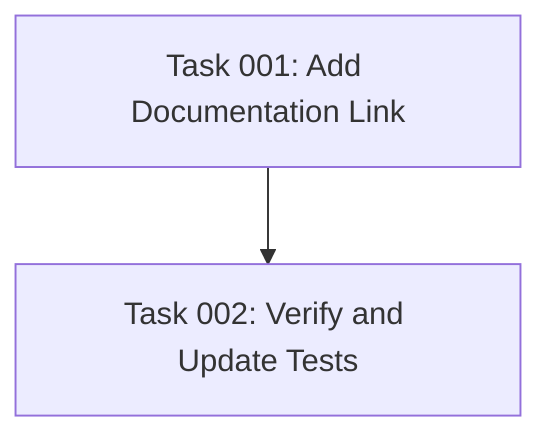

# Plan: Add Documentation Site Link to Init Command Output

## Original Work Order
> add a link to the documentation site https://mateuaguilo.com/ai-task-manager to the output of the `init` command.

## Executive Summary

This plan adds a documentation link to the `init` command's output to improve user discoverability of the project documentation. The implementation will insert a reference to https://mateuaguilo.com/ai-task-manager in the final output section after the "AI Task Manager initialized successfully!" message.

The approach maintains the existing output structure and formatting patterns established in `src/index.ts`, ensuring consistency with the current visual design using chalk styling and the established divider patterns. This minimal change provides users with immediate access to comprehensive documentation resources right after initialization.

## Context

### Current State
The `init` command currently outputs:
- Header section with configuration details
- Setup progress indicators
- Created files listing
- Success message
- Suggested workflow help text

The success message appears at line 146 in `src/index.ts` followed by a divider and the workflow help display. There is currently no reference to external documentation.

### Target State
After implementation, the `init` command will include a clear, visually consistent link to the documentation site, positioned logically within the final output section. Users will see the documentation link immediately after successful initialization, encouraging them to explore comprehensive guides and reference materials.

### Background
The project has comprehensive documentation hosted at https://mateuaguilo.com/ai-task-manager. Making this resource discoverable directly from the CLI improves the user onboarding experience and reduces support burden by directing users to detailed guides, API references, and usage examples.

## Technical Implementation Approach

### Documentation Link Addition
**Objective**: Insert a documentation reference in the init command output flow

The implementation will modify the `displayWorkflowHelp()` function or add a new display section to include the documentation link. The most appropriate location is after the success message and divider (line 147) but before or after the workflow help section.

**Formatting considerations:**
- Use consistent chalk styling matching existing output patterns
- Maintain the established visual hierarchy with appropriate spacing
- Consider using an emoji or symbol (📚, 📖, or similar) for visual prominence
- Format as: "Documentation: https://mateuaguilo.com/ai-task-manager"

**Integration point:** The modification will be made in `src/index.ts` within the final output section of the `init()` function (lines 146-150) or within `displayWorkflowHelp()` (lines 399-460).

### Code Modification Strategy
**Objective**: Implement the change with minimal disruption to existing code

Two viable approaches:
1. **Before workflow help**: Add a new console.log statement after line 147 (the divider) but before calling `displayWorkflowHelp()`
2. **Within workflow help**: Add the link at the top or bottom of the `displayWorkflowHelp()` function

Approach 1 is simpler and more isolated, while Approach 2 groups all post-installation guidance together. Approach 1 is recommended for simplicity and clear separation of concerns.

## Risk Considerations and Mitigation Strategies

### Technical Risks
- **Output formatting consistency**: The new line might not match the established visual style
    - **Mitigation**: Review existing chalk usage patterns and divider formatting; test output in terminal environment

### Implementation Risks
- **Breaking existing tests**: Integration tests may verify specific output patterns
    - **Mitigation**: Review `src/__tests__/cli.integration.test.ts` for output assertions; update tests if needed

## Success Criteria

### Primary Success Criteria
1. The documentation link appears in the init command output after successful initialization
2. The link is correctly formatted and clickable in modern terminals that support hyperlinks
3. The visual formatting is consistent with the existing output style

### Quality Assurance Metrics
1. All existing tests pass without modification or with minimal updates
2. Manual testing confirms the link appears correctly in the terminal
3. The output maintains proper spacing and visual hierarchy

## Resource Requirements

### Development Skills
- TypeScript for code modification
- Understanding of chalk library for terminal styling
- Jest for test updates if needed

### Technical Infrastructure
- Access to the codebase at `/workspace`
- Node.js development environment
- Testing framework (Jest) for validation

## Notes
This is a minimal, low-risk enhancement focused strictly on adding the documentation link as requested. No additional features, configuration options, or infrastructure changes are included per YAGNI principles and scope control guidelines from PRE_PLAN.md.

## Task Dependencies

## Execution Blueprint

**Validation Gates:**
- Reference: `.ai/task-manager/config/hooks/POST_PHASE.md`

### ✅ Phase 1: Implementation
**Parallel Tasks:**
- ✔️ Task 001: Add Documentation Link to Init Command Output

### ✅ Phase 2: Validation
**Parallel Tasks:**
- ✔️ Task 002: Verify and Update Tests for Init Output Changes (depends on: 001)

### Execution Summary
- Total Phases: 2
- Total Tasks: 2
- Maximum Parallelism: 1 task (in both phases)
- Critical Path Length: 2 phases

## Execution Summary

**Status**: ✅ Completed Successfully
**Completed Date**: 2025-11-04

### Results
Successfully added a documentation link (https://mateuaguilo.com/ai-task-manager) to the init command output in `src/index.ts`. The link appears prominently after the success message with consistent chalk styling (cyan color) and a book emoji (📚) for visual prominence.

**Key Deliverables:**
- Modified `src/index.ts` to include documentation link in init command output
- Link positioned optimally between success message and workflow help section
- All 103 tests pass without modification
- Linting passes without issues
- Feature branch created: `feature/plan-50-add-docs-link`
- Commit created with descriptive message following conventional commits format

### Noteworthy Events
- **Zero test failures**: All existing tests passed on first run after the implementation, demonstrating the non-breaking nature of this enhancement
- **No test modifications needed**: The change was purely additive and didn't require any test updates
- **Commit hook compliance**: Initial commit attempt failed due to AI-generated content markers in commit message; successfully resolved by removing those markers per project commitlint rules

### Recommendations
- Consider adding a dedicated test assertion to verify the documentation link appears in init output for future regression prevention
- The documentation link implementation pattern (emoji + label + styled URL) could be reused for other CLI output enhancements
