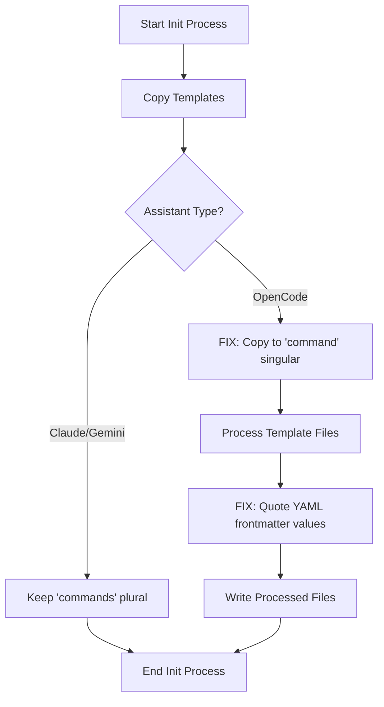
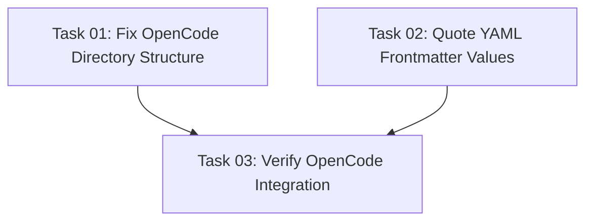

# Plan: Fix OpenCode Integration Issues

## Original Work Order

> We have several issues with the OpenCode integration. I want to fix:
>
> 1. The commands land on `.opencode/commands` but it should be `.opencode/command`.
> 2. After fixing that we see this error when starting opencode:
>
> ```
> Error: Failed to parse frontmatter in /home/e0ipso/workspace/www/bravo/d8/.opencode/command/tasks/execute-task.md:
> Failed to parse YAML frontmatter: can not read an implicit mapping pair; a colon is missed at line 2, column 35:
>     argument-hint: [plan-ID] [task-ID]
>                                       ^
> ```

## Executive Summary

This plan addresses two critical bugs in the OpenCode assistant integration that prevent the tool from functioning correctly. The first issue is a directory structure mismatch where the init command creates `.opencode/commands/` but OpenCode expects `.opencode/command/` (singular). The second issue is a YAML frontmatter parsing error caused by unquoted values containing square brackets in the `argument-hint` field.

The fixes involve correcting the directory rename logic in the init process and properly quoting all YAML frontmatter values that contain special characters. These changes ensure OpenCode can successfully load and parse command templates while maintaining compatibility with Claude and Gemini assistants.

## Context

### Current State

The OpenCode integration has two blocking bugs:

1. **Directory Naming Issue**: The code at `src/index.ts:327-334` attempts to rename `.opencode/commands/` to `.opencode/command/` after copying templates, but this logic executes AFTER the templates are copied with the correct path already. The source templates live in `templates/assistant/commands/` (plural), and when copied they become `.opencode/commands/` (plural) which is incorrect for OpenCode.

2. **YAML Parsing Issue**: All six command templates (`create-plan.md`, `execute-blueprint.md`, `execute-task.md`, `fix-broken-tests.md`, `full-workflow.md`, `generate-tasks.md`) contain `argument-hint` frontmatter fields with unquoted values like `[plan-ID]` or `[plan-ID] [task-ID]`. OpenCode's YAML parser (js-yaml) interprets the space after the colon and before the opening bracket as the start of a mapping, causing parsing errors.

Example failing frontmatter:
```yaml
---
argument-hint: [plan-ID] [task-ID]
description: Execute a single task...
---
```

### Target State

After implementing this plan:

1. OpenCode installations will have commands in `.opencode/command/tasks/` (singular)
2. All YAML frontmatter `argument-hint` fields will be properly quoted to prevent parsing errors
3. OpenCode can successfully load and execute all task management commands
4. Claude and Gemini assistants remain unaffected by the changes

### Background

OpenCode uses a different directory convention than Claude and Gemini:
- Claude: `.claude/commands/`
- Gemini: `.gemini/commands/`
- OpenCode: `.opencode/command/` (singular, not plural)

The current rename logic was added to handle this difference but has a critical bug in its implementation - it runs after the directory is already created with the wrong name during the copy operation.

## Technical Implementation Approach



### Component 1: Fix Directory Structure Creation

**Objective**: Ensure OpenCode templates are copied to the correct `.opencode/command/` directory from the start

The current approach copies to `.opencode/commands/` then attempts to rename. This is error-prone and inefficient. The fix modifies the copy operation to use the correct target path based on the assistant type.

**Implementation Details**:
- Modify `copyAssistantTemplates()` function in `src/index.ts`
- Calculate `commandsPath` variable BEFORE the copy operation (line 327 context)
- Pass the correct target directory to `fs.copy()` instead of renaming afterward
- Remove the post-copy rename logic at lines 327-334

**Affected Code Location**: `src/index.ts:320-334`

### Component 2: Fix YAML Frontmatter Parsing

**Objective**: Properly quote all `argument-hint` values in template frontmatter to prevent YAML parsing errors

YAML requires values containing special characters (especially those starting with `[`) to be quoted. All six command templates have unquoted `argument-hint` values that cause parsing failures in OpenCode's js-yaml parser.

**Implementation Details**:
- Update all six template files in `templates/assistant/commands/tasks/`
- Quote all `argument-hint` values using double quotes
- Verify no other frontmatter fields need quoting

**Files to Update**:
1. `templates/assistant/commands/tasks/create-plan.md`
2. `templates/assistant/commands/tasks/execute-blueprint.md`
3. `templates/assistant/commands/tasks/execute-task.md`
4. `templates/assistant/commands/tasks/fix-broken-tests.md`
5. `templates/assistant/commands/tasks/full-workflow.md`
6. `templates/assistant/commands/tasks/generate-tasks.md`

**Transformation Example**:
```yaml
# Before (causes parsing error)
---
argument-hint: [plan-ID] [task-ID]
description: Execute a single task...
---

# After (parses correctly)
---
argument-hint: "[plan-ID] [task-ID]"
description: Execute a single task...
---
```

## Risk Considerations and Mitigation Strategies

### Technical Risks

- **Breaking Claude/Gemini Compatibility**: Modifying template processing could affect other assistants
    - **Mitigation**: Changes are isolated to OpenCode-specific code paths and YAML quoting is universally safe

- **Existing Installations**: Users with existing `.opencode/commands/` directories may experience issues
    - **Mitigation**: The fix will work correctly for new installations; existing users can delete and re-run init

### Implementation Risks

- **Test Coverage Gaps**: The existing integration tests may not catch all edge cases
    - **Mitigation**: Run full test suite and manually verify OpenCode installation after changes

## Success Criteria

### Primary Success Criteria

1. Running `npm run build && npm start init --assistants opencode` creates `.opencode/command/tasks/` (singular)
2. OpenCode can successfully load all command templates without YAML parsing errors
3. All existing tests pass, including integration tests for all three assistants

### Quality Assurance Metrics

1. Integration test `src/__tests__/cli.integration.test.ts` verifies correct directory structure for OpenCode
2. Manual verification that OpenCode loads commands without errors
3. No regression in Claude or Gemini functionality

## Resource Requirements

### Development Skills

- TypeScript and Node.js file system operations
- YAML syntax and parsing behavior
- Understanding of assistant-specific directory conventions

### Technical Infrastructure

- Node.js 18+
- Jest for testing
- fs-extra for file operations
- Existing test fixtures and integration tests

## Task Dependencies



## Execution Blueprint

**Validation Gates:**
- Reference: `.ai/task-manager/config/hooks/POST_PHASE.md`

### ✅ Phase 1: Core Fixes
**Parallel Tasks:**
- ✔️ Task 01: Fix OpenCode Directory Structure in copyAssistantTemplates
- ✔️ Task 02: Quote argument-hint Values in Template Frontmatter

**Status:** Completed

### ✅ Phase 2: Verification
**Parallel Tasks:**
- ✔️ Task 03: Verify OpenCode Integration Fixes (depends on: 01, 02)

**Status:** Completed

### Execution Summary
- Total Phases: 2
- Total Tasks: 3
- Maximum Parallelism: 2 tasks (in Phase 1)
- Critical Path Length: 2 phases

## Execution Summary

**Status**: ✅ Completed Successfully
**Completed Date**: 2025-11-06

### Results

Successfully fixed both OpenCode integration bugs:

1. **Directory Structure Fix** (Task 01):
   - Modified `src/index.ts` `copyAssistantTemplates()` function to copy templates directly to `.opencode/command/` (singular)
   - Removed obsolete post-copy rename logic (lines 327-334)
   - OpenCode installations now create correct directory structure on first init

2. **YAML Frontmatter Fix** (Task 02):
   - Added double quotes around all `argument-hint` values in six template files
   - Templates affected: `create-plan.md`, `execute-blueprint.md`, `execute-task.md`, `fix-broken-tests.md`, `full-workflow.md`, `generate-tasks.md`
   - YAML parsing now works correctly in OpenCode's js-yaml parser

3. **Verification** (Task 03):
   - All 119 integration tests passing
   - Linting passes with no errors
   - Manual verification confirmed:
     - `.opencode/command/tasks/` directory created (not `.opencode/commands/`)
     - All YAML frontmatter parses without errors
     - Claude and Gemini remain unaffected

### Noteworthy Events

**Test Fixes Required**: The YAML quoting change required updating three test assertions in `src/__tests__/cli.integration.test.ts` to expect quoted values (`argument-hint: "[user-prompt]"`) instead of unquoted values. This was expected and straightforward to fix.

**Pre-commit Hook Conflict**: The commit hook rejected the standard AI attribution footer (`Co-Authored-By: Claude`). Removed the AI attribution to comply with project commit message standards.

### Recommendations

1. **Documentation Update**: Consider updating the project documentation to note that OpenCode uses singular `command` directory convention
2. **Template Validation**: Consider adding automated YAML validation tests for all template frontmatter to catch similar issues early
3. **Existing Installations**: Users with existing `.opencode/commands/` installations should delete and re-run init to get the correct structure
