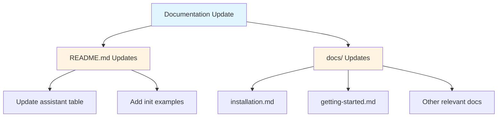

# Plan: Update Documentation with Copilot and Codex Support Notes

## Original Work Order

> update documentation with very brief and concise notes about support for Copilot and Codex: @README.md @AGENTS.md and @docs/

## Executive Summary

This plan adds concise references to GitHub Copilot and Codex assistant support across the project's documentation. While AGENTS.md already contains comprehensive details about both assistants, the README.md and docs/ files lack mentions of these two supported assistants. The updates will ensure users are aware of all five supported AI assistants (Claude, Gemini, Open Code, Codex, and GitHub Copilot) when reviewing any documentation entry point.

Key changes include updating the README's assistant table and quick start examples, and adding brief references in relevant docs/ files without duplicating the comprehensive information already present in AGENTS.md.

## Context

### Current State vs Target State

| Current State | Target State | Why? |
|--------------|--------------|------|
| README.md lists only Claude, Gemini, Open Code assistants | README.md includes all five assistants (Claude, Gemini, Open Code, Codex, GitHub Copilot) | Users need to see complete list of supported assistants |
| README.md initialization examples omit Codex and GitHub Copilot | Initialization examples show all assistant options | Provide complete quick start guidance |
| docs/ files don't mention Codex or GitHub Copilot | docs/ files reference all supported assistants where relevant | Ensure documentation completeness |
| AGENTS.md already has comprehensive Codex/Copilot details | AGENTS.md remains the authoritative source | No change needed - already complete |

### Background

The codebase already fully supports Codex and GitHub Copilot assistants with complete implementation in AGENTS.md (lines 434-555). However, user-facing documentation in README.md and docs/ lacks mentions of these assistants, creating an incomplete picture for new users who might not read AGENTS.md first.

## Architectural Approach

### Component 1: README.md Updates
**Objective**: Ensure the main entry point documentation reflects all five supported assistants

Update the "Supported Assistants" table (currently lines 61-66) to include Codex and GitHub Copilot entries. Add initialization examples showing `--assistants codex` and `--assistants github` options to the Quick Start section (lines 14-23).

### Component 2: docs/ File Updates
**Objective**: Add brief references to Codex and GitHub Copilot in relevant documentation files

Review docs/installation.md, docs/getting-started.md, and other relevant files to add concise mentions of Codex and GitHub Copilot support. Keep descriptions minimal and defer to AGENTS.md for detailed information.

## Risk Considerations and Mitigation Strategies

Documentation Risks

- **Inconsistency with AGENTS.md**: Adding information that contradicts or duplicates existing comprehensive documentation
    - **Mitigation**: Keep additions minimal, reference AGENTS.md for details, ensure consistency by cross-checking with AGENTS.md lines 434-555

Scope Risks

- **Over-documenting**: Adding too much detail when brief notes were requested
    - **Mitigation**: Follow "brief and concise" requirement from work order, add only necessary references

## Success Criteria

### Primary Success Criteria
1. README.md includes Codex and GitHub Copilot in the assistants table and initialization examples
2. Relevant docs/ files contain brief mentions of Codex and GitHub Copilot support
3. All documentation remains consistent with comprehensive details in AGENTS.md
4. Updates are concise and avoid unnecessary elaboration

## Resource Requirements

### Development Skills
- Technical writing and documentation
- Markdown formatting
- Understanding of the assistant initialization workflow

### Technical Infrastructure
- Text editor for Markdown files
- No build or compilation required (documentation only)

## Execution Blueprint

**Validation Gates:**
- Reference: `/config/hooks/POST_PHASE.md`

### ✅ Phase 1: Documentation Updates
**Parallel Tasks:**
- ✔️ Task 001: Update README.md with Codex and GitHub Copilot References
- ✔️ Task 002: Add Codex and GitHub Copilot References to docs/ Files

**Notes:** Both tasks are independent documentation updates and can be executed in parallel.

### Execution Summary
- Total Phases: 1
- Total Tasks: 2
- Maximum Parallelism: 2 tasks (in Phase 1)
- Critical Path Length: 1 phase

## Execution Summary

**Status**: ✅ Completed Successfully
**Completed Date**: 2025-11-23

### Results
Successfully updated all documentation to include references to GitHub Copilot and Codex assistants. Documentation now accurately reflects all five supported AI assistants (Claude, Gemini, Open Code, Codex, GitHub Copilot) across:

- README.md: Updated assistants table and Quick Start examples
- 7 docs/ files: installation.md, getting-started.md, features.md, index.md, workflow.md, reference.md, comparison.md

All changes passed linting and testing validation. Commit created on feature branch `58--update-copilot-codex-docs`.

### Noteworthy Events
No significant issues encountered. Both documentation update tasks executed successfully in parallel as planned. All updates maintained consistency with comprehensive information in AGENTS.md and followed the "brief and concise" requirement from the work order.

### Recommendations
Consider merging the feature branch to main after review to make the documentation updates available to users.
