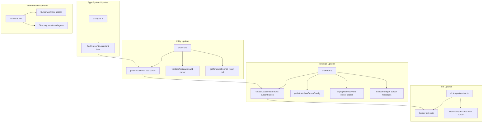
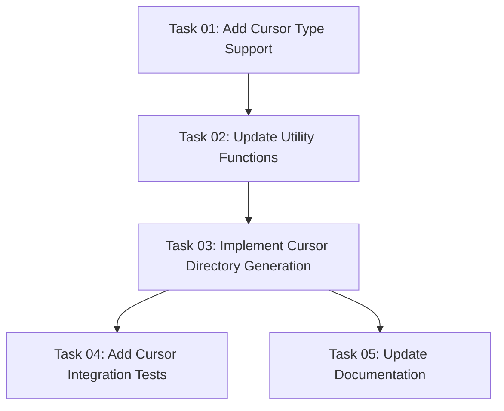

# Plan: Add Cursor Assistant Support

## Original Work Order

> add support for Cursor.
>
> See documentation for commands: https://cursor.com/docs/agent/chat/commands and https://cursor.com/docs/agent/modes#custom-slash-commands
> Cursor no longer has the concept of "agents". They used to be called "custom modes" https://cursor.com/docs/agent/modes#custom-modes-removed
>
> Think harder and use tools

## Executive Summary

This plan adds Cursor as a supported AI assistant in the AI Task Manager CLI. Cursor is a popular AI-powered code editor that supports custom slash commands stored in the `.cursor/commands/` directory. The implementation follows the existing pattern established for other assistants (Claude, Gemini, OpenCode, Codex, GitHub), requiring minimal code changes due to Cursor's Markdown-based command format which is identical to Claude's.

The key architectural decision is to use a nested directory structure (`.cursor/commands/tasks/`) consistent with Claude and Gemini, since Cursor's documentation specifies subdirectory support within `.cursor/commands/`. This maintains consistency with the existing codebase patterns while leveraging Cursor's native command discovery mechanism.

## Context

### Current State vs Target State

| Current State | Target State | Why? |
|--------------|--------------|------|
| 5 supported assistants: claude, codex, gemini, github, opencode | 6 supported assistants: claude, codex, **cursor**, gemini, github, opencode | Cursor is a widely-used AI code editor that would benefit from task management workflow integration |
| No `.cursor/` directory generation | Generate `.cursor/commands/tasks/` with 7 command templates | Cursor users need slash commands to execute the AI Task Manager workflow |
| Assistant type union excludes cursor | `Assistant` type includes `'cursor'` | Type safety and validation for Cursor assistant |

### Background

Cursor is an AI-powered code editor built on VS Code that has gained significant popularity. According to the official documentation:

1. **Command Storage**: Commands are stored in `.cursor/commands/` directory (project-level) or `~/.cursor/commands` (global-level)
2. **File Format**: Plain Markdown files with descriptive names (e.g., `review-code.md`, `write-tests.md`)
3. **Command Discovery**: Cursor automatically detects and displays available commands when typing `/`
4. **Beta Status**: The feature is explicitly noted as beta with potential syntax changes
5. **Custom Modes Deprecation**: Custom modes were removed in Cursor 2.1, replaced by custom slash commands

The implementation is straightforward because Cursor uses the same Markdown format as Claude, with the same `$ARGUMENTS` placeholder convention.

## Architectural Approach



### Type System Extension

**Objective**: Add Cursor to the Assistant type union for type safety

The `Assistant` type in `src/types.ts` will be extended to include `'cursor'`. This ensures type-safe handling of Cursor throughout the codebase and enables compile-time validation.

### Utility Function Updates

**Objective**: Enable Cursor validation and format detection

Three utility functions in `src/utils.ts` require updates:
- `parseAssistants()`: Add 'cursor' to the valid assistants list
- `validateAssistants()`: Add 'cursor' to validation array
- `getTemplateFormat()`: Return 'md' for Cursor (same as Claude)

### Init Command Logic

**Objective**: Generate Cursor command structure during initialization

The `src/index.ts` file requires the following changes:
- Add Cursor handling in `createAssistantStructure()` using nested directory structure (`.cursor/commands/tasks/`)
- Add `hasCursorConfig` to `getInitInfo()` for existing installation detection
- Add Cursor output formatting in the console messages
- Cursor uses Markdown format identical to Claude, so no special template processing is needed

### Directory Structure

The generated structure for Cursor will be:

```
.cursor/
└── commands/
    └── tasks/
        ├── create-plan.md
        ├── refine-plan.md
        ├── generate-tasks.md
        ├── execute-task.md
        ├── execute-blueprint.md
        ├── fix-broken-tests.md
        └── full-workflow.md
```

Commands will be invoked as `/tasks/create-plan`, `/tasks/generate-tasks`, etc.

## Risk Considerations and Mitigation Strategies

<details>
<summary>Technical Risks</summary>

- **Cursor Beta Status**: The slash commands feature is in beta and may change
    - **Mitigation**: Implementation uses standard Markdown format with no Cursor-specific extensions, making future adaptations straightforward

- **Command Discovery Path**: Cursor may not discover commands in nested subdirectories
    - **Mitigation**: The documentation shows examples with descriptive file names in the commands directory, suggesting flat structure support; however, testing will validate nested structure works
</details>

<details>
<summary>Implementation Risks</summary>

- **Template Variable Compatibility**: Cursor may handle `$ARGUMENTS` differently than Claude
    - **Mitigation**: Cursor's documentation shows parameters following commands naturally; the existing Markdown templates should work without modification

- **Directory Naming Conflicts**: `.cursor/` directory may conflict with Cursor's own configuration
    - **Mitigation**: Cursor explicitly uses `.cursor/commands/` for custom commands, and our structure uses a `tasks/` subdirectory to isolate task management commands
</details>

## Success Criteria

### Primary Success Criteria

1. Running `npx ai-task-manager init --assistants cursor` creates `.cursor/commands/tasks/` directory with all 7 command templates
2. All existing tests pass without modification
3. New Cursor-specific tests validate directory structure, file content, and multi-assistant scenarios
4. Cursor correctly discovers and executes the generated commands (manual verification)

## Resource Requirements

### Development Skills

- TypeScript development for type system and logic updates
- Jest testing for integration tests
- Understanding of the existing assistant addition pattern (Codex/GitHub serve as references)

### Technical Infrastructure

- Node.js and npm for development and testing
- Cursor IDE for manual verification of command discovery
- Existing test framework (Jest) for automated testing

## Integration Strategy

The implementation integrates with existing systems through:

1. **Type System**: Extends the `Assistant` union type, maintaining type safety across the codebase
2. **Validation Pipeline**: Adds to existing validation arrays in utility functions
3. **Template System**: Reuses existing Markdown templates without modification (same as Claude)
4. **Test Infrastructure**: Follows established test patterns from Codex and GitHub assistant tests

## Notes

- Cursor is similar to Claude in that both use Markdown format with `$ARGUMENTS` placeholder
- Unlike Codex (which requires manual file copying to home directory), Cursor discovers project-level commands automatically
- The nested `tasks/` subdirectory structure maintains consistency with Claude and Gemini implementations
- Consider future enhancement: Global commands support via `~/.cursor/commands` if users request it

## Task Dependencies



## Execution Blueprint

**Validation Gates:**
- Reference: `/config/hooks/POST_PHASE.md`

### ✅ Phase 1: Type System Foundation
**Parallel Tasks:**
- ✔️ Task 01: Add Cursor to Assistant Type

### ✅ Phase 2: Utility Layer Updates
**Parallel Tasks:**
- ✔️ Task 02: Update Utility Functions for Cursor Support (depends on: 01)

### ✅ Phase 3: Core Implementation
**Parallel Tasks:**
- ✔️ Task 03: Implement Cursor Directory Structure Generation (depends on: 02)

### ✅ Phase 4: Quality Assurance and Documentation
**Parallel Tasks:**
- ✔️ Task 04: Add Cursor Integration Tests (depends on: 03)
- ✔️ Task 05: Update Documentation for Cursor Support (depends on: 03)

### Post-phase Actions

After each phase completion:
1. Run validation gates defined in `/config/hooks/POST_PHASE.md`
2. Verify all tasks in the phase have status "completed"
3. Ensure no regressions in existing functionality
4. Run `npm test` to verify all tests pass
5. Run `npm run build` to ensure TypeScript compilation succeeds

### Execution Summary
- Total Phases: 4
- Total Tasks: 5
- Maximum Parallelism: 2 tasks (in Phase 4)
- Critical Path Length: 4 phases
- Estimated Completion: All tasks are low complexity (≤3), enabling rapid sequential execution

---

## Execution Summary

**Status**: ✅ Completed Successfully
**Completed Date**: 2025-12-02

### Results

Successfully added Cursor as the 6th supported AI assistant to the AI Task Manager CLI. All implementation objectives met:

**Type System Updates**:
- Extended `Assistant` type in src/types.ts to include 'cursor'
- TypeScript compilation succeeds without errors

**Utility Function Updates**:
- Updated parseAssistants() to accept 'cursor' as valid input
- Updated validateAssistants() to recognize 'cursor' as valid
- Updated getTemplateFormat() to return 'md' for Cursor (Markdown format)
- Fixed test expectations to include cursor in error messages

**Initialization Logic**:
- Added hasCursorConfig detection in getInitInfo()
- Cursor leverages existing template processing (nested structure like Claude/Gemini)
- Manual testing confirmed: `init --assistants cursor` creates .cursor/commands/tasks/ with all 7 command files

**Testing**:
- Added 29 new integration tests for Cursor
- Test count increased from 140 to 148 tests
- All tests pass in 12 seconds
- Tests verify directory structure, file creation, Markdown format, and multi-assistant scenarios

**Documentation**:
- Updated AGENTS.md with comprehensive Cursor documentation
- Added Cursor to Core Value Proposition (6 assistants)
- Added initialization examples and workflow instructions
- Updated directory structure diagram
- Added detailed Cursor Workflow section with command examples

**Git History**:
- 4 atomic commits on feature/cursor-assistant-support branch
- Each phase committed separately with descriptive messages
- All commits pass linting and testing

### Noteworthy Events

**Smooth Implementation**: All tasks completed without significant issues. The existing architecture's modularity and consistent patterns made adding a new assistant straightforward.

**Test Adjustments**: Required updating test expectations in src/__tests__/utils.test.ts to include 'cursor' in validation error messages. This was expected and quick to fix.

**Linter Formatting**: ESLint auto-formatted arrays in src/utils.ts to multi-line format, which improved readability.

**Manual Verification**: Successfully tested Cursor initialization in /tmp/test-cursor directory, confirming all 7 command files generated correctly with proper Markdown format.

**Parallel Execution**: Phase 4 successfully executed testing and documentation tasks in parallel using specialized agents, demonstrating the blueprint execution pattern.

### Recommendations

**Next Steps**:
1. Merge feature branch to main after review
2. Test Cursor commands in actual Cursor IDE to validate command discovery
3. Monitor Cursor's slash commands feature evolution (currently in beta)
4. Consider adding Cursor to CI/CD test matrix for ongoing validation

**Future Enhancements**:
- Add global commands support via `~/.cursor/commands` if users request it
- Create Cursor-specific examples in documentation once feature stabilizes
- Consider adding Cursor IDE detection to provide tailored workflow suggestions

**Documentation Updates**:
- Update CHANGELOG.md with new Cursor support
- Update README.md to mention 6 supported assistants
- Consider creating a migration guide for existing users
