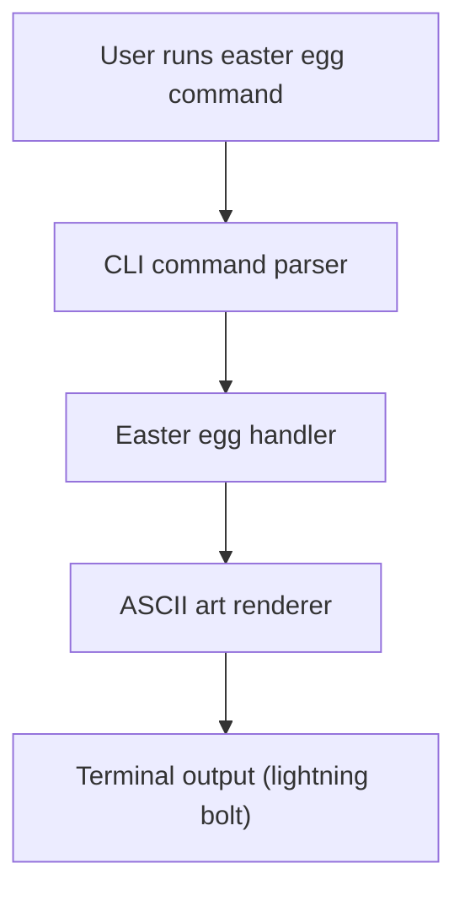
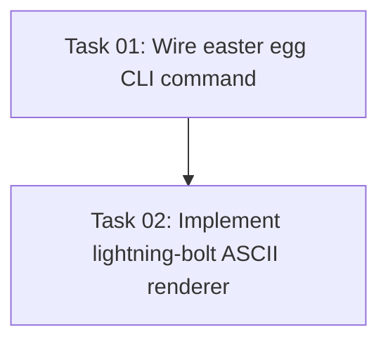

# Plan: Easter Egg Lightning Bolt Command

## Original Work Order
> I need to have an Easter egg command. Thank you. that when executed it will print on the screen A lightning bolt. in ASCII Art.

## Executive Summary

This plan describes how to introduce a small, self-contained easter egg command that, when invoked, prints a lightning bolt rendered in ASCII art to the user’s terminal. The command should behave consistently with the existing CLI ergonomics, but remain non-essential and lightweight so it does not affect core workflows.

The approach focuses on adding a single, discoverable-but-hidden command entry point that delegates to a compact implementation responsible only for rendering the ASCII art and exiting cleanly. Care is taken to avoid scope creep (no configuration, theming, or dynamic behavior) while ensuring the feature is easy to maintain and does not interfere with the rest of the task-manager tooling.

## Context

### Current State vs Target State

| Current State | Target State | Why? |
|--------------|-------------|------|
| The CLI has no easter egg or playful output related to a lightning bolt | The CLI exposes an easter egg command that prints a static lightning bolt in ASCII art | Provide a small delightful surprise for users without impacting core functionality |
| All commands are purely functional and focused on task and plan management | There is exactly one optional, non-critical command for fun | Align with user’s request while keeping the rest of the tool focused and professional |
| No command prints large ASCII art graphics | A dedicated command prints a fixed lightning bolt pattern and exits | Centralize the behavior in one clearly scoped location |

### Background

The user explicitly requested an easter egg command that prints a lightning bolt using ASCII art. There is no requirement to animate the output, parameterize the design, or support multiple art variants. The implementation should therefore remain minimal: one command entry, one implementation function, and simple, predictable console output.

The existing CLI already parses commands and subcommands; the easter egg should plug into this existing mechanism rather than introducing a new CLI framework or altering the task-management flow. This keeps the feature easy to remove or modify in the future while still delivering the requested behavior.

## Architectural Approach

The implementation will wire a new easter egg command into the existing CLI layer, backed by a small module that prints a static lightning-bolt ASCII art to standard output. The design keeps concerns separated: command registration, output formatting, and testing are each handled in their respective layers without introducing new abstractions.

### CLI Command Integration
**Objective**: Expose a single easter egg command that users can invoke from the existing CLI without impacting other commands.

The CLI layer will declare a new command (or subcommand, following existing conventions) whose sole responsibility is to route control to the easter egg handler. It will not accept flags or arguments beyond what the current CLI framework requires for registration. The command will be documented internally in code comments as an easter egg, but it will not alter help output beyond what is necessary to make it callable.

### ASCII Art Rendering Module
**Objective**: Centralize the lightning-bolt ASCII art and printing behavior in a small, isolated function.

The easter egg logic will live in a dedicated module that exports a function responsible for writing the lightning bolt ASCII art lines to standard output and then returning cleanly. The ASCII art will be static and hard-coded to avoid any complexity with templates or dynamic styling. This module will avoid external dependencies and will not modify global state, ensuring that its only side effect is the intended terminal output.

### Non-Interference with Existing Behavior
**Objective**: Ensure that the easter egg behaves correctly in practice and does not interfere with core commands, without adding explicit automated tests that would reveal the surprise.

Validation for this feature will rely on lightweight, manual checks during development (running the command locally and visually confirming the lightning bolt output) while intentionally omitting dedicated automated tests that encode the exact ASCII art. This keeps the easter egg discoverable and surprising for users, while still relying on the existing test suite to protect the broader CLI behavior.

## Risk Considerations and Mitigation Strategies

Technical Risks

- **Output formatting inconsistencies across environments**: Terminal width or font differences might slightly change how the ASCII art is perceived.
    - **Mitigation**: Use a compact, vertically oriented lightning-bolt design that does not rely on exact alignment across many columns and avoid color or advanced control sequences.

- **Unexpected interactions with existing CLI parsing**: Introducing a new command could conflict with existing names or options.
    - **Mitigation**: Choose a unique, clearly non-conflicting command name that follows the project’s naming conventions and verify that existing commands still parse correctly.

Implementation Risks

- **Scope creep beyond the requested easter egg**: There is a temptation to add themes, animations, or additional artwork.
    - **Mitigation**: Keep the module narrowly focused on a single, static lightning-bolt design and avoid introducing configuration or extra features not mentioned in the work order.

- **Maintenance overhead for a non-critical feature**: Overly complex implementation would not be justified for an easter egg.
    - **Mitigation**: Implement the feature using straightforward, easily readable code with minimal surface area, so future maintenance is trivial.

## Success Criteria

### Primary Success Criteria
1. Invoking the easter egg command through the CLI prints a recognizable lightning bolt in ASCII art to the terminal and then exits successfully.
2. The addition of the easter egg command does not alter the behavior of existing commands or the overall task-manager workflow.
3. All existing tests continue to pass, without introducing new automated tests that would reveal the easter egg’s exact ASCII art in test fixtures or snapshots.

## Resource Requirements

### Development Skills
Basic familiarity with the existing CLI command structure and routing in this repository, along with comfort writing and testing simple output-producing functions.

### Technical Infrastructure
Existing project toolchain, including the TypeScript/JavaScript build system, test runner, and CLI packaging setup already used in this repository. No new external dependencies are required.

## Integration Strategy

The new easter egg command will be integrated into the existing CLI entry point alongside current commands, following the same initialization and export patterns. Because it is self-contained and has no external dependencies beyond the standard runtime, integration should not require changes to templates, task management scripts, or assistant-specific configuration files.

## Execution Blueprint

### Task Dependency Visualization

### Phase-Based Execution Blueprint

- ✅ **Phase 1**
  - ✔️ Task 01: Wire easter egg CLI command
- ✅ **Phase 2**
  - ✔️ Task 02: Implement lightning-bolt ASCII renderer

All tasks in Phase 1 have been completed and validated before starting Phase 2. Within each phase, tasks can be executed in parallel (though in this simple plan each phase has a single task).

## Notes

This easter egg is intentionally minimal and isolated. Future adjustments to the ASCII art itself can be made within the dedicated rendering module without affecting the broader architecture or command surface, and should continue to avoid adding explicit automated tests that would spoil the surprise.

## Execution Summary

**Status**: ✅ Completed Successfully  
**Completed Date**: 2025-12-03

### Results
The AI Task Manager CLI now exposes a small easter egg command that, when invoked, prints a static lightning bolt in ASCII art to the terminal without impacting existing commands or workflows.

### Noteworthy Events
No significant issues encountered. The renderer was implemented as a dedicated module and integrated via a single new CLI command, and the output was manually verified from the compiled CLI.

### Recommendations
If the CLI surface evolves, briefly re-verify that the easter egg command name does not conflict with new commands, and keep the ASCII art implementation simple to avoid maintenance overhead.

