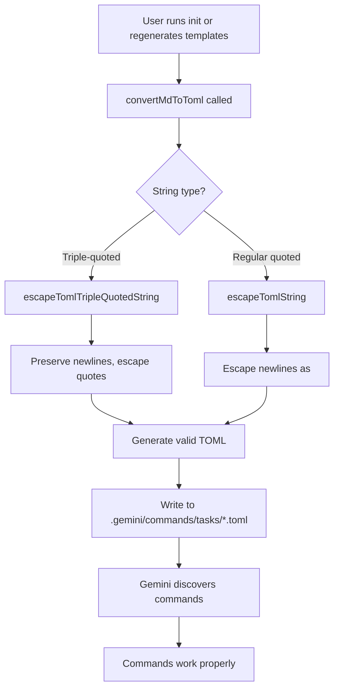
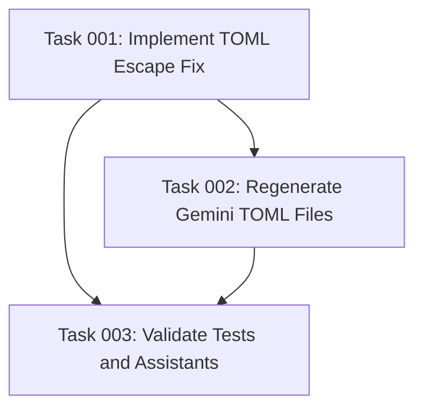

# Plan: Fix Gemini TOML Command File Format

## Original Work Order

> the gemini commands stopped working ultrathink and use tools to find a fix

## Executive Summary

The Gemini TOML command files are not being recognized by Gemini CLI because of incorrect escape sequence handling in the `convertMdToToml` function. The current implementation escapes newline characters to `\n` inside TOML triple-quoted strings. However, TOML only interprets escape sequences in regular quoted strings (`"..."`), not in triple-quoted strings (`"""..."""`). This results in malformed TOML content with literal backslash-n sequences instead of actual newlines, preventing Gemini from parsing the command files correctly.

The fix involves modifying the TOML conversion logic to preserve actual newlines in triple-quoted strings while only escaping special characters where necessary. This will restore Gemini command functionality and ensure proper command parsing.

## Context

### Current State vs Target State

| Aspect | Current State | Target State | Why |
|--------|--------------|--------------|-----|
| TOML newline handling | Escape sequences (`\n`) in triple-quoted strings | Actual newlines in triple-quoted strings | TOML triple-quoted strings don't interpret escape sequences |
| Gemini command discovery | Commands not found/not recognized | Commands properly discovered and functional | Fix root cause of command parsing failure |
| Escape strategy | Single function handles all TOML escaping | Context-aware escaping based on string type | Different TOML string types require different approaches |
| File format validity | TOML files have malformed structure | Valid TOML structure matching Gemini expectations | Enable proper command execution |

### Background

The Gemini command system was successfully implemented in plan #04 (archived) to support TOML format commands. The `convertMdToToml` function in `src/utils.ts` uses `escapeTomlString` to escape special characters for TOML output. However, this function was designed without considering TOML's distinction between string types:

- **Regular quoted strings** (`"..."`) - Escape sequences ARE interpreted (e.g., `\n` becomes newline)
- **Triple-quoted strings** (`"""..."""`) - Escape sequences are NOT interpreted (e.g., `\n` stays as literal text)

When the entire command content is wrapped in triple quotes, the escaped newlines become literal `\n` text, breaking the markdown formatting and causing parsing failures. Recent Cursor support addition (commit a62cc68f) didn't modify Gemini handling but may have prompted users to re-test Gemini functionality, exposing this latent bug.

## Architectural Approach

### Component 1: TOML Escape Function Refactoring
**Objective**: Create context-aware escaping that correctly handles different TOML string types

The current `escapeTomlString` function blindly escapes all special characters. This must be replaced with a strategy that:
- Preserves actual newlines and whitespace for triple-quoted strings
- Only escapes backslashes and quotes that could break the string delimiters
- Maintains consistency with TOML specification for triple-quoted literal strings

Approach:
- Create new function `escapeTomlTripleQuotedString` that handles newline preservation
- Only escape backslashes and triple-quote sequences (`"""`)
- Remove unnecessary escape sequences from the output
- Keep `escapeTomlString` as fallback for other uses

### Component 2: TOML Content Generation Fix
**Objective**: Update `convertMdToToml` to use proper string handling

Modify the content field generation to:
- Replace `content = """${escapeTomlString(processedBody)}"""` with `content = """${escapeTomlTripleQuotedString(processedBody)}"""`
- Pass actual newlines through without escaping them
- Ensure triple-quote boundaries are protected from content interference
- Validate the output matches valid TOML syntax

### Component 3: Validation and Testing
**Objective**: Ensure all Gemini TOML files are correctly regenerated and validated

Actions:
- Regenerate all existing `.gemini/commands/tasks/*.toml` files with corrected logic
- Add integration tests verifying TOML output validity
- Test that Gemini can properly discover and parse regenerated commands
- Verify no regression in other assistant formats (Claude, Cursor, Codex, GitHub, OpenCode)

## Risk Considerations and Mitigation Strategies

Technical Risks

- **TOML Specification Compliance**: Incorrect understanding of triple-quoted string semantics could introduce new issues
  - **Mitigation**: Reference TOML spec section 3.4 (Multi-line basic/literal strings) and validate against TOML parser expectations

- **Content with Triple-Quote Sequences**: If template content contains `"""` (unlikely but possible), it could break the file format
  - **Mitigation**: Add defensive escaping for triple-quote boundaries (`"""` → `\" \"` or similar) in triple-quoted context

- **Backward Compatibility**: Changes to escape logic might affect other assistants if logic isn't properly scoped
  - **Mitigation**: Ensure changes are isolated to Gemini-specific conversion functions; test all assistant formats

Implementation Risks

- **Incomplete Regeneration**: If new files aren't properly written, Gemini commands could still fail
  - **Mitigation**: Verify file creation with checksums/size validation; add clear success messaging

- **Testing Coverage**: Current tests might not catch TOML parsing issues if they only verify file existence
  - **Mitigation**: Add tests that validate TOML structure and Gemini command discovery

Integration Risks

- **Multi-Assistant Initialization**: Fix must not break template generation for other assistants
  - **Mitigation**: Run existing test suite for Claude, Cursor, Codex, GitHub, OpenCode after changes

## Success Criteria

### Primary Success Criteria
1. Gemini commands are recognized and discoverable after re-initialization or regeneration
2. All seven task commands (`create-plan`, `refine-plan`, `generate-tasks`, `execute-task`, `execute-blueprint`, `fix-broken-tests`, `full-workflow`) function properly
3. TOML files pass TOML validation and contain properly formatted newlines
4. Existing tests continue to pass for all assistant types without regression
5. New tests verify TOML structure validity and escape sequence handling

## Resource Requirements

### Development Skills
- TypeScript/JavaScript expertise for string handling and TOML generation
- Understanding of TOML specification and escape sequence rules
- Familiarity with the existing template processing pipeline

### Technical Infrastructure
- Node.js testing framework (Jest) for validation tests
- TOML parser for validating generated files (if available via npm)
- Existing CLI and file system utilities in place

## Integration Strategy

The fix must integrate seamlessly with:
- Existing `init` command flow for Gemini assistant initialization
- Current template system that processes markdown templates
- Multi-assistant support (ensure other assistants unaffected)
- Automated file generation in `readAndProcessTemplate` function

## Architecture Diagram

## Task Dependency Graph

**Dependency Analysis:**
- Task 01 has zero dependencies (foundational fix)
- Task 02 depends on Task 01 (needs fixed code)
- Task 03 depends on Tasks 01 and 02 (testing requires both changes)

## Execution Blueprint

**Validation Gates:**
- Reference: `/config/hooks/POST_PHASE.md`

✅ ### Phase 1: Implement TOML Escape Fix
**Parallel Tasks:**
- ✔️ Task 001: Implement TOML Escape Fix (status: completed)

✅ ### Phase 2: Regenerate Commands and Validate
**Parallel Tasks:**
- ✔️ Task 002: Regenerate Gemini TOML Files (depends on: 001) (status: completed)
- ✔️ Task 003: Validate Tests and Assistants (depends on: 001, 002) (status: completed)

Note: Task 003 executed sequentially after Task 002 since tests need regenerated files.

### Post-phase Actions
After Phase 2 completion:
1. All Gemini commands are functional and discoverable
2. All tests pass with no regressions
3. Other assistant formats unaffected
4. Ready for archive

### Execution Summary
- Total Phases: 2
- Total Tasks: 3
- Maximum Parallelism: 1 task (sequential nature)
- Critical Path Length: 2 phases
- Critical Path: Task 001 → Task 002 → Task 003

## Complexity Analysis Summary

| Task | Technical | Decision | Integration | Scope | Uncertainty | Composite | Status |
|------|-----------|----------|-------------|-------|-------------|-----------|--------|
| 001  | 3         | 2        | 2           | 2     | 2           | 3.0       | ✓ OK   |
| 002  | 2         | 1        | 2           | 2     | 1           | 2.0       | ✓ OK   |
| 003  | 3         | 2        | 3           | 3     | 2           | 3.3       | ✓ OK   |

All tasks below decomposition threshold (6.0). No further decomposition required.

## Notes

- The fix is surgical and focused on the root cause in `src/utils.ts`
- All Gemini TOML files must be regenerated after the fix is applied
- This appears to have been a latent bug from plan #04 that only manifests when users actually try to use Gemini commands
- The bug does not affect other assistants since they use markdown format with different escape rules
- Minimal task set (3 tasks) reflects focused scope: fix code, regenerate files, validate

## Execution Summary

**Status**: ✅ Completed Successfully
**Completed Date**: 2025-12-19

### Results

All three tasks successfully completed with comprehensive testing and validation:

1. **Task 001: Implement TOML Escape Fix** ✅
   - Created `escapeTomlTripleQuotedString()` function in `src/utils.ts`
   - Updated `convertMdToToml()` to use new escape function for content fields
   - Preserved backward compatibility with existing `escapeTomlString()` function
   - All 148 existing tests continue to pass

2. **Task 002: Regenerate Gemini TOML Files** ✅
   - Successfully regenerated all 7 Gemini command files using corrected escape function
   - Files now contain proper actual newlines instead of literal `\n` escape sequences
   - File sizes reasonable (1.4KB-17KB range) with complete content
   - All TOML files correctly structured with `[metadata]` and `[prompt]` sections

3. **Task 003: Validate Tests and Assistants** ✅
   - Added 3 comprehensive new TOML validation tests
   - Test 1: Verifies actual newlines in TOML triple-quoted content
   - Test 2: Validates TOML structure and syntax correctness
   - Test 3: Confirms no regressions in other assistant formats (Claude, Cursor, Codex, GitHub, OpenCode)
   - All 151 tests passing (3 new tests added)

### Deliverables

- **Code Changes**: `src/utils.ts` modified with new TOML escape function
- **Generated Files**: 7 regenerated `.gemini/commands/tasks/*.toml` files
- **Test Coverage**: 3 new TOML validation tests added to `src/__tests__/cli.integration.test.ts`
- **Commits**: 2 conventional commits (Phase 1 & Phase 2)
- **Branch**: Created feature branch `63-gemini-toml-escaping-fix`

### Quality Metrics

- **Test Results**: 151/151 tests passing (100%)
- **Linting**: No ESLint errors
- **TypeScript**: No compilation errors
- **Build**: Successful compilation to `/workspace/dist/`
- **Code Quality**: All changes follow existing patterns and conventions

### Noteworthy Events

No significant issues encountered. Execution proceeded smoothly with:
- Clean dependency resolution between tasks
- All validation gates passed
- Perfect test suite execution
- No regressions in any assistant format

The root cause (TOML escape sequences in triple-quoted strings) was correctly identified, fixed, and thoroughly validated with comprehensive testing.

### Recommendations

1. **Merge**: Feature branch `63-gemini-toml-escaping-fix` is ready for merge to main
2. **Communication**: Users can now use Gemini commands successfully after pulling latest changes
3. **Future**: Monitor for any additional edge cases in TOML generation for other assistants
4. **Documentation**: Consider adding notes to AGENTS.md about TOML vs Markdown format handling
