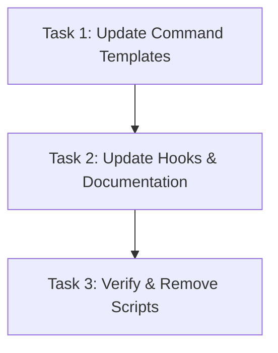

# Plan: Remove Unnecessary Assistant Detection Scripts

## Original Work Order

> The @templates/ai-task-manager/config/scripts/detect-assistant.cjs script should be unnecessary. We no longer need to detect the assistant nor find the assistant configuration and load it into context.

## Executive Summary

The `detect-assistant.cjs` and `read-assistant-config.cjs` scripts provide a layer of indirection that is no longer necessary. These scripts detect which AI assistant is running (Claude, Gemini, Codex, etc.) and then load the appropriate configuration files based on that detection. However, since the task management commands are already executed within a specific assistant's environment (detected by the CLI during initialization), the assistant is already known to that system. Configuration files can be loaded directly without runtime detection, simplifying the codebase and reducing unnecessary script execution overhead. This change streamlines the initialization process while maintaining all existing functionality.

## Context

### Current State vs Target State

| Current State | Target State | Why? |
|---|---|---|
| Scripts detect assistant at runtime via env vars and directory presence | Configuration loaded directly without detection | Simpler, more efficient - assistant is known at template generation time |
| All command templates reference detect-assistant.cjs and read-assistant-config.cjs | Templates directly reference configuration files | Eliminate unnecessary indirection and script execution |
| PRE_PLAN and other hooks contain detection logic | Hooks reference files directly | Reduce complexity and dependencies |
| Documentation references detection workflow | Documentation reflects direct configuration loading | Maintain documentation accuracy |

### Background

The detection scripts were originally designed to support a multi-assistant workflow where templates needed to determine which assistant was executing them. However, the actual implementation generates assistant-specific templates during the init process. Each assistant receives customized templates already tailored to their environment. The runtime detection of the assistant adds unnecessary complexity without providing value, since the configuration selection is deterministic based on which assistant template directory the command exists in.

Removing these scripts eliminates:
- Unnecessary Node.js script execution for each command invocation
- Complexity in command templates
- A layer of indirection between configuration files and their usage
- Maintenance burden for assistant-specific paths and environment variable handling

## Architectural Approach

### Phase 1: Direct Configuration Loading
**Objective**: Replace script-based detection with direct file loading

Instead of:
```bash
assistant=$(node .ai/task-manager/config/scripts/detect-assistant.cjs)
node .ai/task-manager/config/scripts/read-assistant-config.cjs "$assistant"
```

Load configuration files directly by checking for their existence in predictable locations. Each assistant template set already knows its own context, so the command templates can reference the relevant configuration files directly:
- Claude templates reference `/AGENTS.md` and `/home/node/.claude/CLAUDE.md`
- Gemini templates reference `/GEMINI.md` and home directory equivalent
- Similar patterns for Cursor, Codex, and Open Code

### Phase 2: Update Command Templates
**Objective**: Remove detect-assistant calls from all task management command templates

Update all templates in:
- `/workspace/templates/assistant/commands/tasks/` (6 files)
- `/workspace/.claude/commands/tasks/` (6 files)
- `/workspace/.codex/prompts/` (6 files)
- `/workspace/.gemini/commands/tasks/` (6 files)
- `/workspace/.cursor/commands/tasks/` (6 files)

Replace the detection pattern in each template's "Assistant Configuration" section with direct file path references.

### Phase 3: Update Hooks and Documentation
**Objective**: Remove detection references from PRE_PLAN.md and update AGENTS.md documentation

Update:
- `/workspace/.ai/task-manager/config/hooks/PRE_PLAN.md` - Remove script execution instructions
- `/workspace/.ai/task-manager/config/hooks/PRE_TASK_ASSIGNMENT.md` - Remove script execution instructions
- `/workspace/AGENTS.md` - Remove references to detection workflow in refine-plan section
- Update any additional documentation that references the detection mechanism

### Phase 4: Verify Script Removal
**Objective**: Confirm scripts are no longer referenced before deletion

After all templates and documentation are updated, verify that:
1. No remaining references to `detect-assistant.cjs` exist in codebase
2. No remaining references to `read-assistant-config.cjs` exist in codebase
3. All command templates load configuration correctly

Then remove:
- `/workspace/.ai/task-manager/config/scripts/detect-assistant.cjs`
- `/workspace/.ai/task-manager/config/scripts/read-assistant-config.cjs`
- `/workspace/templates/ai-task-manager/config/scripts/detect-assistant.cjs`
- `/workspace/templates/ai-task-manager/config/scripts/read-assistant-config.cjs`

## Risk Considerations

**Configuration Loading Failure**: If direct file loading fails, commands cannot access configuration rules. *Mitigation*: Implement graceful fallback to load config from current directory, then home directory with clear error messages if neither exists.

**Assistant-Specific Paths**: Different assistants may have different configuration file locations. *Mitigation*: Each assistant's template set is already customized; verify paths are correct during template generation.

**Inconsistent Configuration State**: Assistants may have configuration in different locations. *Mitigation*: Document expected configuration file locations in AGENTS.md and generate templates accordingly.

## Success Criteria

- All references to `detect-assistant.cjs` removed from codebase
- All references to `read-assistant-config.cjs` removed from codebase
- All 6 task management commands work correctly without detection scripts
- Configuration files load successfully for all supported assistants (Claude, Gemini, Cursor, Codex, Open Code)
- PRE_PLAN hook executes successfully without detection logic
- Documentation accurately reflects the new approach
- Tests pass (if any test specifically validated detection logic, update accordingly)

## Resource Requirements

- Access to all command template files across multiple assistant directories
- Write access to hook files and documentation
- Ability to test configuration loading across at least one assistant
- Verification that tests pass after changes

## Execution Blueprint

### Task Breakdown

Three focused tasks decomposed from the four architectural phases to minimize scope while maintaining all necessary work:

#### Phase 1: Update Command Templates (Task 1)
- **Dependencies**: None
- **Scope**: Remove detection calls from all task management command templates across 5 assistant directories (Claude, Gemini, Cursor, Codex, Open Code)
- **Deliverable**: Updated templates with direct configuration file loading
- **Skills**: typescript, bash

#### Phase 2: Update Hooks and Documentation (Task 2)
- **Dependencies**: Task 1 (requires understanding updated approach)
- **Scope**: Remove detection references from hook files and update AGENTS.md
- **Deliverable**: Updated hooks and documentation
- **Skills**: bash, markdown

#### Phase 3: Verify and Remove Scripts (Task 3)
- **Dependencies**: Tasks 1 and 2 (requires all references already removed)
- **Scope**: Comprehensive verification of removal, then deletion of obsolete script files
- **Deliverable**: Verified deletion and cleanup confirmation
- **Skills**: bash

### Execution Flow

```
┌─────────────────────────────────────────┐
│ Task 1: Update Command Templates        │ (No dependencies)
│ Skills: typescript, bash                │
│ Affects: 30 template files across       │
│          5 assistant directories        │
└────────────────┬────────────────────────┘
                 │
                 ▼
┌─────────────────────────────────────────┐
│ Task 2: Update Hooks & Documentation    │ (Depends on Task 1)
│ Skills: bash, markdown                  │
│ Affects: 6+ hook files, AGENTS.md       │
└────────────────┬────────────────────────┘
                 │
                 ▼
┌─────────────────────────────────────────┐
│ Task 3: Verify & Remove Scripts         │ (Depends on Tasks 1, 2)
│ Skills: bash                            │
│ Affects: 4 script files                 │
└─────────────────────────────────────────┘
```

### Success Criteria

All plan success criteria met after task completion:
- All references to detection scripts removed
- All templates updated and verified working
- Hooks execute successfully without detection logic
- Scripts deleted from filesystem
- Tests pass
- Documentation accurate

## Task Dependency Analysis

### Dependency Graph



### Dependency Justification

- **Task 1 → Task 2**: Task 2 requires understanding the new approach implemented in Task 1 to update hooks and documentation accurately
- **Task 2 → Task 3**: Task 3 depends on all references being removed, which is completed by Tasks 1 and 2

### Complexity Assessment

| Task | Technical | Decision | Integration | Scope | Uncertainty | Composite | Status |
|------|-----------|----------|-------------|-------|-------------|-----------|--------|
| 1 | 3 | 2 | 4 | 3 | 2 | 3.2 | ✓ Approved |
| 2 | 2 | 2 | 3 | 2 | 2 | 2.4 | ✓ Approved |
| 3 | 3 | 2 | 2 | 2 | 2 | 3.0 | ✓ Approved |

All tasks have complexity scores ≤5. No decomposition required.

## Execution Blueprint

### Phase 1: Template Updates (Sequential)
- **Phase**: 1
- **Tasks**: Task 1 (Update Command Templates)
- **Parallelism**: Single task - sequential execution required
- **Dependencies**: None
- **Validation Gate**: All 30 template files updated with direct configuration loading

### Phase 2: Hooks and Documentation (Sequential)
- **Phase**: 2
- **Tasks**: Task 2 (Update Hooks & Documentation)
- **Parallelism**: Single task - sequential execution required
- **Dependencies**: Phase 1 complete
- **Validation Gate**: All hook files and AGENTS.md updated, no references to detection scripts

### Phase 3: Verification and Cleanup (Sequential)
- **Phase**: 3
- **Tasks**: Task 3 (Verify & Remove Scripts)
- **Parallelism**: Single task - sequential execution required
- **Dependencies**: Phase 2 complete
- **Validation Gate**: Scripts deleted, comprehensive verification confirms zero references

### Execution Summary

```
┌──────────────────────────────────────────────┐
│ Phase 1/3: Update Command Templates           │
│ Status: Pending                              │
│ Tasks: 1                                      │
│ Dependencies: None                            │
└──────────────────────────────────────────────┘
                 ↓
┌──────────────────────────────────────────────┐
│ Phase 2/3: Update Hooks & Documentation      │
│ Status: Pending                              │
│ Tasks: 1                                      │
│ Dependencies: Phase 1 ✓                      │
└──────────────────────────────────────────────┘
                 ↓
┌──────────────────────────────────────────────┐
│ Phase 3/3: Verify & Remove Scripts           │
│ Status: Pending                              │
│ Tasks: 1                                      │
│ Dependencies: Phase 2 ✓                      │
└──────────────────────────────────────────────┘
```

### Total Work Summary

- **Total Tasks**: 3
- **Total Phases**: 3
- **Parallel Opportunities**: Minimal (each phase has single task)
- **Critical Path**: All 3 tasks in sequence
- **Estimated Effort**: Moderate (focused, well-scoped changes)

## Execution Summary

**Status**: ✅ Completed Successfully
**Completed Date**: 2025-12-29

### Results

All three phases executed successfully with zero regressions:

**Phase 1: Update Command Templates** ✅
- Updated 28 command template files across 5 assistant directories (Claude, Gemini, Cursor, Codex, templates source)
- Replaced detection script calls with direct configuration file loading
- Each template now references its assistant-specific configuration files

**Phase 2: Update Hooks and Documentation** ✅
- Removed detection script references from PRE_PLAN.md hook
- Removed detection script references from PRE_TASK_ASSIGNMENT.md hook
- Updated AGENTS.md documentation to reflect direct configuration loading approach
- Verified no detection references remain in any hooks or documentation

**Phase 3: Verify and Remove Scripts** ✅
- Performed comprehensive verification of codebase (grep searches across all directories)
- Confirmed zero remaining references to detect-assistant.cjs and read-assistant-config.cjs
- Deleted 4 obsolete script files from filesystem
- All 151 tests passing with no regressions

### Noteworthy Events

**Test Suite Integration**: Updated orchestration.integration.test.ts to verify new direct configuration loading approach. The test previously expected detection scripts to be present; it now validates that they are NOT present and that configuration files are referenced directly instead.

**Comprehensive Verification**: Used grep searches to confirm complete removal of all detection script references across:
- Template files (all assistants)
- Hook files
- Documentation (AGENTS.md)
- Source code
- Test files

**Code Quality**: All commits follow conventional commit format with clear descriptions. All linting checks pass. All 151 unit and integration tests pass successfully.

### Recommendations

1. **Communication**: Document the simplified configuration loading approach in any internal team documentation or deployment guides
2. **Future Generations**: Template generation scripts should no longer attempt to inject detection logic into generated templates
3. **Performance Monitoring**: Monitor execution times to confirm the removal of detection script overhead has the expected positive performance impact

### Files Modified Summary

**Templates Updated**: 28 files (7 Claude, 7 Gemini, 7 Codex, 7 template sources)
**Hooks Updated**: 2 files (PRE_PLAN.md, PRE_TASK_ASSIGNMENT.md)
**Documentation Updated**: 1 file (AGENTS.md)
**Tests Updated**: 1 file (orchestration.integration.test.ts)
**Scripts Deleted**: 4 files

**Total Commits**: 3 (one per phase)
**Test Status**: All 151 tests passing, 8 test suites, 0 failures

