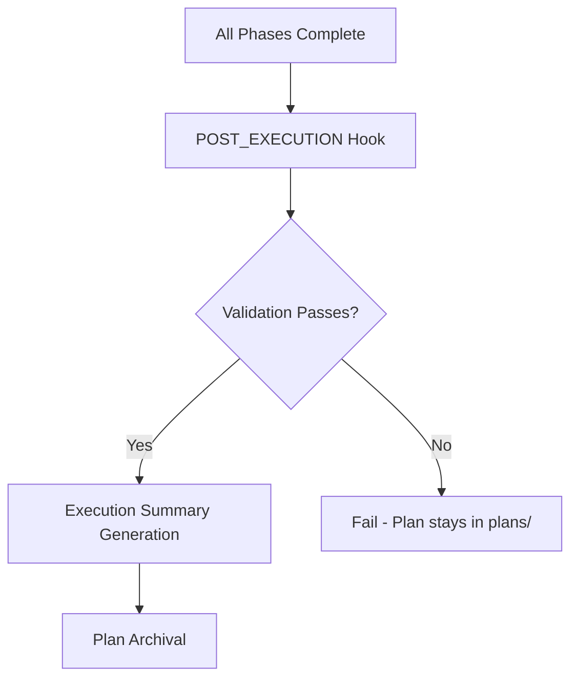
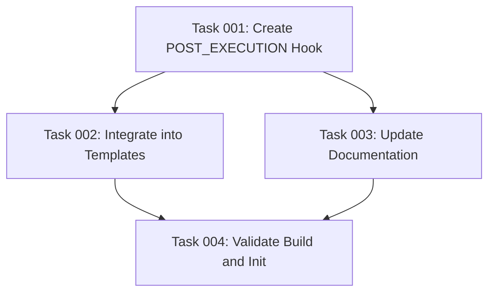

# Plan: POST_EXECUTION Hook

## Original Work Order
> Create a new POST_EXECUTION hook. Remember to add documentation to the hook.

## Executive Summary

Add a `POST_EXECUTION.md` hook file that fires once after all blueprint phases complete, before summary generation and archival. The hook will perform validation gates (linting, tests) and summary/reporting actions. The hook must be integrated into `execute-blueprint.md` and `full-workflow.md` templates, and added to the template source directory so it ships with `npx . init`.

## Context

### Current State vs Target State

| Current State | Target State | Why? |
|---|---|---|
| No hook fires after full blueprint execution | POST_EXECUTION hook runs after all phases complete | Provides a validation and reporting checkpoint before archival |
| Post-execution steps (summary, archival) execute without prior validation | Validation gates (lint, tests) run before summary/archival | Catches issues before marking execution as complete |
| No documentation for a post-execution hook | Hook file is self-documenting with clear purpose and usage | Users can customize post-execution behavior |

### Background

The hook system already follows a consistent pattern: markdown files in `config/hooks/` that are read and executed at specific lifecycle points. Existing hooks include `PRE_PLAN`, `POST_PLAN`, `PRE_PHASE`, `POST_PHASE`, `PRE_TASK_ASSIGNMENT`, `POST_TASK_GENERATION_ALL`, and `POST_ERROR_DETECTION`. There is no hook at the blueprint-level post-execution point.

The `execute-blueprint.md` and `full-workflow.md` templates both have a "Post-Execution Processing" section that currently jumps straight to summary generation and archival. The new hook inserts between "all phases complete" and "summary generation."

## Architectural Approach

### Hook File Creation

**Objective**: Create `POST_EXECUTION.md` in the template hooks directory with validation gates and reporting instructions.

The hook will instruct the AI assistant to:
1. Run the project's linting checks (if configured)
2. Run the project's test suite (if configured)
3. Verify all tasks in the plan have `status: "completed"` in their frontmatter
4. Report a summary of what was accomplished

The hook follows the same documentation pattern as existing hooks (e.g., `POST_PHASE.md`, `POST_PLAN.md`) — a markdown file with a heading, description, and actionable instructions.

### Template Integration

**Objective**: Wire the hook into `execute-blueprint.md` and `full-workflow.md` so it fires at the right lifecycle point.

Both templates have a "Post-Execution Processing" section. The hook reference will be inserted immediately before the existing summary generation step, with a checklist item added to the execution tracking lists.

### Documentation

**Objective**: Document the hook's existence and purpose.

The `AGENTS.md` file does not individually list every hook, so the hook's own markdown content serves as the primary documentation. The hook file itself will contain clear documentation of its purpose, when it fires, and what it does.

## Risk Considerations and Mitigation Strategies

Technical Risks

- **Test suite failures blocking archival**: The hook runs validation that could fail, preventing summary/archival.
    - **Mitigation**: The hook should document that failures keep the plan in `plans/` for debugging, consistent with existing behavior for failed executions.

Implementation Risks

- **Template sync**: Changes to `execute-blueprint.md` and `full-workflow.md` must stay in sync.
    - **Mitigation**: Both templates follow the same structure; the insertion point is identical in both.

## Success Criteria

### Primary Success Criteria
1. `POST_EXECUTION.md` exists in `templates/ai-task-manager/config/hooks/` and is self-documenting
2. `execute-blueprint.md` and `full-workflow.md` reference the hook before summary generation
3. Running `npm run build && npx . init --assistants claude --destination-directory /tmp/test` produces the hook file in the output

## Documentation

- The hook file itself contains its documentation (purpose, trigger point, actions)
- AGENTS.md: No changes needed — hooks are not individually listed there
- **Documentation site** (`docs/`): Multiple pages reference hooks (e.g., `reference.md`, `customization.md`, `customization-extension.md`, `architecture.md`, `core-concepts.md`, `workflows.md`). The new POST_EXECUTION hook must be documented in the relevant docs pages where hooks are listed or described, maintaining consistency with how existing hooks are documented

## Resource Requirements

### Development Skills
- Markdown authoring for the hook file
- Understanding of the template system and hook lifecycle

### Technical Infrastructure
- Node.js build system (`npm run build`)
- Existing template processing pipeline

## Dependency Visualization

## Execution Blueprint

**Validation Gates:**
- Reference: `/config/hooks/POST_PHASE.md`

### ✅ Phase 1: Hook Creation
**Parallel Tasks:**
- ✔️ Task 001: Create POST_EXECUTION.md hook file

### ✅ Phase 2: Integration and Documentation
**Parallel Tasks:**
- ✔️ Task 002: Integrate hook into execute-blueprint and full-workflow templates (depends on: 001)
- ✔️ Task 003: Update documentation pages (depends on: 001)

### ✅ Phase 3: Validation
**Parallel Tasks:**
- ✔️ Task 004: Validate build and init output (depends on: 002, 003)

### Execution Summary
- Total Phases: 3
- Total Tasks: 4
- Maximum Parallelism: 2 tasks (in Phase 2)
- Critical Path Length: 3 phases

## Notes

- The hook file must also be placed in the project's own `.ai/task-manager/config/hooks/` directory (the "live" copy), in addition to the template source directory.
- The `full-workflow.md` template embeds the same execution logic as `execute-blueprint.md`, so both need identical changes.

## Execution Summary

**Status**: ✅ Completed Successfully
**Completed Date**: 2026-02-02

### Results
All 4 tasks completed across 3 phases. The POST_EXECUTION hook was created, integrated into both template files (execute-blueprint.md and full-workflow.md), documented across 6 docs pages, and validated via build, init output, lint, and test suite (178 tests passing).

### Noteworthy Events
- Unstaged changes on main prevented feature branch creation; work was done directly on main.
- The `.ai/task-manager/` directory is gitignored, so only the template source copy of the hook is tracked in git.

### Recommendations
No follow-up actions needed.