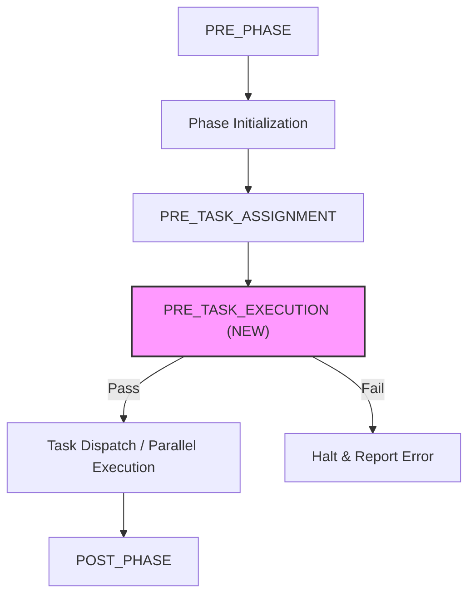
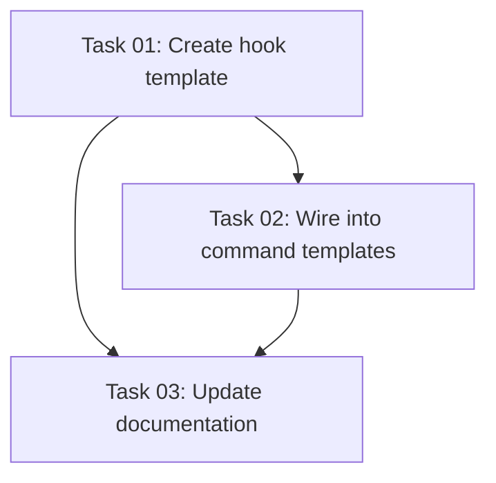

# Plan: Add PRE_TASK_EXECUTION Hook

## Original Work Order

> Add a new PRE_TASK_EXECUTION.md hook template in templates/ai-task-manager/config/hooks/ that is triggered before each individual task execution begins. The hook should:
>
> 1. Follow the existing hook naming convention (PRE_TASK_EXECUTION.md)
> 2. Be referenced in the execute-blueprint and full-workflow orchestration flows, invoked before each task starts
> 3. Support pre-flight validations such as:
>    - Verifying all task dependencies have status "done"
>    - Checking that required tools/dependencies for the task are available
>    - Confirming the working directory is in an expected state
>    - Validating task frontmatter is complete and well-formed
> 4. Halt execution if any pre-flight check fails, similar to how POST_EXECUTION halts on validation gate failures

## Executive Summary

This plan adds a missing lifecycle hook — `PRE_TASK_EXECUTION` — that fires before each individual task begins execution. Today, hooks exist at the phase level (`PRE_PHASE`, `POST_PHASE`) and for agent selection (`PRE_TASK_ASSIGNMENT`), but nothing validates an individual task's readiness before work starts. The new hook fills this gap by performing pre-flight checks (dependency verification, frontmatter validation, working directory state) and halting execution on failure.

The approach follows the established hook conventions exactly: a Markdown template in `templates/ai-task-manager/config/hooks/`, wired into the execute-blueprint and full-workflow command templates via "Read and execute" directives. No new scripts or tooling are required — the hook leverages the existing `check-task-dependencies.cjs` script and standard frontmatter parsing.

## Context

### Current State vs Target State

| Current State | Target State | Why? |
|---|---|---|
| No hook fires before individual task execution | `PRE_TASK_EXECUTION.md` hook runs before each task | Missing lifecycle event leaves no opportunity for task-level pre-flight validation |
| Dependency checks only happen at phase level in `PRE_PHASE.md` | Dependency status re-verified per-task before execution | Phase-level checks may miss status changes from parallel tasks completing within the same phase |
| Task frontmatter is not validated before execution | Frontmatter validated (required fields, valid status) before work begins | Malformed frontmatter causes confusing downstream failures |
| Working directory state unchecked before task start | Clean git state verified before each task | Leftover uncommitted changes from prior tasks can interfere |
| `execute-blueprint.md` goes directly from agent selection to parallel execution | New hook invocation between agent selection and task dispatch | Consistent with PRE/POST pattern used elsewhere in the lifecycle |

### Background

The hook lifecycle currently covers: `PRE_PLAN` → `POST_PLAN` → `POST_TASK_GENERATION_ALL` → `PRE_PHASE` → `PRE_TASK_ASSIGNMENT` → (execution) → `POST_PHASE` → `POST_EXECUTION` → `POST_ERROR_DETECTION`. The gap is between `PRE_TASK_ASSIGNMENT` (which selects the agent) and actual task dispatch. The new hook sits in that gap.

Existing hooks are Markdown files containing instructions that the AI assistant reads and executes. They are not programmatic hooks — they are prompt-level directives. The new hook follows this same pattern.

## Architectural Approach

### Hook Template Creation

**Objective**: Create `PRE_TASK_EXECUTION.md` following the established hook file conventions.

The hook will instruct the AI assistant to perform four pre-flight checks for each task before dispatching it:

1. **Dependency verification** — Use the existing `check-task-dependencies.cjs` script to confirm all dependencies have `status: "completed"`. This reuses infrastructure already available in `PRE_PHASE.md`.
2. **Frontmatter validation** — Verify required fields (`id`, `group`, `dependencies`, `status`, `created`, `skills`) are present and well-formed. Status must be `pending` or `in-progress` (not `needs-clarification`).
3. **Working directory state** — Check `git status --porcelain` to detect uncommitted changes that could interfere with the task's execution.
4. **Halt behavior** — If any check fails, halt task execution immediately, document the failure, and do not dispatch the agent. This mirrors `POST_EXECUTION`'s halt behavior.

### Command Template Integration

**Objective**: Wire the new hook into `execute-blueprint.md` and `full-workflow.md` so it is invoked before each task dispatch.

The hook reference will be inserted in the "Phase Execution Workflow" section of `execute-blueprint.md`, between step 2 (Agent Selection / `PRE_TASK_ASSIGNMENT`) and step 3 (Parallel Execution). It will follow the same "Read and execute" directive pattern used for all other hooks.

The `full-workflow.md` template embeds the execute-blueprint content inline, so the same insertion point applies there. Both templates will be updated consistently.

## Risk Considerations and Mitigation Strategies

Technical Risks

- **Git status check may be too strict for parallel tasks**: Parallel tasks in the same phase could create legitimate uncommitted changes.
    - **Mitigation**: The hook checks working directory state before dispatch, not after. Tasks dispatched in parallel start from the same clean state. The check warns about unexpected pre-existing changes rather than blocking all uncommitted files.

- **Dependency check redundancy with PRE_PHASE**: The phase-level check already validates dependencies.
    - **Mitigation**: The per-task check is a lightweight re-verification. In practice it adds minimal overhead and catches edge cases where task status changes mid-phase.

Implementation Risks

- **Template sync between execute-blueprint and full-workflow**: Both templates need identical changes.
    - **Mitigation**: The changes are small (adding a single hook reference line) and will be validated by the existing orchestration integration tests.

## Success Criteria

### Primary Success Criteria
1. `PRE_TASK_EXECUTION.md` exists in `templates/ai-task-manager/config/hooks/` and is copied to `.ai/task-manager/config/hooks/` on init
2. `execute-blueprint.md` references the new hook before each task dispatch
3. `full-workflow.md` references the new hook in its embedded execute-blueprint section
4. Existing integration tests continue to pass
5. The hook halts execution when pre-flight checks fail (dependency unmet, invalid frontmatter)

## Self Validation

1. Run `npm run build && npm test` to verify all existing tests pass
2. Run `npm start init --assistants claude --destination-directory /tmp/test-pre-task-hook --force` and verify `PRE_TASK_EXECUTION.md` exists in `/tmp/test-pre-task-hook/.ai/task-manager/config/hooks/`
3. Verify the hook content includes dependency checking, frontmatter validation, working directory state checks, and halt behavior
4. Read `/tmp/test-pre-task-hook/.claude/commands/tasks/execute-blueprint.md` and confirm it references `PRE_TASK_EXECUTION.md` between agent selection and parallel execution
5. Read the full-workflow command template output and confirm the same hook reference exists in the embedded execute-blueprint section

## Documentation

- Update `AGENTS.md` to include `PRE_TASK_EXECUTION` in the hook listing where existing hooks are enumerated

## Resource Requirements

### Development Skills
- Markdown template authoring (following existing hook conventions)
- Understanding of the task-manager command template system

### Technical Infrastructure
- Node.js for build and test execution
- Existing `check-task-dependencies.cjs` script (already available)

## Notes

- The hook is a prompt-level directive (Markdown), not programmatic code. It instructs the AI assistant what to check, consistent with all other hooks in the system.
- No new CJS scripts are needed — the existing `check-task-dependencies.cjs` and `extract-task-skills.cjs` scripts provide the necessary validation infrastructure.

## Execution Blueprint

**Validation Gates:**
- Reference: `/config/hooks/POST_PHASE.md`

### Dependency Diagram

### Phase 1: Hook Template Creation
**Parallel Tasks:**
- Task 01: Create PRE_TASK_EXECUTION.md hook template

### Phase 2: Integration
**Parallel Tasks:**
- Task 02: Wire hook into execute-blueprint and full-workflow command templates (depends on: 01)

### Phase 3: Documentation
**Parallel Tasks:**
- Task 03: Update AGENTS.md documentation (depends on: 01, 02)

### Post-phase Actions

### Execution Summary
- Total Phases: 3
- Total Tasks: 3
- Maximum Parallelism: 1 task (in Phase 1)
- Critical Path Length: 3 phases

## Execution Summary

**Status**: ✅ Completed Successfully
**Completed Date**: 2026-03-26

### Results
- Created `templates/ai-task-manager/config/hooks/PRE_TASK_EXECUTION.md` with dependency verification, frontmatter validation, working directory state checks, and halt behavior
- Wired hook into `execute-blueprint.md` and `full-workflow.md` as step 3 (Task Pre-Flight Validation) between agent selection and parallel execution
- Updated `AGENTS.md` hook listing to include PRE_TASK_EXECUTION
- All 189 existing tests pass, hook installs correctly via `init`

### Noteworthy Events
No significant issues encountered. The implementation was straightforward — the hook follows established conventions exactly and the template copy system automatically picks up new files in the hooks directory.

### Recommendations
- Consider adding a matching `POST_TASK_EXECUTION` hook in the future for task-level post-execution validation
