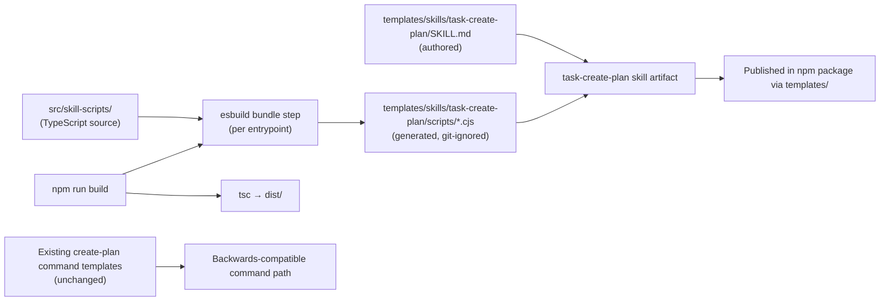
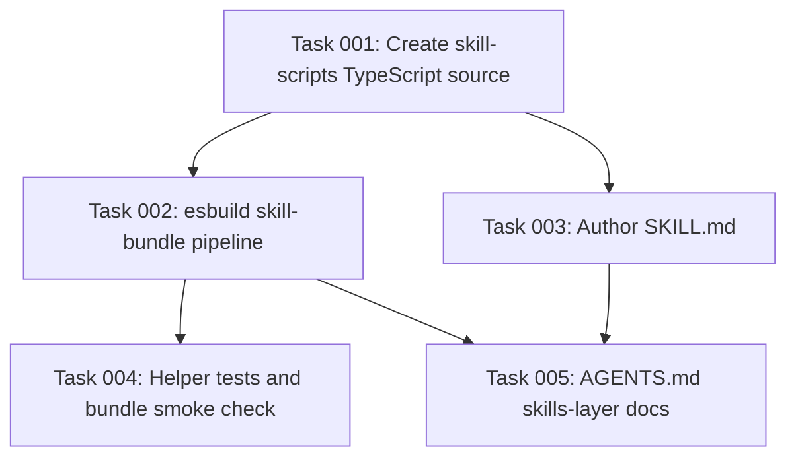

# Plan: Create task-create-plan Skill with Centralized TypeScript Script Source

## Original Work Order

> I'd like to start transitioning the custom commands to skills. Skills are supported now for all assistants and they don't have differences in how they are written depending on the assistant. So the same skill will work for Gemini, for Codex, for Cursor, for Claude, for OpenCode, etc. So I want to start moving to using skills. Skills are also interesting in the sense that they typically contain code as well. I'm going to give you a link to the skills documentation. So what I want to do is I want to start with the create plan skill. I want you to move from the create plan command to a create plan skill. The skill should be auto-contained. So it should have all of the code that it needs inside of the skill directory. Now how do we do that? I want to have a central source of truth for code in TypeScript. So starting on the create plan skill, move all of the scripts and code that it uses to a central source place. That then during build time will be compiled either individual scripts that can be from the skill in .CJS, or Common JavaScript. These will require a little bit of infrastructure that we are gonna eat in this first skill, but that is fine. The common infrastructure is the creation of the source for the code which will be in TypeScript and the creation of the pipeline that will generate the compiled and bundled individual scripts. Each one of the skills will use. Again we're focusing on the create plan skill. The command now contains a column but the skill will not be able to. I don't think skills can be nested in sub-directories so avoid that. Call the skill task hyphen create hyphen plan. For now we'll just worry about creating the skill and we'll defer for the future how the skills will be distributed.
>
> Reference: https://agentskills.io/home

## Plan Clarifications

| Question | Answer |
| --- | --- |
| Should existing create-plan command behavior be preserved (backwards compatibility)? | Yes. The existing command templates under `templates/assistant/commands/tasks/` remain untouched. The skill is purely additive. |
| Which TypeScript-to-CJS bundling tool should the build use? | `esbuild`. Fast, minimal dependency footprint, produces standalone bundled `.cjs` files per entrypoint. |
| Where does the centralized TypeScript script source live? | `src/skill-scripts/` — a new top-level directory inside `src/` dedicated to skill script entrypoints and shared utilities. |
| Where does the skill artifact live in the repository, and does `init` copy it? | `templates/skills/task-create-plan/`. `init` does **not** copy the skill to user projects in this plan — distribution mechanics are deferred per the work order. |
| Which scripts must ship inside the skill? | Everything the current `create-plan` command needs to operate today. At minimum: locating the task-manager root, and allocating the next plan ID. Anything else the command relies on at runtime is also bundled. |
| When does the skill bundling step run? | As part of `npm run build`. The TypeScript compile and skill bundle both run from the top-level build target so CI and `prepublishOnly` automatically include skill artifacts. |
| Are generated `.cjs` files committed? | No. They are git-ignored, generated at build time, and included in the npm package via the existing `files[]` entry for `templates/`. |

## Executive Summary

Introduce `task-create-plan`, the project's first Agent Skill, as a self-contained directory under `templates/skills/` containing a single `SKILL.md` and the CommonJS scripts it needs at runtime. The skill encodes the same create-plan workflow the existing slash command performs today: locate `.ai/task-manager`, read hooks and templates, allocate a plan ID, gather clarifications, and emit a semantic HTML plan ending with a structured `Plan Summary` block.

The maintained source of truth for executable logic moves into `src/skill-scripts/` as TypeScript. A build-time pipeline backed by `esbuild` compiles and bundles each entrypoint into an individual `.cjs` file placed inside the skill's `scripts/` subdirectory. The pipeline runs as part of `npm run build`, generated outputs are git-ignored, and the npm package picks them up through the existing `templates/` publish rule.

The existing assistant-specific command templates and `init` behavior remain unchanged. The skill is an additive artifact in the repository; how it reaches user projects (init copy, separate publish channel, etc.) is intentionally deferred.

## Context

### Current State vs Target State

| Current State | Target State | Why? |
| --- | --- | --- |
| Create-plan behavior is expressed only through assistant-specific command templates under `templates/assistant/commands/tasks/`. | Create-plan behavior is also available as a single, assistant-agnostic Agent Skill named `task-create-plan`. | Skills are now supported across the project's target assistants and eliminate per-assistant prompt-format differences. |
| Runtime helper logic (e.g. finding the task-manager root) is inlined as bash heredocs inside the command Markdown, and other helpers live as hand-maintained `.cjs` files in `templates/ai-task-manager/config/scripts/`. | Reusable skill helper logic is authored once in TypeScript under `src/skill-scripts/` and compiled to standalone `.cjs` bundles placed inside the skill directory. | A single TypeScript source of truth is easier to maintain, lints and type-checks with the rest of `src/`, and is portable into future skills. |
| The repository has no build step that produces skill artifacts. | `npm run build` runs the TypeScript compile *and* bundles every skill-script TypeScript entrypoint into a `.cjs` file inside the corresponding skill directory. | A single build target keeps developer and CI workflows consistent and makes generated outputs available wherever the package is consumed. |
| The existing create-plan command is the only entry point and is relied on by current users. | The existing command remains unchanged. The skill is purely additive. | The user explicitly requested backwards compatibility; users on any current assistant continue to work without migration. |
| Skill distribution into user projects (init copy, registry, etc.) is not defined. | A complete, valid skill artifact exists in the repository and ships in the npm package via `templates/`. How it lands in user projects is deferred. | The work order explicitly defers distribution to a later effort while still wanting a real artifact in place. |

### Background

Agent Skills are directories with a required `SKILL.md` and optional `scripts/`, `references/`, and `assets/`. The skill name must match the parent directory, use lowercase letters, numbers, and hyphens, and must not be nested inside another skill. Scripts should be self-contained and non-interactive, and the skill's instructions should describe usage and failure modes in prose.

The existing create-plan command already encodes the contract this skill must preserve: discover `.ai/task-manager`, read `config/TASK_MANAGER.md`, execute `PRE_PLAN.md` and `POST_PLAN.md` hooks, gather clarifications, allocate the next plan ID via `config/scripts/get-next-plan-id.cjs`, write the plan into `plans/{padded-id}--{slug}/plan-{padded-id}--{slug}.html` conforming to `config/templates/PLAN_TEMPLATE.html`, and finish with a structured `Plan Summary` block. The skill's instructions and bundled scripts must keep the same observable outcome.

## Architectural Approach

The change adds three things: a single skill directory, a small TypeScript source tree for skill-script entrypoints, and a build step that turns the latter into bundled `.cjs` files inside the former. Nothing else in the repository is modified.

### Skill Artifact

**Objective**: Add a standards-compliant `task-create-plan` skill that orchestrates the create-plan workflow.

The skill lives at `templates/skills/task-create-plan/` — a flat directory with no nested skills. It contains an authored `SKILL.md` with frontmatter whose `name` matches the directory, a description specific enough to trigger only on plan-creation requests for this task-manager, and prose instructions adapted from the existing command. Detailed material the skill references at runtime (e.g. plan format reminders) lives one level down under `references/` only when separating it improves progressive disclosure. The skill calls its bundled scripts by relative path from the skill root and avoids assistant-specific syntax such as slash-command argument placeholders or `$ARGUMENTS`.

### Centralized TypeScript Source

**Objective**: Make TypeScript the single maintained source for skill-script logic.

A new directory `src/skill-scripts/` holds the TypeScript entrypoints the skill needs at runtime and any shared utilities they depend on. The entrypoints cover everything the current create-plan command relies on at runtime: locating the task-manager root, allocating the next plan ID, and any additional helper currently invoked by the command (e.g. hook/template reading or plan-blueprint validation if the command path uses it). Shared logic (file walking, frontmatter parsing, plan/archive scanning) lives in co-located modules so each entrypoint stays small and so future skills can reuse the same helpers.

The directory participates in the existing TypeScript configuration: it lints and type-checks alongside `src/`, but its outputs are produced by the bundler, not by `tsc`. The `tsc` output to `dist/` remains the CLI's domain.

### Build Pipeline (esbuild)

**Objective**: Produce standalone bundled `.cjs` files inside the skill directory as part of the normal build.

A small build script driven by `esbuild`'s Node API enumerates the entrypoints in `src/skill-scripts/` and emits one bundled `.cjs` per entrypoint into `templates/skills/task-create-plan/scripts/`. The bundle is configured for `platform: 'node'`, `format: 'cjs'`, with bundling enabled so each output is self-contained and has no implicit runtime dependency on the repository layout. The script is wired into `npm run build` so a single command produces both `dist/` and the skill bundles. Generated `.cjs` files are added to `.gitignore` and remain shipped via the existing `files: ["templates/"]` entry in `package.json` for npm consumers.

For this first skill, the build script also resolves which skill directory each entrypoint targets through a simple convention (e.g. an explicit mapping in the build script or filename/folder convention under `src/skill-scripts/`). The convention is documented in `AGENTS.md` so future skills can register additional entrypoints without re-architecting the pipeline.

### Compatibility Boundary

**Objective**: Leave the existing command path entirely intact.

No file under `templates/assistant/commands/` is modified. No file under `templates/ai-task-manager/config/scripts/` is removed or renamed. `init` behavior and `.init-metadata.json` generation are untouched. Existing tests continue to validate the current path. The new skill is an additive artifact in the repository whose only contact with the user's runtime is the npm package contents, gated behind future distribution work.

## Risk Considerations and Mitigation Strategies

Technical Risks

- **Bundle assumes repository paths.** A generated `.cjs` could accidentally close over `__dirname` values or imports that only resolve from the repo root and fail when the skill is consumed elsewhere.
    - **Mitigation**: Configure `esbuild` with bundling and external-free settings, and validate generated outputs by executing them from a temporary fixture directory that contains only the skill (not the repo).
- **Logic drift between command and skill.** The command and skill describe the same workflow in prose; helper logic could be reimplemented inconsistently in TypeScript versus the existing `.cjs` templates.
    - **Mitigation**: Keep helper semantics in the TypeScript source faithful to the existing scripts (notably ID allocation across `plans/` and `archive/`), and limit the skill's prose to orchestration so behavior is driven by the bundled scripts, not by restated instructions.
- **Plan ID allocation edge cases.** The existing repository contains older archived Markdown plans alongside current HTML plans; the scanner must recognize both formats to allocate a correct next ID.
    - **Mitigation**: Preserve current `.cjs` semantics for plan-ID scanning (consider Markdown and HTML plan files) in the TypeScript port. Validate by running the generated entrypoint against this repository and confirming the resulting ID matches `get-next-plan-id.cjs`.

Implementation Risks

- **Scope creep into a full migration.** Adding TypeScript source and a bundler tempts a broader port of every command and every script.
    - **Mitigation**: Limit user-facing skill work strictly to `task-create-plan`. Only port helpers that the create-plan workflow actually needs at runtime. Do not touch other commands.
- **Build pipeline accidentally couples skill output to `dist/`.** Reusing the `dist/` output for skills would mix CLI and skill artifacts.
    - **Mitigation**: Keep the skill bundle step physically separate from `tsc` output. `tsc` targets `dist/`; `esbuild` targets `templates/skills/<skill>/scripts/`.
- **Ambiguous distribution.** Different assistants may expect skills in different directories on the consumer side.
    - **Mitigation**: Defer distribution explicitly. Keep the in-repo artifact standards-compliant and portable so any future distribution mechanism (init copy, registry, manual install) can use it unchanged.

Quality Risks

- **Generated outputs escape lint and test coverage.** Hand-written `.cjs` in `templates/` is currently inspectable; bundled output is not.
    - **Mitigation**: Cover the TypeScript source (and especially shared helpers) with the existing Jest setup. Add a build-output smoke check that runs each generated `.cjs` end-to-end against a fixture.

## Success Criteria

### Primary Success Criteria

1. A standards-compliant skill directory exists at `templates/skills/task-create-plan/` with a valid `SKILL.md` whose `name` matches the directory name and whose description is specific to plan creation for this task-manager.
2. TypeScript source for skill-script entrypoints and their shared helpers exists under `src/skill-scripts/` and is the only maintained source for that logic.
3. `npm run build` produces a `scripts/` directory inside the skill containing one bundled, self-contained `.cjs` per entrypoint — including, at minimum, equivalents for locating the task-manager root and allocating the next plan ID, plus any additional helper the existing create-plan command relies on at runtime.
4. Generated `.cjs` files are git-ignored, are present in the published npm package via the existing `templates/` rule, and execute correctly when run from a directory that contains only the skill (not the repository).
5. The existing assistant-specific create-plan command templates, the existing `.cjs` scripts under `templates/ai-task-manager/config/scripts/`, and `init` behavior remain unchanged, and current tests still pass.
6. Running the skill against an initialized fixture produces a semantic HTML plan conforming to `PLAN_TEMPLATE.html`, with valid head metadata, the right next plan ID, and a final `Plan Summary` block.

## Self Validation

Execute these concrete checks after implementation:

- Run `npm run build` from a clean tree and confirm `templates/skills/task-create-plan/scripts/` contains the expected `.cjs` files. Confirm none of these files are tracked by git (`git status` shows them ignored).
- Open `templates/skills/task-create-plan/SKILL.md` and verify the `name` frontmatter equals `task-create-plan`, the description is plan-creation specific, and every file reference is relative to the skill root.
- Create a temporary fixture directory via `npx . init --assistants claude --destination-directory /tmp/skill-fixture`, copy `templates/skills/task-create-plan/` into the fixture, and from inside the fixture run the bundled find-root script — confirm it resolves the fixture's `.ai/task-manager` root, not the repository's.
- From the same fixture, run the bundled next-plan-id script and confirm its output matches what `node .ai/task-manager/config/scripts/get-next-plan-id.cjs` returns in that fixture.
- Following the skill's instructions, drive a sample plan creation to completion in the fixture. Confirm a new `plan-{padded-id}--{slug}.html` file is written under `.ai/task-manager/plans/`, validates against `PLAN_TEMPLATE.html` structure (required `<meta>` elements present, sections present), and that the run's output ends with a `Plan Summary` block containing the new plan ID and absolute path.
- Run the existing pipeline as a regression check: `npx . init --assistants claude,gemini,opencode,codex --destination-directory /tmp/regression` and confirm the create-plan command files are generated as before. Run `npm test` and `npm run lint` — both pass.
- Run `npm pack` and inspect the resulting tarball to confirm the skill directory and its generated `scripts/*.cjs` are present under `templates/skills/task-create-plan/`.

## Documentation

This plan requires documentation updates. `AGENTS.md` should gain a short section describing the skills layer: where TypeScript source lives (`src/skill-scripts/`), where skill artifacts live (`templates/skills/<skill-name>/`), the build command that produces bundled `.cjs` outputs (`npm run build`), the fact that those outputs are git-ignored and distributed via the npm `templates/` rule, and a note that distribution into user projects is deferred. The repository `README.md` needs a brief mention only if it currently enumerates available commands; otherwise it can be left alone until distribution lands. No user-facing migration guide is required because the existing command path is preserved.

## Resource Requirements

### Development Skills

Working knowledge of TypeScript and Node CommonJS packaging, familiarity with `esbuild`'s Node API for multi-entry bundling, comfort with the existing AI Task Manager init/template/hook system, and an understanding of Agent Skill structure and progressive disclosure conventions.

### Technical Infrastructure

The repository already provides TypeScript, Jest, ESLint, Prettier, and the task-manager templates. This plan adds `esbuild` as a dev dependency, extends `npm run build` to invoke a small bundling script, and updates `.gitignore` to exclude generated `.cjs` files under `templates/skills/<skill>/scripts/`. No changes to publish rules are needed beyond verifying the existing `files: ["templates/"]` entry continues to include the skill artifact.

## Integration Strategy

The skill integrates with the repository as an additive artifact. Existing command templates, common task-manager configuration, hook files, and helper scripts remain available unchanged. The build pipeline becomes the integration surface: producing skill bundles becomes a normal part of `npm run build` and therefore of `prepublishOnly`, so future skills can plug into the same pipeline by adding a TypeScript entrypoint and a skill directory without re-architecting anything. Consumer-side distribution remains deferred and can be addressed in a follow-up effort once one or more skills are in place.

## Notes

The current checkout contains both older archived Markdown plans and current HTML plans. Plan-ID allocation logic ported into TypeScript must handle both file extensions to remain compatible with `get-next-plan-id.cjs`. Broader reconciliation of legacy plan formats is out of scope.

A prior plan document at `plans/01--task-create-plan-skill/plan-01--task-create-plan-skill.html` covers the same work order. Per the user's selection it is left in place and untouched; this plan (ID 68) is the active record.

## Execution Blueprint

**Validation Gates:**
- Reference: `/config/hooks/POST_PHASE.md`

### Dependency Diagram

### ✅ Phase 1: TypeScript Source of Truth
**Parallel Tasks:**
- ✔️ Task 001: Create centralized TypeScript source for skill scripts

### ✅ Phase 2: Build Pipeline and Skill Artifact
**Parallel Tasks:**
- ✔️ Task 002: Add esbuild skill-bundle pipeline to `npm run build` (depends on: 001)
- ✔️ Task 003: Author SKILL.md for the task-create-plan skill (depends on: 001)

### ✅ Phase 3: Validation and Documentation
**Parallel Tasks:**
- ✔️ Task 004: Meaningful tests for helpers + bundle smoke check (depends on: 002)
- ✔️ Task 005: Document the skills layer in AGENTS.md (depends on: 002, 003)

### Post-phase Actions

After Phase 3 completes, run the project's regression checks end-to-end: `npm run build`, `npm test`, `npm run lint`, and `npm pack --dry-run` (verifying the bundled skill scripts appear in the published file list).

### Execution Summary
- Total Phases: 3
- Total Tasks: 5

## Execution Summary

**Status**: ✅ Completed Successfully
**Completed Date**: 2026-05-14

### Results

- `src/skill-scripts/` established as the centralized TypeScript source. Two entrypoints (`find-task-manager-root.ts`, `get-next-plan-id.ts`) plus shared helpers (`shared/root.ts`, `shared/frontmatter.ts`, `shared/plan-scan.ts`) port the existing create-plan helper semantics and add HTML plan-file recognition.
- A sibling `tsconfig.skill-scripts.json` type-checks the subtree without emitting; the main `tsconfig.json` excludes it so `dist/` stays unchanged.
- `scripts/build-skills.cjs` bundles each entrypoint into a self-contained `.cjs` under `templates/skills/<skill>/scripts/` using `esbuild`. Wired into `npm run build` and exposed standalone as `npm run build:skills`. Generated outputs are git-ignored and ship via the existing `files: ["templates/"]` publish rule (verified with `npm pack --dry-run`).
- First skill `templates/skills/task-create-plan/SKILL.md` authored — assistant-agnostic, no slash-command syntax, all script references relative to the skill root.
- New Jest file `src/__tests__/skill-scripts.test.ts` (7 tests) covers helpers with mixed `.md`/`.html` plan fixtures across `plans/` and `archive/`, root discovery from nested cwd, and a bundle smoke check that runs the generated `.cjs` from a fixture containing only the skill — cross-validated against the existing reference `.cjs`.
- `AGENTS.md` documents the new skills layer (TS source, build pipeline, entrypoint mapping convention, git-ignored outputs, deferred distribution).
- All 196 tests pass; `npm run lint`, `npm run build`, and the existing `npx . init` pipeline produce identical create-plan command artifacts as before.

### Noteworthy Events

- Husky pre-commit hook runs lint and the full test suite. Each phase's commit therefore acts as an additional validation gate beyond the planned post-phase checks.
- The bundled skill script recognizes both `.md` and `.html` plans by design; the existing reference `.cjs` recognizes only `.md`. The smoke test cross-validates the two only on `.md`-only fixtures to confirm semantic alignment for the shared surface; the expanded `.html` handling is asserted separately.
- The package was already pre-configured with `files: ["templates/"]`, so the skill artifact ships in `npm pack` with no `package.json` edits beyond the new `build:skills` script and the `esbuild` dev dependency.

### Necessary follow-ups

- Define a distribution mechanism for skills into user projects (init copy, registry, or manual install). The artifact is portable and standards-compliant; this is intentionally deferred per the original work order.
- Migrate additional commands to skills as the pattern proves out (e.g. `refine-plan`, `generate-tasks`). The build pipeline now accepts new entrypoints with a single addition to `SKILL_ENTRYPOINTS` in `scripts/build-skills.cjs`.

