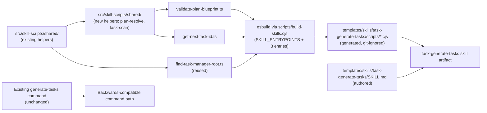
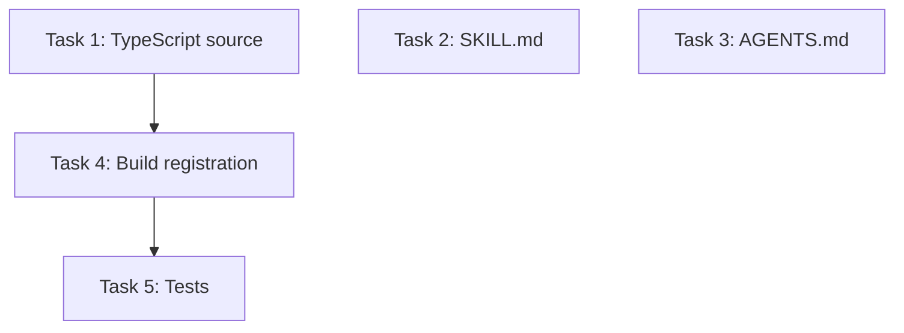

# Plan: Create task-generate-tasks Skill Following the Plan-68 Pattern

## Original Work Order

> check plan 68 and apply it to the `/tasks:generate-tasks`

## Plan Clarifications

| Question | Answer |
| --- | --- |
| What should the new skill be named? | `task-generate-tasks`, mirroring `task-create-plan`. |
| Which scripts must the skill bundle at runtime? | Everything the skill needs to operate end-to-end: locating the task-manager root, resolving a plan by ID, and allocating the next task ID. Each entrypoint is bundled into this skill's own `scripts/` directory so the skill is self-contained, as required by plan 68. |
| What format should the tasks emitted by the skill use? | Markdown, matching the current `TASK_TEMPLATE.md`. No HTML transition for tasks is in scope. |
| Should backwards compatibility be preserved? | Yes. The existing `/tasks:generate-tasks` command template, the existing `.cjs` scripts under `templates/ai-task-manager/config/scripts/`, and `init` behavior remain unchanged. The skill is purely additive. |
| Where do new TypeScript entrypoints and shared helpers live? | Under the existing `src/skill-scripts/` tree established in plan 68. New shared helpers (plan-by-id resolution, task scanning) are co-located in `src/skill-scripts/shared/`. |
| Are generated `.cjs` files committed? | No. They are git-ignored, generated at build time, and shipped via the existing `files: ["templates/"]` entry in `package.json`. |

## Executive Summary

Introduce `task-generate-tasks` as the second Agent Skill in this repository, following the exact pattern plan 68 established for `task-create-plan`. The skill encodes the same task-decomposition workflow the existing `/tasks:generate-tasks` command performs today: locate `.ai/task-manager`, resolve the target plan by ID, read the plan blueprint and task template, allocate sequential task IDs, and emit one Markdown task file per atomic unit conforming to `TASK_TEMPLATE.md`, ending with a structured `Task Generation Summary` block.

Executable logic the skill needs at runtime is added to the existing `src/skill-scripts/` TypeScript source. The existing build pipeline driven by `scripts/build-skills.cjs` and `esbuild` already supports multiple skills via the `SKILL_ENTRYPOINTS` registry; new entrypoints are appended to that registry and the same `npm run build` command produces the bundled `.cjs` artifacts under `templates/skills/task-generate-tasks/scripts/`. No build-pipeline rework is required.

The existing assistant-specific `/tasks:generate-tasks` command template and the `.cjs` scripts under `templates/ai-task-manager/config/scripts/` remain unchanged. The skill is an additive artifact in the repository, distributed via the existing `files: ["templates/"]` rule in the npm package. Distribution into user projects continues to be deferred per plan 68.

## Context

### Current State vs Target State

| Current State | Target State | Why? |
| --- | --- | --- |
| `/tasks:generate-tasks` exists only as assistant-specific command templates under `templates/assistant/commands/tasks/generate-tasks.md`. | The same workflow is also available as an assistant-agnostic skill at `templates/skills/task-generate-tasks/`. | Plan 68 established skills as the migration target; `task-create-plan` is already shipping under this pattern. |
| Runtime helpers (`validate-plan-blueprint.cjs`, `get-next-task-id.cjs`) live only as hand-maintained `.cjs` under `templates/ai-task-manager/config/scripts/`. | The same helpers are also authored in TypeScript under `src/skill-scripts/` and bundled into the new skill's `scripts/`. The legacy `.cjs` files stay in place. | A single TypeScript source of truth was the explicit goal of plan 68. New skills extend the same source tree, not parallel ones. |
| `scripts/build-skills.cjs` registers entrypoints only for `task-create-plan` (find-root and get-next-plan-id). | The same registry adds entrypoints for `task-generate-tasks` (find-root, validate-plan-blueprint, get-next-task-id). | The pipeline was deliberately designed to accept new entrypoints via a single array — that mechanism is exercised here for the first time. |
| Only the `task-create-plan` skill is present under `templates/skills/`. | A second sibling skill directory exists, with its own `SKILL.md` and its own bundled scripts. | Skills are flat and self-contained per plan 68's architectural constraint; this is the canonical way to add another. |
| The existing generate-tasks command is the only entry point and is in active use. | The existing command remains unchanged. The skill is purely additive. | User explicitly confirmed backwards compatibility, consistent with plan 68. |

### Background

Plan 68 (`task-create-plan` skill) introduced three pieces that make this plan small:

1. `src/skill-scripts/` with `find-task-manager-root.ts`, `get-next-plan-id.ts`, and shared helpers under `shared/` (root discovery, frontmatter parsing, plan scanning across `plans/` and `archive/`).
2. `scripts/build-skills.cjs`, an `esbuild`-driven script wired into `npm run build` that iterates a `SKILL_ENTRYPOINTS` array and emits one self-contained `.cjs` per entrypoint into the corresponding skill's `scripts/` directory.
3. The conventions documented in `AGENTS.md`: flat skill directories under `templates/skills/<skill-name>/`, generated `.cjs` git-ignored, ship via `files: ["templates/"]`, distribution deferred.

The existing `/tasks:generate-tasks` command contract this skill must preserve: discover `.ai/task-manager`, read `config/TASK_MANAGER.md`, accept a plan ID as input, validate the plan exists by running `config/scripts/validate-plan-blueprint.cjs <id> planFile` to obtain the plan file path, read the plan body and the `config/templates/TASK_TEMPLATE.md` template, decompose the plan into atomic tasks following the minimization principles in the command, allocate sequential task IDs via `config/scripts/get-next-task-id.cjs <id>`, write each task as `tasks/{padded-task-id}--{slug}.md`, execute `config/hooks/POST_TASK_GENERATION_ALL.md`, and finish with a structured `Task Generation Summary` block. The skill's prose and bundled scripts must keep the same observable outcome.

## Architectural Approach

This plan adds three TypeScript entrypoints, two new shared helpers (extending an existing one where natural), three lines in `SKILL_ENTRYPOINTS`, one new skill directory with a single `SKILL.md`, and tests. Nothing else changes.



### TypeScript Source Extensions

**Objective**: Add the entrypoints and shared helpers the new skill needs, alongside the existing ones, in `src/skill-scripts/`.

Two new entrypoints are added at `src/skill-scripts/`:

- `validate-plan-blueprint.ts` — port of `templates/ai-task-manager/config/scripts/validate-plan-blueprint.cjs`. Accepts a plan ID or absolute path plus an optional field name (`planFile`, `planDir`, `taskCount`, `blueprintExists`, `taskManagerRoot`, `planId`), resolves the plan, and prints either the full JSON or the requested field. Preserves the existing CLI surface so the skill can invoke `validate-plan-blueprint.cjs <id> planFile` identically to the command.
- `get-next-task-id.ts` — port of `templates/ai-task-manager/config/scripts/get-next-task-id.cjs`. Accepts a plan ID, locates the plan's `tasks/` directory under the resolved root, scans existing task files, and prints the next integer.

`find-task-manager-root.ts` is reused unchanged; the build pipeline simply emits a second bundled copy into this skill's `scripts/` so the skill remains self-contained per plan 68's architectural constraint.

Shared helpers added under `src/skill-scripts/shared/`:

- `plan-resolve.ts` — given a numeric ID or absolute path and a task-manager root, returns the plan directory and plan file path. Searches both `plans/` and `archive/`, and accepts both `.md` and `.html` plan files (`task-create-plan` already establishes this dual recognition; `task-generate-tasks` reuses the same convention). Reuses `plan-scan.ts` where natural.
- `task-scan.ts` — given a plan directory, enumerates `tasks/*.md` files and returns existing task IDs plus the next available integer.

Type-checks via the existing `tsconfig.skill-scripts.json`. Lints with the rest of `src/`. Output is produced by the bundler, not by `tsc`. No changes to the main `tsconfig.json` exclusions are required.

### Build Pipeline Registration

**Objective**: Wire the new entrypoints into the existing `SKILL_ENTRYPOINTS` registry so `npm run build` produces the new skill's bundled scripts.

Three entries are appended to `SKILL_ENTRYPOINTS` in `scripts/build-skills.cjs`:

```text
{ src: 'src/skill-scripts/find-task-manager-root.ts',   skill: 'task-generate-tasks', out: 'find-task-manager-root.cjs' }
{ src: 'src/skill-scripts/validate-plan-blueprint.ts',  skill: 'task-generate-tasks', out: 'validate-plan-blueprint.cjs' }
{ src: 'src/skill-scripts/get-next-task-id.ts',         skill: 'task-generate-tasks', out: 'get-next-task-id.cjs' }
```

No other build-script logic changes. Generated outputs land under `templates/skills/task-generate-tasks/scripts/`, are git-ignored by the existing rule (`templates/skills/*/scripts/`), and ship via the existing `files: ["templates/"]` publish rule. Confirm with `npm pack --dry-run`.

### Skill Artifact

**Objective**: Add a standards-compliant `task-generate-tasks` skill directory.

The skill lives at `templates/skills/task-generate-tasks/` — a flat directory, no nested skills. It contains an authored `SKILL.md` with frontmatter whose `name` matches the directory and whose description is specific enough to trigger only on task-generation requests for this task-manager. The skill's prose:

- Describes the operating procedure (locate root → resolve plan → load template → analyze and decompose → minimize → allocate IDs → emit task files → run POST hook → emit summary).
- Calls bundled scripts by relative path from the skill root.
- Avoids assistant-specific syntax (no `$ARGUMENTS`, no `$1`); the user supplies the plan ID conversationally.
- Carries forward the minimization principles, skill-selection guidance, dependency analysis, and the "write a few tests, mostly integration" mantra from the existing command, but expressed as skill prose rather than a slash-command template.
- Ends with the exact required `Task Generation Summary` block format.

### Compatibility Boundary

**Objective**: Leave the existing command path entirely intact.

No file under `templates/assistant/commands/` is modified. No file under `templates/ai-task-manager/config/scripts/` is removed or renamed. The existing `.cjs` helpers continue to back the command path. The new skill is an additive artifact in the repository whose only contact with the user's runtime is the npm package contents, gated behind the still-deferred distribution work from plan 68.

## Risk Considerations and Mitigation Strategies

<details>
<summary>Technical Risks</summary>

- **Drift between command-path `.cjs` and skill-path TypeScript port.** Two implementations of the same helper (e.g. next-task-id) could diverge in behavior — different handling of padded IDs, different sort order, different recognition of in-progress vs completed tasks.
    - **Mitigation**: Anchor the port to the existing `.cjs` semantics by treating the legacy file as the reference. Add a cross-validation test that runs both the bundled `.cjs` and the legacy `.cjs` against shared fixtures and asserts identical output for the overlapping surface.
- **`validate-plan-blueprint.cjs` CLI surface is broader than `get-next-plan-id`.** It accepts a plan ID *or* an absolute path, and an optional field name with several valid values. A partial port could break the command's existing call sites if the helpers are ever cross-wired.
    - **Mitigation**: Port the full CLI surface (all field names, both input modes). Test each field path against fixtures. The legacy file is not modified and is not called by the skill — but the port preserves parity so a future consolidation is safe.
- **Plan resolution must handle both `.md` and `.html` plans.** The existing repository contains older archived Markdown plans alongside current HTML plans. The skill must resolve either, or it will fail on real-world plans.
    - **Mitigation**: Reuse the dual-extension recognition `plan-scan.ts` already implements (per plan 68's notes). Validate against a fixture mixing both formats.

</details>

<details>
<summary>Implementation Risks</summary>

- **Scope creep into a broader migration.** Adding a second skill tempts a parallel port of every remaining command and a wholesale removal of legacy `.cjs` scripts.
    - **Mitigation**: Limit the skill work strictly to `task-generate-tasks`. Port only the helpers this specific workflow needs at runtime. Do not touch other commands. Do not delete or modify the legacy `.cjs` files.
- **Skill prose accidentally diverges from the command's contract.** The existing command embeds significant guidance (minimization principles, complexity scoring, test philosophy) that affects task quality. A trimmed-down skill could produce lower-quality output.
    - **Mitigation**: Treat the existing command template as the contract. Carry forward the minimization rules, skill-selection guidance, dependency-analysis rules, and the test philosophy into the skill, expressed as skill prose rather than restated slash-command instructions.

</details>

<details>
<summary>Quality Risks</summary>

- **Generated outputs escape lint and direct test coverage.** Bundled `.cjs` files are not hand-inspectable.
    - **Mitigation**: Cover the TypeScript source and the new shared helpers with the existing Jest setup. Add a bundle smoke check that executes each generated `.cjs` end-to-end against a fixture, mirroring the smoke test established for `task-create-plan`.

</details>

## Success Criteria

### Primary Success Criteria

1. A standards-compliant skill directory exists at `templates/skills/task-generate-tasks/` with a valid `SKILL.md` whose `name` matches the directory name and whose description is specific to task generation for this task-manager.
2. TypeScript source for the three skill entrypoints (`find-task-manager-root.ts` reused, `validate-plan-blueprint.ts`, `get-next-task-id.ts`) and their shared helpers exists under `src/skill-scripts/`, and is the only maintained source for that logic.
3. `npm run build` produces a `scripts/` directory inside the new skill containing three bundled, self-contained `.cjs` files — `find-task-manager-root.cjs`, `validate-plan-blueprint.cjs`, `get-next-task-id.cjs` — each runnable from a directory that contains only the skill, not the repository.
4. Generated `.cjs` files are git-ignored by the existing rule and present in the published npm package via the existing `templates/` entry.
5. The existing `/tasks:generate-tasks` command template, the existing `.cjs` scripts under `templates/ai-task-manager/config/scripts/`, and `init` behavior remain unchanged, and current tests still pass.
6. Running the skill against an initialized fixture with an existing plan produces a `tasks/` directory containing one or more Markdown task files conforming to `TASK_TEMPLATE.md`, with valid frontmatter (`id`, `group`, `dependencies`, `status`, `created`, `skills`), correct sequential IDs starting from the value returned by the bundled `get-next-task-id.cjs`, and a final `Task Generation Summary` block at end of output.

## Self Validation

Execute these concrete checks after implementation:

- Run `npm run build` from a clean tree and confirm `templates/skills/task-generate-tasks/scripts/` contains exactly `find-task-manager-root.cjs`, `validate-plan-blueprint.cjs`, and `get-next-task-id.cjs`. Confirm `git status` shows them ignored.
- Open `templates/skills/task-generate-tasks/SKILL.md` and verify the `name` frontmatter equals `task-generate-tasks`, the description is task-generation-specific, and every script reference is relative to the skill root.
- Create a temporary fixture via `npx . init --assistants claude --destination-directory /tmp/skill-generate-tasks-fixture`, manually create a sample plan directory under `.ai/task-manager/plans/` containing a plan `.md` file, copy `templates/skills/task-generate-tasks/` into the fixture, and from inside the fixture run:
  - the bundled `find-task-manager-root.cjs` and confirm it resolves the fixture's root, not the repository's;
  - the bundled `validate-plan-blueprint.cjs <plan-id> planFile` and confirm it returns the absolute path to the sample plan file;
  - the bundled `get-next-task-id.cjs <plan-id>` and confirm its output matches `node .ai/task-manager/config/scripts/get-next-task-id.cjs <plan-id>` in the same fixture.
- Drive a sample task-generation run against a real plan in the fixture by following the skill's instructions. Confirm new `tasks/{padded-id}--{slug}.md` files are written under the plan directory, each conforms to `TASK_TEMPLATE.md` frontmatter, and the run's final output contains a `Task Generation Summary` block with the correct plan ID, task count, and `Status: Ready for execution`.
- Run the existing pipeline as a regression check: `npx . init --assistants claude,gemini,opencode,codex --destination-directory /tmp/regression-69` and confirm the generate-tasks command files are generated identically to before. Run `npm test` and `npm run lint` — both pass.
- Run `npm pack --dry-run` and confirm both `templates/skills/task-create-plan/scripts/*.cjs` (unchanged) and the new `templates/skills/task-generate-tasks/scripts/*.cjs` are present in the file list.

## Documentation

`AGENTS.md` already documents the skills layer following plan 68. This plan requires a small, surgical update to that section:

- Add `task-generate-tasks` alongside `task-create-plan` as a shipping skill.
- Update the "registered entrypoints" mention if the doc enumerates them, otherwise note only that the `SKILL_ENTRYPOINTS` array now contains entries for two skills.
- No other documentation changes are required. The `README.md` does not enumerate commands or skills today and does not need to change. No user-facing migration guide is required — the command path is preserved.

## Resource Requirements

### Development Skills

Working knowledge of TypeScript and Node CommonJS packaging, familiarity with the existing `esbuild` bundle script in `scripts/build-skills.cjs`, comfort with the AI Task Manager templates and hook system, and an understanding of Agent Skill structure conventions established by `task-create-plan`.

### Technical Infrastructure

No new dependencies. `esbuild` is already a dev dependency. The build target, gitignore rule, and publish rule introduced by plan 68 already accommodate this skill without changes.

## Integration Strategy

The new skill integrates exactly as plan 68 prescribed: an additive artifact in the repository, picked up by the same `npm run build` step (and therefore by `prepublishOnly`), shipped via the existing `files: ["templates/"]` rule, with distribution into user projects deferred. The `SKILL_ENTRYPOINTS` array is now exercised by two skills, validating the multi-skill design plan 68 anticipated.

## Notes

The skill emits Markdown task files because the current `TASK_TEMPLATE.md` is the only template in the repository. If task templates later transition to HTML — paralleling the plan-template transition — the skill's prose section on file output is the only spot that would need updating. No other generation logic in the bundled scripts depends on the file format; they operate on IDs and filenames.

The existing `validate-plan-blueprint.cjs` has the broader CLI surface; pull the full surface into the port to avoid future divergence if/when the legacy `.cjs` is eventually retired.

## Execution Blueprint

**Validation Gates:**
- Reference: `/config/hooks/POST_PHASE.md`

### Dependency Diagram



No circular dependencies. Tasks 2 and 3 are independent of tasks 1, 4, 5.

### ✅ Phase 1: Foundation (parallel)
**Parallel Tasks:**
- ✔️ Task 1: Add TypeScript source for task-generate-tasks skill
- ✔️ Task 2: Author task-generate-tasks SKILL.md
- ✔️ Task 3: Document task-generate-tasks skill in AGENTS.md

### ✅ Phase 2: Build wiring
**Parallel Tasks:**
- ✔️ Task 4: Register entrypoints in `scripts/build-skills.cjs` (depends on: 1)

### ✅ Phase 3: Tests
**Parallel Tasks:**
- ✔️ Task 5: Add tests for helpers and bundles (depends on: 1, 4)

### Execution Summary
- Total Phases: 3
- Total Tasks: 5

## Execution Summary

**Status**: ✅ Completed Successfully
**Completed Date**: 2026-05-14

### Results

The `task-generate-tasks` Agent Skill has been added to the repository following the plan-68 pattern. Specifically:

- New TypeScript entrypoints under `src/skill-scripts/`: `validate-plan-blueprint.ts` (full CLI parity with the legacy `.cjs` — six output fields plus JSON mode) and `get-next-task-id.ts`.
- New shared helpers: `src/skill-scripts/shared/plan-resolve.ts` (numeric-ID + absolute-path resolution with standard-root shortcut and ancestry search) and `src/skill-scripts/shared/task-scan.ts` (next-task-id computation).
- `scripts/build-skills.cjs` `SKILL_ENTRYPOINTS` registry now contains three additional entries; `npm run build` produces three bundled `.cjs` files under `templates/skills/task-generate-tasks/scripts/`, which are git-ignored and present in `npm pack --dry-run` output.
- `templates/skills/task-generate-tasks/SKILL.md`: an authored, standards-compliant skill artifact — assistant-agnostic, self-contained, references bundled scripts by relative path, and ends with the required `Task Generation Summary` block format.
- `AGENTS.md` notes the second shipping skill in the Skills Layer section.
- New Jest coverage in `src/__tests__/task-generate-tasks.skill.test.ts`: 11 tests covering helpers and bundle smoke + parity with the legacy reference. Full suite: 207 tests pass, 0 failures.

### Noteworthy Events

- The Phase 1 commit initially staged unrelated untracked `.cursor/` command files; they were unstaged before committing so the plan-69 commit contains only the plan's intended changes.
- Two prettier auto-fixes were applied during Phase 1 (line wrapping in the validate-plan-blueprint entrypoint and plan-resolve helper). No semantic changes.
- The plan's stated "feature branch" step was a no-op because the working tree was already on a non-main/master branch (`2.x`); `create-feature-branch.cjs` correctly proceeded without branching.

### Necessary follow-ups

- Plan-68's deferred distribution work still applies: `npx . init` does not copy skills into user projects, so the new skill ships only via the npm package contents. Any future skill-distribution work covers both `task-create-plan` and `task-generate-tasks` uniformly.

---

Plan Summary:
- Plan ID: 69
- Plan File: /workspace/.ai/task-manager/plans/69--task-generate-tasks-skill/plan-69--task-generate-tasks-skill.md
