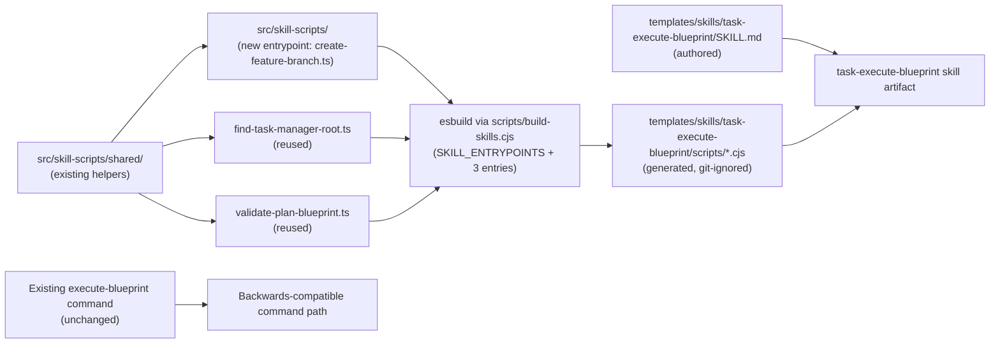

# Plan: Create task-execute-blueprint Skill Following the Plan-68/69 Pattern

## Original Work Order

> look at archived plans 68 and 69, and apply it to the `/tasks:execute-blueprint` command.

## Executive Summary

Introduce `task-execute-blueprint` as the third Agent Skill in this repository, following the exact pattern plans 68 and 69 established for `task-create-plan` and `task-generate-tasks`. The skill encodes the same execution-orchestration workflow the existing `/tasks:execute-blueprint` command performs today: locate `.ai/task-manager`, resolve the target plan by ID, validate tasks and execution blueprint existence (auto-generating if missing), execute phases in dependency order while running hooks, and conclude with post-execution validation, summary generation, and archival.

Executable logic the skill needs at runtime is added to the existing `src/skill-scripts/` TypeScript source. The existing build pipeline driven by `scripts/build-skills.cjs` and `esbuild` already supports multiple skills via the `SKILL_ENTRYPOINTS` registry; new entrypoints are appended to that registry and the same `npm run build` command produces the bundled `.cjs` artifacts under `templates/skills/task-execute-blueprint/scripts/`. No build-pipeline rework is required.

The existing assistant-specific `/tasks:execute-blueprint` command template and the `.cjs` scripts under `templates/ai-task-manager/config/scripts/` remain unchanged. The skill is an additive artifact in the repository, distributed via the existing `files: ["templates/"]` rule in the npm package. Distribution into user projects continues to be deferred per plan 68.

## Context

### Current State vs Target State

| Current State | Target State | Why? |
|---|---|---|
| `/tasks:execute-blueprint` exists only as assistant-specific command templates under `templates/assistant/commands/tasks/execute-blueprint.md`. | The same workflow is also available as an assistant-agnostic skill at `templates/skills/task-execute-blueprint/`. | Plans 68 and 69 established skills as the migration target; `task-create-plan` and `task-generate-tasks` are already shipping under this pattern. |
| Runtime helpers (`validate-plan-blueprint.cjs`, `create-feature-branch.cjs`) live only as hand-maintained `.cjs` under `templates/ai-task-manager/config/scripts/`. | The same helpers are also authored in TypeScript under `src/skill-scripts/` and bundled into the new skill's `scripts/`. The legacy `.cjs` files stay in place. | A single TypeScript source of truth was the explicit goal of plan 68. New skills extend the same source tree. |
| `scripts/build-skills.cjs` registers entrypoints for two skills (`task-create-plan`, `task-generate-tasks`). | The same registry adds entrypoints for `task-execute-blueprint` (find-root, validate-plan-blueprint, create-feature-branch). | The pipeline was deliberately designed to accept new entrypoints via a single array — that mechanism is exercised here for a third skill. |
| Only the `task-create-plan` and `task-generate-tasks` skills are present under `templates/skills/`. | A third sibling skill directory exists, with its own `SKILL.md` and its own bundled scripts. | Skills are flat and self-contained per plan 68's architectural constraint. |
| The existing execute-blueprint command is the only entry point and is in active use. | The existing command remains unchanged. The skill is purely additive. | The established pattern from plans 68 and 69 is to preserve backwards compatibility. |

### Background

Plans 68 and 69 introduced three pieces that make this plan small:

1. `src/skill-scripts/` with entrypoints and shared helpers under `shared/` (root discovery, frontmatter parsing, plan scanning, plan resolution, task scanning).
2. `scripts/build-skills.cjs`, an `esbuild`-driven script wired into `npm run build` that iterates a `SKILL_ENTRYPOINTS` array and emits one self-contained `.cjs` per entrypoint into the corresponding skill's `scripts/` directory.
3. The conventions documented in `AGENTS.md`: flat skill directories under `templates/skills/<skill-name>/`, generated `.cjs` git-ignored, ship via `files: ["templates/"]`, distribution deferred.

The existing `/tasks:execute-blueprint` command contract this skill must preserve: discover `.ai/task-manager`, read `config/TASK_MANAGER.md`, validate the plan exists by running `config/scripts/validate-plan-blueprint.cjs <id> planFile`, check task count and blueprint existence, auto-generate tasks and blueprint if either is missing (by following the generate-tasks command instructions), read the plan's execution blueprint to identify phases and parallel task groupings, execute each phase by running `PRE_PHASE.md` hook, dispatching tasks in parallel with `PRE_TASK_EXECUTION.md` hook, running `POST_PHASE.md` hook, and advancing to the next phase, then running `POST_EXECUTION.md` hook, appending an execution summary per `EXECUTION_SUMMARY_TEMPLATE.md`, and moving the completed plan directory from `plans/` to `archive/`. Optionally create a feature branch via `config/scripts/create-feature-branch.cjs <id>` before execution begins. The skill's prose and bundled scripts must keep the same observable outcome.

## Architectural Approach

This plan adds one new TypeScript entrypoint, three lines in `SKILL_ENTRYPOINTS`, one new skill directory with a single `SKILL.md`, and tests. Nothing else changes.



### TypeScript Source Extensions

**Objective**: Add the entrypoint the new skill needs, alongside the existing ones, in `src/skill-scripts/`.

One new entrypoint is added at `src/skill-scripts/`:

- `create-feature-branch.ts` — port of `templates/ai-task-manager/config/scripts/create-feature-branch.cjs`. Accepts a plan ID or absolute path, resolves the plan, checks git state (repo, branch, uncommitted changes), and creates a `feature/{planId}--{sanitized-name}` branch when on main/master with a clean working tree. Preserves the existing CLI surface and exit codes.

`find-task-manager-root.ts` and `validate-plan-blueprint.ts` are reused unchanged; the build pipeline simply emits second bundled copies into this skill's `scripts/` so the skill remains self-contained per plan 68's architectural constraint.

Shared helpers added under `src/skill-scripts/shared/`:

- `git-utils.ts` — small helper for safe git command execution (execSync wrapper with error swallowing) so `create-feature-branch.ts` stays focused on branch logic rather than child-process boilerplate.

Type-checks via the existing `tsconfig.skill-scripts.json`. Lints with the rest of `src/`. Output is produced by the bundler, not by `tsc`. No changes to the main `tsconfig.json` exclusions are required.

### Build Pipeline Registration

**Objective**: Wire the new entrypoints into the existing `SKILL_ENTRYPOINTS` registry so `npm run build` produces the new skill's bundled scripts.

Three entries are appended to `SKILL_ENTRYPOINTS` in `scripts/build-skills.cjs`:

```text
{ src: 'src/skill-scripts/find-task-manager-root.ts',   skill: 'task-execute-blueprint', out: 'find-task-manager-root.cjs' }
{ src: 'src/skill-scripts/validate-plan-blueprint.ts',  skill: 'task-execute-blueprint', out: 'validate-plan-blueprint.cjs' }
{ src: 'src/skill-scripts/create-feature-branch.ts',    skill: 'task-execute-blueprint', out: 'create-feature-branch.cjs' }
```

No other build-script logic changes. Generated outputs land under `templates/skills/task-execute-blueprint/scripts/`, are git-ignored by the existing rule (`templates/skills/*/scripts/`), and ship via the existing `files: ["templates/"]` publish rule. Confirm with `npm pack --dry-run`.

### Skill Artifact

**Objective**: Add a standards-compliant `task-execute-blueprint` skill directory.

The skill lives at `templates/skills/task-execute-blueprint/` — a flat directory, no nested skills. It contains an authored `SKILL.md` with frontmatter whose `name` matches the directory and whose description is specific enough to trigger only on blueprint-execution requests for this task-manager. The skill's prose:

- Describes the operating procedure (locate root → resolve plan → validate tasks/blueprint → auto-generate if missing → optional feature branch → execute phases with hooks → post-execution validation → summary → archival).
- Calls bundled scripts by relative path from the skill root.
- Avoids assistant-specific syntax (no `$ARGUMENTS`, no `$1`); the user supplies the plan ID conversationally.
- Carries forward the critical rules from the existing command: never skip validation gates, preserve dependency order, maximize parallelism, fail safely, document everything in Noteworthy Events.
- Ends with the exact required `Execution Summary` block format.

### Compatibility Boundary

**Objective**: Leave the existing command path entirely intact.

No file under `templates/assistant/commands/` is modified. No file under `templates/ai-task-manager/config/scripts/` is removed or renamed. The existing `.cjs` helpers continue to back the command path. The new skill is an additive artifact in the repository whose only contact with the user's runtime is the npm package contents, gated behind the still-deferred distribution work from plan 68.

## Risk Considerations and Mitigation Strategies

<details>
<summary>Technical Risks</summary>

- **Drift between command-path `.cjs` and skill-path TypeScript port.** The `create-feature-branch.cjs` port could diverge in branch-naming logic, exit-code behavior, or git-command error handling.
    - **Mitigation**: Anchor the port to the existing `.cjs` semantics by treating the legacy file as the reference. Add a cross-validation test that runs both the bundled `.cjs` and the legacy `.cjs` against temporary git fixtures and asserts identical branch names and exit codes for the overlapping surface.
- **`create-feature-branch.cjs` depends on `shared-utils.cjs` at runtime.** The legacy script imports `resolvePlan` from a sibling file that will not exist when the bundled `.cjs` is consumed standalone.
    - **Mitigation**: The TypeScript port imports `resolvePlan` from `shared/plan-resolve.ts`, which `esbuild` bundles into the output. Validate the generated `.cjs` by running it from a temporary directory that contains only the skill artifact (not the repository).
- **Plan resolution must handle both `.md` and `.html` plans.** The existing repository contains older archived Markdown plans alongside current HTML plans. The skill must resolve either.
    - **Mitigation**: Reuse the dual-extension recognition `plan-scan.ts` and `plan-resolve.ts` already implement. No new logic is required.

</details>

<details>
<summary>Implementation Risks</summary>

- **Scope creep into a broader migration.** Adding a third skill tempts a parallel port of every remaining command (`refine-plan`, `fix-broken-tests`, `full-workflow`, `execute-task`).
    - **Mitigation**: Limit the skill work strictly to `task-execute-blueprint`. Port only `create-feature-branch.cjs`. Do not touch other commands. Do not delete or modify the legacy `.cjs` files.
- **Skill prose accidentally diverges from the command's contract.** The existing command embeds significant orchestration guidance (phase progression, hook execution order, error handling, parallelism rules) that affects execution quality. A trimmed-down skill could produce lower-quality output.
    - **Mitigation**: Treat the existing command template as the contract. Carry forward the critical rules, phase workflow, hook invocation order, error-handling behavior, and output requirements into the skill, expressed as skill prose rather than restated slash-command instructions.

</details>

<details>
<summary>Quality Risks</summary>

- **Generated outputs escape lint and direct test coverage.** Bundled `.cjs` files are not hand-inspectable.
    - **Mitigation**: Cover the TypeScript source and the new `git-utils.ts` helper with the existing Jest setup. Add a bundle smoke check that executes the generated `.cjs` end-to-end against a fixture, mirroring the smoke tests established for plans 68 and 69.

</details>

## Success Criteria

### Primary Success Criteria

1. A standards-compliant skill directory exists at `templates/skills/task-execute-blueprint/` with a valid `SKILL.md` whose `name` matches the directory name and whose description is specific to blueprint execution for this task-manager.
2. TypeScript source for the three skill entrypoints (`find-task-manager-root.ts` reused, `validate-plan-blueprint.ts` reused, `create-feature-branch.ts` new) and their shared helpers exists under `src/skill-scripts/`, and is the only maintained source for that logic.
3. `npm run build` produces a `scripts/` directory inside the new skill containing three bundled, self-contained `.cjs` files — `find-task-manager-root.cjs`, `validate-plan-blueprint.cjs`, `create-feature-branch.cjs` — each runnable from a directory that contains only the skill, not the repository.
4. Generated `.cjs` files are git-ignored by the existing rule and present in the published npm package via the existing `templates/` entry.
5. The existing `/tasks:execute-blueprint` command template, the existing `.cjs` scripts under `templates/ai-task-manager/config/scripts/`, and `init` behavior remain unchanged, and current tests still pass.
6. Running the skill against an initialized fixture with an existing plan and tasks produces phase-by-phase execution, runs the appropriate hooks, appends an execution summary to the plan document, and moves the completed plan directory to `archive/`. The run's final output contains an `Execution Summary` block with the correct plan ID, status `Archived`, and absolute archive path.

## Self Validation

Execute these concrete checks after implementation:

- Run `npm run build` from a clean tree and confirm `templates/skills/task-execute-blueprint/scripts/` contains exactly `find-task-manager-root.cjs`, `validate-plan-blueprint.cjs`, and `create-feature-branch.cjs`. Confirm `git status` shows them ignored.
- Open `templates/skills/task-execute-blueprint/SKILL.md` and verify the `name` frontmatter equals `task-execute-blueprint`, the description is blueprint-execution-specific, and every script reference is relative to the skill root.
- Create a temporary fixture via `npx . init --assistants claude --destination-directory /tmp/skill-execute-blueprint-fixture`, manually create a sample plan directory under `.ai/task-manager/plans/` containing a plan `.md` file with an Execution Blueprint section and at least one task file, initialize a git repo in the fixture with a `main` branch, and from inside the fixture run:
  - the bundled `find-task-manager-root.cjs` and confirm it resolves the fixture's root, not the repository's;
  - the bundled `validate-plan-blueprint.cjs <plan-id> planFile` and confirm it returns the absolute path to the sample plan file;
  - the bundled `create-feature-branch.cjs <plan-id>` and confirm it creates a `feature/{id}--{name}` branch and switches to it.
- Drive a sample blueprint execution against the fixture plan by following the skill's instructions. Confirm the plan is moved to `.ai/task-manager/archive/`, the plan document contains an appended execution summary, and the run's final output contains an `Execution Summary` block.
- Run the existing pipeline as a regression check: `npx . init --assistants claude,gemini,opencode,codex --destination-directory /tmp/regression-70` and confirm the execute-blueprint command files are generated identically to before. Run `npm test` and `npm run lint` — both pass.
- Run `npm pack --dry-run` and confirm all three skills' `templates/skills/*/scripts/*.cjs` are present in the file list.

## Documentation

`AGENTS.md` already documents the skills layer following plans 68 and 69. This plan requires a small, surgical update to that section:

- Add `task-execute-blueprint` alongside `task-create-plan` and `task-generate-tasks` as a shipping skill.
- Update the "registered entrypoints" mention if the doc enumerates them, otherwise note only that the `SKILL_ENTRYPOINTS` array now contains entries for three skills.
- No other documentation changes are required. The `README.md` does not enumerate commands or skills today and does not need to change. No user-facing migration guide is required — the command path is preserved.

## Resource Requirements

### Development Skills

Working knowledge of TypeScript and Node CommonJS packaging, familiarity with the existing `esbuild` bundle script in `scripts/build-skills.cjs`, comfort with the AI Task Manager templates and hook system, and an understanding of Agent Skill structure conventions established by `task-create-plan` and `task-generate-tasks`. Basic git automation (branch creation, status checking) for the `create-feature-branch` port.

### Technical Infrastructure

No new dependencies. `esbuild` is already a dev dependency. The build target, gitignore rule, and publish rule introduced by plan 68 already accommodate this skill without changes. Git is used only in the new entrypoint and its tests.

## Integration Strategy

The new skill integrates exactly as plans 68 and 69 prescribed: an additive artifact in the repository, picked up by the same `npm run build` step (and therefore by `prepublishOnly`), shipped via the existing `files: ["templates/"]` rule, with distribution into user projects deferred. The `SKILL_ENTRYPOINTS` array is now exercised by three skills, validating the multi-skill design plan 68 anticipated.

## Notes

The skill's prose encodes a significant orchestration workflow (phases, hooks, parallel execution, error handling, archival). Unlike `task-create-plan` and `task-generate-tasks`, which are primarily file-generation workflows, `task-execute-blueprint` is a coordination workflow. The SKILL.md therefore carries more procedural instruction and mirrors the command template's structure closely.

The existing `create-feature-branch.cjs` has a broader CLI surface than a simple branch creator; it accepts a plan ID or absolute path, resolves the plan, checks git state, and has multiple exit codes. Pull the full surface into the port to avoid future divergence if/when the legacy `.cjs` is eventually retired.

## Execution Blueprint

**Validation Gates:**
- Reference: `/config/hooks/POST_PHASE.md`

### ✅ Phase 1: TypeScript Source and Build Pipeline
**Parallel Tasks:**
- ✔️ Task 001: Port create-feature-branch.cjs to TypeScript and register build entrypoints
- ✔️ Task 002: Create task-execute-blueprint skill directory and SKILL.md

### ✅ Phase 2: Documentation and Testing
**Parallel Tasks:**
- ✔️ Task 003: Update AGENTS.md to document task-execute-blueprint as a shipping skill (depends on: 002)
- ✔️ Task 004: Add Jest tests for create-feature-branch.ts and bundle smoke checks (depends on: 001)

### Post-phase Actions
- Verify `npm run build` produces the three `.cjs` bundles under `templates/skills/task-execute-blueprint/scripts/`
- Run `npm test` and `npm run lint` — both must pass
- Run `npm pack --dry-run` and confirm all three skills' bundles are present

### Execution Summary
- Total Phases: 2
- Total Tasks: 4

---

## Execution Summary

**Status**: Completed Successfully
**Completed Date**: 2026-05-18

### Results
- Ported `create-feature-branch.cjs` to TypeScript (`src/skill-scripts/create-feature-branch.ts`) with identical CLI surface, exit codes, and branch naming logic.
- Added `src/skill-scripts/shared/git-utils.ts` helper for safe git command execution.
- Registered three new `SKILL_ENTRYPOINTS` in `scripts/build-skills.cjs` for `task-execute-blueprint`.
- Created `templates/skills/task-execute-blueprint/SKILL.md` with assistant-agnostic orchestration prose.
- Updated `AGENTS.md` to document `task-execute-blueprint` as the third shipping skill.
- Added Jest integration tests covering branch creation, skip-on-dirty-tree, skip-on-non-main, branch reuse, name sanitization, cross-validation against legacy `.cjs`, and bundle smoke checks.
- `npm run build` produces three self-contained `.cjs` bundles under `templates/skills/task-execute-blueprint/scripts/`.
- `npm test` (217 tests) and `npm run lint` both pass.
- Regression init (`npx . init --assistants claude,gemini,opencode,codex`) confirms existing command files are generated identically.
- `npm pack --dry-run` confirms all three skills' bundles are included in the package.

### Noteworthy Events
- Task 001 (TypeScript port) required manual intervention after the initial subagent failed to produce output. The coordinator directly authored `create-feature-branch.ts`, `git-utils.ts`, and updated `build-skills.cjs`.
- Jest integration tests for `create-feature-branch.cjs` initially failed because `git status --porcelain` detected untracked fixture plan files. Fixed by staging all fixture files with `git add .` before committing in test fixtures.
- The repository currently has uncommitted changes on branch `2.x` (pre-existing `.gitignore` modification), so the `create-feature-branch.cjs` script correctly skipped branch creation with exit code 0.

### Necessary follow-ups
- None identified. The skill artifact is complete and tested.

---

Plan Summary:
- Plan ID: 70
- Plan File: /workspace/.ai/task-manager/plans/70--task-execute-blueprint-skill/plan-70--task-execute-blueprint-skill.md
