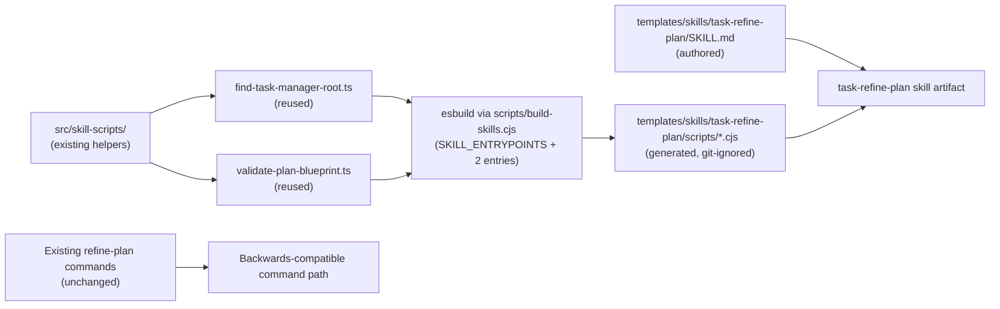
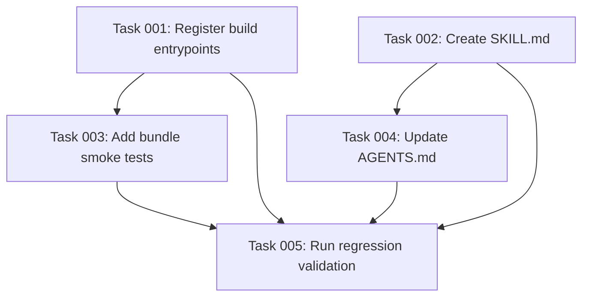

# Plan: Create task-refine-plan Skill Following the Plan-68/69/70 Pattern

## Original Work Order

> look at archived plans 68, 69 and 70, and apply it to the `/tasks:refine-plan` command.

## Executive Summary

Introduce `task-refine-plan` as the fourth Agent Skill in this repository, following the exact pattern plans 68, 69, and 70 established for `task-create-plan`, `task-generate-tasks`, and `task-execute-blueprint`. The skill encodes the same plan-refinement workflow the existing `/tasks:refine-plan` and `/tasks:refine-plan-auto` commands perform today: locate `.ai/task-manager`, resolve the target plan by ID, load the plan and project context, execute `PRE_PLAN.md`, review the plan end-to-end, run a clarification loop (either interactive or autonomous), apply refinements in-place while preserving the plan's identity, execute `POST_PLAN.md`, and emit a structured `Plan Refinement Summary`.

The skill covers both operating modes — interactive clarification (asking the user targeted questions) and autonomous clarification (resolving gaps via codebase inspection) — within a single skill artifact. The assistant selects the appropriate mode based on the user's request and context.

Executable logic the skill needs at runtime is fully satisfied by the existing `src/skill-scripts/` TypeScript source. `find-task-manager-root.ts` and `validate-plan-blueprint.ts` are already ported and bundled for other skills; the build pipeline simply emits additional bundled copies into this skill's `scripts/` so the skill remains self-contained per plan 68's architectural constraint. No new TypeScript entrypoints or shared helpers are required.

The existing assistant-specific `/tasks:refine-plan` and `/tasks:refine-plan-auto` command templates and the `.cjs` scripts under `templates/ai-task-manager/config/scripts/` remain unchanged. The skill is an additive artifact in the repository, distributed via the existing `files: ["templates/"]` rule in the npm package. Distribution into user projects continues to be deferred per plan 68.

## Context

### Current State vs Target State

| Current State | Target State | Why? |
|---|---|---|
| `/tasks:refine-plan` and `/tasks:refine-plan-auto` exist only as assistant-specific command templates under `templates/assistant/commands/tasks/`. | The same workflow is also available as an assistant-agnostic skill at `templates/skills/task-refine-plan/`. | Plans 68–70 established skills as the migration target; three skills are already shipping under this pattern. |
| Runtime helpers (`validate-plan-blueprint.cjs`) live only as hand-maintained `.cjs` under `templates/ai-task-manager/config/scripts/`. | The same helpers are also available as bundled `.cjs` inside the new skill's `scripts/` directory, authored in TypeScript under `src/skill-scripts/`. | A single TypeScript source of truth was the explicit goal of plan 68. The new skill reuses the already-ported entrypoints. |
| `scripts/build-skills.cjs` registers entrypoints for three skills (`task-create-plan`, `task-generate-tasks`, `task-execute-blueprint`). | The same registry adds entrypoints for `task-refine-plan` (find-root, validate-plan-blueprint). | The pipeline was deliberately designed to accept new entrypoints via a single array. |
| Only three skills are present under `templates/skills/`. | A fourth sibling skill directory exists, with its own `SKILL.md` and its own bundled scripts. | Skills are flat and self-contained per plan 68's architectural constraint. |
| The existing refine-plan commands are the only entry points and are in active use. | The existing commands remain unchanged. The skill is purely additive. | The established pattern from plans 68–70 is to preserve backwards compatibility. |

### Background

Plans 68, 69, and 70 introduced three pieces that make this plan small:

1. `src/skill-scripts/` with entrypoints and shared helpers under `shared/` (root discovery, frontmatter parsing, plan scanning, plan resolution, task scanning, git utilities).
2. `scripts/build-skills.cjs`, an `esbuild`-driven script wired into `npm run build` that iterates a `SKILL_ENTRYPOINTS` array and emits one self-contained `.cjs` per entrypoint into the corresponding skill's `scripts/` directory.
3. The conventions documented in `AGENTS.md`: flat skill directories under `templates/skills/<skill-name>/`, generated `.cjs` git-ignored, ship via `files: ["templates/"]`, distribution deferred.

The existing `/tasks:refine-plan` command contract this skill must preserve: discover `.ai/task-manager`, read `config/TASK_MANAGER.md`, validate the plan exists by running `config/scripts/validate-plan-blueprint.cjs <id> planFile`, load the plan body, execute `config/hooks/PRE_PLAN.md`, review the plan end-to-end (frontmatter, clarifications, architecture, risks, etc.), surface strengths and contradictions, run a clarification loop (interactive mode: ask user; auto mode: resolve via codebase inspection), append answers/assumptions to the "Plan Clarifications" table, apply refinements in-place using `config/templates/PLAN_TEMPLATE.md` as the structural baseline, preserve the original plan ID and directory, add a change log in the `Notes` section, execute `config/hooks/POST_PLAN.md`, and finish with a structured `Plan Refinement Summary` block.

The `/tasks:refine-plan-auto` command differs only in Stage 2: it uses an "Autonomous Clarification Algorithm" that resolves gaps by inspecting the codebase, docs, and project context instead of asking the user, and records findings as "auto-resolved" or "assumption" in the clarifications table.

## Architectural Approach

This plan adds two lines in `SKILL_ENTRYPOINTS`, one new skill directory with a single `SKILL.md`, and tests. No new TypeScript source is required because the needed entrypoints (`find-task-manager-root.ts`, `validate-plan-blueprint.ts`) are already authored and tested.



### Build Pipeline Registration

**Objective**: Wire the existing entrypoints into the `SKILL_ENTRYPOINTS` registry so `npm run build` produces the new skill's bundled scripts.

Two entries are appended to `SKILL_ENTRYPOINTS` in `scripts/build-skills.cjs`:

```text
{ src: 'src/skill-scripts/find-task-manager-root.ts',   skill: 'task-refine-plan', out: 'find-task-manager-root.cjs' }
{ src: 'src/skill-scripts/validate-plan-blueprint.ts',  skill: 'task-refine-plan', out: 'validate-plan-blueprint.cjs' }
```

No other build-script logic changes. Generated outputs land under `templates/skills/task-refine-plan/scripts/`, are git-ignored by the existing rule (`templates/skills/*/scripts/`), and ship via the existing `files: ["templates/"]` publish rule. Confirm with `npm pack --dry-run`.

### Skill Artifact

**Objective**: Add a standards-compliant `task-refine-plan` skill directory.

The skill lives at `templates/skills/task-refine-plan/` — a flat directory, no nested skills. It contains an authored `SKILL.md` with frontmatter whose `name` matches the directory and whose description is specific enough to trigger only on plan-refinement requests for this task-manager. The skill's prose:

- Describes the operating procedure (locate root → resolve plan → load context and hooks → baseline review → clarification loop → refinement implementation → POST_PLAN hook → emit summary).
- Covers both interactive and autonomous clarification modes within the same skill. The skill explains the two modes so the assistant can select the right one based on context (e.g., user explicitly asks for autonomous refinement, or the conversation indicates no further user input will be available).
- Calls bundled scripts by relative path from the skill root.
- Avoids assistant-specific syntax (no `$ARGUMENTS`, no `$1`); the user supplies the plan ID conversationally.
- Carries forward the critical rules from the existing commands: preserve plan identity (same ID, same directory), use `PLAN_TEMPLATE.md` as structural baseline, update the "Plan Clarifications" table, append a change log, execute validation hooks.
- Ends with the exact required `Plan Refinement Summary` block format.

### Compatibility Boundary

**Objective**: Leave the existing command path entirely intact.

No file under `templates/assistant/commands/` is modified. No file under `templates/ai-task-manager/config/scripts/` is removed or renamed. The existing `.cjs` helpers continue to back the command path. The new skill is an additive artifact in the repository whose only contact with the user's runtime is the npm package contents, gated behind the still-deferred distribution work from plan 68.

## Risk Considerations and Mitigation Strategies

<details>
<summary>Technical Risks</summary>

- **Drift between command-path `.cjs` and skill-path TypeScript port for `validate-plan-blueprint`.** The existing bundled `.cjs` for other skills could diverge from the legacy `.cjs` if the TypeScript source is modified in the future.
    - **Mitigation**: The TypeScript source is already tested and cross-validated against the legacy `.cjs` in plans 69 and 70. The new skill simply reuses the same already-bundled entrypoint. No new logic is introduced.
- **Plan resolution must handle both `.md` and `.html` plans.** The existing repository contains older archived Markdown plans alongside current HTML plans. The skill must resolve either.
    - **Mitigation**: Reuse the dual-extension recognition `plan-scan.ts` and `plan-resolve.ts` already implement. No new logic is required.
- **Skill prose conflates interactive and auto modes in a confusing way.** A single skill covering both modes could produce ambiguous instructions.
    - **Mitigation**: Structure the skill prose so the clarification stage clearly branches into "Interactive Clarification" and "Autonomous Clarification" subsections. The assistant selects the branch based on context, and both converge on the same refinement implementation stage.

</details>

<details>
<summary>Implementation Risks</summary>

- **Scope creep into a broader migration.** Adding a fourth skill tempts a parallel port of every remaining command (`fix-broken-tests`, `full-workflow`, `execute-task`, `status-dashboard`).
    - **Mitigation**: Limit the skill work strictly to `task-refine-plan`. No new TypeScript entrypoints are added. Do not touch other commands. Do not delete or modify the legacy `.cjs` files.
- **Skill prose accidentally diverges from the command's contract.** The existing commands embed significant guidance (clarification algorithm, structural compliance rules, change log requirements, output format) that affects refinement quality.
    - **Mitigation**: Treat the existing command templates as the contract. Carry forward the Total Clarification Algorithm, Autonomous Clarification Algorithm, stage definitions, and output requirements into the skill, expressed as skill prose rather than restated slash-command instructions.

</details>

<details>
<summary>Quality Risks</summary>

- **Generated outputs escape lint and direct test coverage.** Bundled `.cjs` files are not hand-inspectable.
    - **Mitigation**: The TypeScript source is already covered by existing Jest tests. Add a bundle smoke check that executes the generated `.cjs` end-to-end against a fixture, mirroring the smoke tests established for plans 68–70.
- **Skill lacks validation that it can produce the right refinement summary format.** The structured output block is consumed by downstream automation.
    - **Mitigation**: Include a specific self-validation step that drives a sample refinement and asserts the final output contains the exact `Plan Refinement Summary` block format.

</details>

## Success Criteria

### Primary Success Criteria

1. A standards-compliant skill directory exists at `templates/skills/task-refine-plan/` with a valid `SKILL.md` whose `name` matches the directory name and whose description is specific to plan refinement for this task-manager.
2. `npm run build` produces a `scripts/` directory inside the new skill containing two bundled, self-contained `.cjs` files — `find-task-manager-root.cjs` and `validate-plan-blueprint.cjs` — each runnable from a directory that contains only the skill, not the repository.
3. Generated `.cjs` files are git-ignored by the existing rule and present in the published npm package via the existing `templates/` entry.
4. The existing `/tasks:refine-plan` and `/tasks:refine-plan-auto` command templates, the existing `.cjs` scripts under `templates/ai-task-manager/config/scripts/`, and `init` behavior remain unchanged, and current tests still pass.
5. Running the skill against an initialized fixture with an existing plan produces an in-place refined plan that preserves the original ID and directory, updates the "Plan Clarifications" table if new information surfaced, appends a change log to the `Notes` section, and ends with a `Plan Refinement Summary` block containing the correct plan ID and absolute plan file path.

## Self Validation

Execute these concrete checks after implementation:

- Run `npm run build` from a clean tree and confirm `templates/skills/task-refine-plan/scripts/` contains exactly `find-task-manager-root.cjs` and `validate-plan-blueprint.cjs`. Confirm `git status` shows them ignored.
- Open `templates/skills/task-refine-plan/SKILL.md` and verify the `name` frontmatter equals `task-refine-plan`, the description is plan-refinement-specific, and every script reference is relative to the skill root. Verify the skill prose contains distinct coverage for both interactive and autonomous clarification modes.
- Create a temporary fixture via `npx . init --assistants claude --destination-directory /tmp/skill-refine-plan-fixture`, manually create a sample plan directory under `.ai/task-manager/plans/` containing a plan `.md` file, copy `templates/skills/task-refine-plan/` into the fixture, and from inside the fixture run:
  - the bundled `find-task-manager-root.cjs` and confirm it resolves the fixture's root, not the repository's;
  - the bundled `validate-plan-blueprint.cjs <plan-id> planFile` and confirm it returns the absolute path to the sample plan file.
- Drive a sample refinement run against the fixture plan by following the skill's instructions (use autonomous mode for testability). Confirm the plan file is updated in-place, the original plan ID and directory are preserved, a change log entry is present in the `Notes` section, and the run's final output contains a `Plan Refinement Summary` block.
- Run the existing pipeline as a regression check: `npx . init --assistants claude,gemini,opencode,codex --destination-directory /tmp/regression-71` and confirm the refine-plan command files are generated identically to before. Run `npm test` and `npm run lint` — both pass.
- Run `npm pack --dry-run` and confirm all four skills' `templates/skills/*/scripts/*.cjs` are present in the file list.

## Documentation

`AGENTS.md` already documents the skills layer following plans 68–70. This plan requires a small, surgical update to that section:

- Add `task-refine-plan` alongside `task-create-plan`, `task-generate-tasks`, and `task-execute-blueprint` as a shipping skill.
- Update the "registered entrypoints" mention to note that the `SKILL_ENTRYPOINTS` array now contains entries for four skills.
- No other documentation changes are required. The `README.md` does not enumerate commands or skills today and does not need to change. No user-facing migration guide is required — the command path is preserved.

## Resource Requirements

### Development Skills

Working knowledge of TypeScript and Node CommonJS packaging, familiarity with the existing `esbuild` bundle script in `scripts/build-skills.cjs`, comfort with the AI Task Manager templates and hook system, and an understanding of Agent Skill structure conventions established by `task-create-plan`, `task-generate-tasks`, and `task-execute-blueprint`.

### Technical Infrastructure

No new dependencies. `esbuild` is already a dev dependency. The build target, gitignore rule, and publish rule introduced by plan 68 already accommodate this skill without changes. The TypeScript entrypoints needed by this skill (`find-task-manager-root.ts`, `validate-plan-blueprint.ts`) are already authored and tested.

## Integration Strategy

The new skill integrates exactly as plans 68–70 prescribed: an additive artifact in the repository, picked up by the same `npm run build` step (and therefore by `prepublishOnly`), shipped via the existing `files: ["templates/"]` rule, with distribution into user projects deferred. The `SKILL_ENTRYPOINTS` array is now exercised by four skills, further validating the multi-skill design plan 68 anticipated.

## Notes

The skill's prose encodes a document-review workflow rather than a file-generation workflow. Unlike `task-create-plan` and `task-generate-tasks`, `task-refine-plan` modifies an existing artifact in-place. The SKILL.md therefore emphasizes identity preservation, structural compliance, and the clarification-to-refinement pipeline.

Both `/tasks:refine-plan` (interactive) and `/tasks:refine-plan-auto` (autonomous) are represented by the same skill. The distinction is not in the skill artifact but in how the assistant executes the clarification stage. This mirrors how a single human reviewer can either ask questions or research answers independently.

---

Plan Summary:
- Plan ID: 71
- Plan File: /workspace/.ai/task-manager/plans/71--task-refine-plan-skill/plan-71--task-refine-plan-skill.md

## Execution Blueprint

**Validation Gates:**
- Reference: `/config/hooks/POST_PHASE.md`

### Dependency Diagram



### ✅ Phase 1: Build Registration and Skill Authoring
**Parallel Tasks:**
- ✔️ Task 001: Register task-refine-plan entrypoints in build script
- ✔️ Task 002: Create task-refine-plan skill artifact (SKILL.md)

### ✅ Phase 2: Tests and Documentation
**Parallel Tasks:**
- ✔️ Task 003: Add bundle smoke tests for task-refine-plan scripts (depends on: 001)
- ✔️ Task 004: Update AGENTS.md to document task-refine-plan (depends on: 002)

### ✅ Phase 3: Regression Validation
**Parallel Tasks:**
- ✔️ Task 005: Run regression validation and self-checks (depends on: 001, 002, 003, 004)

### Post-phase Actions
- Confirm all success criteria from Plan 71 are satisfied.
- Archive the plan upon successful completion.

### Execution Summary
- Total Phases: 3
- Total Tasks: 5

---

## Execution Summary

**Status**: ✅ Completed Successfully
**Completed Date**: 2026-05-18

### Results
- Registered `task-refine-plan` entrypoints in `scripts/build-skills.cjs` (two new SKILL_ENTRYPOINTS entries)
- Created `templates/skills/task-refine-plan/SKILL.md` with assistant-agnostic prose covering interactive and autonomous clarification modes
- Added Jest bundle smoke tests for `task-refine-plan` scripts in `src/__tests__/skill-scripts.test.ts`
- Updated `AGENTS.md` to document the fourth shipping skill and four SKILL_ENTRYPOINTS entries
- All regression validations passed: `npm run build` produces correct bundles, `npm test` passes (219 tests), `npm run lint` is clean, `npm pack --dry-run` includes all four skills' `.cjs` bundles, init command generates refine-plan templates identically for all four assistants

### Noteworthy Events
- No significant issues encountered during execution. The first commit message in Phase 1 exceeded the 72-character subject limit enforced by commitlint; it was shortened and re-committed successfully.

### Necessary follow-ups
- None. The skill artifact is complete, tested, documented, and packaged. Distribution into user projects remains deferred per plan 68's architectural decision.
