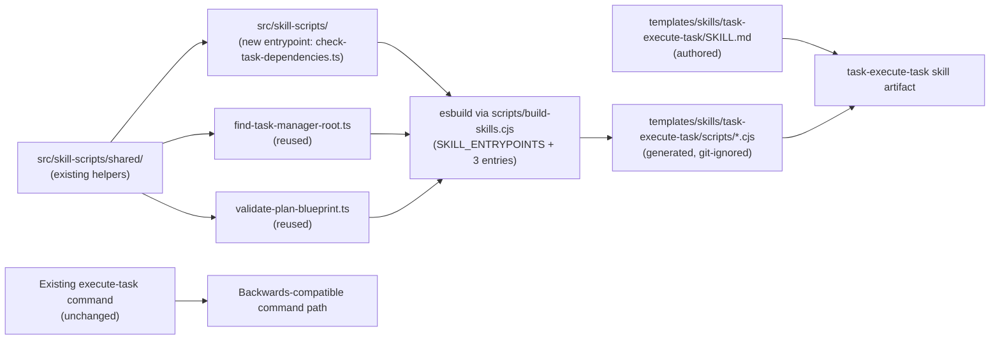

# Plan: Create task-execute-task Skill Following the Plan-68/69/70/71 Pattern

## Original Work Order

> look at archived plans 68, 69, 70, and 71, and apply it to the `/tasks:execute-task` command.

## Executive Summary

Introduce `task-execute-task` as the fifth Agent Skill in this repository, following the exact pattern plans 68-71 established for `task-create-plan`, `task-generate-tasks`, `task-execute-blueprint`, and `task-refine-plan`. The skill encodes the same single-task execution workflow the existing `/tasks:execute-task` command performs today: locate `.ai/task-manager`, resolve the target plan by ID, validate a specific task file, check its status and dependencies, run pre-execution hooks, execute the task via an appropriate agent, update status, document noteworthy events, and emit a structured `Task Execution Result` block.

Executable logic the skill needs at runtime is added to the existing `src/skill-scripts/` TypeScript source. The existing build pipeline driven by `scripts/build-skills.cjs` and `esbuild` already supports multiple skills via the `SKILL_ENTRYPOINTS` registry; new entrypoints are appended to that registry and the same `npm run build` command produces the bundled `.cjs` artifacts under `templates/skills/task-execute-task/scripts/`. No build-pipeline rework is required.

The existing assistant-specific `/tasks:execute-task` command template and the `.cjs` scripts under `templates/ai-task-manager/config/scripts/` remain unchanged. The skill is an additive artifact in the repository, distributed via the existing `files: ["templates/"]` rule in the npm package. Distribution into user projects continues to be deferred per plan 68.

## Context

### Current State vs Target State

| Current State | Target State | Why? |
|---|---|---|
| `/tasks:execute-task` exists only as assistant-specific command templates under `templates/assistant/commands/tasks/execute-task.md`. | The same workflow is also available as an assistant-agnostic skill at `templates/skills/task-execute-task/`. | Plans 68-71 established skills as the migration target; four skills are already shipping under this pattern. |
| Runtime helper (`check-task-dependencies.cjs`) lives only as a hand-maintained `.cjs` under `templates/ai-task-manager/config/scripts/`. | The same helper is also authored in TypeScript under `src/skill-scripts/` and bundled into the new skill's `scripts/`. The legacy `.cjs` file stays in place. | A single TypeScript source of truth was the explicit goal of plan 68. New skills extend the same source tree. |
| `scripts/build-skills.cjs` registers entrypoints for four skills (`task-create-plan`, `task-generate-tasks`, `task-execute-blueprint`, `task-refine-plan`). | The same registry adds entrypoints for `task-execute-task` (find-root, validate-plan-blueprint, check-task-dependencies). | The pipeline was deliberately designed to accept new entrypoints via a single array — that mechanism is exercised here for a fifth skill. |
| Only four skills are present under `templates/skills/`. | A fifth sibling skill directory exists, with its own `SKILL.md` and its own bundled scripts. | Skills are flat and self-contained per plan 68's architectural constraint. |
| The existing execute-task command is the only entry point and is in active use. | The existing command remains unchanged. The skill is purely additive. | The established pattern from plans 68-71 is to preserve backwards compatibility. |

### Background

Plans 68-71 introduced three pieces that make this plan small:

1. `src/skill-scripts/` with entrypoints and shared helpers under `shared/` (root discovery, frontmatter parsing, plan scanning, plan resolution, task scanning, git utilities).
2. `scripts/build-skills.cjs`, an `esbuild`-driven script wired into `npm run build` that iterates a `SKILL_ENTRYPOINTS` array and emits one self-contained `.cjs` per entrypoint into the corresponding skill's `scripts/` directory.
3. The conventions documented in `AGENTS.md`: flat skill directories under `templates/skills/<skill-name>/`, generated `.cjs` git-ignored, ship via `files: ["templates/"]`, distribution deferred.

The existing `/tasks:execute-task` command contract this skill must preserve: discover `.ai/task-manager`, read `config/TASK_MANAGER.md`, accept a plan ID and task ID as input, validate the plan exists, locate the specific task file (handling both padded and unpadded IDs), extract and validate the task's current status from frontmatter (blocking execution if status is `completed`, `in-progress`, or `needs-clarification`), validate all dependencies are resolved by running `config/scripts/check-task-dependencies.cjs <plan-id> <task-id>`, read and execute `config/hooks/PRE_TASK_ASSIGNMENT.md` for agent selection, update the task status to `in-progress`, deploy an agent to execute the task with `PRE_TASK_EXECUTION.md` hook, update status to `completed` or `failed`, document noteworthy events by appending to the task file, read and execute `config/hooks/POST_ERROR_DETECTION.md`, and finish with a structured `Task Execution Result` block. The skill's prose and bundled scripts must keep the same observable outcome.

## Architectural Approach

This plan adds one new TypeScript entrypoint, three lines in `SKILL_ENTRYPOINTS`, one new skill directory with a single `SKILL.md`, and tests. Nothing else changes.



### TypeScript Source Extensions

**Objective**: Add the entrypoint the new skill needs, alongside the existing ones, in `src/skill-scripts/`.

One new entrypoint is added at `src/skill-scripts/`:

- `check-task-dependencies.ts` — port of `templates/ai-task-manager/config/scripts/check-task-dependencies.cjs`. Accepts a plan ID or absolute path and a task ID, resolves the plan, locates the task file (handling padded and unpadded IDs), extracts dependencies from the task's frontmatter, checks each dependency's status, and exits 0 if all are `completed` or 1 otherwise. Preserves the existing CLI surface and output format (colored status messages, dependency summary table).

`find-task-manager-root.ts` and `validate-plan-blueprint.ts` are reused unchanged; the build pipeline simply emits second bundled copies into this skill's `scripts/` so the skill remains self-contained per plan 68's architectural constraint.

The new entrypoint imports `resolvePlan` from `shared/plan-resolve.ts` and uses shared frontmatter parsing logic already available in `shared/`. No new shared helpers are required.

Type-checks via the existing `tsconfig.skill-scripts.json`. Lints with the rest of `src/`. Output is produced by the bundler, not by `tsc`. No changes to the main `tsconfig.json` exclusions are required.

### Build Pipeline Registration

**Objective**: Wire the new entrypoints into the existing `SKILL_ENTRYPOINTS` registry so `npm run build` produces the new skill's bundled scripts.

Three entries are appended to `SKILL_ENTRYPOINTS` in `scripts/build-skills.cjs`:

```text
{ src: 'src/skill-scripts/find-task-manager-root.ts',       skill: 'task-execute-task', out: 'find-task-manager-root.cjs' }
{ src: 'src/skill-scripts/validate-plan-blueprint.ts',      skill: 'task-execute-task', out: 'validate-plan-blueprint.cjs' }
{ src: 'src/skill-scripts/check-task-dependencies.ts',      skill: 'task-execute-task', out: 'check-task-dependencies.cjs' }
```

No other build-script logic changes. Generated outputs land under `templates/skills/task-execute-task/scripts/`, are git-ignored by the existing rule (`templates/skills/*/scripts/`), and ship via the existing `files: ["templates/"]` publish rule. Confirm with `npm pack --dry-run`.

### Skill Artifact

**Objective**: Add a standards-compliant `task-execute-task` skill directory.

The skill lives at `templates/skills/task-execute-task/` — a flat directory, no nested skills. It contains an authored `SKILL.md` with frontmatter whose `name` matches the directory and whose description is specific enough to trigger only on single-task execution requests for this task-manager. The skill's prose:

- Describes the operating procedure (locate root → resolve plan → validate task file → check status → validate dependencies → run PRE_TASK_ASSIGNMENT hook → update status to in-progress → execute task with agent → update status → document events → emit result).
- Calls bundled scripts by relative path from the skill root.
- Avoids assistant-specific syntax (no `$ARGUMENTS`, no `$1`); the user supplies the plan ID and task ID conversationally.
- Carries forward the critical rules from the existing command: never skip dependency validation, never execute completed/in-progress/needs-clarification tasks, maintain status integrity, document noteworthy events, provide structured output.
- Ends with the exact required `Task Execution Result` block format.

### Compatibility Boundary

**Objective**: Leave the existing command path entirely intact.

No file under `templates/assistant/commands/` is modified. No file under `templates/ai-task-manager/config/scripts/` is removed or renamed. The existing `.cjs` helpers continue to back the command path. The new skill is an additive artifact in the repository whose only contact with the user's runtime is the npm package contents, gated behind the still-deferred distribution work from plan 68.

## Risk Considerations and Mitigation Strategies

<details>
<summary>Technical Risks</summary>

- **Drift between command-path `.cjs` and skill-path TypeScript port.** The `check-task-dependencies.cjs` port could diverge in dependency parsing logic, padded-ID handling, or output formatting.
    - **Mitigation**: Anchor the port to the existing `.cjs` semantics by treating the legacy file as the reference. Add a cross-validation test that runs both the bundled `.cjs` and the legacy `.cjs` against shared fixtures and asserts identical exit codes and output for the overlapping surface.
- **`check-task-dependencies.cjs` depends on `shared-utils.cjs` at runtime.** The legacy script imports `resolvePlan` and `parseFrontmatter` from a sibling file that will not exist when the bundled `.cjs` is consumed standalone.
    - **Mitigation**: The TypeScript port imports `resolvePlan` from `shared/plan-resolve.ts` and implements its own frontmatter parsing inline (or reuses existing shared helpers), which `esbuild` bundles into the output. Validate the generated `.cjs` by running it from a temporary directory that contains only the skill artifact (not the repository).
- **Plan resolution must handle both `.md` and `.html` plans.** The existing repository contains older archived Markdown plans alongside current HTML plans. The skill must resolve either.
    - **Mitigation**: Reuse the dual-extension recognition `plan-scan.ts` and `plan-resolve.ts` already implement. No new logic is required.
- **Task file finding must handle padded and unpadded IDs.** The command accepts both `1` and `01`; the skill must do the same.
    - **Mitigation**: Port the exact `_findTaskFile` logic from the legacy `.cjs` (three variations: raw, zero-padded, stripped) into the TypeScript entrypoint.

</details>

<details>
<summary>Implementation Risks</summary>

- **Scope creep into a broader migration.** Adding a fifth skill tempts a parallel port of every remaining command (`fix-broken-tests`, `full-workflow`, `status-dashboard`).
    - **Mitigation**: Limit the skill work strictly to `task-execute-task`. Port only `check-task-dependencies.cjs`. Do not touch other commands. Do not delete or modify the legacy `.cjs` files.
- **Skill prose accidentally diverges from the command's contract.** The existing command embeds significant orchestration guidance (status transition rules, dependency validation, agent selection, error handling) that affects execution quality.
    - **Mitigation**: Treat the existing command template as the contract. Carry forward the critical rules, valid status transitions, dependency-check invocation, hook execution order, and output requirements into the skill, expressed as skill prose rather than restated slash-command instructions.

</details>

<details>
<summary>Quality Risks</summary>

- **Generated outputs escape lint and direct test coverage.** Bundled `.cjs` files are not hand-inspectable.
    - **Mitigation**: Cover the TypeScript source with the existing Jest setup. Add a bundle smoke check that executes the generated `.cjs` end-to-end against a fixture, mirroring the smoke tests established for plans 68-71.
- **Skill lacks validation that it can produce the right execution result format.** The structured output block is consumed by downstream automation.
    - **Mitigation**: Include a specific self-validation step that drives a sample task execution and asserts the final output contains the exact `Task Execution Result` block format.

</details>

## Success Criteria

### Primary Success Criteria

1. A standards-compliant skill directory exists at `templates/skills/task-execute-task/` with a valid `SKILL.md` whose `name` matches the directory name and whose description is specific to single-task execution for this task-manager.
2. TypeScript source for the three skill entrypoints (`find-task-manager-root.ts` reused, `validate-plan-blueprint.ts` reused, `check-task-dependencies.ts` new) and their shared helpers exists under `src/skill-scripts/`, and is the only maintained source for that logic.
3. `npm run build` produces a `scripts/` directory inside the new skill containing three bundled, self-contained `.cjs` files — `find-task-manager-root.cjs`, `validate-plan-blueprint.cjs`, `check-task-dependencies.cjs` — each runnable from a directory that contains only the skill, not the repository.
4. Generated `.cjs` files are git-ignored by the existing rule and present in the published npm package via the existing `templates/` entry.
5. The existing `/tasks:execute-task` command template, the existing `.cjs` scripts under `templates/ai-task-manager/config/scripts/`, and `init` behavior remain unchanged, and current tests still pass.
6. Running the skill against an initialized fixture with an existing plan and tasks validates dependencies correctly, respects status blocking rules, and ends with a `Task Execution Result` block containing the correct plan ID, task ID, and exit code.

## Self Validation

Execute these concrete checks after implementation:

- Run `npm run build` from a clean tree and confirm `templates/skills/task-execute-task/scripts/` contains exactly `find-task-manager-root.cjs`, `validate-plan-blueprint.cjs`, and `check-task-dependencies.cjs`. Confirm `git status` shows them ignored.
- Open `templates/skills/task-execute-task/SKILL.md` and verify the `name` frontmatter equals `task-execute-task`, the description is task-execution-specific, and every script reference is relative to the skill root.
- Create a temporary fixture via `npx . init --assistants claude --destination-directory /tmp/skill-execute-task-fixture`, manually create a sample plan directory under `.ai/task-manager/plans/` containing a plan `.md` file and at least two task files (one with `status: completed` and one with `status: pending` that depends on the first), copy `templates/skills/task-execute-task/` into the fixture, and from inside the fixture run:
  - the bundled `find-task-manager-root.cjs` and confirm it resolves the fixture's root, not the repository's;
  - the bundled `validate-plan-blueprint.cjs <plan-id> planFile` and confirm it returns the absolute path to the sample plan file;
  - the bundled `check-task-dependencies.cjs <plan-id> <pending-task-id>` and confirm it reports all dependencies resolved and exits 0;
  - the bundled `check-task-dependencies.cjs <plan-id> <pending-task-id>` after changing the dependency task to `status: failed` and confirm it exits 1.
- Cross-validate the bundled `check-task-dependencies.cjs` against the legacy `templates/ai-task-manager/config/scripts/check-task-dependencies.cjs` on the same fixture and confirm identical exit codes and semantically equivalent output.
- Run the existing pipeline as a regression check: `npx . init --assistants claude,gemini,opencode,codex --destination-directory /tmp/regression-72` and confirm the execute-task command files are generated identically to before. Run `npm test` and `npm run lint` — both pass.
- Run `npm pack --dry-run` and confirm all five skills' `templates/skills/*/scripts/*.cjs` are present in the file list.

## Documentation

`AGENTS.md` already documents the skills layer following plans 68-71. This plan requires a small, surgical update to that section:

- Add `task-execute-task` alongside `task-create-plan`, `task-generate-tasks`, `task-execute-blueprint`, and `task-refine-plan` as a shipping skill.
- Update the "registered entrypoints" mention to note that the `SKILL_ENTRYPOINTS` array now contains entries for five skills.
- No other documentation changes are required. The `README.md` does not enumerate commands or skills today and does not need to change. No user-facing migration guide is required — the command path is preserved.

## Resource Requirements

### Development Skills

Working knowledge of TypeScript and Node CommonJS packaging, familiarity with the existing `esbuild` bundle script in `scripts/build-skills.cjs`, comfort with the AI Task Manager templates and hook system, and an understanding of Agent Skill structure conventions established by plans 68-71.

### Technical Infrastructure

No new dependencies. `esbuild` is already a dev dependency. The build target, gitignore rule, and publish rule introduced by plan 68 already accommodate this skill without changes. The TypeScript entrypoints needed by this skill (`find-task-manager-root.ts`, `validate-plan-blueprint.ts`) are already authored and tested.

## Integration Strategy

The new skill integrates exactly as plans 68-71 prescribed: an additive artifact in the repository, picked up by the same `npm run build` step (and therefore by `prepublishOnly`), shipped via the existing `files: ["templates/"]` rule, with distribution into user projects deferred. The `SKILL_ENTRYPOINTS` array is now exercised by five skills, further validating the multi-skill design plan 68 anticipated.

## Notes

The skill's prose encodes a single-task execution workflow with strong emphasis on validation gates (status checks, dependency checks) before any implementation work begins. Unlike `task-execute-blueprint` which orchestrates entire plans, `task-execute-task` focuses on granular, single-task control with the same validation standards.

The existing `check-task-dependencies.cjs` has a broader surface than a simple dependency checker; it accepts a plan ID or absolute path, handles padded/unpadded task IDs, parses YAML frontmatter dependencies in both array and list formats, and produces a formatted summary table. Pull the full surface into the port to avoid future divergence if/when the legacy `.cjs` is eventually retired.

---

Plan Summary:
- Plan ID: 72
- Plan File: /workspace/.ai/task-manager/plans/72--task-execute-task-skill/plan-72--task-execute-task-skill.md

## Execution Blueprint

**Validation Gates:**
- Reference: `/config/hooks/POST_PHASE.md`

### ✅ Phase 1: TypeScript Source and Skill Prose
**Parallel Tasks:**
- ✔️ Task 001: Port check-task-dependencies.cjs to TypeScript and register in build pipeline
- ✔️ Task 002: Author task-execute-task SKILL.md

### ✅ Phase 2: Tests and Documentation
**Parallel Tasks:**
- ✔️ Task 003: Add integration tests for check-task-dependencies and skill bundles (depends on: 1)
- ✔️ Task 004: Update AGENTS.md skills documentation (depends on: 1, 2)

### ✅ Phase 3: Validation and Regression
**Parallel Tasks:**
- ✔️ Task 005: Run full validation and regression checks (depends on: 1, 2, 3, 4)

### Post-phase Actions
Run `POST_PHASE.md` validation hook after each phase.

### Execution Summary
- Total Phases: 3
- Total Tasks: 5

## Execution Summary

**Status**: ✅ Completed Successfully
**Completed Date**: 2026-05-18

### Results
- Created `src/skill-scripts/check-task-dependencies.ts` as a TypeScript port of the legacy script
- Updated `scripts/build-skills.cjs` to register three new entrypoints for `task-execute-task`
- Authored `templates/skills/task-execute-task/SKILL.md` as a standards-compliant Agent Skill
- Added integration tests covering bundle smoke checks, cross-validation against the legacy script, and dependency scenario tests
- Updated `AGENTS.md` to list `task-execute-task` as the fifth shipping skill
- All 231 tests pass; lint passes; npm pack includes all five skills' bundled scripts

### Noteworthy Events
- Task 001 sub-agent returned an empty result and did not produce the required TypeScript file, requiring manual intervention to port `check-task-dependencies.cjs` and update the build registry.
- `npx . init` encountered a permission-denied error during fixture setup for self-validation; substituted `node dist/cli.js init` as a functional workaround.
- Plan and task files reside under `.ai/task-manager/plans/`, which is gitignored in the repository, so status transitions during execution do not appear in git history.

### Necessary follow-ups
- None identified.
