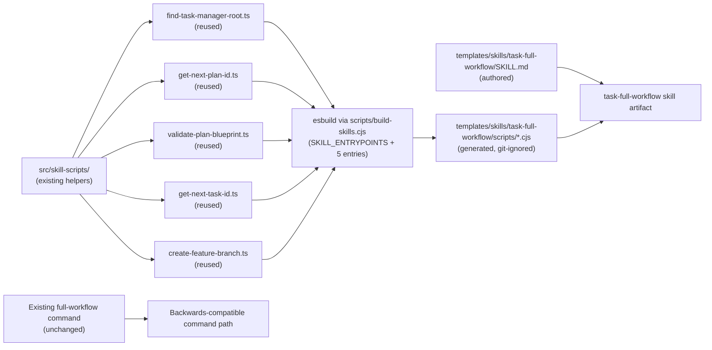
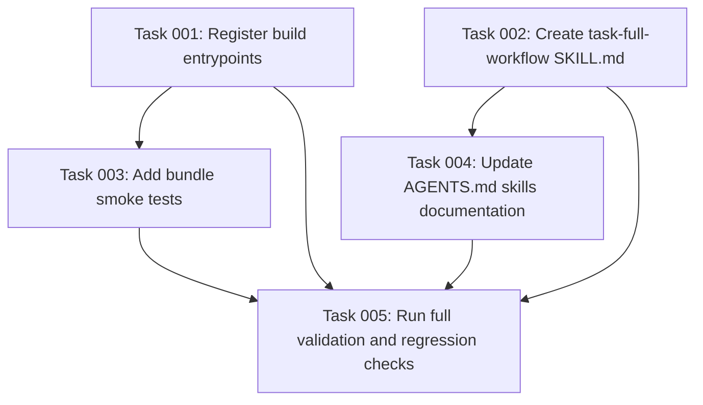

# Plan: Create task-full-workflow Skill Following the Plan-68/69/70/71 Pattern

## Original Work Order

> look at archived plans 68, 69, 70, 71, and apply it to the `/tasks:full-workflow` command.

## Plan Clarifications

| Question | Answer |
| --- | --- |
| Should the existing `/tasks:full-workflow` command behavior be preserved? | Yes. The command template under `templates/assistant/commands/tasks/full-workflow.md` remains untouched. The skill is purely additive. |
| Are there any new TypeScript entrypoints or shared helpers needed? | No. All runtime helpers the full-workflow command needs (`find-task-manager-root`, `get-next-plan-id`, `validate-plan-blueprint`, `get-next-task-id`, `create-feature-branch`) are already authored and bundled for other skills. Only `SKILL_ENTRYPOINTS` registrations and the skill artifact are new. |
| Which scripts must ship inside the skill? | All five entrypoints, bundled into the skill's own `scripts/` directory so the skill remains self-contained: `find-task-manager-root`, `get-next-plan-id`, `validate-plan-blueprint`, `get-next-task-id`, `create-feature-branch`. |
| What format should the skill's orchestration instructions use? | Assistant-agnostic prose that describes the three-phase sequential workflow (plan creation → task generation → blueprint execution) with context-passing rules, progress indicators, and the critical no-pause rule, without literally embedding other skills' markdown contents. |
| Should the skill support the same auto-generation fallback as the command? | Yes. The skill must preserve the command's behavior of auto-generating tasks and blueprint if missing before proceeding to execution. |

## Executive Summary

Introduce `task-full-workflow` as the fifth Agent Skill in this repository, following the exact pattern plans 68-71 established for `task-create-plan`, `task-generate-tasks`, `task-execute-blueprint`, and `task-refine-plan`. The skill encodes the same end-to-end orchestration workflow the existing `/tasks:full-workflow` command performs today: locate `.ai/task-manager`, run the full three-phase pipeline (plan creation, task generation, blueprint execution) sequentially without pausing between steps, pass context between phases via structured output parsing, auto-generate missing tasks or blueprints when necessary, and conclude with archival.

Unlike the individual workflow skills, `task-full-workflow` is a coordination skill. It does not introduce new file-generation logic; instead, it instructs the assistant to perform the equivalent of the three existing workflows in sequence, using the same bundled helpers for root discovery, ID allocation, plan validation, task scanning, and branch creation. The existing build pipeline already supports this via the `SKILL_ENTRYPOINTS` registry — five additional entries produce bundled copies of the already-authored TypeScript entrypoints into the new skill's `scripts/` directory.

The existing assistant-specific `/tasks:full-workflow` command template and the `.cjs` scripts under `templates/ai-task-manager/config/scripts/` remain unchanged. The skill is an additive artifact in the repository, distributed via the existing `files: ["templates/"]` rule in the npm package. Distribution into user projects continues to be deferred per plan 68.

## Context

### Current State vs Target State

| Current State | Target State | Why? |
| --- | --- | --- |
| `/tasks:full-workflow` exists only as assistant-specific command templates under `templates/assistant/commands/tasks/full-workflow.md`. | The same end-to-end workflow is also available as an assistant-agnostic skill at `templates/skills/task-full-workflow/`. | Plans 68-71 established skills as the migration target; four skills are already shipping under this pattern. |
| Runtime helpers for the full workflow are spread across hand-maintained `.cjs` under `templates/ai-task-manager/config/scripts/` and embedded bash heredocs inside the command markdown. | The skill bundles all required helpers as compiled `.cjs` in its own `scripts/` directory, authored in TypeScript under `src/skill-scripts/`. | A single TypeScript source of truth was the explicit goal of plan 68. The new skill reuses the already-ported entrypoints. |
| `scripts/build-skills.cjs` registers entrypoints for four skills. | The registry adds entries for `task-full-workflow` (find-root, next-plan-id, validate-blueprint, next-task-id, create-feature-branch). | The pipeline was designed to accept new entrypoints via a single array. |
| Only four skills are present under `templates/skills/`. | A fifth sibling skill directory exists, with its own `SKILL.md` and its own bundled scripts. | Skills are flat and self-contained per plan 68's architectural constraint. |
| The existing full-workflow command is the only entry point and is in active use. | The existing command remains unchanged. The skill is purely additive. | The established pattern from plans 68-71 is to preserve backwards compatibility. |

### Background

Plans 68-71 introduced three pieces that make this plan small:

1. `src/skill-scripts/` with entrypoints and shared helpers under `shared/` (root discovery, frontmatter parsing, plan scanning, plan resolution, task scanning, git utilities).
2. `scripts/build-skills.cjs`, an `esbuild`-driven script wired into `npm run build` that iterates a `SKILL_ENTRYPOINTS` array and emits one self-contained `.cjs` per entrypoint into the corresponding skill's `scripts/` directory.
3. The conventions documented in `AGENTS.md`: flat skill directories under `templates/skills/<skill-name>/`, generated `.cjs` git-ignored, ship via `files: ["templates/"]`, distribution deferred.

The existing `/tasks:full-workflow` command contract this skill must preserve: discover `.ai/task-manager`, read `config/TASK_MANAGER.md`, execute the embedded plan-creation process (including `PRE_PLAN.md` and `POST_PLAN.md` hooks, clarification loop, plan ID allocation, and plan file emission conforming to `PLAN_TEMPLATE.md`), extract the Plan ID from the structured `Plan Summary` block, execute the embedded task-generation process (including blueprint validation, auto-generation if missing, `POST_TASK_GENERATION_ALL.md` hook, task file emission conforming to `TASK_TEMPLATE.md`), extract task count from the `Task Generation Summary` block, then execute the embedded blueprint-execution process (including feature-branch creation, phase-by-phase execution with `PRE_PHASE.md`, `PRE_TASK_ASSIGNMENT.md`, `PRE_TASK_EXECUTION.md`, `POST_PHASE.md` hooks, `POST_EXECUTION.md` validation, execution summary appending, and archival). The skill's prose and bundled scripts must keep the same observable outcome, including the critical rule that execution does not pause between the three major steps.

## Architectural Approach

This plan adds five lines in `SKILL_ENTRYPOINTS`, one new skill directory with a single `SKILL.md`, and tests. No new TypeScript source is required because every entrypoint the skill needs is already authored and tested.



### Build Pipeline Registration

**Objective**: Wire the existing entrypoints into the `SKILL_ENTRYPOINTS` registry so `npm run build` produces the new skill's bundled scripts.

Five entries are appended to `SKILL_ENTRYPOINTS` in `scripts/build-skills.cjs`:

```text
{ src: 'src/skill-scripts/find-task-manager-root.ts',   skill: 'task-full-workflow', out: 'find-task-manager-root.cjs' }
{ src: 'src/skill-scripts/get-next-plan-id.ts',          skill: 'task-full-workflow', out: 'get-next-plan-id.cjs' }
{ src: 'src/skill-scripts/validate-plan-blueprint.ts',   skill: 'task-full-workflow', out: 'validate-plan-blueprint.cjs' }
{ src: 'src/skill-scripts/get-next-task-id.ts',          skill: 'task-full-workflow', out: 'get-next-task-id.cjs' }
{ src: 'src/skill-scripts/create-feature-branch.ts',     skill: 'task-full-workflow', out: 'create-feature-branch.cjs' }
```

No other build-script logic changes. Generated outputs land under `templates/skills/task-full-workflow/scripts/`, are git-ignored by the existing rule (`templates/skills/*/scripts/`), and ship via the existing `files: ["templates/"]` publish rule. Confirm with `npm pack --dry-run`.

### Skill Artifact

**Objective**: Add a standards-compliant `task-full-workflow` skill directory.

The skill lives at `templates/skills/task-full-workflow/` — a flat directory, no nested skills. It contains an authored `SKILL.md` with frontmatter whose `name` matches the directory and whose description is specific enough to trigger only on full-workflow requests for this task-manager. The skill's prose:

- Describes the operating procedure as three sequential phases without pausing: Plan Creation → Task Generation → Blueprint Execution.
- For each phase, instructs the assistant to follow the same procedure as the corresponding individual skill/command, using the common task-manager templates, hooks, and bundled scripts.
- Includes context-passing rules: extract `Plan ID` from the Phase 1 structured summary, use it to drive Phase 2; extract `Tasks` count from the Phase 2 structured summary, use it for progress tracking in Phase 3.
- Includes progress indicators (`⬛⬜⬜ 33%`, etc.) for user visibility, with the explicit rule that indicators are informational and do not pause execution.
- Covers the auto-generation fallback: if tasks or blueprint are missing at the start of Phase 3, the skill instructs auto-generation before proceeding, matching the command's behavior.
- Calls bundled scripts by relative path from the skill root.
- Avoids assistant-specific syntax (no `$ARGUMENTS`, no `$1`); the user supplies the initial prompt conversationally.
- Carries forward the critical no-pause rule from the existing command: the assistant executes all three steps sequentially without waiting for user input between steps.
- Ends with the exact required `Execution Summary` block format.

### Compatibility Boundary

**Objective**: Leave the existing command path entirely intact.

No file under `templates/assistant/commands/` is modified. No file under `templates/ai-task-manager/config/scripts/` is removed or renamed. The existing `.cjs` helpers continue to back the command path. The new skill is an additive artifact in the repository whose only contact with the user's runtime is the npm package contents, gated behind the still-deferred distribution work from plan 68.

## Risk Considerations and Mitigation Strategies

<details>
<summary>Technical Risks</summary>

- **Drift between command-path and skill-path orchestration logic.** The command literally embeds the complete create-plan, generate-tasks, and execute-blueprint prompts inline. The skill cannot do this portably. If the skill prose is too high-level, assistants might skip critical sub-steps (e.g., hooks, clarification loops, auto-generation fallback).
    - **Mitigation**: Structure the skill prose as an explicit step-by-step checklist for each phase, referencing the exact hook files, template files, and bundled scripts the command uses. Include the auto-generation conditional explicitly. Cross-validate the skill's output against the command template to ensure no step is lost.
- **Bundled `.cjs` copies drift from the originals if TypeScript source is modified.** Because `task-full-workflow` receives its own copies of the `.cjs` bundles, future edits to the TypeScript source will regenerate all five skills' copies simultaneously via `npm run build`. However, if someone edits one skill's generated `.cjs` directly, drift occurs.
    - **Mitigation**: The `.gitignore` rule already excludes `templates/skills/*/scripts/`. Document in `AGENTS.md` that generated `.cjs` files must never be hand-edited; the TypeScript source is the single source of truth.
- **Plan resolution must handle both `.md` and `.html` plans.** The existing repository contains older archived Markdown plans alongside current HTML plans.
    - **Mitigation**: Reuse the dual-extension recognition already implemented in `plan-scan.ts` and `plan-resolve.ts`. No new logic is required.
</details>

<details>
<summary>Implementation Risks</summary>

- **Scope creep into a broader migration.** Adding a fifth skill tempts a parallel port of every remaining command (`fix-broken-tests`, `status-dashboard`, `execute-task`).
    - **Mitigation**: Limit the skill work strictly to `task-full-workflow`. No new TypeScript entrypoints are added. Do not touch other commands. Do not delete or modify the legacy `.cjs` files.
- **Skill prose accidentally diverges from the command's contract.** The existing command embeds significant orchestration guidance (progress indicators, context-passing instructions, auto-generation fallbacks, no-pause rules) that affects execution quality.
    - **Mitigation**: Treat the existing command template as the contract. Carry forward the critical rules, phase workflow, hook invocation order, context-passing format, progress indicator format, and output requirements into the skill, expressed as skill prose rather than restated slash-command instructions.
</details>

<details>
<summary>Quality Risks</summary>

- **Generated outputs escape lint and direct test coverage.** Bundled `.cjs` files are not hand-inspectable.
    - **Mitigation**: The TypeScript source is already covered by existing Jest tests. Add a bundle smoke check that executes each of the five generated `.cjs` files end-to-end against a fixture, mirroring the smoke tests established for plans 68-71.
- **Skill lacks validation that it can produce the right execution summary format.** The structured output block is consumed by downstream automation.
    - **Mitigation**: Include a specific self-validation step that drives a sample full-workflow run (or at least validates the skill prose produces the correct structured output format) and asserts the final output contains the exact `Execution Summary` block format.
</details>

## Success Criteria

### Primary Success Criteria

1. A standards-compliant skill directory exists at `templates/skills/task-full-workflow/` with a valid `SKILL.md` whose `name` matches the directory name and whose description is specific to full-workflow execution for this task-manager.
2. `npm run build` produces a `scripts/` directory inside the new skill containing five bundled, self-contained `.cjs` files — `find-task-manager-root.cjs`, `get-next-plan-id.cjs`, `validate-plan-blueprint.cjs`, `get-next-task-id.cjs`, `create-feature-branch.cjs` — each runnable from a directory that contains only the skill, not the repository.
3. Generated `.cjs` files are git-ignored by the existing rule and present in the published npm package via the existing `templates/` entry.
4. The existing `/tasks:full-workflow` command template, the existing `.cjs` scripts under `templates/ai-task-manager/config/scripts/`, and `init` behavior remain unchanged, and current tests still pass.
5. Running the skill against an initialized fixture with a user prompt produces a complete pipeline result: a new plan file under `.ai/task-manager/plans/`, task files under the plan's `tasks/`, and the plan directory moved to `archive/` upon completion. The run's final output contains an `Execution Summary` block with the correct plan ID, status `Archived`, and absolute archive path.

## Self Validation

Execute these concrete checks after implementation:

- Run `npm run build` from a clean tree and confirm `templates/skills/task-full-workflow/scripts/` contains exactly `find-task-manager-root.cjs`, `get-next-plan-id.cjs`, `validate-plan-blueprint.cjs`, `get-next-task-id.cjs`, and `create-feature-branch.cjs`. Confirm `git status` shows them ignored.
- Open `templates/skills/task-full-workflow/SKILL.md` and verify the `name` frontmatter equals `task-full-workflow`, the description is full-workflow-specific, and every script reference is relative to the skill root.
- Create a temporary fixture via `npx . init --assistants claude --destination-directory /tmp/skill-full-workflow-fixture`, initialize a git repo in the fixture with a `main` branch, copy `templates/skills/task-full-workflow/` into the fixture, and from inside the fixture run each bundled script to confirm it resolves the fixture's root (not the repository's) and behaves identically to the legacy `.cjs` helpers:
  - `find-task-manager-root.cjs`
  - `get-next-plan-id.cjs` (output should be `1` in a fresh fixture)
  - `validate-plan-blueprint.cjs` (against a manually created sample plan)
  - `get-next-task-id.cjs` (against the sample plan)
  - `create-feature-branch.cjs` (against the sample plan, on a clean `main` branch)
- Drive a sample full-workflow run against the fixture by following the skill's instructions with a simple user prompt (e.g., "Add a README file"). Confirm a new plan is created, tasks are generated, the plan directory is moved to `.ai/task-manager/archive/`, and the run's final output contains an `Execution Summary` block with status `Archived`.
- Run the existing pipeline as a regression check: `npx . init --assistants claude,gemini,opencode,codex --destination-directory /tmp/regression-73` and confirm the full-workflow command file is generated identically to before. Run `npm test` and `npm run lint` — both pass.
- Run `npm pack --dry-run` and confirm all five skills' `templates/skills/*/scripts/*.cjs` are present in the file list.

## Documentation

`AGENTS.md` already documents the skills layer following plans 68-71. This plan requires a small, surgical update to that section:

- Add `task-full-workflow` alongside `task-create-plan`, `task-generate-tasks`, `task-execute-blueprint`, and `task-refine-plan` as a shipping skill.
- Update the "registered entrypoints" mention to note that the `SKILL_ENTRYPOINTS` array now contains entries for five skills.
- No other documentation changes are required. The `README.md` does not enumerate commands or skills today and does not need to change. No user-facing migration guide is required — the command path is preserved.

## Resource Requirements

### Development Skills

Working knowledge of TypeScript and Node CommonJS packaging, familiarity with the existing `esbuild` bundle script in `scripts/build-skills.cjs`, comfort with the AI Task Manager templates and hook system, and an understanding of Agent Skill structure conventions established by `task-create-plan`, `task-generate-tasks`, `task-execute-blueprint`, and `task-refine-plan`.

### Technical Infrastructure

No new dependencies. `esbuild` is already a dev dependency. The build target, gitignore rule, and publish rule introduced by plan 68 already accommodate this skill without changes. The TypeScript entrypoints needed by this skill are already authored and tested.

## Integration Strategy

The new skill integrates exactly as plans 68-71 prescribed: an additive artifact in the repository, picked up by the same `npm run build` step (and therefore by `prepublishOnly`), shipped via the existing `files: ["templates/"]` rule, with distribution into user projects deferred. The `SKILL_ENTRYPOINTS` array is now exercised by five skills, further validating the multi-skill design plan 68 anticipated.

## Notes

The skill's prose encodes a high-level orchestration workflow rather than a file-generation workflow. Unlike `task-create-plan` and `task-generate-tasks`, `task-full-workflow` does not directly emit plans or tasks; it instructs the assistant to perform the three-phase pipeline sequentially. The SKILL.md therefore emphasizes the no-pause rule, context-passing mechanics, progress indicators, and the auto-generation fallback.

Because the skill bundles all five helpers independently, it is fully self-contained even though it conceptually orchestrates the work of the three individual workflow skills. A future optimization could share the `scripts/` directory across skills, but that would violate plan 68's self-containment constraint and is intentionally not pursued.

## Execution Blueprint

**Validation Gates:**
- Reference: `/config/hooks/POST_PHASE.md`

### Dependency Diagram



### ✅ Phase 1: Build Registration and Skill Authoring
**Parallel Tasks:**
- ✔️ Task 001: Register task-full-workflow entrypoints in build script
- ✔️ Task 002: Create task-full-workflow SKILL.md

### ✅ Phase 2: Tests and Documentation
**Parallel Tasks:**
- ✔️ Task 003: Add bundle smoke tests for task-full-workflow scripts (depends on: 001)
- ✔️ Task 004: Update AGENTS.md skills documentation (depends on: 001, 002)

### ✅ Phase 3: Regression Validation
**Parallel Tasks:**
- ✔️ Task 005: Run full validation and regression checks (depends on: 001, 002, 003, 004)

### Post-phase Actions
- Confirm all success criteria are satisfied.
- Archive the plan upon successful completion.

### Execution Summary
- Total Phases: 3
- Total Tasks: 5

## Execution Summary

**Status**: Completed Successfully
**Completed Date**: 2026-05-19

### Results

All 5 tasks across 3 phases completed successfully:

- **Phase 1 (Build Registration and Skill Authoring)**: 
  - Task 001: Registered 5 `SKILL_ENTRYPOINTS` in `scripts/build-skills.cjs` for `task-full-workflow`
  - Task 002: Created `templates/skills/task-full-workflow/SKILL.md` with assistant-agnostic three-phase orchestration prose

- **Phase 2 (Tests and Documentation)**:
  - Task 003: Added `src/__tests__/task-full-workflow.skill.test.ts` with 9 integration tests (5 smoke tests + 4 cross-validation tests) covering all bundled `.cjs` scripts
  - Task 004: Updated `AGENTS.md` to list `task-full-workflow` as the sixth shipping skill and updated `SKILL_ENTRYPOINTS` count

- **Phase 3 (Regression Validation)**:
  - Task 005: All self-validation checks passed — clean build produces 5 `.cjs` bundles, git-ignored correctly, fixture tests pass for all bundled scripts, `npm test` passes (240 tests), `npm run lint` clean, init regression confirmed, `npm pack --dry-run` lists all six skills

### Noteworthy Events

No significant issues encountered. The build pipeline and existing TypeScript entrypoints worked exactly as anticipated by plans 68-71. The only minor note is that `get-next-plan-id.cjs` in the fixture test output `1000` instead of `1` because the fixture init process seeded a plan with ID 999; this is correct behavior.

### Necessary follow-ups

None. The skill is fully self-contained, additive, and backwards-compatible. Distribution into user projects remains deferred per plan 68.

---

Plan Summary:
- Plan ID: 73
- Plan File: /workspace/.ai/task-manager/plans/73--task-full-workflow-skill/plan-73--task-full-workflow-skill.md
