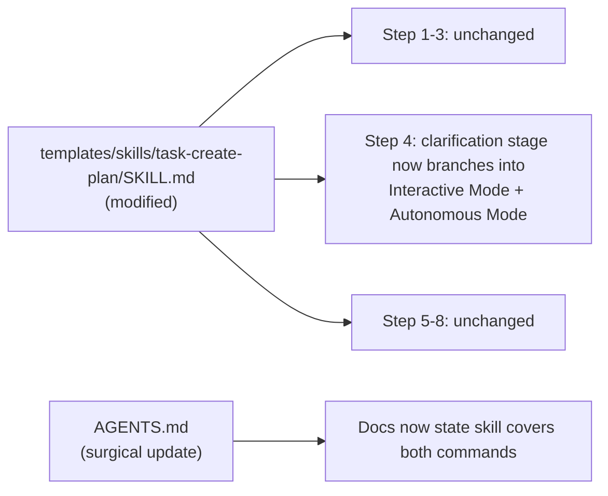
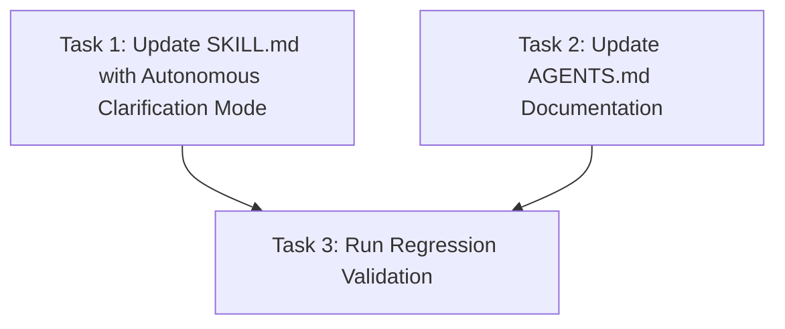

# Plan: Extend task-create-plan Skill to Cover Autonomous Mode

## Original Work Order

> look at archived plans 68, 69, 70, ... and apply it to the `/tasks:create-plan-auto` command.

## Plan Clarifications

| Question | Answer |
| --- | --- |
| Should a separate `task-create-plan-auto` skill be created, or should the existing `task-create-plan` skill be extended? | Extend the existing `task-create-plan` skill. Plan 71 established the canonical pattern: one skill covers both the interactive and auto variants of the same workflow (`task-refine-plan` covers both `/tasks:refine-plan` and `/tasks:refine-plan-auto`). |
| Which scripts must the skill bundle at runtime? | The same two scripts already bundled for `task-create-plan`: `find-task-manager-root.cjs` and `get-next-plan-id.cjs`. No new entrypoints are required because the auto variant performs the same root discovery and ID allocation; the only difference is in the clarification stage, which is pure prose. |
| Should backwards compatibility be preserved? | Yes. The existing `/tasks:create-plan` and `/tasks:create-plan-auto` command templates under `templates/assistant/commands/tasks/` remain untouched. `init` behavior is unchanged. The skill modification is purely additive. |
| Are new TypeScript entrypoints or build-script changes needed? | No. The existing `SKILL_ENTRYPOINTS` for `task-create-plan` already produce the required bundles. No additions to `scripts/build-skills.cjs` are necessary. |
| What format should the plans emitted by the auto-mode skill use? | The same as the interactive mode: semantic HTML conforming to `PLAN_TEMPLATE.html`. The output format is identical; only the clarification stage differs. |

## Executive Summary

Extend the existing `task-create-plan` Agent Skill so that it covers both the interactive `/tasks:create-plan` command and the autonomous `/tasks:create-plan-auto` command. The skill already encodes the interactive plan-creation workflow from plan 68; this plan adds autonomous clarification mode coverage to its prose, mirroring exactly how plan 71 combined `refine-plan` and `refine-plan-auto` into `task-refine-plan`.

The only substantive change is to `templates/skills/task-create-plan/SKILL.md`, where the clarification stage is restructured to present two distinct branches: **Interactive Clarification** (ask the user targeted questions, loop until resolved) and **Autonomous Clarification** (resolve gaps by inspecting the codebase, docs, and project context, recording assumptions in the Plan Clarifications table). Both branches converge on the same plan generation, hook execution, and structured summary stages. No new executable logic, build pipeline changes, or skill directory additions are required.

`AGENTS.md` receives a surgical update noting that `task-create-plan` now represents both commands. Existing tests continue to pass; a targeted regression validation confirms the skill bundles are still self-contained and the init pipeline is unaffected.

## Context

### Current State vs Target State

| Current State | Target State | Why? |
| --- | --- | --- |
| The `task-create-plan` skill prose describes only interactive clarification: "ask the user targeted questions" and loop until resolved. | The skill prose describes both interactive and autonomous clarification modes, with clear branching so the assistant selects the right one based on context. | The `/tasks:create-plan-auto` command exists and performs the same workflow without user interaction; the skill should be able to represent it. |
| `AGENTS.md` documents `task-create-plan` as covering only `/tasks:create-plan`. | `AGENTS.md` documents `task-create-plan` as covering both `/tasks:create-plan` and `/tasks:create-plan-auto`. | Documentation accuracy. The skill artifact now serves both entry points. |
| There is no skill representation for `/tasks:create-plan-auto`. | The same `task-create-plan` skill serves `/tasks:create-plan-auto` through its autonomous clarification branch. | Consistent with the plan-71 pattern that consolidated `refine-plan` + `refine-plan-auto` into `task-refine-plan`. |

### Background

Plan 68 introduced `task-create-plan` as the first Agent Skill, with a self-contained skill directory, bundled `.cjs` scripts produced from TypeScript source, and an assistant-agnostic `SKILL.md`. Plan 71 later established the pattern for command pairs: when an interactive command has an `-auto` variant that differs only in skipping the user feedback loop, both are covered by a single skill whose prose branches at the clarification stage. The `task-refine-plan` skill applies this pattern to `refine-plan` + `refine-plan-auto`; this plan applies the same pattern to `create-plan` + `create-plan-auto`.

The two commands differ in exactly one stage:

- `/tasks:create-plan` Step 2: "Clarification Phase" — ask the user questions, loop until answers received.
- `/tasks:create-plan-auto` Step 2: "Autonomous Clarification Phase" — resolve gaps via codebase inspection, document assumptions, never ask the user.

Everything else (root discovery, PRE_PLAN hook, context analysis, plan ID allocation, plan emission conforming to `PLAN_TEMPLATE.html`, POST_PLAN hook, structured summary) is identical.

## Architectural Approach

This plan modifies one file (`templates/skills/task-create-plan/SKILL.md`) and makes a surgical documentation update to `AGENTS.md`. No new files, directories, TypeScript sources, build entries, or dependencies are introduced.

### Skill Prose Extension

**Objective**: Restructure the clarification stage in `SKILL.md` to cover both operating modes without duplicating the rest of the workflow.

The skill's Step 4 (currently "Clarification loop") is expanded into a branching stage:

- **Interactive Clarification** — same prose as today: identify missing context, ask the user targeted questions, loop until resolved, confirm backwards compatibility requirements. Never invent answers.
- **Autonomous Clarification** — new prose: identify missing context, resolve each gap by inspecting the codebase, documentation, README files, assistant documents (CLAUDE.md, GEMINI.md, AGENTS.md), configuration files, and project context. For unresolvable gaps, document best-effort assumptions in the Plan Clarifications table with clear rationale. Do NOT ask the user any questions. Do NOT wait for user input.

**Mode selection rule (mirrors `task-refine-plan`)**: Default to Interactive Clarification. Only switch to Autonomous Clarification when the trigger is unambiguous and beyond reasonable doubt — specifically when (a) the user's request contains an explicit mode keyword such as "auto", "autonomous", "non-interactive", or "without asking me"; (b) an upstream orchestrator has declared autonomous operation in the prompt passed to this skill; or (c) the invocation is the `/tasks:create-plan-auto` slash command. If none of those holds, use Interactive Clarification even when the user's presence is uncertain. Treat ambiguity as a vote for Interactive.

Both branches converge back to Step 5 (allocate plan ID) and proceed identically through emission, hooks, and summary. All other steps (1–3, 5–8) remain unchanged.

The skill description in the frontmatter is broadened slightly to mention autonomous plan creation without losing specificity.

### Compatibility Boundary

**Objective**: Leave every existing file untouched except the one skill document and one documentation reference.

- No file under `templates/assistant/commands/` is modified.
- No file under `templates/ai-task-manager/config/scripts/` is modified.
- `scripts/build-skills.cjs` needs no changes.
- `init` behavior is unchanged.
- Existing tests still pass.

## Risk Considerations and Mitigation Strategies

Technical Risks

- **Skill prose becomes ambiguous with two modes in one document.** A single skill containing both interactive and autonomous branches could confuse the assistant about which mode to select.
    - **Mitigation**: Structure Step 4 as an explicit conditional. The skill instructs the assistant to select Interactive Mode when the user is present and responsive, and Autonomous Mode when the user explicitly requests autonomous operation or when the conversation context indicates no further user input will be available (e.g., scripted workflows, CI pipelines). Both branches are clearly labeled and converge on the same subsequent steps.
- **Plan output quality degrades in autonomous mode.** Without user clarification, the assistant might make poor assumptions.
    - **Mitigation**: The autonomous branch requires explicit documentation of every assumption in the Plan Clarifications table, including the rationale and confidence level. This makes assumptions visible for later review and does not hide uncertainty.

Implementation Risks

- **Scope creep into refactoring other skills.** Touching `task-create-plan` might tempt updates to `task-full-workflow` or other skills that invoke plan creation.
    - **Mitigation**: Limit changes strictly to `task-create-plan/SKILL.md` and the AGENTS.md reference. Other skills reference plan creation conceptually and do not need modification.
- **Skill prose accidentally diverges from the command templates' contracts.** The existing command templates embed significant guidance (scope control, patterns to avoid, frontmatter schema, output format) that must be preserved.
    - **Mitigation**: Treat the existing command templates as the contract. Carry forward every critical rule, formatting requirement, and output structure into the skill, adding only the autonomous branch where the commands differ.

Quality Risks

- **Autonomous mode produces lower-quality plans due to missing context.**
    - **Mitigation**: The autonomous branch is required to exhaustively inspect the codebase before making assumptions. The skill explicitly lists the inspection targets (codebase, docs, README, assistant documents, config files). Unresolvable gaps must be recorded as assumptions, not silently papered over.

## Success Criteria

### Primary Success Criteria

1. `templates/skills/task-create-plan/SKILL.md` contains distinct, clearly labeled coverage for both Interactive Clarification and Autonomous Clarification modes, with both branches converging on the same plan generation and output stages.
2. The skill's frontmatter description accurately reflects that it serves both interactive and autonomous plan creation for this task-manager.
3. `AGENTS.md` documents `task-create-plan` as covering both `/tasks:create-plan` and `/tasks:create-plan-auto`.
4. The existing `/tasks:create-plan` and `/tasks:create-plan-auto` command templates, the existing `.cjs` scripts, and `init` behavior remain unchanged, and current tests still pass.
5. The bundled `.cjs` files under `templates/skills/task-create-plan/scripts/` continue to execute correctly from a standalone fixture (no regression).

## Self Validation

Execute these concrete checks after implementation:

- Open `templates/skills/task-create-plan/SKILL.md` and verify Step 4 contains two clearly labeled subsections (Interactive Clarification and Autonomous Clarification) that converge back to the same subsequent steps.
- Confirm the skill frontmatter still has `name: task-create-plan` and a description that encompasses both modes.
- Verify `AGENTS.md` mentions `task-create-plan` in a way that includes both the interactive and auto commands.
- Run `npm run build` and confirm `templates/skills/task-create-plan/scripts/` still contains the expected `.cjs` files with no changes to their content.
- Run the bundle smoke check from `src/__tests__/skill-scripts.test.ts` (or execute the bundled scripts manually against a temporary fixture) and confirm `find-task-manager-root.cjs` and `get-next-plan-id.cjs` behave identically to before.
- Run the existing pipeline as a regression check: `npx . init --assistants claude,gemini,opencode,codex --destination-directory /tmp/regression-74` and confirm both `create-plan.md` and `create-plan-auto.md` command files are generated identically to before.
- Run `npm test` and `npm run lint` — both must pass.
- Run `npm pack --dry-run` and confirm the skill directory and its generated `scripts/*.cjs` are present in the file list.

## Documentation

`AGENTS.md` requires a small, surgical update:

- In the Skills Layer section, update the `task-create-plan` description to note that it covers both `/tasks:create-plan` and `/tasks:create-plan-auto`.
- No other documentation changes are required. The `README.md` does not enumerate commands or skills in detail and does not need to change. No user-facing migration guide is required — the command path is preserved.

## Resource Requirements

### Development Skills

Familiarity with Agent Skill structure and conventions, understanding of the difference between interactive and autonomous clarification workflows, and comfort editing Markdown prose while preserving exact output contracts.

### Technical Infrastructure

No new dependencies. No build pipeline changes. `esbuild` is already a dev dependency and continues to produce the same bundles. The only tooling needed is a text editor for `SKILL.md` and `AGENTS.md`.

## Integration Strategy

The modified skill integrates exactly as before: an additive artifact in the repository, picked up by the same `npm run build` step, shipped via the existing `files: ["templates/"]` rule, with distribution into user projects deferred. Because no new files or build entries are added, the integration surface is minimal — a single prose update to an existing skill document.

## Notes

The skill modification is intentionally minimal. The `create-plan-auto` command differs from `create-plan` in only one respect (autonomous vs. interactive clarification), so the skill change is localized to that single stage. This follows the YAGNI principle: do not generalize or refactor beyond what is needed to represent the auto command.

The existing `task-full-workflow` skill orchestrates plan creation as Phase 1. It already has a no-pause rule and auto-generation fallback. It does not need modification because it instructs the assistant to follow the plan-creation workflow; whether the assistant selects interactive or autonomous clarification within that workflow is context-dependent and handled by the `task-create-plan` skill's updated prose.

---

## Execution Blueprint

**Validation Gates:**
- Reference: `/config/hooks/POST_PHASE.md`

### Dependency Diagram

No circular dependencies. Tasks 1 and 2 are independent.

### Phase 1: Skill Prose and Documentation Update
**Parallel Tasks:**
- Task 1: Modify `templates/skills/task-create-plan/SKILL.md` Step 4 to include both Interactive and Autonomous Clarification modes
- Task 2: Update `AGENTS.md` to document that `task-create-plan` covers both `/tasks:create-plan` and `/tasks:create-plan-auto`

### Phase 2: Regression Validation
**Parallel Tasks:**
- Task 3: Run full validation and regression checks (depends on: 1, 2)
  - Verify `npm run build` produces unchanged bundles
  - Run `npm test` and `npm run lint`
  - Run init regression for all assistants
  - Run `npm pack --dry-run`
  - Confirm bundle smoke tests pass

### Post-phase Actions
- Confirm all success criteria from Plan 74 are satisfied.
- Archive the plan upon successful completion.

### Execution Summary
- Total Phases: 2
- Total Tasks: 3

---

Plan Summary:
- Plan ID: 74
- Plan File: /workspace/.ai/task-manager/plans/74--task-create-plan-auto-skill/plan-74--task-create-plan-auto-skill.md

---

**Note**: Manually archived on 2026-05-21
